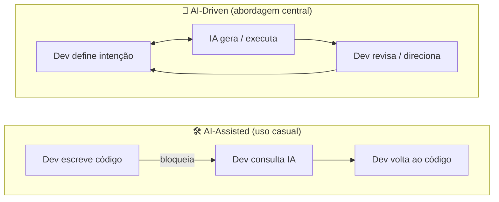
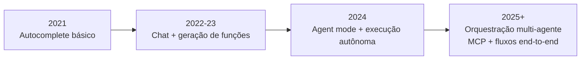

# 01 — O que é AI-Driven Development

> **Objetivo:** Entender o que distingue o desenvolvimento guiado por IA do uso casual de ferramentas de IA, e o que essa mudança significa para o papel do desenvolvedor.

---

## 🧭 Definição

**AI-Driven Development** é uma abordagem de desenvolvimento de software em que modelos de linguagem grandes (LLMs) são participantes ativos e contínuos do processo — não ferramentas de consulta pontual.

A diferença está na **posição da IA no fluxo**:



No modelo **AI-Assisted**, a IA é uma ferramenta reativa — você a consulta quando trava.

No modelo **AI-Driven**, a IA é um colaborador proativo — você define *o que* e *por quê*, ela cuida do *como* (com supervisão).

---

## 📊 Comparativo: AI-Assisted vs AI-Driven

| Dimensão | AI-Assisted | AI-Driven |
|----------|-------------|-----------|
| **Iniciativa** | Desenvolvedor escreve, IA completa | Dev define, IA executa ciclos completos |
| **Escopo da tarefa** | Linha ou função | Feature, módulo, pipeline inteiro |
| **Interação** | Pontual (autocomplete, busca) | Contínua (sessão, projeto) |
| **Output revisado** | Sugestão de linha | Diff completo, PR, resultado de testes |
| **Contexto** | Local (arquivo aberto) | Global (repo, docs, issues) |
| **Exemplo de uso** | Autocompletar um `for` loop | "Adicione autenticação JWT nessa API e escreva os testes" |

---

## 🔄 A Inversão de Responsabilidades

No desenvolvimento tradicional, o dev escreve código e a máquina executa.

No AI-driven development, essa relação muda:

```
Antes:  Dev → [escreve] → Código → [executa] → Máquina
Depois: Dev → [direciona] → IA → [gera + executa] → Código → [valida] → Dev
```

O desenvolvedor migra de **produtor de código** para **engenheiro de intenção e qualidade**:

- **Define** o que precisa ser feito (requisitos, contexto, restrições)
- **Avalia** o que a IA produziu (correctude, segurança, manutenibilidade)
- **Itera** até o resultado ser adequado
- **Mantém** o controle sobre decisões de arquitetura e negócio

> 📌 **Referência:** Anthropic descreve Claude Code como uma ferramenta que mantém o dev "no controle" enquanto executa tarefas de desenvolvimento autonomamente — docs.anthropic.com/en/docs/claude-code/overview

---

## 👨‍💻 O Novo Papel do Desenvolvedor

### Habilidades que aumentam de valor

| Habilidade | Por quê aumenta |
|------------|-----------------|
| **Decomposição de problemas** | A IA executa melhor tarefas bem definidas |
| **Revisão crítica de código** | Todo output de IA precisa de revisão humana |
| **Conhecimento de domínio** | A IA não conhece seu negócio, contexto ou usuários |
| **Arquitetura de sistemas** | Decisões estruturais requerem julgamento humano |
| **Comunicação de intenção** | Saber articular o *o quê* e o *por quê* com precisão |

### Habilidades que mudam de natureza

| Habilidade | Como muda |
|------------|-----------|
| **Escrita de código** | Menos digitação, mais direcionamento e revisão |
| **Debugging** | De investigação manual para diagnóstico colaborativo |
| **Documentação** | De tarefa adiada para processo contínuo assistido |
| **Aprendizado** | A IA acelera a curva de aprendizado em novas stacks |

---

## 🌊 A Onda de Adoção

O GitHub publicou dados do seu relatório de 2024 mostrando que desenvolvedores usando Copilot completam tarefas até **55% mais rápido** em benchmarks controlados. A Anthropic relata que Claude Code é usado por desenvolvedores para tarefas que vão de geração de código a execução de pipelines completos de CI/CD.



> 📌 **Referência:** GitHub Octoverse 2024 — github.blog/news-insights/octoverse

---

## 🎯 O que Você Vai Aprender neste Curso

Este curso te prepara para operar no modelo **AI-Driven**:

1. **Fundamentos** — entender LLMs o suficiente para não cometer erros ingênuos
2. **Prompt engineering** — comunicar intenção com precisão
3. **Context engineering** — dar à IA o contexto certo para produzir bons resultados
4. **Fluxos de trabalho** — integrar IA em cada fase do ciclo de desenvolvimento
5. **Agentes** — delegar ciclos completos de execução
6. **MCP** — conectar modelos às suas ferramentas e dados
7. **Ferramentas específicas** — Claude Code e GitHub Copilot em profundidade

---

## ✅ Pontos-chave do Capítulo

- AI-Driven ≠ usar IA às vezes. É uma mudança na posição da IA no fluxo de trabalho.
- O desenvolvedor migra de **produtor de código** para **engenheiro de intenção e qualidade**.
- As habilidades mais valiosas agora são: decomposição de problemas, revisão crítica e conhecimento de domínio.
- A adoção está acelerando — entender os fundamentos é urgente.

---

## 🔗 Próxima Aula

👉 [02 — Mental Models: como pensar com IA](./02-mental-models.md)
