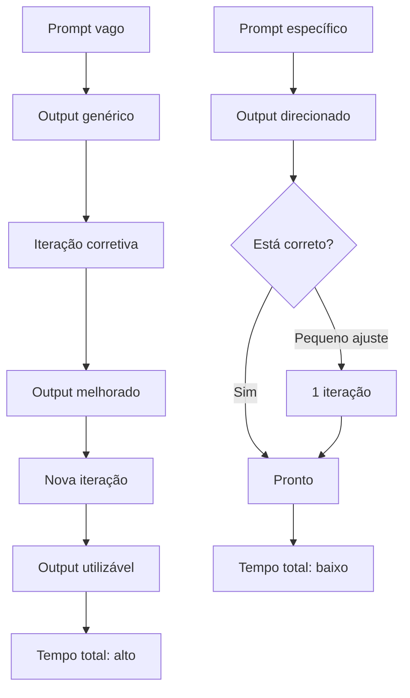
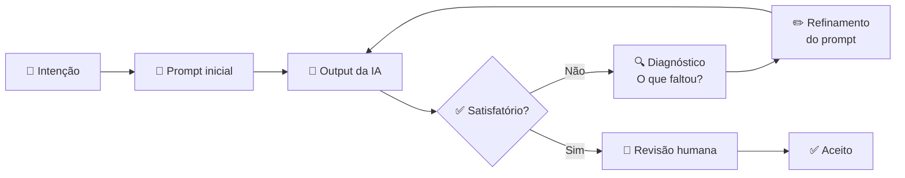

# 02 — Mental Models: Como Pensar com IA

> **Objetivo:** Desenvolver os modelos mentais corretos para colaborar com IA de forma eficaz — calibrando autonomia, expectativas e postura de acordo com cada situação.

---

## 🧠 Por que Mental Models importam?

A maioria dos problemas com IA não é técnica — é conceitual. Desenvolvedores frustrados com resultados ruins geralmente estão usando o modelo mental errado para a situação.

Um mental model é uma simplificação que te ajuda a tomar decisões melhores mais rapidamente. Você não precisa entender como o modelo funciona internamente; você precisa saber **como se comportar em relação a ele**.

---

## 🤝 Mental Model 1: Pair Programmer Sênior Desconhecido

Imagine que você contratou um programador muito experiente, mas que:
- **Nunca viu seu codebase antes**
- **Não conhece o contexto do seu negócio**
- **É capaz de produzir código de alta qualidade em segundos**
- **Às vezes inventa detalhes quando não tem certeza**
- **Precisa ser orientado sobre o que é importante**

Essa metáfora calibra bem as expectativas:

| Comportamento correto | Comportamento incorreto |
|-----------------------|------------------------|
| Dar contexto antes de pedir código | Assumir que a IA "sabe" o que você quer |
| Revisar todo output com atenção | Aceitar código sem ler |
| Explicar restrições do projeto | Esperar que a IA adivinhe as regras |
| Iterar quando o resultado estiver errado | Desistir após uma resposta ruim |

> 📌 **Referência:** Anthropic descreve o uso de Claude como uma colaboração onde "você mantém o controle enquanto Claude executa" — docs.anthropic.com/en/docs/claude-code/overview

---

## 🎓 Mental Model 2: Junior vs Senior Prompting

A qualidade do resultado depende diretamente de como você formula a tarefa. Compare:

**Junior prompting** — vago, sem contexto, espera que a IA "descubra":
```
"Escreve uma função de login"
```

**Senior prompting** — específico, contextualizado, com restrições claras:
```
"Crie uma função `authenticate_user` em Python que:
- Recebe email e senha como strings
- Valida contra o banco PostgreSQL usando SQLAlchemy (modelo User já existe)
- Retorna um JWT assinado com HS256 (lib: python-jose)
- Lança AuthenticationError para credenciais inválidas
- Nunca retorna detalhes específicos sobre qual campo está errado (segurança)
- Use type hints e escreva um docstring"
```

O segundo prompt produz código utilizável de primeira. O primeiro vai precisar de 4-5 iterações para chegar ao mesmo lugar.



---

## 🔧 Mental Model 3: Ferramenta Calibrável

A IA não tem comportamento fixo — ela responde ao contexto que você fornece. Você pode calibrar:

| O que calibrar | Como calibrar | Exemplo |
|----------------|---------------|---------|
| **Tom e estilo** | Instruções de persona | "Responda como um senior dev revisando um PR" |
| **Formato do output** | Especificar estrutura | "Retorne apenas o código, sem explicação" |
| **Nível de detalhe** | Dizer explicitamente | "Seja conciso" / "Explique cada decisão" |
| **Domínio de conhecimento** | Fornecer contexto | "Usamos Clean Architecture neste projeto" |
| **Restrições** | Listar o que não fazer | "Não use bibliotecas externas além das já importadas" |

---

## ⚖️ Mental Model 4: Espectro de Autonomia

Nem toda tarefa deve ter o mesmo nível de autonomia da IA. Use este espectro para calibrar:

```
← Mais controle humano          Mais autonomia da IA →

[Sugestão]  [Rascunho]  [Execução supervisionada]  [Execução autônoma]
    |            |                |                        |
autocomplete   geração de    agent mode com         agente headless
inline         função        checkpoint              em CI/CD
```

**Regra prática:**
- **Alto risco / Alta irreversibilidade** → mais controle humano
- **Baixo risco / Alta reversibilidade** → mais autonomia

| Tarefa | Autonomia recomendada |
|--------|----------------------|
| Fazer push para produção | Controle humano — sempre aprove |
| Deletar dados de banco | Controle humano — sempre aprove |
| Criar estrutura de arquivos | Supervisionada — revise antes |
| Gerar testes unitários | Supervisionada — revise antes |
| Gerar docstrings | Pode ser mais autônoma |
| Renomear variável local | Pode ser mais autônoma |

> 📌 **Referência:** Anthropic recomenda que Claude Code solicite confirmação para "ações de alto impacto irreversíveis" — docs.anthropic.com/en/docs/claude-code/security

---

## 🔄 Mental Model 5: Loop de Refinamento, não Comando Único

Muitos desenvolvedores abordam a IA como se fosse um comando de terminal: entrar algo, receber o resultado correto imediatamente. A realidade é diferente.

O fluxo mais produtivo é iterativo:



**Diagnóstico quando o output está errado:**

| Sintoma | Provável causa | Solução |
|---------|---------------|---------|
| Output genérico demais | Falta de contexto | Adicione detalhes do projeto |
| Código com libs erradas | IA não sabe sua stack | Especifique dependências |
| Lógica incorreta | Problema mal definido | Descreva casos de uso concretos |
| Output parcial | Tarefa muito grande | Quebre em sub-tarefas |
| IA inventou API | Alucinação | Forneça documentação como contexto |

---

## 🧩 Mental Model 6: IA como Amplificador, não Substituto

A IA amplifica sua competência existente — para o bem e para o mal.

```
Desenvolvedor experiente + IA = Produtividade muito alta
Desenvolvedor iniciante + IA = Velocidade alta, mas risco alto
```

Um desenvolvedor que não sabe revisar código não vai identificar quando a IA produz código incorreto, inseguro ou mal estruturado. Por isso:

- **Aprenda os fundamentos** — a IA não cobre lacunas de conhecimento que impedem revisão crítica
- **Revise sempre** — o output da IA é um rascunho inicial, não código de produção
- **Questione o que não entende** — se você não entende o código gerado, peça explicação antes de aceitar

> 📌 **Referência:** GitHub Copilot docs alertam que "Copilot pode gerar código que parece correto mas contém erros sutis" — docs.github.com/en/copilot/using-github-copilot/best-practices-for-using-github-copilot

---

## 📋 Checklist de Mental Models

Antes de começar uma sessão com IA, pergunte-se:

- [ ] Defini claramente *o que* quero (não apenas *o problema*)?
- [ ] Forneci contexto suficiente (stack, restrições, padrões do projeto)?
- [ ] Calibrei o nível de autonomia adequado para essa tarefa?
- [ ] Estou pronto para revisar o output com atenção?
- [ ] Se o resultado estiver errado, sei diagnosticar por quê?

---

## ✅ Pontos-chave do Capítulo

- Trate a IA como um **pair programmer capaz mas sem contexto** — sempre oriente antes de delegar.
- **Senior prompting** = especificidade + contexto + restrições. É a diferença entre 1 e 5 iterações.
- Calibre o **nível de autonomia** pela reversibilidade e risco da tarefa.
- O fluxo com IA é **iterativo** — espere refinar, não acertar de primeira.
- A IA é um **amplificador** — sua capacidade de revisão crítica continua indispensável.

---

## 🔗 Próxima Aula

👉 [03 — Como LLMs Funcionam para Devs](./03-como-llms-funcionam-para-devs.md)
