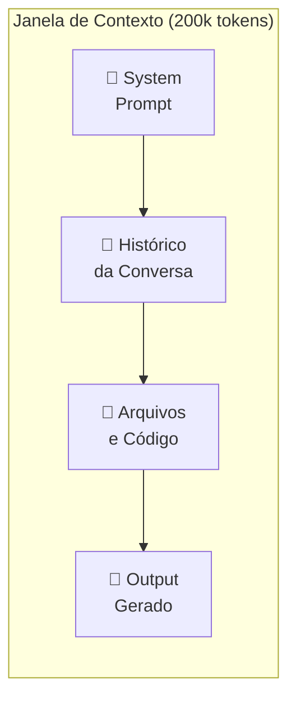
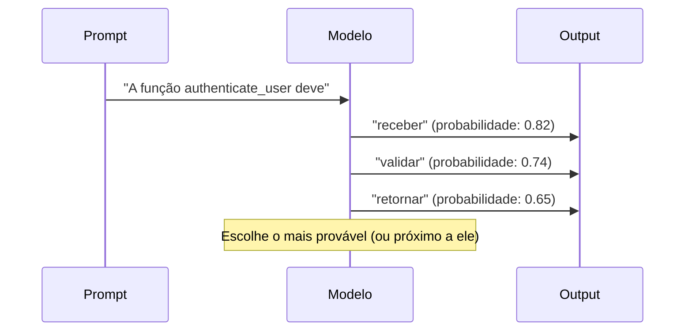
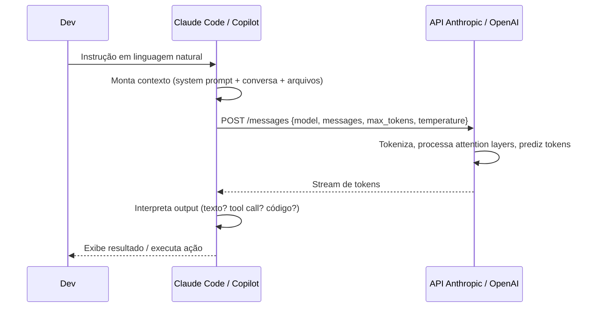

# 03 — Como LLMs Funcionam para Devs

> **Objetivo:** Entender o suficiente sobre o funcionamento de LLMs para usar ferramentas de IA de forma eficaz — sem precisar ser especialista em ML.

---

## 🎯 O que você precisa saber (e o que pode ignorar)

Você não precisa entender backpropagation ou attention mechanisms para ser um desenvolvedor AI-driven eficaz. Mas precisa entender:

| Conceito | Por que importa para você |
|----------|--------------------------|
| **Tokens** | Define o custo e os limites de cada chamada |
| **Janela de contexto** | Define quanto o modelo "lembra" e processa |
| **Temperatura** | Controla previsibilidade vs criatividade do output |
| **Top-p / Top-k** | Controla diversidade de vocabulário |
| **Treinamento e corte de dados** | Explica por que a IA pode não conhecer APIs recentes |
| **Predição de próximo token** | Explica por que a IA "alucina" com confiança |

---

## 🔤 Tokens: a Unidade Fundamental

**Token** não é palavra — é um fragmento de texto que o modelo processa. A tokenização varia por modelo.

**Aproximações úteis para o Claude (Anthropic):**
- 1 token ≈ 4 caracteres em inglês
- 1 token ≈ 3-4 caracteres em português (línguas com morfologia mais rica)
- 1 palavra comum ≈ 1-2 tokens
- 1 linha de código ≈ 5-15 tokens

**Exemplos práticos:**

| Texto | Tokens (aproximado) |
|-------|---------------------|
| `Hello, world!` | 4 |
| `function authenticateUser(email, password)` | 10 |
| `import pandas as pd` | 5 |
| Este parágrafo inteiro | ~50 |

**Por que importa:**
- Custo de API é calculado em tokens (input + output)
- A janela de contexto é medida em tokens
- Arquivos grandes consomem tokens rapidamente

> 📌 **Referência:** Anthropic disponibiliza um tokenizer para contar tokens: docs.anthropic.com/en/docs/build-with-claude/token-counting

---

## 📏 Janela de Contexto

A janela de contexto é a quantidade máxima de tokens que o modelo pode **processar em uma única chamada** — inclui o prompt, o histórico da conversa, e o output gerado.

**Janelas de contexto atuais (2024-2025):**

| Modelo | Janela de Contexto |
|--------|--------------------|
| Claude Opus 4 | 200.000 tokens |
| Claude Sonnet 4 | 200.000 tokens |
| Claude Haiku 4.5 | 200.000 tokens |
| GPT-4o | 128.000 tokens |
| Gemini 1.5 Pro | 1.000.000 tokens |

**200.000 tokens em perspectiva:**
- ~150.000 palavras
- ~500 páginas de texto
- Um codebase médio de 3.000-5.000 linhas inteiro



**Comportamento crítico:** O modelo processa **tudo** na janela com igual "visibilidade" — mas tende a dar mais peso ao início e ao fim. Conteúdo no meio pode ser "esquecido" em janelas muito longas (fenômeno chamado *lost in the middle*).

> 📌 **Referência:** Pesquisa "Lost in the Middle: How Language Models Use Long Contexts" — arxiv.org/abs/2307.03172

---

## 🌡️ Temperatura

A temperatura controla o **grau de aleatoriedade** na seleção do próximo token.

```
Temperatura 0.0  → Determinístico: sempre escolhe o token mais provável
Temperatura 0.5  → Equilibrado: alguma variação
Temperatura 1.0  → Criativo: mais variação
Temperatura 2.0  → Caótico: muito imprevisível (raramente útil)
```

**Quando usar cada extremo:**

| Temperatura | Use para |
|-------------|----------|
| 0.0 - 0.2 | Geração de código, extração de dados, análise determinística |
| 0.3 - 0.7 | Explicações, documentação, respostas equilibradas |
| 0.8 - 1.0 | Brainstorming, geração de ideias, nomes criativos |

**Dica prática:** Para geração de código em produção, use temperatura baixa (0.0-0.2). Para exploração de ideias de arquitetura, use temperatura mais alta.

> 📌 **Referência:** Anthropic API — o parâmetro `temperature` aceita valores de 0 a 1. docs.anthropic.com/en/api/messages

---

## 🎲 Top-p (Nucleus Sampling)

Top-p é uma alternativa à temperatura para controlar diversidade. O modelo considera apenas os tokens cujas probabilidades somam `p`.

```
top_p = 0.1  → Considera apenas os 10% de tokens mais prováveis (conservador)
top_p = 0.9  → Considera os 90% mais prováveis (diverso)
top_p = 1.0  → Considera todos os tokens (máxima diversidade)
```

**Na prática:** Para geração de código, ajuste temperatura OU top-p — não ambos ao mesmo tempo. Temperatura é mais intuitiva para desenvolvedores.

---

## 🧠 Como o Modelo "Pensa": Predição de Próximo Token

LLMs não "pensam" — eles **predizem o próximo token** com base em todos os tokens anteriores. Isso tem implicações importantes:



**O que isso explica:**

| Comportamento | Explicação |
|--------------|------------|
| **Alucinações** | O modelo gera o token mais provável, mesmo quando deveria dizer "não sei" |
| **Consistência** | Outputs similares para prompts similares (com temperatura baixa) |
| **Sensibilidade a contexto** | Tokens anteriores influenciam todos os seguintes |
| **Por que exemplos ajudam** | Exemplos no prompt "direcionam" a distribuição de probabilidade |

---

## 📅 Treinamento, Corte de Dados e Conhecimento Factual

LLMs são treinados em um snapshot da internet até uma **data de corte**. Depois disso:
- Não conhecem APIs lançadas recentemente
- Não conhecem mudanças de comportamento de frameworks
- Podem citar versões antigas de bibliotecas

**Como lidar:**
1. **Cole a documentação relevante no prompt** — a IA vai usar o texto fornecido, não o treinamento
2. **Especifique versões explicitamente** — "usando React 19, não React 18"
3. **Verifique chamadas de API** — especialmente em libs que evoluem rápido

```
❌ "Como usar o novo hook do React 19?"
✅ "Usando React 19 (lançado em dezembro 2024), como implementar..."
   + cole a seção relevante da documentação oficial
```

**Datas de corte de conhecimento (aproximadas):**
| Modelo | Corte de Treinamento |
|--------|---------------------|
| Claude 3.5 Sonnet | Abril 2024 |
| Claude Sonnet 4.6 | Agosto 2025 |
| GPT-4o | Outubro 2023 |

> 📌 **Referência:** Anthropic informa datas de corte de conhecimento por modelo em: docs.anthropic.com/en/docs/about-claude/models

---

## 💡 O Modelo de Execução na Prática

Quando você usa Claude Code ou GitHub Copilot, o fluxo de baixo nível é:



**O que cada parâmetro faz na API:**

```json
{
  "model": "claude-sonnet-4-6",
  "max_tokens": 8096,
  "temperature": 0.0,
  "messages": [
    {
      "role": "user",
      "content": "Refatore esta função para usar async/await..."
    }
  ]
}
```

| Parâmetro | O que controla |
|-----------|----------------|
| `model` | Qual modelo usar (capacidade, custo, velocidade) |
| `max_tokens` | Limite máximo de tokens no output |
| `temperature` | Aleatoriedade do output |
| `messages` | O histórico completo da conversa |
| `system` | Instruções persistentes que definem comportamento |

> 📌 **Referência:** Documentação completa da Messages API: docs.anthropic.com/en/api/messages

---

## 🔢 Calculando Custo de uma Sessão

Para planejar uso de API:

```
Custo = (tokens_input × preço_input) + (tokens_output × preço_output)

Exemplo com Claude Sonnet 4.6:
- Input: 10.000 tokens × $3/MTok = $0,03
- Output: 2.000 tokens × $15/MTok = $0,03
- Total: $0,06 por chamada
```

Para uso via interface (claude.ai, GitHub Copilot), os custos são cobertos pela assinatura.

---

## ✅ Pontos-chave do Capítulo

- **Token** é a unidade básica — aproximadamente 4 caracteres. Contexto, custo e limites são medidos em tokens.
- **Janela de contexto** define quanto o modelo processa de uma vez — Claude suporta 200k tokens.
- **Temperatura baixa** (0-0.2) para código determinístico; temperatura mais alta para brainstorming.
- LLMs **predizem o próximo token** — isso explica alucinações e por que contexto é tão importante.
- O modelo não conhece APIs pós-treinamento — **forneça documentação** diretamente no prompt.

---

## 🔗 Próxima Aula

👉 [04 — Limitações e Expectativas Realistas](./04-limitacoes-e-expectativas-realistas.md)
