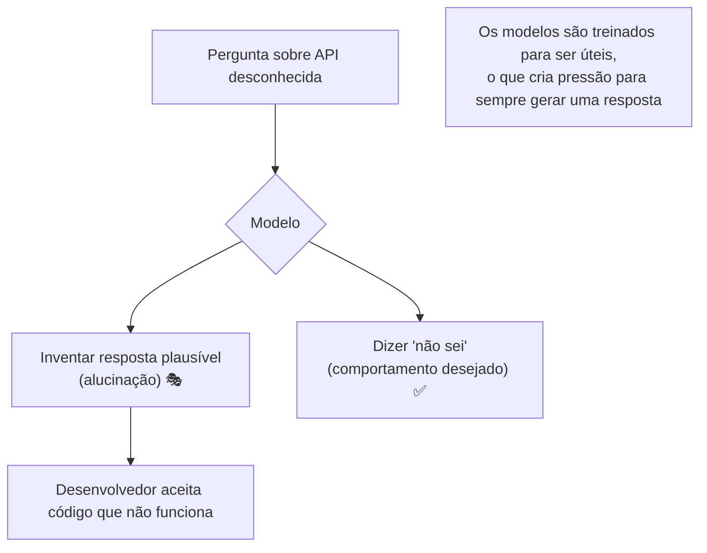
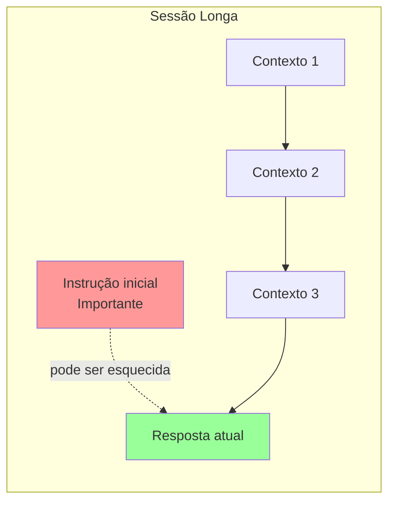

# 04 — Limitações e Expectativas Realistas

> **Objetivo:** Conhecer as limitações reais dos LLMs para evitar armadilhas comuns, saber quando não delegar e como verificar outputs.

---

## ⚠️ Por que Estudar Limitações?

Desenvolvedores que ignoram as limitações dos LLMs cometem erros caros:
- Aceitam código incorreto por parecer plausível
- Delegam tarefas que a IA não pode executar corretamente
- Ficam frustrados com resultados ruins que eram previsíveis
- Introduzem bugs e vulnerabilidades sem perceber

Conhecer os limites não é pessimismo — é **uso inteligente**.

---

## 🎭 Alucinações: O Problema Central

**Alucinação** é quando o modelo gera informação incorreta com aparência de correção e confiança. É uma consequência direta da predição de próximo token: o modelo sempre gera o token mais provável, mesmo quando a resposta correta seria "não sei".



### Categorias de alucinação em contexto de desenvolvimento

| Tipo | Exemplo | Frequência |
|------|---------|------------|
| **API inexistente** | Gerar código com método que não existe | Alta |
| **Parâmetros incorretos** | Chamar função com assinatura errada | Alta |
| **Comportamento incorreto** | Descrever o que uma função faz errado | Média |
| **Versão desatualizada** | Usar sintaxe de versão antiga | Média |
| **Citações falsas** | Inventar links, papers, nomes de autores | Alta |
| **Lógica incorreta** | Código que parece certo mas tem bug sutil | Média |

### Como detectar alucinações

- **Teste o código** — sempre execute, não apenas leia
- **Verifique a API** — confira na documentação oficial, não confie apenas no output
- **Desconfie de links** — a IA pode gerar URLs que não existem
- **Peça a fonte** — "em qual parte da documentação oficial isso está?"
- **Contradições internas** — a IA pode afirmar A e depois afirmar não-A

---

## 🧮 Erros de Raciocínio Lógico

LLMs têm desempenho inconsistente em raciocínio puro, especialmente:

### Matemática e Algoritmos

```python
# Prompt: "Qual é a complexidade deste código?"
# A IA pode errar a análise de Big O em casos não triviais

def nested_loop(n):
    for i in range(n):          # O(n)
        for j in range(i):      # O(n) no pior caso
            process(i, j)       # mas j vai de 0 a i, não 0 a n

# Complexidade real: O(n²) — mas a IA pode calcular incorretamente
```

### Casos Limite

A IA frequentemente não considera:
- Inputs vazios (`[]`, `""`, `None`)
- Números negativos quando a lógica assume positivos
- Overflow em operações numéricas
- Concorrência e race conditions
- Estados inválidos em máquinas de estado

### O que fazer

- **Peça explicitamente que considere edge cases:** "liste todos os casos limite que você está tratando"
- **Escreva os testes você mesmo** para casos que a IA não listou
- **Use a IA para gerar testes** mas revise se os casos são realmente completos

---

## 📦 Limites de Contexto e "Esquecimento"

Mesmo com janelas grandes (200k tokens), há limitações práticas:



### Fenômenos observados

| Fenômeno | Descrição | Mitigação |
|----------|-----------|-----------|
| **Lost in the middle** | Informação no meio do contexto é menos utilizada | Coloque informação crítica no início ou fim |
| **Drift de instrução** | Após muitas mensagens, a IA pode "esquecer" restrições iniciais | Reforce instruções importantes periodicamente |
| **Acumulação de erro** | Em sessões longas, pequenos erros se acumulam | Inicie nova sessão para tarefas independentes |
| **Inconsistência** | A IA pode contradizer decisões de mensagens anteriores | Use CLAUDE.md / copilot-instructions para reforçar padrões |

> 📌 **Referência:** Estudo "Lost in the Middle" (Stanford, 2023) documenta este efeito: arxiv.org/abs/2307.03172

---

## 🚫 O que NÃO Delegar (ou Delegar com Cautela Extrema)

### Não delegue sem revisão humana cuidadosa:

| Categoria | Por quê é arriscado |
|-----------|---------------------|
| **Código de autenticação/autorização** | Bugs de segurança sutis são frequentes |
| **Queries que modificam dados em produção** | `DELETE`, `UPDATE` sem `WHERE` — a IA pode gerar isso |
| **Configuração de infraestrutura** | Um parâmetro errado pode derrubar sistemas |
| **Código criptográfico** | Nunca implemente cripto manualmente — use bibliotecas estabelecidas |
| **Lógica de negócio crítica** | A IA não conhece as regras implícitas do seu domínio |
| **Decisões de arquitetura permanentes** | A IA não conhece o histórico e restrições do seu projeto |

### Delegar com supervisão ativa:

| Categoria | O que verificar |
|-----------|----------------|
| **Geração de testes** | Cobertura real, não apenas quantidade |
| **Refatoração** | Equivalência comportamental preservada |
| **Migração de framework** | Comportamento idêntico após migração |
| **Documentação** | Precisão técnica e atualidade |

---

## 🔄 Inconsistência entre Sessões

LLMs não são determinísticos por padrão:

```bash
# Mesmo prompt, dois resultados diferentes
Prompt: "Nomeie esta variável que armazena o timestamp de expiração do token"

Sessão 1: token_expiry_timestamp
Sessão 2: expiration_time
Sessão 3: expires_at
```

**Implicação:** A IA não tem "memória" de preferências entre sessões a menos que você forneça isso explicitamente via arquivos de instrução (CLAUDE.md, copilot-instructions.md).

---

## 📚 Conhecimento Desatualizado

O modelo foi treinado até uma data de corte. Após isso:

```
❌ Claude desconhece:
   - APIs lançadas depois do corte de treinamento
   - Mudanças breaking em frameworks populares
   - Novas vulnerabilidades de segurança (CVEs recentes)
   - Boas práticas que evoluíram após o corte

✅ Mas você pode compensar:
   - Cole a documentação diretamente no prompt
   - Especifique versões explicitamente
   - Use MCP para conectar a documentação viva
   - Verifique outputs contra fontes autoritativas
```

---

## 🛡️ Checklist: Antes de Aceitar um Output

Antes de commitar código gerado por IA, pergunte:

```
Correção:
  [ ] Rodei o código e ele funciona?
  [ ] Testei os casos limite?
  [ ] Verificei a assinatura das APIs usadas na documentação oficial?

Segurança:
  [ ] Há SQL injection, XSS, ou outras vulnerabilidades óbvias?
  [ ] Dados sensíveis estão sendo logados?
  [ ] Dependências usadas são de fontes confiáveis?

Manutenibilidade:
  [ ] Eu entendo o código gerado?
  [ ] Está alinhado com os padrões do projeto?
  [ ] A lógica é simples o suficiente para manter?

Completude:
  [ ] Todos os edge cases foram tratados?
  [ ] Os erros estão sendo tratados adequadamente?
  [ ] A tarefa foi completada de fato, não apenas parcialmente?
```

---

## 🎯 Expectativas Calibradas

O que você PODE esperar de LLMs em 2024-2025:

| ✅ Vai bem | ⚠️ Vai razoavelmente | ❌ Vai mal |
|-----------|---------------------|-----------|
| Código CRUD padrão | Algoritmos complexos | Raciocínio matemático avançado |
| Refatoração simples | Debugging de bugs sutis | Criptografia customizada |
| Geração de testes unitários | Arquitetura de sistema | Análise de performance precisa |
| Documentação e docstrings | Code review de segurança | Predição de comportamento em concorrência |
| Boilerplate e templates | Migração de base de código grande | Análise de correctude formal |
| Explicação de código | Análise de complexidade | |

---

## ✅ Pontos-chave do Capítulo

- **Alucinações são inevitáveis** — sempre verifique APIs e lógica crítica contra fontes oficiais.
- LLMs têm **raciocínio lógico inconsistente** — não confie em análises matemáticas sem verificar.
- **Contexto longo degrada** — informação no meio pode ser "esquecida"; informação crítica vai no início ou fim.
- Nunca delegue sem revisão: **autenticação, criptografia, queries destrutivas, e lógica de negócio crítica**.
- **Expectativas realistas** = usar IA no que ela vai bem, complementar com revisão humana no que ela vai mal.

---

## 🔗 Próxima Aula

👉 [05 — Ética e Responsabilidade](./05-etica-e-responsabilidade.md)
