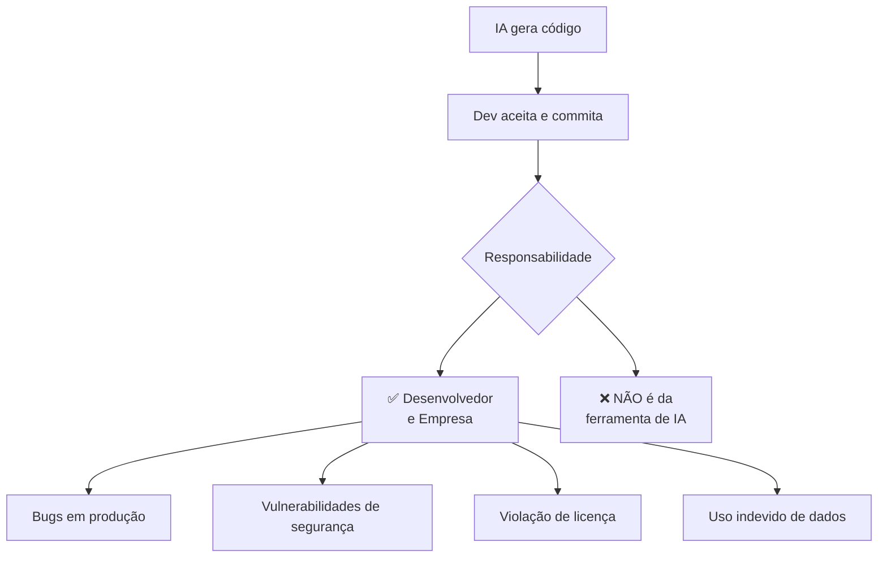
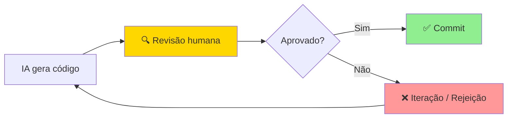

# 05 — Ética e Responsabilidade no Uso de IA para Desenvolvimento

> **Objetivo:** Compreender as responsabilidades legais, éticas e de segurança associadas ao uso de IA para gerar código — e como operar dentro delas de forma responsável.

---

## ⚖️ Por que Ética importa para Devs que Usam IA?

O código gerado por IA é **sua responsabilidade**, não da ferramenta. Isso não é apenas uma postura filosófica — tem implicações legais, de segurança e de qualidade concretas.



---

## 📜 Propriedade Intelectual e Licenças

### O Problema do Treinamento

LLMs são treinados em grandes volumes de código público, incluindo código com diversas licenças (MIT, GPL, Apache, proprietário). Isso levanta questões sobre se o código gerado pode conter fragmentos de código protegido.

**Estado atual (2024-2025):**
- Não há consenso legal estabelecido globalmente
- Casos judiciais em andamento (ex: Andersen v. Stability AI, processos contra GitHub Copilot)
- As empresas de IA assumem responsabilidades contratuais limitadas

### Políticas das Principais Ferramentas

| Ferramenta | Política de IP |
|------------|---------------|
| **GitHub Copilot Business/Enterprise** | Oferece "Indemnification" — proteção legal para clientes Enterprise em casos de disputa de IP relacionados ao Copilot |
| **GitHub Copilot Free/Pro** | Sem proteção de indenização explícita |
| **Claude (Anthropic)** | Anthropic oferece proteção de indenização para uso da API em planos pagos comerciais — ver docs.anthropic.com/en/policies/usage-policy |

> 📌 **Referência:** GitHub Copilot IP indemnification: docs.github.com/en/copilot/managing-copilot/managing-github-copilot-in-your-organization/managing-policies-for-copilot-in-your-organization

### Filtro de Código Duplicado

O GitHub Copilot tem um filtro configurável que bloqueia sugestões com mais de 150 caracteres idênticos a código público indexado. Recomenda-se manter este filtro ativo.

```json
// settings.json (VS Code)
{
  "github.copilot.enable": {
    "duplicateDetection": true
  }
}
```

### Boas Práticas de IP

- ✅ **Ative filtros de duplicação** quando disponíveis
- ✅ **Revise código gerado** para fragmentos que pareçam trechos literais de projetos conhecidos
- ✅ **Documente uso de IA** no processo de desenvolvimento, especialmente em projetos open source
- ✅ **Consulte seu jurídico** para projetos com alta sensibilidade de IP
- ❌ **Não use IA para reverter engenharia** de software proprietário

---

## 🔒 Segurança: O Código Gerado por IA Tem Vulnerabilidades?

Estudos mostram que código gerado por IA pode conter vulnerabilidades de segurança com frequência similar ou maior que código escrito por humanos, especialmente quando:

1. O prompt não especifica requisitos de segurança
2. O desenvolvedor não tem conhecimento de segurança para revisar
3. A IA usa padrões de código antigos do seu corpus de treinamento

> 📌 **Referência:** Estudo "Do Users Write More Insecure Code with AI Assistants?" (Stanford/NYU, 2022) — arxiv.org/abs/2211.03622 — mostrou que usuários de assistentes de IA produziram código com mais vulnerabilidades quando não alertados.

### Vulnerabilidades Mais Comuns em Código Gerado por IA

| Vulnerabilidade | Exemplo | Como Prevenir |
|-----------------|---------|---------------|
| **SQL Injection** | Concatenar input do usuário em queries | Sempre usar parameterized queries |
| **XSS** | Inserir input do usuário em HTML sem sanitizar | Sempre escapar output |
| **Hard-coded secrets** | API keys, senhas no código | Usar variáveis de ambiente |
| **Controle de acesso falho** | Não verificar permissões antes de ação | Explicitamente pedir checagem de auth |
| **Validação insuficiente** | Aceitar qualquer input sem validar | Pedir validação explícita no prompt |
| **Dependências vulneráveis** | Sugerir versões antigas com CVEs | Verificar CVEs nas dependências sugeridas |

### Prompt de Segurança como Padrão

Inclua sempre restrições de segurança no prompt quando relevante:

```
"Implemente esta função considerando:
- Toda entrada do usuário deve ser sanitizada/validada
- Não exponha detalhes de erro internos ao usuário
- Use prepared statements para queries de banco de dados
- Siga o princípio de mínimo privilégio
- Não inclua segredos no código — use variáveis de ambiente"
```

---

## 🏢 Dados Sensíveis e Privacidade

### O Risco de Enviar Dados para Modelos

Quando você cola código ou dados em uma sessão de IA, esses dados podem:
- Ser usados para melhorar o modelo (dependendo dos termos de serviço)
- Estar sujeitos às políticas de retenção do provedor
- Ser acessados por funcionários do provedor em casos de revisão

### Políticas das Principais Ferramentas (2024-2025)

| Ferramenta | Retenção de Dados | Uso para Treinamento |
|------------|-------------------|---------------------|
| **Claude.ai (Free/Pro)** | Conversa retida por tempo limitado | Pode ser usado — consulte política atual |
| **Claude API (pagante)** | Não retido para treinamento por padrão | Não usado para treinamento |
| **GitHub Copilot Business** | Prompts não retidos | Não usado para treinamento |
| **GitHub Copilot Enterprise** | Dados não saem da org | Não usado para treinamento |

> 📌 **Referência:** Política de privacidade Anthropic: anthropic.com/privacy | GitHub Copilot: docs.github.com/en/site-policy/privacy-policies/github-general-privacy-statement

### O que NUNCA colar em ferramentas de IA

```
❌ Chaves de API e tokens de acesso
❌ Senhas e credenciais
❌ PII (CPF, RG, dados de saúde, dados financeiros de usuários)
❌ Código proprietário crítico de negócio (verifique política da empresa)
❌ Dados de clientes
❌ Contratos e documentos legais confidenciais
```

### LGPD e GDPR

Se você processa dados pessoais de usuários:
- O código gerado que processa dados pessoais é **sua responsabilidade** de compliance
- Peça explicitamente que a IA considere LGPD/GDPR: "implemente coleta de consentimento conforme LGPD"
- Revise sempre se dados pessoais estão sendo logados, expostos ou tratados incorretamente

---

## 👁️ Revisão Obrigatória: A Regra Inviolável

**Todo código gerado por IA deve ser revisado por um humano antes de ir para produção.** Esta não é uma recomendação opcional.

### Por que a revisão é inegociável:

1. **Responsabilidade não se transfere** — você é responsável pelo código que commita
2. **Contexto de negócio** — a IA não conhece regras implícitas do seu produto
3. **Segurança** — bugs de segurança parecem código normal para não-especialistas
4. **Correctude** — a IA pode gerar código que "parece certo" mas tem lógica errada
5. **Manutenibilidade** — código confuso é mais difícil de manter, mesmo que funcione



### Checklist de Revisão Ética

```
Responsabilidade:
  [ ] Entendo o que este código faz?
  [ ] Posso defender este código em um code review?
  [ ] Está documentado que IA foi usada (se a política do projeto exige)?

Segurança:
  [ ] Não há credenciais hard-coded?
  [ ] Não há vulnerabilidades óbvias (OWASP Top 10)?
  [ ] Dados pessoais são tratados conforme política?

Propriedade Intelectual:
  [ ] O código não é um trecho literal de outro projeto?
  [ ] As dependências sugeridas têm licenças compatíveis?

Conformidade:
  [ ] Está alinhado com a política de uso de IA da minha empresa?
```

---

## 🏛️ Políticas de Uso de IA nas Organizações

### Tipos de Política

| Nível | Descrição |
|-------|-----------|
| **Permissivo** | IA pode ser usada em qualquer tarefa; toda revisão é pelo dev |
| **Moderado** | IA permitida com restrições (ex: não em código de segurança) |
| **Restritivo** | IA apenas para tarefas específicas; aprovação necessária |
| **Proibido** | Nenhum uso de ferramentas de IA externas |

### Criando uma Política para seu Time

Uma boa política de uso de IA deve cobrir:
1. **Ferramentas permitidas** — quais plataformas e modelos são aprovados
2. **Dados proibidos** — o que nunca pode ser enviado a modelos externos
3. **Revisão obrigatória** — como o código gerado deve ser revisado
4. **Documentação** — como registrar uso de IA no desenvolvimento
5. **Treinamento** — capacitação mínima antes de usar

> 📌 **Referência:** GitHub publica guias de adoção de Copilot em organizações: docs.github.com/en/copilot/rolling-out-github-copilot-at-scale

---

## 🌱 Responsabilidade Ambiental

LLMs consomem recursos computacionais significativos:
- Uma sessão de geração de código tem impacto de carbono mensurável
- Isso não é razão para não usar IA — o benefício de produtividade geralmente justifica
- Mas é razão para usar ferramentas eficientemente: prompts claros reduzem iterações

---

## ✅ Pontos-chave do Capítulo

- **A responsabilidade pelo código gerado é sua**, não da IA. Trate como qualquer código que você escreveria.
- **Nunca envie dados sensíveis** (PII, credenciais, código proprietário crítico) para ferramentas de IA externas sem verificar a política de privacidade.
- **Código gerado por IA pode ter vulnerabilidades** — especifique requisitos de segurança e revise sempre.
- **IP** é uma área ainda em evolução legal — use filtros de duplicação e consulte sua empresa sobre políticas.
- **Revisão humana é inegociável** — você precisa entender e aprovar todo código antes de commitar.

---

## 🔗 Próxima Aula

👉 [Exercícios do Capítulo 00](./06-exercicios.md) — Consolide os fundamentos com exercícios práticos.
