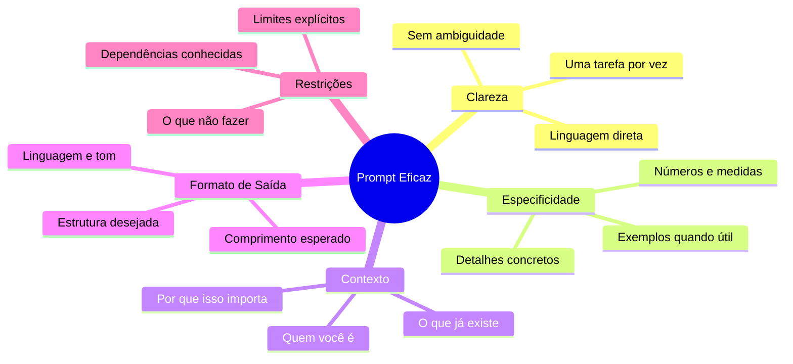

# 01 — Princípios Fundamentais de Prompt Engineering

> **Objetivo:** Dominar os princípios que tornam qualquer prompt mais eficaz, independente da ferramenta ou modelo utilizado.

---

## O que é Prompt Engineering?

**Prompt engineering** é a prática de estruturar entradas para modelos de linguagem de forma a obter outputs mais precisos, úteis e consistentes.

Não é uma arte mística — é uma disciplina com princípios verificáveis. A Anthropic documenta explicitamente que a qualidade do prompt é um dos fatores mais importantes para a qualidade do output:

> *"The quality of your results depends significantly on how well you structure your prompts."*
> — Anthropic Prompt Engineering Guide

> 📌 **Referência:** docs.anthropic.com/en/docs/build-with-claude/prompt-engineering/overview

---

## Os 5 Princípios Fundamentais



---

## Princípio 1: Clareza

**Clareza** significa que o modelo não precisa adivinhar o que você quer.

### Regras de ouro da clareza

- Uma instrução = uma tarefa
- Use verbos de ação específicos: *refatore*, *explique*, *liste*, *gere*, *corrija*
- Evite negações duplas e frases ambíguas
- Se der para interpretar de duas formas, vai ser interpretado da forma errada

### Comparativo

```
❌ Vago:
"Melhora esse código"

✅ Claro:
"Refatore esta função para eliminar duplicação de lógica, 
mantendo o mesmo comportamento externo. Não mude a assinatura da função."
```

```
❌ Ambíguo:
"Não faça coisas desnecessárias"

✅ Claro:
"Não adicione tratamento de erro para casos que nunca ocorrem no fluxo atual.
Não adicione comentários que apenas repetem o que o código já diz."
```

---

## Princípio 2: Especificidade

**Especificidade** elimina a necessidade de o modelo "preencher lacunas" com suposições.

### O que especificar sempre

| Dimensão | Vago | Específico |
|----------|------|------------|
| **Linguagem/Runtime** | "em Python" | "em Python 3.12 com type hints" |
| **Biblioteca** | "usando requests" | "usando httpx 0.27, client async" |
| **Tamanho do output** | "uma função" | "uma função de no máximo 30 linhas" |
| **Formato** | "uma lista" | "uma lista numerada em markdown" |
| **Comportamento de erro** | "trate erros" | "lance ValueError com mensagem descritiva para input None" |

### Exemplo prático

```
❌ Genérico:
"Crie uma função de autenticação"

✅ Específico:
"Crie a função `authenticate_user(email: str, password: str) -> AuthToken` em Python 3.12.
- Use bcrypt para verificar a senha contra o hash no banco
- Retorne um dataclass AuthToken com campos: token (str), expires_at (datetime)
- Lance AuthenticationError (já existente em src/exceptions.py) se as credenciais forem inválidas
- Nunca diferencie na mensagem de erro se foi o email ou a senha que falhou
- Não adicione logging — isso é responsabilidade do caller"
```

---

## Princípio 3: Contexto

**Contexto** é a informação que o modelo precisa mas não tem por padrão — seu projeto, suas convenções, sua situação.

### Tipos de contexto e quando incluir

| Tipo | O que incluir | Quando é crítico |
|------|---------------|-----------------|
| **Técnico** | Stack, versões, arquitetura | Sempre para geração de código |
| **De negócio** | Regras do domínio, invariantes | Quando a lógica tem exceções |
| **De código** | Código relacionado, interfaces existentes | Ao integrar com código existente |
| **De restrição** | O que não pode mudar, dependências fixas | Ao refatorar |
| **De objetivo** | Por que você precisa disso | Para tarefas de design/arquitetura |

### Contexto técnico mínimo para geração de código

```
"Contexto do projeto:
- Python 3.12, FastAPI 0.111, SQLAlchemy 2.0 (async)
- Banco: PostgreSQL 16
- Autenticação: JWT via python-jose
- Estrutura: src/routers/, src/models/, src/services/
- Convenções: snake_case, type hints obrigatórios, sem comentários inline"
```

---

## Princípio 4: Formato de Saída

**Especificar o formato** elimina trabalho de pós-processamento e garante que o output seja diretamente utilizável.

### Formatos comuns para desenvolvimento

| Situação | Formato ideal | Como pedir |
|----------|---------------|------------|
| Geração de código | Apenas código, sem explicação | "Retorne apenas o código, sem texto antes ou depois" |
| Explicação de conceito | Prosa com exemplos | "Explique em prosa com um exemplo de código ao final" |
| Análise de código | Lista de problemas | "Liste os problemas encontrados, um por linha, com o número da linha afetada" |
| Comparativo de opções | Tabela | "Compare em uma tabela markdown com colunas: Opção, Prós, Contras, Quando usar" |
| Plano de ação | Lista numerada | "Retorne um passo a passo numerado com estimativa de esforço para cada item" |

### Controlando o tamanho do output

```
"Seja conciso — a função não deve ter mais de 20 linhas"
"Explique em no máximo 3 parágrafos"
"Retorne apenas o diff das mudanças, não o arquivo inteiro"
"Limite a resposta ao essencial — sem introdução, sem conclusão"
```

---

## Princípio 5: Restrições

**Restrições explícitas** evitam que o modelo tome decisões que você não quer.

### Categorias de restrições úteis

```
Dependências:
  "Não adicione novas bibliotecas além das já importadas no arquivo"
  "Use apenas stdlib do Python — sem dependências externas"

Escopo:
  "Altere apenas a função processPayment — não toque no resto do arquivo"
  "Não mude a assinatura pública da classe"

Estilo:
  "Sem comentários inline — o código deve ser auto-explicativo"
  "Não use list comprehensions com mais de uma condição"

Comportamento:
  "Não altere o comportamento para inputs válidos — apenas adicione validação para inputs inválidos"
  "Mantenha compatibilidade com Python 3.10 — não use syntax de 3.12"
```

---

## Combinando os 5 Princípios: Antes e Depois

### Cenário: Pedir uma função de validação

**Antes (sem os princípios):**
```
Cria uma validação de CPF pra mim
```

**Depois (com os 5 princípios):**
```
Crie a função `validate_cpf(cpf: str) -> bool` em Python 3.12.

Contexto:
- Usada em um formulário de cadastro — input vem como string do usuário
- Deve seguir o algoritmo oficial de dígitos verificadores do CPF (Receita Federal)

Comportamento esperado:
- Retorna True para CPF válido (apenas o formato numérico de 11 dígitos)
- Retorna False (não lança exceção) para qualquer input inválido
- Trata CPFs mascarados (ex: "123.456.789-09") removendo pontuação antes de validar
- Rejeita CPFs com todos os dígitos iguais (111.111.111-11 é inválido)

Restrições:
- Sem dependências externas
- Sem regex — use aritmética direta para os dígitos verificadores
- Sem comentários no código

Formato de saída:
- Apenas o código da função com type hints
- Inclua 3 casos de teste simples usando assert no final (não doctest)
```

---

## Checklist: Avaliando Seu Prompt

Antes de enviar, passe pelo checklist:

```
Clareza:
  [ ] A instrução é interpretável de uma única forma?
  [ ] Há apenas uma tarefa principal?

Especificidade:
  [ ] Especifiquei linguagem e versão?
  [ ] Especifiquei bibliotecas relevantes?
  [ ] O formato de output está definido?

Contexto:
  [ ] O modelo tem acesso à informação que precisa?
  [ ] Incluí o código relacionado quando necessário?

Restrições:
  [ ] Listei o que NÃO deve ser feito?
  [ ] Defini o escopo claramente?
```

---

## ✅ Pontos-chave do Capítulo

- Clareza elimina ambiguidade — uma tarefa, um verbo de ação, zero dupla interpretação.
- Especificidade evita que o modelo preencha lacunas com suposições — dê detalhes concretos.
- Contexto é a diferença entre output genérico e output adaptado ao seu projeto.
- Formato de saída garante que o output seja diretamente utilizável.
- Restrições explícitas evitam que o modelo tome decisões indesejadas.

---

## 🔗 Próxima Aula

👉 [02 — Anatomia de um Prompt](./02-anatomia-de-um-prompt.md)
