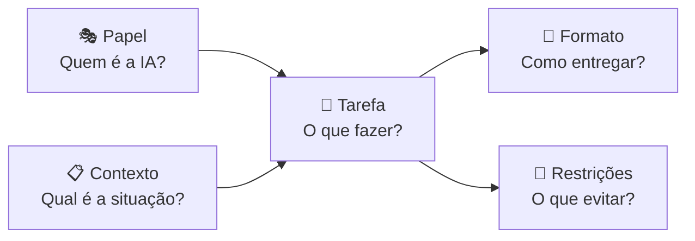
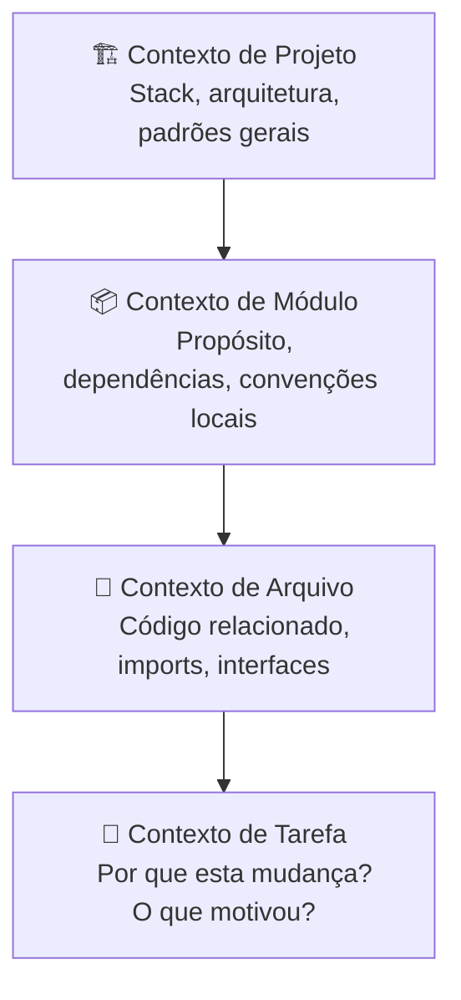
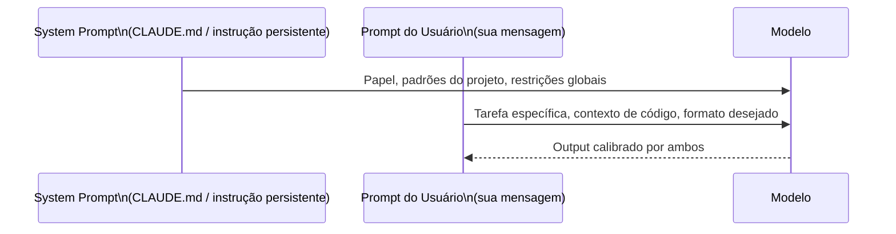

# 02 — Anatomia de um Prompt

> **Objetivo:** Conhecer os componentes estruturais de um prompt eficaz e saber quando e como usar cada um.

---

## O Modelo PCTFR

Um prompt completo tem até 5 componentes. Nenhum é obrigatório em toda situação — mas conhecer cada um te permite construir o prompt certo para cada contexto:

```
P — Papel (Persona / Role)
C — Contexto (Background / Situação)
T — Tarefa (O que fazer)
F — Formato (Como entregar o resultado)
R — Restrições (O que evitar / limitar)
```



---

## Componente 1: Papel (Role / Persona)

O **papel** instrui o modelo a adotar uma perspectiva específica de especialista. Isso ativa padrões de raciocínio e vocabulário alinhados àquela expertise.

### Por que funciona

O corpus de treinamento dos LLMs contém texto escrito por pessoas com diferentes especialidades. Ao definir um papel, você direciona o modelo a priorizar os padrões de raciocínio daquele perfil.

> 📌 **Referência:** A Anthropic documenta que o uso de roles no system prompt é uma técnica eficaz para configurar o comportamento do modelo — docs.anthropic.com/en/docs/build-with-claude/prompt-engineering/system-prompts

### Exemplos de papéis para desenvolvimento

| Papel | Quando usar | Exemplo |
|-------|-------------|---------|
| Senior developer | Geração e revisão geral de código | "Você é um desenvolvedor sênior Python com foco em código limpo e testável" |
| Security engineer | Análise de vulnerabilidades | "Você é um engenheiro de segurança especializado em OWASP Top 10" |
| Tech writer | Documentação | "Você é um technical writer que prioriza clareza e exemplos concretos" |
| Code reviewer | Revisão de PR | "Você é um revisor rigoroso que foca em correctude, performance e manutenibilidade" |
| Arquiteto | Design de sistema | "Você é um arquiteto de software especializado em sistemas distribuídos" |

### Como usar

```
Sistema (CLAUDE.md ou system prompt):
"Você é um desenvolvedor backend sênior especializado em Python e FastAPI.
Você prioriza código testável, seguro e legível.
Você não adiciona features além do que foi pedido.
Você sempre usa type hints e docstrings."

Usuário:
"Implemente o endpoint de criação de usuário conforme a spec abaixo..."
```

---

## Componente 2: Contexto

O **contexto** fornece ao modelo a informação de background que ele precisa para tomar decisões alinhadas com sua situação real.

### Hierarquia de contexto (do mais ao menos importante)



### Tipos de contexto e exemplos

**Contexto de projeto:**
```
"Este é um sistema de pagamentos B2B. Os valores são sempre em centavos (inteiro),
nunca em float. Usamos PostgreSQL com SQLAlchemy async. 
A autenticação é feita via API key no header X-API-Key."
```

**Contexto de código:**
```
"Aqui está o código existente que você vai modificar:
[código]

E aqui está a interface que a função deve satisfazer:
[interface/tipo]"
```

**Contexto de negócio:**
```
"Esta validação existe porque a Receita Federal exige que CPFs sejam verificados
antes de qualquer emissão de nota fiscal. O erro deve ser tratável pelo cliente da API."
```

---

## Componente 3: Tarefa

A **tarefa** é o coração do prompt — o que você quer que o modelo faça. Deve ser formulada com verbos de ação específicos.

### Verbos de ação para desenvolvimento

| Ação | Verbo ideal | Exemplo |
|------|-------------|---------|
| Criar código novo | Implemente, Crie, Gere | "Implemente a função `parse_csv`..." |
| Melhorar código | Refatore, Otimize, Simplifique | "Refatore eliminando a duplicação em..." |
| Corrigir código | Corrija, Conserte, Resolva | "Corrija o bug na linha 42 onde..." |
| Analisar código | Analise, Identifique, Revise | "Identifique todos os problemas de segurança em..." |
| Explicar código | Explique, Descreva, Documente | "Explique o fluxo de execução de..." |
| Transformar código | Converta, Migre, Traduza | "Converta esta classe de callbacks para async/await" |

### Decomposição de tarefa complexa

Para tarefas longas, divida em sub-tarefas explícitas:

```
"Faça as seguintes alterações no módulo de autenticação:

1. Extraia a lógica de validação de token em uma função separada `_validate_token`
2. Adicione rate limiting: máximo 5 tentativas por IP em 60 segundos
3. Adicione logging estruturado (JSON) para cada tentativa de login — sucesso e falha
4. Escreva testes unitários para os três cenários acima

Execute na ordem listada. Após cada passo, confirme o que foi feito antes de continuar."
```

---

## Componente 4: Formato

O **formato** define como o output deve ser estruturado e apresentado.

### Formatos mais usados em desenvolvimento

**Apenas código:**
```
"Retorne apenas o código Python, sem nenhum texto antes ou depois.
Não inclua blocos markdown — apenas o código puro."
```

**Código com explicação:**
```
"Retorne o código implementado, seguido de uma seção 'Decisões de Design'
com no máximo 3 bullet points explicando escolhas não óbvias."
```

**Lista de problemas:**
```
"Retorne uma lista de problemas no formato:
- [SEVERIDADE] Linha X: Descrição do problema
Onde SEVERIDADE é: CRÍTICO, ALTO, MÉDIO ou BAIXO"
```

**Diff:**
```
"Retorne apenas o diff das mudanças necessárias no formato unified diff.
Não retorne o arquivo inteiro."
```

**Tabela de análise:**
```
"Retorne uma tabela markdown com as colunas:
| Função | Complexidade | Problema | Sugestão |"
```

---

## Componente 5: Restrições

As **restrições** definem os limites explícitos — o que o modelo não deve fazer.

### Categorias de restrições

```
De escopo:
  "Modifique apenas a função listada — não altere o restante do arquivo"
  "Não adicione novas dependências ao projeto"

De estilo:
  "Sem comentários no código"
  "Sem type: ignore ou supressão de warnings"
  "Sem list comprehensions com mais de duas condições"

De comportamento:
  "Não quebre a interface pública atual"
  "Mantenha compatibilidade com Python 3.10"
  "Não altere o schema do banco de dados"

De segurança:
  "Não exponha mensagens de erro internas ao usuário final"
  "Não use eval() ou exec()"
  "Não faça queries sem parâmetros"
```

---

## Prompt System vs. Prompt de Usuário

Em ferramentas profissionais (Claude Code com CLAUDE.md, Copilot com copilot-instructions.md), existe uma distinção importante:



**O que vai no system prompt (CLAUDE.md / copilot-instructions):**
- Papel e persona permanentes
- Convenções do projeto (nomenclatura, estrutura)
- Restrições globais (libs proibidas, padrões obrigatórios)
- Informações sobre a stack

**O que vai no prompt do usuário:**
- Tarefa específica da sessão
- Código atual (contexto de arquivo)
- Formato de output desejado para esta tarefa

---

## Prompt Completo: Exemplo Real

```markdown
[PAPEL — no CLAUDE.md]
Você é um desenvolvedor backend sênior especializado em Python 3.12 e FastAPI.
Você escreve código limpo, testável e seguro. Sem comentários desnecessários.

[CONTEXTO — na mensagem]
Estou adicionando paginação ao endpoint GET /users.
Código atual do endpoint:

```python
@router.get("/users")
async def list_users(db: AsyncSession = Depends(get_db)):
    result = await db.execute(select(User))
    return result.scalars().all()
```

A model User tem os campos: id, email, name, created_at, is_active.
Usamos Pydantic v2 para schemas. Já existe o schema UserResponse em src/schemas/user.py.

[TAREFA]
Adicione paginação cursor-based ao endpoint usando o campo created_at como cursor.

[FORMATO]
Retorne:
1. O endpoint atualizado
2. O schema de response paginado (se necessário alterar)
3. Um exemplo de request/response

[RESTRIÇÕES]
- Não adicione offset-based pagination — quero cursor-based
- Limite máximo de 100 itens por página, padrão 20
- O cursor deve ser opaco para o cliente (encode em base64)
- Não altere o schema UserResponse existente — crie um wrapper se necessário
```

---

## ✅ Pontos-chave do Capítulo

- Um prompt tem 5 componentes: **Papel, Contexto, Tarefa, Formato, Restrições** — use os que forem relevantes.
- **Papel** ativa padrões de raciocínio de especialista — especialmente útil em system prompts persistentes.
- **Contexto** é o que diferencia output genérico de output adaptado ao seu projeto.
- **Tarefa** deve ter verbos de ação específicos; tarefas complexas devem ser decompostas.
- **Formato** garante que o output seja diretamente utilizável sem pós-processamento.
- **Restrições** evitam decisões indesejadas — liste explicitamente o que não fazer.

---

## 🔗 Próxima Aula

👉 [03 — Técnicas Avançadas](./03-tecnicas-avancadas.md)
