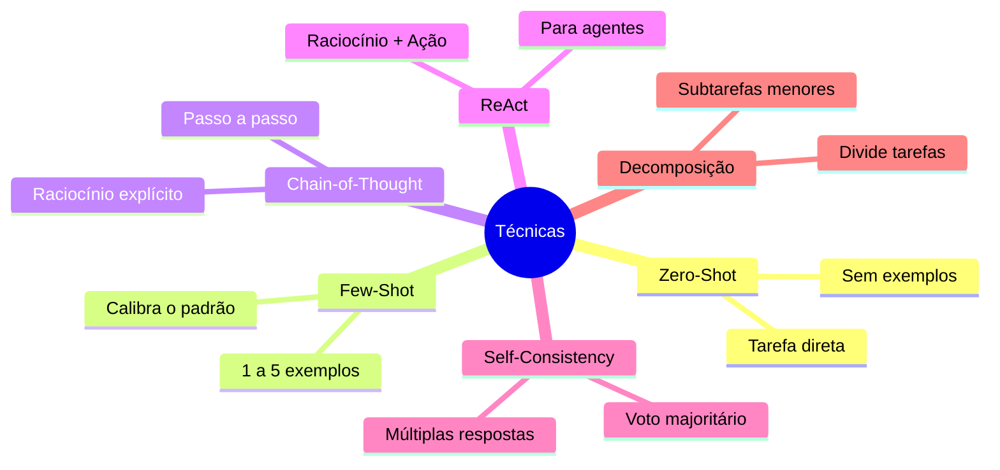

# 03 — Técnicas Avançadas de Prompt Engineering

> **Objetivo:** Dominar as principais técnicas de prompting que produzem resultados superiores em tarefas complexas de desenvolvimento.

---

## Visão Geral das Técnicas



---

## Técnica 1: Zero-Shot

**Zero-Shot** é o baseline — você descreve a tarefa sem fornecer exemplos. O modelo aplica conhecimento geral do treinamento.

```
Instrução direta → Output

"Analise este código e identifique possíveis memory leaks"
```

**Quando usar:**
- Tarefas padrão bem definidas (geração de docstring, conversão de formato)
- Quando o padrão desejado é óbvio e universal
- Como ponto de partida antes de adicionar exemplos

**Limitação:** Para tarefas com padrões específicos do seu projeto, o modelo vai usar convenções genéricas.

---

## Técnica 2: Few-Shot

**Few-Shot** fornece exemplos de entrada/saída para calibrar o comportamento do modelo antes da tarefa real.

> 📌 **Referência:** A Anthropic documenta few-shot como uma das técnicas mais eficazes para calibrar o formato e o padrão de output — docs.anthropic.com/en/docs/build-with-claude/prompt-engineering/use-examples-to-guide-outputs

### Estrutura

```
[Exemplo 1]
Input: <entrada de exemplo>
Output: <saída esperada>

[Exemplo 2]
Input: <entrada de exemplo>
Output: <saída esperada>

[Tarefa real]
Input: <sua entrada>
Output:
```

### Exemplo prático: Padronizando mensagens de commit

```
Você é um assistente de mensagens de commit.
Converta descrições informais em mensagens de commit no padrão Conventional Commits.

[Exemplo 1]
Descrição: "adicionei validação de email no formulário de cadastro"
Commit: feat(auth): add email validation on registration form

[Exemplo 2]
Descrição: "consertei o bug que fazia o botão de salvar travar quando o nome era vazio"
Commit: fix(ui): prevent save button freeze on empty name input

[Exemplo 3]
Descrição: "removi o console.log que ficou esquecido na tela de pagamento"
Commit: chore(payment): remove leftover console.log statement

[Tarefa]
Descrição: "migrei o banco de dados de MySQL para PostgreSQL e atualizei as queries"
Commit:
```

### Quantos exemplos usar?

| Situação | Exemplos recomendados |
|----------|-----------------------|
| Formato simples | 1-2 |
| Padrão específico da empresa | 3-5 |
| Tarefa com muita variação | 5+ |
| Classificação com múltiplas categorias | 1-2 por categoria |

**Regra prática:** Comece com 2-3 exemplos. Se o output ainda desviar do esperado, adicione mais exemplos que cubram os casos de desvio.

---

## Técnica 3: Chain-of-Thought (CoT)

**Chain-of-Thought** instrui o modelo a externalizar seu raciocínio passo a passo antes de chegar à resposta final. Isso melhora significativamente a qualidade em tarefas que requerem raciocínio multi-step.

> 📌 **Referência:** Paper original: "Chain-of-Thought Prompting Elicits Reasoning in Large Language Models" (Wei et al., 2022) — arxiv.org/abs/2201.11903

### Como ativar

```
❌ Sem CoT:
"Qual é a complexidade de tempo deste algoritmo?"

✅ Com CoT implícito:
"Analise a complexidade de tempo deste algoritmo. 
Pense passo a passo: identifique cada loop, suas relações de aninhamento 
e a operação dominante antes de dar a resposta final."

✅ Com CoT explícito:
"Analise a complexidade de tempo deste algoritmo.
Mostre seu raciocínio:
1. Identifique cada loop ou recursão
2. Determine o fator de crescimento de cada um
3. Combine os fatores
4. Conclua com a notação Big O"
```

### Quando CoT faz diferença

| Situação | Benefício |
|----------|-----------|
| Análise de algoritmos | Força análise sistemática |
| Debugging de lógica complexa | Explicita hipóteses antes de concluir |
| Avaliação de trade-offs de arquitetura | Considera cada dimensão separadamente |
| Revisão de segurança | Força análise de cada vetor de ataque |
| Estimativa de esforço | Decompõe antes de estimar |

### CoT para debugging

```
"Este código tem um bug — o resultado é incorreto para entradas negativas.

Antes de propor a correção, raciocine em voz alta:
1. Trace a execução com input = -5
2. Identifique exatamente onde o valor diverge do esperado
3. Explique por que aquela linha se comporta assim
4. Só então proponha a correção"

[código com bug]
```

---

## Técnica 4: ReAct (Reasoning + Acting)

**ReAct** é um padrão que combina raciocínio explícito com ações concretas em ciclos iterativos. É a base de como agentes de IA funcionam.

> 📌 **Referência:** Paper: "ReAct: Synergizing Reasoning and Acting in Language Models" (Yao et al., 2022) — arxiv.org/abs/2210.03629

### O loop ReAct

```
Thought: Raciocínio sobre a situação atual
Action: Ação a tomar (executar código, ler arquivo, chamar ferramenta)
Observation: Resultado da ação
Thought: Novo raciocínio com base na observação
Action: Próxima ação
... (repete até resolver)
```

### Exemplo em contexto de debugging

```
"Você tem acesso às ferramentas: read_file, run_tests, search_code.
Use o ciclo Thought/Action/Observation para investigar por que os testes de integração estão falhando.

Comece lendo o output do último CI e trabalhe de forma sistemática."
```

Isso é exatamente como Claude Code e Copilot Agent Mode operam internamente.

### Quando usar ReAct

- Tarefas de investigação (debugging, análise de impacto)
- Quando a próxima ação depende do resultado da anterior
- Fluxos com múltiplas ferramentas
- Qualquer task de agente autônomo

---

## Técnica 5: Self-Consistency

**Self-Consistency** gera múltiplas respostas independentes e seleciona a mais consistente. Útil para decisões críticas.

> 📌 **Referência:** "Self-Consistency Improves Chain of Thought Reasoning in Language Models" — arxiv.org/abs/2203.11171

### Como aplicar manualmente

```
"Analise este algoritmo de 3 perspectivas diferentes e independentes:

Perspectiva 1 — Performance: Foque apenas em otimização e complexidade
Perspectiva 2 — Manutenibilidade: Foque apenas em legibilidade e facilidade de mudança  
Perspectiva 3 — Segurança: Foque apenas em superfície de ataque e validações

Após as 3 análises, sintetize: em qual dimensão o código tem maior risco?"
```

### Uso em decisões de arquitetura

```
"Estou decidindo entre Redis e Memcached para cache de sessão.
Analise a decisão sob 3 lentes:
1. Operacional: facilidade de manutenção, monitoramento, failover
2. Performance: latência, throughput, modelo de dados
3. Custo-benefício: licenciamento, recursos de cloud, curva de aprendizado

Não salte para a recomendação — analise cada dimensão antes de concluir."
```

---

## Técnica 6: Decomposição de Tarefas

**Decomposição** quebra tarefas grandes em subtarefas menores, processadas sequencialmente. Crítica para tarefas que excedem a capacidade cognitiva de um único prompt.

### Padrão de decomposição explícita

```
"Vamos fazer isso em etapas. Não faça tudo de uma vez.

Etapa 1: Leia o código existente e liste as responsabilidades atuais da classe UserService.
Aguarde minha confirmação antes de continuar.

Etapa 2: Com base na lista, identifique quais responsabilidades violam o Princípio da Responsabilidade Única.
Aguarde minha confirmação antes de continuar.

Etapa 3: Proponha como extrair cada responsabilidade em uma classe separada.
Aguarde minha confirmação antes de continuar.

Etapa 4: Implemente a refatoração."
```

### Decomposição implícita (para agentes)

Para Claude Code e Copilot Agent Mode, a decomposição pode ser feita pelo próprio modelo:

```
"Adicione autenticação OAuth2 com Google a esta API FastAPI.
Pense na lista completa de mudanças necessárias antes de começar,
e execute uma de cada vez, confirmando o resultado antes de avançar."
```

---

## Combinando Técnicas

As técnicas se complementam. Exemplos de combinações eficazes:

| Combinação | Caso de uso |
|------------|-------------|
| **Few-Shot + CoT** | Ensinar o padrão E o raciocínio esperado |
| **CoT + Self-Consistency** | Decisões críticas de arquitetura |
| **ReAct + Decomposição** | Agentes que investigam e agem |
| **Zero-Shot + Formato** | Tarefas simples com output estruturado |

### Exemplo: Few-Shot + CoT para code review

```
Você é um revisor de código rigoroso.
Para cada problema encontrado, explique:
- O que é o problema
- Por que é um problema
- Como corrigir

[Exemplo]
Código:
```python
def get_user(id):
    return db.query(f"SELECT * FROM users WHERE id={id}")
```
Análise:
- **Problema:** SQL Injection na linha 2
- **Por que:** O id é interpolado diretamente na query sem sanitização, permitindo que um atacante injete SQL arbitrário
- **Correção:** Use parâmetros: `db.query("SELECT * FROM users WHERE id=?", (id,))`

[Tarefa]
Analise o seguinte código:
[código]
```

---

## ✅ Pontos-chave do Capítulo

- **Zero-Shot** é o baseline — use para tarefas padrão e como ponto de partida.
- **Few-Shot** é a técnica com melhor custo-benefício — 2-5 exemplos mudam radicalmente a qualidade.
- **Chain-of-Thought** melhora raciocínio complexo — peça explicitamente que o modelo "pense passo a passo".
- **ReAct** é o padrão fundamental dos agentes — reasoning + action em ciclos.
- **Self-Consistency** aumenta confiança em decisões críticas — analise de múltiplas perspectivas.
- **Decomposição** é essencial para tarefas grandes — quebre, confirme, avance.

---

## 🔗 Próxima Aula

👉 [04 — Prompts para Código](./04-prompts-para-codigo.md)
