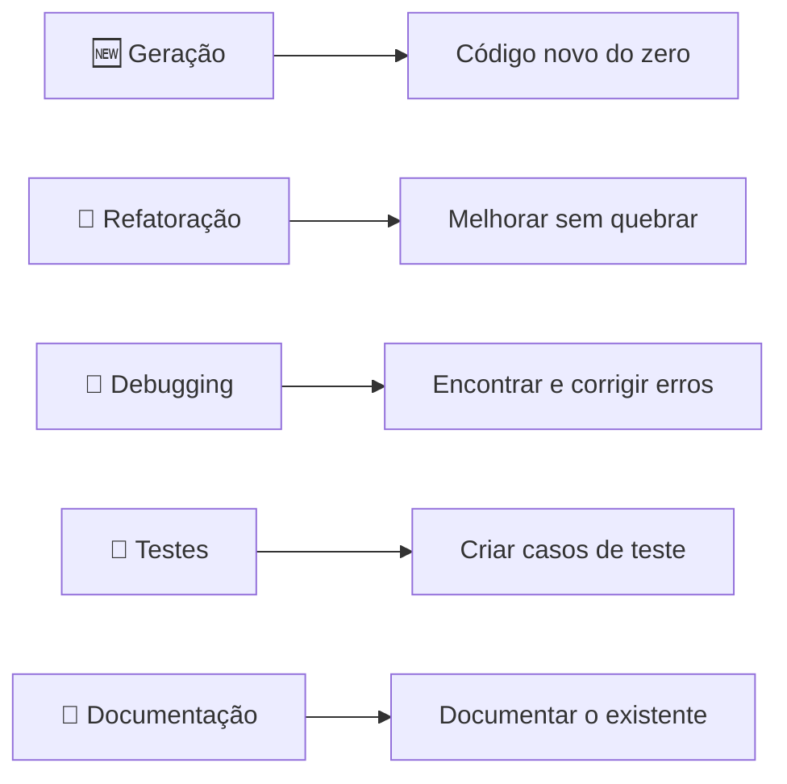

# 04 — Prompts para Código

> **Objetivo:** Dominar os padrões de prompt específicos para as situações mais comuns do desenvolvimento: geração, refatoração, debugging, testes e documentação.

---

## Os 5 Padrões Principais



Cada padrão tem uma estrutura de prompt otimizada. Aprenda as estruturas — não apenas os exemplos.

---

## Padrão 1: Geração de Código

**Objetivo:** Criar código novo do zero que atenda especificações precisas.

### Estrutura do prompt

```
[Assinatura ou interface]
[Comportamento esperado — casos normais]
[Comportamento de erro — o que lançar/retornar]
[Restrições técnicas — libs, versões, padrões]
[Formato de output — só código? Com testes?]
```

### Template

```markdown
Implemente `[nome_da_função](params) -> ReturnType` em [linguagem/versão].

**Comportamento:**
- Input válido: [o que retornar]
- Input inválido: [o que lançar/retornar]
- Edge cases: [comportamento especial]

**Contexto técnico:**
- [biblioteca/framework]: [versão]
- [padrão de projeto usado]: [detalhes]
- [integração com]: [sistema/módulo existente]

**Restrições:**
- [o que não usar]
- [compatibilidade necessária]

**Output:** Apenas o código com type hints. Sem comentários. Inclua [N] assertions de teste no final.
```

### Exemplo real: Função de rate limiting

```markdown
Implemente `check_rate_limit(user_id: str, action: str) -> bool` em Python 3.12.

**Comportamento:**
- Retorna True se o usuário pode executar a ação (dentro do limite)
- Retorna False se o limite foi atingido
- Limite padrão: 100 chamadas por minuto por (user_id, action)

**Contexto técnico:**
- Redis via redis-py 5.x (cliente assíncrono, já instanciado como `redis_client`)
- Algoritmo: sliding window com chave `rate:{user_id}:{action}`
- Janela: 60 segundos

**Restrições:**
- Operação atômica via Lua script ou pipeline — sem race conditions
- Não levante exceção para limite atingido — apenas retorne False
- Sem dependências além do redis-py já importado

**Output:** Apenas a função assíncrona com type hints.
```

---

## Padrão 2: Refatoração

**Objetivo:** Melhorar código existente (estrutura, clareza, performance) sem alterar comportamento externo.

### Estrutura do prompt

```
[Código atual — cole o código]
[Objetivo da refatoração — o que melhorar]
[O que NÃO mudar — interface pública, assinatura, comportamento]
[Critério de sucesso — como saber se ficou melhor]
```

### Template

```markdown
Refatore o código abaixo para [objetivo específico].

**Código atual:**
```[linguagem]
[código]
```

**O que melhorar:**
- [problema 1]
- [problema 2]

**O que NÃO alterar:**
- A assinatura pública da função/classe
- O comportamento para todos os inputs válidos
- [outras restrições]

**Critério:** O resultado deve ser [mais legível / mais performático / sem duplicação / etc.]

**Output:** Apenas o código refatorado. Se necessário, uma nota com as mudanças principais.
```

### Exemplo real: Extraindo responsabilidades

```markdown
Refatore a função abaixo para separar responsabilidades. Ela faz coisas demais.

**Código atual:**
```python
async def create_order(user_id: str, items: list[dict], db: AsyncSession):
    # Valida usuário
    user = await db.get(User, user_id)
    if not user or not user.is_active:
        raise ValueError("Usuário inválido")
    
    # Calcula total
    total = 0
    for item in items:
        product = await db.get(Product, item["product_id"])
        if not product or product.stock < item["quantity"]:
            raise ValueError(f"Produto {item['product_id']} indisponível")
        total += product.price * item["quantity"]
    
    # Aplica desconto
    if user.is_premium and total > 10000:
        total = total * 0.9
    
    # Cria pedido
    order = Order(user_id=user_id, total=total, status="pending")
    db.add(order)
    # ... 30 linhas mais
```

**O que melhorar:** Extraia em funções privadas com responsabilidade única.

**O que NÃO alterar:** A assinatura de `create_order`. O comportamento externo deve ser idêntico.

**Output:** O conjunto de funções refatorado. Máximo de 15 linhas por função.
```

---

## Padrão 3: Debugging

**Objetivo:** Identificar a causa raiz de um bug e corrigi-lo com o mínimo de mudança.

### Estrutura do prompt

```
[Código com o bug]
[Comportamento atual — o que está acontecendo]
[Comportamento esperado — o que deveria acontecer]
[Evidências — stack trace, logs, casos que reproduzem]
[Contexto adicional — o que já tentou]
```

### Template

```markdown
Este código tem um bug. Ajude a identificar e corrigir.

**Código:**
```[linguagem]
[código]
```

**Comportamento atual:** [o que acontece]
**Comportamento esperado:** [o que deveria acontecer]

**Evidências:**
```
[stack trace / log / output incorreto]
```

**Input que reproduz:** `[exemplo de input que dispara o bug]`

**O que já testei:** [suas hipóteses e o que descartou]

**Instrução:** Raciocine em voz alta — trace a execução com o input problemático antes de propor a correção. Faça o mínimo de mudança necessário.
```

### Exemplo real: Bug em lógica de paginação

```markdown
Este código tem um bug na paginação. Alguns itens aparecem duplicados.

**Código:**
```python
async def paginate_users(cursor: str | None, limit: int = 20) -> dict:
    query = select(User).order_by(User.created_at.desc())
    
    if cursor:
        cursor_time = datetime.fromisoformat(cursor)
        query = query.where(User.created_at < cursor_time)
    
    users = await db.execute(query.limit(limit + 1))
    users = users.scalars().all()
    
    has_more = len(users) > limit
    if has_more:
        users = users[:-1]
    
    next_cursor = users[-1].created_at.isoformat() if has_more else None
    return {"data": users, "next_cursor": next_cursor}
```

**Comportamento atual:** Quando dois usuários têm o mesmo `created_at`, o cursor aponta para o timestamp e ambos aparecem na próxima página.

**Comportamento esperado:** Sem duplicatas. Cada item deve aparecer exatamente uma vez.

**Instrução:** Trace a execução com dois usuários com mesmo created_at antes de corrigir. Use o mínimo de mudança possível.
```

---

## Padrão 4: Geração de Testes

**Objetivo:** Criar testes que realmente validem o comportamento, não apenas aumentem contagem de cobertura.

### Estrutura do prompt

```
[Código a testar — a função/classe]
[Tipo de teste — unitário, integração, e2e]
[Framework — pytest, jest, vitest, etc.]
[Casos obrigatórios — o que deve ser coberto]
[Contexto de mocks — o que mockar]
```

### Template

```markdown
Escreva testes [tipo] para a função abaixo usando [framework].

**Código:**
```[linguagem]
[código a testar]
```

**Cobertura obrigatória:**
- [ ] Happy path: [comportamento normal]
- [ ] Edge cases: [lista de casos limite]
- [ ] Erros: [quais exceções/erros devem ser testados]

**Mocks necessários:**
- [dependência 1]: [como mockar]
- [dependência 2]: [como mockar]

**Restrições:**
- [framework de mock preferido]
- [convenções de naming da empresa]
- [sem testes de implementação interna — apenas comportamento observável]

**Output:** Apenas os testes, organizados por grupo de comportamento.
```

### Exemplo real: Testes para autenticação

```markdown
Escreva testes unitários para a função `authenticate_user` usando pytest e pytest-asyncio.

**Código:**
```python
async def authenticate_user(email: str, password: str, db: AsyncSession) -> AuthToken:
    user = await db.execute(select(User).where(User.email == email))
    user = user.scalar_one_or_none()
    
    if not user or not bcrypt.checkpw(password.encode(), user.password_hash):
        raise AuthenticationError("Credenciais inválidas")
    
    if not user.is_active:
        raise AuthenticationError("Conta desativada")
    
    token = create_jwt(user.id, expires_in=3600)
    return AuthToken(token=token, expires_at=datetime.utcnow() + timedelta(hours=1))
```

**Cobertura obrigatória:**
- [ ] Credenciais corretas → retorna AuthToken com token e expires_at
- [ ] Email não encontrado → AuthenticationError
- [ ] Senha incorreta → AuthenticationError (mesma mensagem que email não encontrado)
- [ ] Conta desativada → AuthenticationError
- [ ] Verificar que mensagem de erro NÃO diferencia email inválido de senha inválida

**Mocks:**
- `db`: mock da sessão SQLAlchemy retornando User fixture
- `bcrypt.checkpw`: mock direto
- `create_jwt`: mock retornando token fixo "test-token"

**Output:** Testes agrupados por cenário. Sem comentários óbvios.
```

---

## Padrão 5: Documentação

**Objetivo:** Gerar documentação precisa, concisa e útil para código existente.

### Estrutura do prompt

```
[Código a documentar]
[Tipo de documentação — docstring, README, changelog]
[Audiência — quem vai ler]
[Convenção — Google style, NumPy, JSDoc, etc.]
[Nível de detalhe — o que incluir e o que omitir]
```

### Tipos de documentação e prompts específicos

**Docstrings:**
```markdown
Escreva docstrings no estilo Google para todas as funções públicas do código abaixo.

Inclua: descrição de uma linha, Args (com tipos e descrição), Returns, Raises.
Omita: comentários sobre implementação interna, referências ao histórico.
Audiência: outro desenvolvedor Python que nunca viu este código.

```python
[código]
```
```

**README de módulo:**
```markdown
Escreva um README.md para este módulo Python.

Estrutura desejada:
1. O que este módulo faz (2 linhas)
2. Instalação/dependências (se houver)
3. Uso básico com exemplo de código real
4. API pública — apenas os métodos públicos, em tabela
5. Limitações conhecidas

Audiência: desenvolvedor novo no projeto. Tom: técnico e direto.
```

**Changelog de PR:**
```markdown
Gere um changelog entry para este diff.

Formato: Keep a Changelog (keepachangelog.com)
Versão: [número]
Data: [data]

Diff:
[diff do git]

Inclua apenas mudanças observáveis externamente. Omita refatorações internas.
```

---

## Comparativo de Padrões por Situação

| Situação | Padrão | Elemento mais crítico |
|----------|--------|----------------------|
| Feature nova sem código relacionado | Geração | Especificidade da interface |
| Feature nova com código existente | Geração + Contexto | Código relacionado no prompt |
| Código funciona mas está bagunçado | Refatoração | "O que NÃO mudar" |
| Comportamento inesperado em produção | Debugging | Evidências + raciocínio passo a passo |
| Cobertura baixa em módulo estável | Testes | Lista de edge cases |
| API pública sem documentação | Documentação | Audiência e convenção |

---

## ✅ Pontos-chave do Capítulo

- **Geração:** Sempre especifique a assinatura, os casos de erro e as restrições técnicas.
- **Refatoração:** O elemento mais importante é definir **o que não mudar** — proteja a interface pública.
- **Debugging:** Cole o stack trace, descreva o input que reproduz o bug, peça raciocínio antes da correção.
- **Testes:** Liste os casos obrigatórios explicitamente — não espere que o modelo adivinhe seus edge cases.
- **Documentação:** Defina a audiência e a convenção — a qualidade muda radicalmente com isso.

---

## 🔗 Próxima Aula

👉 [05 — Chain-of-Thought e Reasoning](./05-chain-of-thought-e-reasoning.md)
