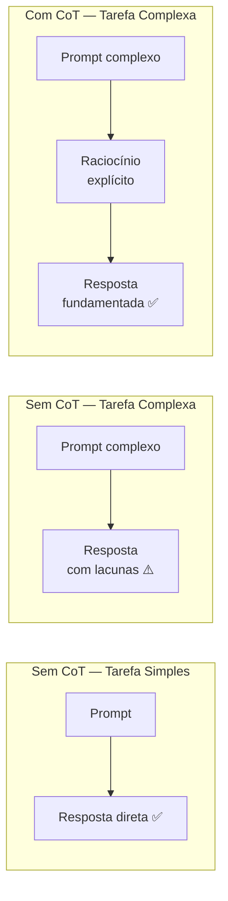
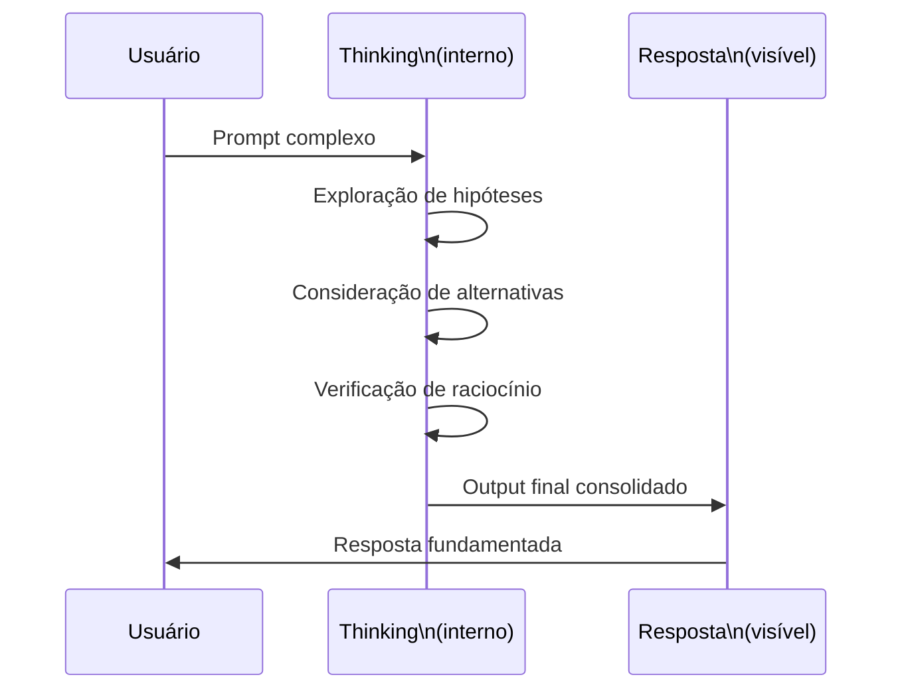
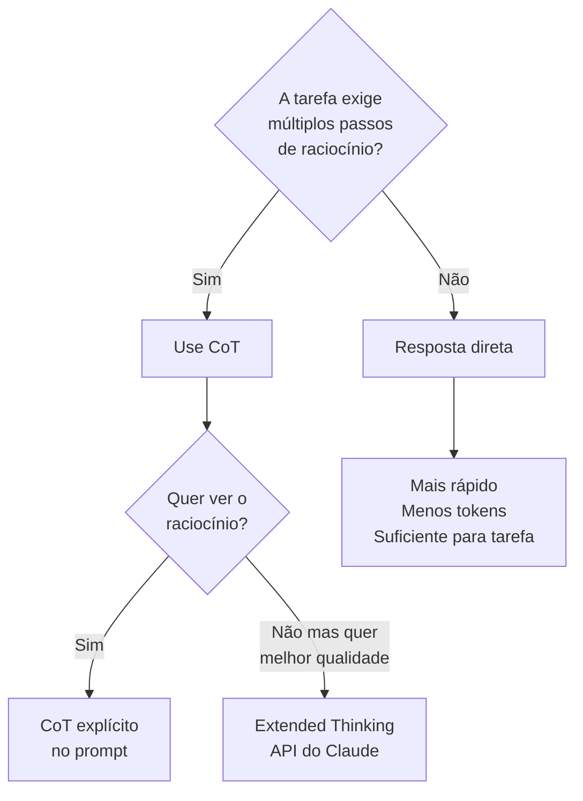

# 05 — Chain-of-Thought e Reasoning

> **Objetivo:** Entender quando e como usar raciocínio explícito para melhorar a qualidade em tarefas que exigem análise multi-step — e como o Extended Thinking do Claude funciona.

---

## O Problema com Respostas Diretas

Para tarefas simples, resposta direta funciona bem. Para tarefas complexas, o modelo pode "pular etapas" e chegar a conclusões erradas com confiança.



> 📌 **Referência:** O paper original de CoT (Wei et al., 2022) demonstrou melhora significativa em benchmarks de raciocínio matemático e lógico — arxiv.org/abs/2201.11903. A Anthropic documenta a técnica em docs.anthropic.com/en/docs/build-with-claude/prompt-engineering/chain-of-thought

---

## Formas de Ativar Chain-of-Thought

### 1. Instrução direta

```
"Pense passo a passo antes de responder."
"Raciocine em voz alta antes de dar a resposta final."
"Mostre seu raciocínio."
```

### 2. Estrutura explícita

```
"Analise em 3 etapas:
1. [Primeira etapa de análise]
2. [Segunda etapa de análise]  
3. Só então dê a resposta final"
```

### 3. Few-shot com raciocínio

```
[Exemplo]
Problema: [descrição]
Raciocínio: [passos explícitos de análise]
Resposta: [conclusão baseada no raciocínio]

[Tarefa]
Problema: [novo problema]
Raciocínio:
```

---

## Quando CoT Faz Diferença

| Situação | Ganho com CoT | Situação | Sem ganho |
|----------|---------------|----------|-----------|
| Análise de complexidade algorítmica | Alto | Geração de boilerplate | Baixo |
| Debugging de lógica multi-step | Alto | Formatação de código | Nenhum |
| Avaliação de trade-offs | Alto | Renomear variável | Nenhum |
| Análise de segurança (vetores de ataque) | Alto | Gerar docstring simples | Baixo |
| Estimativa de esforço | Médio-alto | Converter JSON para CSV | Baixo |
| Decisão de arquitetura | Alto | Adicionar tipo a função | Nenhum |

**Regra prática:** Use CoT quando a resposta correta exige considerar múltiplos fatores antes de concluir.

---

## CoT na Prática: Exemplos de Desenvolvimento

### Análise de bug complexo

```markdown
"Este código tem um bug de race condition que só ocorre sob alta carga.

```python
async def increment_counter(key: str, db: Redis):
    current = await db.get(key) or 0
    await asyncio.sleep(0)  # simula I/O
    await db.set(key, int(current) + 1)
```

Antes de propor a correção, raciocine:
1. Trace duas coroutines executando simultaneamente com key='visits'
2. Identifique exatamente qual linha cria o problema
3. Explique por que `asyncio.sleep(0)` torna o bug mais evidente
4. Só então proponha a correção mínima necessária"
```

### Avaliação de trade-offs de arquitetura

```markdown
"Estou escolhendo entre PostgreSQL e MongoDB para armazenar eventos de auditoria.
Volume: ~1M eventos/dia, retenção de 2 anos, queries por user_id e date range.

Raciocine em etapas:
1. Analise o padrão de escrita (insert-heavy, never update)
2. Analise o padrão de leitura (queries mencionadas)
3. Analise o volume e crescimento (1M/dia × 730 dias)
4. Considere operações de manutenção (particionamento, archiving)
5. Conclua com uma recomendação e as condições em que ela muda"
```

### Análise de impacto de refatoração

```markdown
"Quero extrair a classe UserRepository do arquivo user_service.py (1200 linhas).

Antes de gerar o plano, raciocine:
1. Liste todas as dependências que UserService tem atualmente
2. Identifique quais métodos pertencem genuinamente ao repositório vs. ao serviço
3. Identifique riscos: o que pode quebrar com a extração?
4. Considere o order de execução para não quebrar o sistema durante a migração
5. Então gere o plano passo a passo"
```

---

## Extended Thinking: CoT Interno do Claude

O **Extended Thinking** é uma feature específica do Claude que permite ao modelo raciocinar extensivamente em um espaço de "pensamento" interno antes de responder.

> 📌 **Referência:** Anthropic documenta Extended Thinking em: docs.anthropic.com/en/docs/build-with-claude/extended-thinking

### Como funciona



### Como ativar via API

```python
import anthropic

client = anthropic.Anthropic()

response = client.messages.create(
    model="claude-opus-4-5",
    max_tokens=16000,
    thinking={
        "type": "enabled",
        "budget_tokens": 10000  # tokens dedicados ao raciocínio interno
    },
    messages=[{
        "role": "user",
        "content": "Analise os trade-offs de arquitetura deste sistema..."
    }]
)

# O response tem dois tipos de bloco:
for block in response.content:
    if block.type == "thinking":
        print("Raciocínio interno:", block.thinking)
    elif block.type == "text":
        print("Resposta:", block.text)
```

### Quando usar Extended Thinking

| Situação | Recomendado |
|----------|:-----------:|
| Análise de segurança complexa | ✅ |
| Debugging de bugs intermitentes | ✅ |
| Decisões de arquitetura com muitas variáveis | ✅ |
| Análise de algoritmos com provas | ✅ |
| Geração de código padrão | ❌ |
| Formatação e transformações simples | ❌ |

**Custo:** Extended Thinking consome mais tokens (e portanto tem custo maior). Use para tarefas onde a qualidade do raciocínio justifica o custo adicional.

### Extended Thinking em Claude Code

Quando você usa Claude Code para tarefas complexas, o modelo aplica raciocínio estendido automaticamente para planejamento de multi-step tasks. Você pode incentivar isso com:

```
"Antes de começar a implementar, pense cuidadosamente em:
- Todos os arquivos que precisarão ser modificados
- A ordem correta das mudanças para não quebrar nada
- Possíveis efeitos colaterais
Só então execute o plano"
```

---

## CoT para Code Review

Um dos usos mais valiosos de CoT é em revisões de código:

```markdown
"Revise este pull request. Para cada problema encontrado:

1. Cite a linha ou bloco específico
2. Explique POR QUE é um problema (não apenas que é)
3. Avalie a severidade: CRÍTICO / ALTO / MÉDIO / BAIXO
4. Proponha a correção

Não liste problemas de estilo — foque em correctude, segurança e performance.

```diff
[diff do PR]
```
"
```

---

## CoT vs. Resposta Direta: Quando Cada Um Ganha



---

## Anti-Pattern: Pedir CoT Desnecessariamente

Nem toda tarefa precisa de raciocínio explícito. Pedir "pense passo a passo" para tarefas triviais:
- Aumenta o uso de tokens sem benefício
- Torna a resposta mais longa sem adicionar qualidade
- Pode até atrapalhar para tarefas com resposta óbvia

```
❌ Desnecessário:
"Pense passo a passo e adicione type hints a esta função Python"

✅ Suficiente:
"Adicione type hints a esta função Python"
```

---

## ✅ Pontos-chave do Capítulo

- **CoT** melhora tarefas que exigem raciocínio multi-step — análise de bugs, trade-offs, avaliação de impacto.
- **Ative CoT** com "pense passo a passo", estrutura explícita de etapas, ou few-shot com raciocínio.
- **Extended Thinking** é a implementação nativa do Claude — raciocínio interno antes da resposta. Ative via API com `thinking: {type: "enabled"}`.
- **Não use CoT** para tarefas simples — é desperdício de tokens sem benefício.
- **Code review** é um dos melhores casos de uso de CoT — force o modelo a justificar cada problema.

---

## 🔗 Próxima Aula

👉 [06 — Few-Shot e Exemplos](./06-few-shot-e-exemplos.md)
