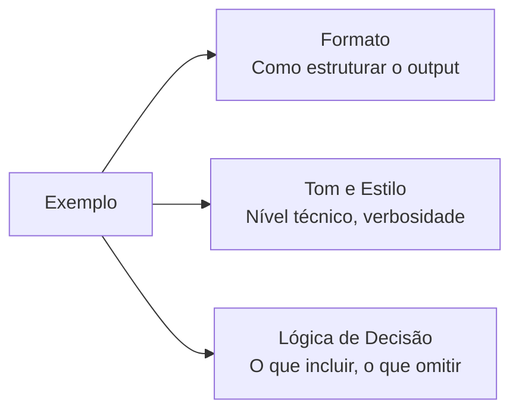
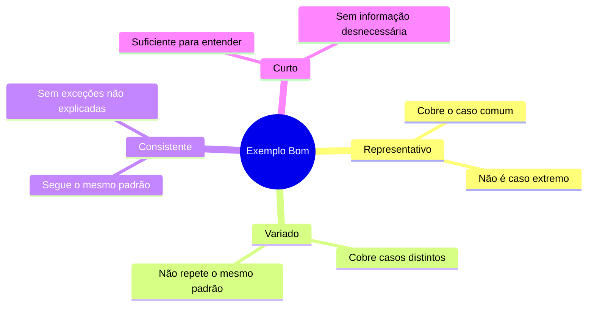

# 06 — Few-Shot e Exemplos

> **Objetivo:** Dominar a técnica de few-shot learning para calibrar o modelo com precisão — quando usar exemplos, como construí-los e como evitar que eles saiam pela culatra.

---

## O que é Few-Shot?

**Few-shot** é fornecer exemplos de entrada e saída esperada antes da tarefa real. O modelo usa esses exemplos para inferir o padrão desejado e aplicá-lo à nova entrada.

```
Zero-shot:  [instrução]                        → output
One-shot:   [instrução] + [1 exemplo]          → output
Few-shot:   [instrução] + [2-5 exemplos]       → output melhor calibrado
```

> 📌 **Referência:** A Anthropic documenta few-shot como uma das técnicas mais eficazes para calibrar comportamento: "Examples are one of the most powerful tools for guiding Claude's behavior" — docs.anthropic.com/en/docs/build-with-claude/prompt-engineering/use-examples-to-guide-outputs

---

## Por que Exemplos Funcionam

O modelo aprende três coisas de um exemplo:



Um bom conjunto de exemplos substitui páginas de instrução textual.

---

## Quando Usar Few-Shot

| Situação | Usar? | Por quê |
|----------|:-----:|---------|
| Formato de output não-padrão | ✅ | Exemplos definem o formato melhor que descrição |
| Convenção específica da empresa | ✅ | O modelo não conhece suas regras internas |
| Classificação com muitas categorias | ✅ | Um exemplo por categoria calibra os limites |
| Transformação de dados com nuances | ✅ | Edge cases ficam claros com exemplos |
| Geração de código padrão universal | ❌ | Zero-shot já cobre com instruções claras |
| Tarefa bem definida e sem ambiguidade | ❌ | Overhead sem benefício |

---

## Construindo Bons Exemplos

### Os 4 critérios de um bom exemplo



### O que NÃO fazer em exemplos

```
❌ Exemplos repetitivos (ensinam o mesmo padrão):
Input: "corrigir typo no nome"     → fix: correct typo in username
Input: "corrigir erro de digitação" → fix: fix typo in field name

✅ Exemplos variados (cobrem padrões diferentes):
Input: "corrigir typo no nome"     → fix: correct typo in username field
Input: "adicionar validação"       → feat: add email format validation
Input: "melhorar performance"      → perf: optimize user query with index
```

---

## Estrutura de um Bloco Few-Shot

```
[Instrução geral]

[Exemplo 1]
Input: <entrada>
Output: <saída esperada>

[Exemplo 2]
Input: <entrada>
Output: <saída esperada>

[Exemplo N]
...

Agora faça o mesmo para:
Input: <sua entrada real>
Output:
```

---

## Casos de Uso Práticos para Desenvolvimento

### 1. Padronizar mensagens de commit

```markdown
Converta a descrição informal em um commit message no padrão Conventional Commits.
Tipos: feat, fix, refactor, test, docs, chore, perf, style

Exemplos:

Input: "adicionei botão de exportar CSV na tela de relatórios"
Output: feat(reports): add CSV export button

Input: "consertei o crash quando o usuário não tem foto de perfil"
Output: fix(profile): handle missing avatar image gracefully

Input: "mudei o nome da variável temp para pendingOrders"
Output: refactor(orders): rename temp variable to pendingOrders

Input: "coloquei testes para a função de validar CPF"
Output: test(validation): add unit tests for CPF validator

Agora converta:
Input: "removi o endpoint antigo de login que não era mais usado"
Output:
```

### 2. Padronizar mensagens de log

```markdown
Converta logs informais em logs estruturados JSON para o nosso sistema.
O log deve ter: level, message, context (objeto com dados relevantes).

Exemplos:

Input: "usuário João (id: 123) fez login com sucesso às 14:30"
Output: {"level": "info", "message": "user.login.success", "context": {"user_id": 123, "username": "João"}}

Input: "ERRO: pagamento falhou para pedido 456 - cartão recusado"
Output: {"level": "error", "message": "payment.failed", "context": {"order_id": 456, "reason": "card_declined"}}

Input: "tentativa de acesso não autorizado ao endpoint /admin por IP 192.168.1.1"
Output: {"level": "warn", "message": "auth.unauthorized_access", "context": {"endpoint": "/admin", "ip": "192.168.1.1"}}

Agora converta:
Input: "produto 789 ficou sem estoque depois do pedido do cliente Maria"
Output:
```

### 3. Classificar issues do GitHub

```markdown
Classifique esta issue em uma das categorias: BUG, FEATURE, IMPROVEMENT, QUESTION, DOCS.
Retorne apenas a categoria, sem explicação.

Exemplos:

Input: "O botão de salvar não funciona no Firefox 120"
Output: BUG

Input: "Seria ótimo ter exportação para PDF"
Output: FEATURE

Input: "O tempo de carregamento da lista está lento com mais de 1000 itens"
Output: IMPROVEMENT

Input: "Como configurar autenticação com LDAP?"
Output: QUESTION

Classifique:
Input: "Falta documentação sobre os parâmetros da API de webhooks"
Output:
```

### 4. Gerar código de teste a partir de casos de uso

```markdown
Gere um teste pytest para o caso de uso descrito, seguindo o padrão dos exemplos.

Exemplos:

Caso: "login com credenciais corretas retorna token JWT"
Teste:
```python
async def test_login_success(client, user_factory):
    user = await user_factory(email="test@example.com", password="secret")
    response = await client.post("/auth/login", json={"email": "test@example.com", "password": "secret"})
    assert response.status_code == 200
    assert "token" in response.json()
```

Caso: "login com senha incorreta retorna 401"
Teste:
```python
async def test_login_wrong_password(client, user_factory):
    await user_factory(email="test@example.com", password="correct")
    response = await client.post("/auth/login", json={"email": "test@example.com", "password": "wrong"})
    assert response.status_code == 401
    assert response.json()["detail"] == "Credenciais inválidas"
```

Gere o teste para:
Caso: "login com conta desativada retorna 403"
Teste:
```

---

## Few-Shot para Calibrar Nível de Detalhe

Um uso menos óbvio de few-shot é calibrar **o quanto** o modelo escreve:

```markdown
Explique este conceito de forma concisa, no estilo dos exemplos.

Exemplos:

Conceito: "O que é um mutex?"
Explicação: Lock que garante acesso exclusivo a um recurso. Só uma goroutine/thread pode segurá-lo por vez. Se outra tenta adquiri-lo, bloqueia até ser liberado.

Conceito: "O que é memoização?"
Explicação: Cache de resultados de funções puras. Dado o mesmo input, retorna o resultado armazenado em vez de recalcular. Troca tempo por memória.

Explique:
Conceito: "O que é um deadlock?"
Explicação:
```

---

## Armadilhas do Few-Shot

### Armadilha 1: Exemplos que contradizem a instrução

```
❌ Instrução diz "sem emoji", mas os exemplos têm emoji → modelo vai usar emoji
✅ Instrução e exemplos devem ser consistentes
```

### Armadilha 2: Exemplos que cobrem só o happy path

```
❌ Todos os exemplos são casos normais → modelo não sabe como tratar edge cases
✅ Inclua pelo menos 1 exemplo com caso limite ou input inesperado
```

### Armadilha 3: Exemplos muito longos

```
❌ Exemplos com 50+ linhas → modelo tenta replicar a verbosidade, não o padrão
✅ Exemplos tão curtos quanto possível para comunicar o padrão
```

### Armadilha 4: Exemplos muito homogêneos

```
❌ 5 exemplos que cobrem a mesma variação → modelo aprende um padrão estreito
✅ Cada exemplo cobre uma variação diferente do espaço de inputs
```

---

## Quantos Exemplos Usar?

| Situação | Exemplos |
|----------|----------|
| Formato simples com regra clara | 1-2 |
| Transformação com nuances | 3-4 |
| Classificação em N categorias | 1 por categoria |
| Estilo muito específico | 4-5 |
| Mais que 5 raramente ajuda | — |

**Como decidir:** Comece com 2 exemplos. Se o output ainda desviar, adicione um exemplo que cubra o padrão que está errando.

---

## ✅ Pontos-chave do Capítulo

- **Few-shot** calibra formato, tom e lógica de decisão simultaneamente — mais eficiente que texto descritivo.
- **Bons exemplos** são representativos, variados, consistentes e curtos.
- **Comece com 2-3 exemplos** e adicione mais apenas se o output ainda desviar.
- **1 exemplo por categoria** para problemas de classificação.
- **Cuidado com contradições** entre instrução e exemplos — o modelo vai seguir os exemplos.

---

## 🔗 Próxima Aula

👉 [07 — Anti-Patterns](./07-anti-patterns.md)
