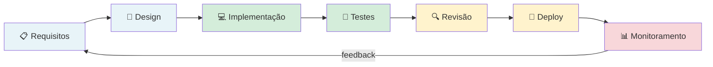
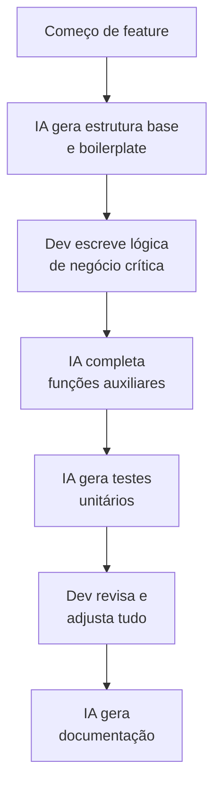
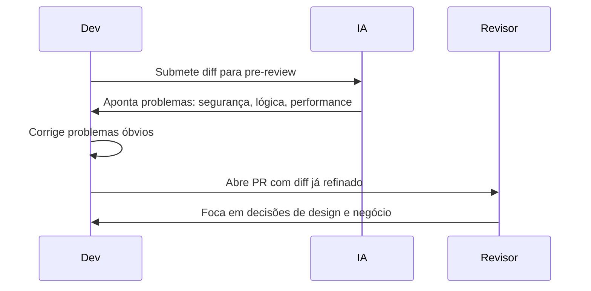

# 01 — IA no Ciclo de Desenvolvimento

> **Objetivo:** Entender onde e como a IA se encaixa em cada fase do ciclo de desenvolvimento de software — do levantamento de requisitos ao deploy.

---

## O Ciclo de Desenvolvimento com IA

A IA não entra apenas na fase de escrita de código. Ela pode contribuir em **todas as fases** do ciclo, assumindo papéis diferentes em cada uma.



---

## Fase 1: Requisitos e Planejamento

**O que a IA faz bem aqui:**

| Tarefa | Como usar | Ganho |
|--------|-----------|-------|
| Refinamento de histórias | "Aqui está a história de usuário — identifique ambiguidades e perguntas em aberto" | Detecta lacunas antes de codar |
| Estimativa de esforço | "Com base nesta spec, liste subtarefas e estime complexidade" | Decomposição mais completa |
| Critérios de aceitação | "Gere critérios de aceitação Given/When/Then para esta feature" | Cobertura de edge cases |
| Análise de impacto | "Quais módulos existentes esta mudança pode afetar?" | Reduz surpresas |

### Exemplo: Refinando uma história de usuário

```markdown
"Analise esta história de usuário e identifique:
1. Ambiguidades que precisam ser esclarecidas com o PO
2. Edge cases não mencionados que provavelmente existem
3. Dependências técnicas implícitas
4. Critérios de aceitação que estão faltando

História: 'Como usuário, quero redefinir minha senha para recuperar acesso à minha conta'"
```

**Output esperado:** lista de perguntas (e se o email não existir? e se o link expirar? quantas tentativas?), critérios de aceitação estruturados, dependências (sistema de email, rate limiting).

---

## Fase 2: Design e Arquitetura

**O que a IA faz bem aqui:**

| Tarefa | Como usar |
|--------|-----------|
| Esboço de arquitetura | Descreva o problema, peça opções com trade-offs |
| Revisão de design | "Quais problemas você vê neste diagrama de sequência?" |
| Escolha de padrões | "Qual design pattern se aplica a este cenário?" |
| Análise de trade-offs | "Compare estas duas abordagens para este requisito" |

> ⚠️ **Limite importante:** A IA não conhece o histórico do seu sistema, decisões passadas, restrições organizacionais ou dívida técnica acumulada. Decisões de arquitetura exigem julgamento humano — use a IA para explorar opções, não para decidir.

### Exemplo: Explorando opções de design

```markdown
"Preciso implementar notificações em tempo real para ~10k usuários simultâneos.

Descreva as opções: WebSockets, SSE, Long Polling e Polling curto.
Para cada uma:
- Complexidade de implementação (1-5)
- Adequação para este volume
- Quando escolheria esta abordagem
- Quando NÃO escolheria

Nosso stack: Python/FastAPI, PostgreSQL, Redis. Sem infraestrutura de mensageria."
```

---

## Fase 3: Implementação

Esta é a fase onde a IA tem o maior impacto direto. Os padrões específicos estão detalhados no Capítulo 01 (Prompt Engineering) e nas próximas aulas.

**Mapa de uso durante a implementação:**



**Regra de ouro:** A lógica de negócio específica do seu domínio é responsabilidade do desenvolvedor. Delegue boilerplate, utilitários e código padrão.

---

## Fase 4: Testes

**O que a IA faz bem aqui:**

| Tarefa | Nível de confiança |
|--------|-------------------|
| Gerar testes unitários para funções puras | Alto |
| Identificar edge cases não cobertos | Alto |
| Gerar fixtures e factories de dados | Alto |
| Criar testes de integração | Médio — revise a lógica |
| Criar testes end-to-end | Baixo — exige conhecimento da UI |

```markdown
"Analise esta função e identifique todos os caminhos de execução possíveis.
Para cada caminho, gere um teste unitário usando pytest.
Liste os caminhos antes de gerar os testes."

[função]
```

Detalhado na aula [08 — Geração de Testes](./08-geracao-de-testes.md).

---

## Fase 5: Code Review

A IA funciona como **primeiro revisor** — não substitui a revisão humana, mas a complementa capturando problemas antes.



**Resultado:** O revisor humano não gasta tempo em problemas mecânicos e pode focar no que realmente importa.

Detalhado na aula [03 — Code Review com IA](./03-code-review-com-ia.md).

---

## Fase 6: Deploy e Operações

**O que a IA faz bem aqui:**

| Tarefa | Como usar |
|--------|-----------|
| Gerar scripts de migration | Com revisão obrigatória antes de executar |
| Revisar configurações de infraestrutura | "Identifique problemas neste docker-compose.yml" |
| Gerar runbooks | "Crie um runbook de rollback para esta feature" |
| Analisar changelogs para release notes | "Transforme estes commits em release notes para usuários finais" |

> ⚠️ **Regra inviolável:** Nunca execute scripts destrutivos gerados por IA (DROP, DELETE, migrations irreversíveis) sem revisão humana e teste em ambiente não-produtivo.

---

## Fase 7: Monitoramento e Debugging

**O que a IA faz bem aqui:**

| Tarefa | Como usar |
|--------|-----------|
| Análise de stack traces | Cole o trace completo + código relevante |
| Interpretação de logs | "O que este padrão de log indica?" |
| Hipóteses para bugs intermitentes | "Dado este comportamento, quais são as causas prováveis?" |
| Análise de queries lentas | Cole o EXPLAIN ANALYZE e peça diagnóstico |

Detalhado na aula [06 — Debugging com IA](./06-debugging-com-ia.md).

---

## Mapa de Valor por Fase

```mermaid
xychart-beta
    title "Impacto da IA por fase do ciclo"
    x-axis [Requisitos, Design, Implementação, Testes, Review, Deploy, Monitoramento]
    y-axis "Nível de impacto" 0 --> 10
    bar [5, 4, 9, 8, 7, 5, 7]
```

---

## Armadilhas por Fase

| Fase | Armadilha comum |
|------|----------------|
| Requisitos | Aceitar critérios de aceitação sem validar com stakeholders |
| Design | Implementar a arquitetura sugerida sem considerar contexto organizacional |
| Implementação | Aceitar código sem revisar — especialmente lógica de negócio |
| Testes | Contar cobertura de linhas sem verificar se os casos são relevantes |
| Review | Usar IA como único revisor — ela não conhece o contexto do produto |
| Deploy | Executar scripts gerados sem testar em staging |
| Monitoramento | Aceitar hipóteses da IA como diagnóstico definitivo |

---

## ✅ Pontos-chave do Capítulo

- A IA tem papel em **todas as fases** do ciclo — não apenas na escrita de código.
- O maior impacto está em **implementação, testes e code review**.
- Decisões de arquitetura e lógica de negócio crítica exigem **julgamento humano**.
- A IA como **primeiro revisor** libera o revisor humano para questões de design e negócio.
- Nada gerado pela IA vai para produção sem **revisão e teste humanos**.

---

## 🔗 Próxima Aula

👉 [02 — TDD com IA](./02-tdd-com-ia.md)
