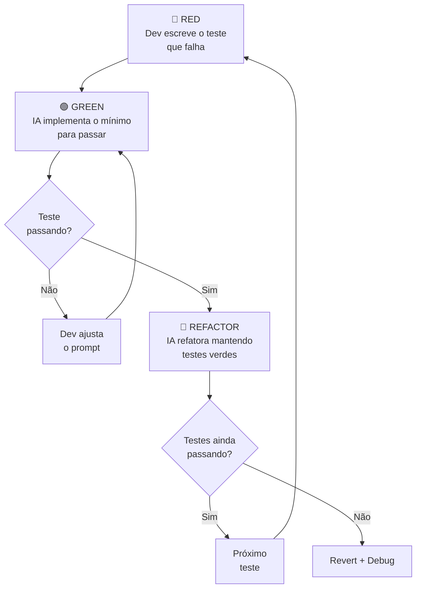
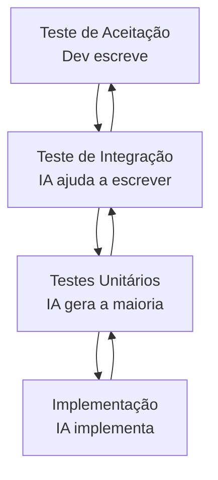

# 02 — TDD com IA

> **Objetivo:** Integrar IA no ciclo Red-Green-Refactor de forma que ela acelere o processo sem comprometer a disciplina do TDD.

---

## Por que TDD + IA?

TDD (Test-Driven Development) e IA parecem contraditórios à primeira vista — se a IA pode gerar código, por que escrever testes antes? A resposta é: **exatamente por isso**.

Quando você usa IA sem TDD:
- A IA gera código que "parece funcionar"
- Você aceita porque não tem testes para refutar
- Bugs de lógica entram em produção com aparência de código correto

Quando você usa IA **com** TDD:
- Os testes definem o comportamento esperado com precisão
- A IA gera a implementação guiada pelos testes
- O ciclo Red-Green confirma que o código realmente funciona

> 📌 **Referência:** A Anthropic documenta o uso de Claude Code em fluxos de TDD: docs.anthropic.com/en/docs/claude-code/common-workflows

---

## O Ciclo Red-Green-Refactor com IA



**Divisão de responsabilidades:**

| Quem | O que faz |
|------|-----------|
| **Desenvolvedor** | Escreve os testes, define comportamento, valida, decide o design |
| **IA** | Implementa para fazer os testes passarem, refatora quando solicitada |

---

## Fase RED: Escrevendo Testes Antes

O desenvolvedor escreve o teste. A IA pode ajudar a **complementar** os casos, mas o teste inicial deve vir de você — é aqui que o conhecimento de negócio é aplicado.

### Exemplo: Feature de validação de cupom

**Você escreve o primeiro teste:**
```java
// CouponTest.java
@Test
void validCouponAppliesDiscount() {
    Order order = new Order(200.0);
    Coupon coupon = new Coupon("SAVE10", 0.10, 100.0);

    Order result = applyCoupon(order, coupon);

    assertEquals(180.0, result.total(), 0.001);
}
```

**Você pede à IA para completar os casos:**
```markdown
"Dado este teste inicial para o método applyCoupon, identifique os edge cases
que estão faltando e escreva os testes correspondentes em JUnit 5.

Regras de negócio:
- Cupom tem valor mínimo de pedido
- Cupom pode estar expirado (campo expiresAt)
- Cupom pode ter limite de usos (campos maxUses, usedCount)
- Desconto não pode tornar o total negativo

Escreva apenas os testes — não implemente o método."
```

---

## Fase GREEN: IA Implementa o Mínimo

Com os testes escritos e falhando (RED confirmado), você pede à IA para implementar:

```markdown
"Implemente o método applyCoupon para fazer os seguintes testes JUnit 5 passarem.

Testes:
```java
[cole todos os testes]
```

Regras:
- Implemente o mínimo necessário para os testes passarem
- Não adicione lógica além do que os testes exigem
- Use records Java para Order e Coupon onde fizer sentido
- Retorne um novo objeto Order, não modifique o original"
```

**Por que "o mínimo necessário"?** A disciplina do TDD proíbe implementar o que os testes não exigem. Isso força design incremental e evita over-engineering.

### Verificando o GREEN

```bash
mvn test -Dtest=CouponTest
# Todos os testes devem passar
# Se algum falhar, ajuste o prompt — não mude o teste
```

---

## Fase REFACTOR: IA Melhora sem Quebrar

Com os testes verdes, você pede à IA para refatorar:

```markdown
"Os testes estão passando. Refatore a função apply_coupon para:
- Separar as validações em funções privadas nomeadas
- Reduzir a complexidade ciclomática para ≤ 4
- Tornar o fluxo de decisão mais legível

Restrição: todos os testes devem continuar passando após a refatoração.
Execute os testes mentalmente antes de propor a mudança."
```

**Confirme que o REFACTOR não quebrou nada:**
```bash
mvn test -Dtest=CouponTest
# Deve manter 100% de aprovação
```

---

## Padrão Avançado: IA como Par no TDD

Em vez de usar a IA apenas para implementar, use-a como par programador que sugere o próximo teste:

```markdown
"Estamos fazendo TDD para o módulo de autenticação.

Implementações existentes e seus testes [já passando]:
- register_user: cria usuário com senha hash
- login: retorna JWT para credenciais válidas

Qual deveria ser o próximo teste a escrever? Considere:
- Casos não cobertos ainda
- Fluxos de erro
- Segurança"
```

A IA sugere: "O próximo teste deveria ser para tentativas de login com conta desativada — o comportamento não está especificado nos testes atuais."

---

## TDD com Claude Code no Terminal

Claude Code permite um fluxo TDD integrado:

```bash
# Inicia sessão Claude Code no projeto
claude

# Você descreve o comportamento esperado
> Quero implementar rate limiting por IP usando TDD.
  Vamos começar pelos testes. Me ajude a escrever os casos.

# Claude sugere os testes, você revisa e aprova

# Claude implementa para fazer os testes passarem
> Agora implemente para fazer esses testes passarem

# Claude refatora
> Testes verdes. Refatore para separar a lógica de contagem da lógica de decisão.
```

> 📌 **Referência:** docs.anthropic.com/en/docs/claude-code/common-workflows#test-driven-development

---

## Outside-In TDD com IA

**Outside-In** (também chamado de London School TDD) começa pelos testes de aceitação de alto nível e desce até os unitários. A IA é especialmente útil aqui:



### Exemplo de Outside-In

**Nível 1 — Aceitação (você escreve):**
```java
@Test
void userCanResetPasswordViaEmail() {
    User user = createUser("user@example.com");

    restTemplate.postForEntity("/auth/reset-password",
        Map.of("email", "user@example.com"), Void.class);

    assertEquals(1, mailbox.getMessages().size());
    assertTrue(mailbox.getMessages().get(0).getSubject()
        .toLowerCase().contains("redefinição"));
}
```

**Nível 2 — Integração (IA ajuda):**
```markdown
"Este teste de aceitação precisa de um serviço de reset de senha.
Quais testes de integração precisamos para o PasswordResetService?
Use JUnit 5 + Mockito. Liste-os antes de escrever."
```

**Nível 3 — Unitário (IA gera):**
```markdown
"Agora gere os testes unitários JUnit 5 para cada método do PasswordResetService
identificado no passo anterior. Use @Mock e @InjectMocks do Mockito."
```

---

## Anti-Patterns: TDD + IA

| Anti-pattern | Descrição | Consequência |
|--------------|-----------|-------------|
| **Teste depois** | Pede à IA para implementar e depois gerar testes | Testes descrevem a implementação, não o comportamento |
| **Testes frágeis** | IA gera testes de implementação (testam internals) | Refatoração quebra testes sem mudar comportamento |
| **Green sem Red** | Não confirma que o teste falha antes de implementar | Teste pode nunca ter testado nada |
| **Pular o Refactor** | Aceita o GREEN sem refatorar | Dívida técnica acumulada |
| **Mudar o teste** | Quando o teste falha, muda o teste em vez do código | Perde a especificação do comportamento |

---

## Checklist: TDD com IA

```
RED:
  [ ] O teste está escrito por mim (não gerado inteiramente pela IA)
  [ ] O teste falha por um motivo correto (não por erro de sintaxe)
  [ ] O teste descreve comportamento, não implementação

GREEN:
  [ ] Pedi à IA o "mínimo necessário" para passar
  [ ] Confirmei que os testes passam rodando de verdade
  [ ] Não há lógica além do que os testes exigem

REFACTOR:
  [ ] Os testes continuam passando após a refatoração
  [ ] O código ficou mais legível ou mais simples
  [ ] Nenhuma lógica nova foi adicionada durante o refactor
```

---

## ✅ Pontos-chave do Capítulo

- TDD e IA **se complementam** — os testes são a especificação que guia a geração de código.
- **Você escreve os testes** (especialmente os iniciais); a IA implementa e pode sugerir casos adicionais.
- Peça sempre o **mínimo necessário** na fase GREEN para manter a disciplina do TDD.
- **Confirme RED antes de GREEN** — se o teste já passa sem implementação, ele não testa nada.
- **Outside-In TDD** com IA é especialmente poderoso: começa alto nível, IA ajuda a descer.

---

## 🔗 Próxima Aula

👉 [03 — Code Review com IA](./03-code-review-com-ia.md)
