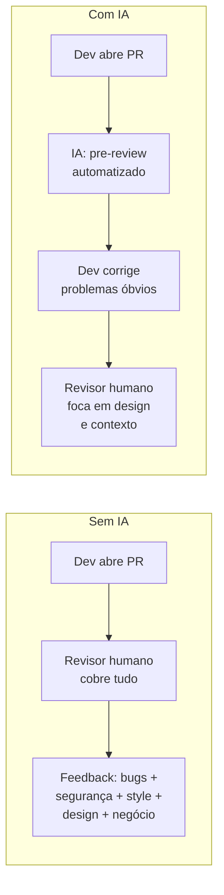

# 03 — Code Review com IA

> **Objetivo:** Usar IA como primeiro revisor sistemático — capturando problemas mecânicos antes da revisão humana, para que o revisor possa focar em design, contexto de negócio e decisões arquiteturais.

---

## O Papel da IA no Code Review

A IA não substitui a revisão humana — ela **muda o que o humano precisa revisar**.



**O que a IA cobre bem:**
- Padrões de vulnerabilidade (SQL injection, XSS, credenciais expostas)
- Queries N+1 e problemas de performance óbvios
- Inconsistências com padrões definidos
- Edge cases não tratados
- Código morto, imports não usados

**O que o humano cobre:**
- Alinhamento com requisitos de negócio
- Decisões de arquitetura e trade-offs
- Contexto histórico do sistema
- Impacto em outras equipes

---

## Fluxo de Pre-Review com IA

### Passo 1: Gerar o diff

```bash
# Diff em relação à branch base
git diff main...HEAD

# Ou diff do último commit
git diff HEAD~1

# Diff de um arquivo específico
git diff main -- src/payments/
```

### Passo 2: Prompt de pre-review

```markdown
"Faça um code review deste diff antes de eu abrir o PR.

**Diff:**
```diff
[git diff output]
```

**Contexto:**
- Esta mudança adiciona rate limiting ao endpoint de login
- Stack: Python 3.12, FastAPI, Redis
- Segurança é crítica — o endpoint é público

**Foque em:**
1. Vulnerabilidades de segurança (autenticação, injection, exposição de dados)
2. Correctude da lógica de rate limiting
3. Edge cases não tratados
4. Performance (O(n) onde deveria ser O(1), etc.)

**Formato:**
- [BLOQUEANTE] para problemas que impedem o merge
- [IMPORTANTE] para problemas que devem ser corrigidos
- [SUGESTÃO] para melhorias opcionais
- Cite arquivo e linha para cada item"
```

### Passo 3: Agir nos resultados

```
BLOQUEANTE → corrigir antes de abrir o PR
IMPORTANTE → corrigir ou documentar decisão de não corrigir
SUGESTÃO → avaliar e decidir
```

---

## Checklist de Review por Categoria

### Segurança

```markdown
"Analise este código para vulnerabilidades de segurança. Verifique especificamente:

[ ] SQL/NoSQL Injection: inputs do usuário em queries sem parametrização
[ ] XSS: outputs sem sanitização em contexto HTML
[ ] Credenciais expostas: API keys, senhas, tokens no código
[ ] Exposição de dados sensíveis em logs ou respostas de erro
[ ] Controle de acesso: toda operação verifica autorização?
[ ] Rate limiting: endpoints sensíveis têm proteção?
[ ] IDOR: IDs de recursos validados contra o usuário autenticado?

Para cada problema: localização + severidade CVSS + correção"
```

### Performance

```markdown
"Analise este código para problemas de performance. Considere:
- Volume: [ex: 100k registros na tabela, 500 req/s]

[ ] Queries N+1 (loop que faz query por iteração)
[ ] Dados carregados em memória quando poderiam ser paginados
[ ] Falta de índice em campos usados em WHERE/ORDER BY
[ ] Locks desnecessariamente longos
[ ] Operações síncronas que bloqueiam onde async seria melhor
[ ] Cache não utilizado para dados estáticos

Para cada problema: impacto estimado em alto/médio/baixo + solução"
```

### Manutenibilidade

```markdown
"Avalie a manutenibilidade deste código:

[ ] Funções com mais de uma responsabilidade
[ ] Complexidade ciclomática > 10 em alguma função
[ ] Duplicação de lógica que poderia ser extraída
[ ] Nomes de variáveis/funções que não comunicam intenção
[ ] Dependências circulares ou acoplamento excessivo
[ ] Código comentado ao invés de removido"
```

---

## Integração com Git Hooks

Você pode automatizar o pre-review com um hook de pre-push:

```bash
# .git/hooks/pre-push (ou via Lefthook/Husky)
#!/bin/bash

echo "🤖 Executando pre-review com IA..."

# Gera o diff
DIFF=$(git diff origin/main...HEAD)

# Envia para Claude via API e exibe resultado
# (requer claude CLI instalado)
echo "$DIFF" | claude --print "Faça um code review de segurança rápido deste diff. 
Liste apenas BLOQUEANTEs e IMPORTANTEs. Seja conciso."

echo "Confirma push mesmo assim? [y/N]"
read -r response
[[ "$response" =~ ^[Yy]$ ]] || exit 1
```

> 📌 **Referência:** Claude Code hooks — docs.anthropic.com/en/docs/claude-code/hooks

---

## Review de Pull Request Aberto

Para PRs já abertos (review de outros), você pode usar a IA para preparar perguntas melhores:

```markdown
"Estou revisando este PR de um colega. O objetivo é: [descrição do PR].

**Diff:**
[diff]

Me ajude a preparar um review útil:
1. Que perguntas de esclarecimento eu deveria fazer?
2. Que cenários de teste eu deveria sugerir que o autor adicione?
3. Há algo no design que parece assumir requisitos não declarados?

Não faça o review por mim — me dê ferramentas para fazer um review melhor."
```

---

## Review Especializado: API Pública

Quando o PR expõe uma nova API (endpoint, SDK, evento):

```markdown
"Este PR adiciona um novo endpoint público. Revise com foco em:

**Contrato da API:**
- Os campos do response são os mínimos necessários? (não expor internals)
- O naming segue os padrões REST da nossa API?
- Erros retornam códigos HTTP corretos e mensagens acionáveis?
- O endpoint tem paginação se pode retornar múltiplos itens?

**Backwards Compatibility:**
- Esta mudança quebra clientes existentes?
- Campos obrigatórios foram adicionados onde antes eram opcionais?

**Segurança:**
- Autenticação necessária?
- Autorização verifica o recurso pertence ao usuário autenticado?
- Rate limiting aplicado?

Diff: [diff]"
```

---

## Métricas de Qualidade do Review

Como saber se seu processo de code review com IA está funcionando?

| Métrica | O que mede | Como melhorar |
|---------|------------|---------------|
| **Bugs escapados por PR** | Quantos bugs vão para produção | Adicionar categorias ao checklist |
| **Tempo médio de review** | Tempo do revisor humano | Mais pré-filtragem pela IA |
| **Comentários de style/format** | % de comments sobre questões mecânicas | Configurar linter + IA só em lógica |
| **Retrabalho pós-merge** | Quantas mudanças são revertidas ou corrigidas | Melhorar cobertura de testes + review |

---

## ✅ Pontos-chave do Capítulo

- A IA é um **pré-filtro**, não um substituto para revisão humana.
- Use **checklists especializados** por categoria (segurança, performance, manutenibilidade) — review genérico é menos eficaz.
- **Pre-review antes de abrir o PR** é mais eficiente — corrigir antes que o revisor humano veja.
- Git hooks podem **automatizar** o pre-review no fluxo de trabalho.
- Para APIs públicas, adicione review de **contrato e backwards compatibility**.

---

## 🔗 Próxima Aula

👉 [04 — Refatoração Assistida](./04-refatoracao-assistida.md)
