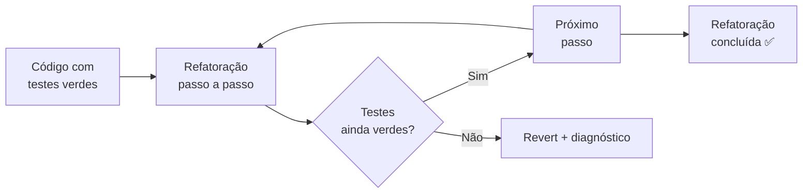
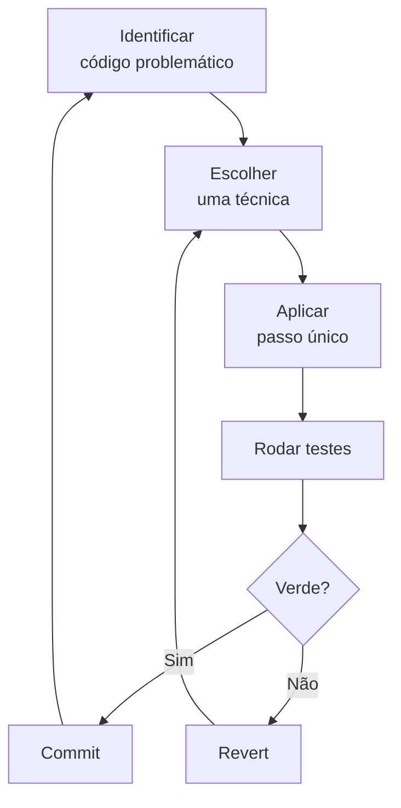
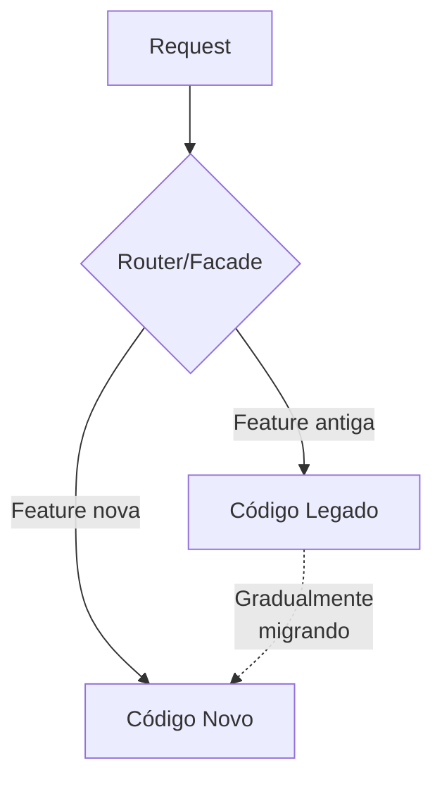
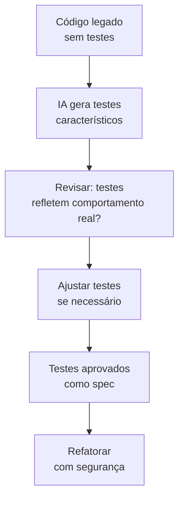

# 04 — Refatoração Assistida por IA

> **Objetivo:** Dominar estratégias de refatoração incremental usando IA como par programador — garantindo equivalência comportamental a cada passo.

---

## Princípios da Refatoração Segura

Refatoração tem uma definição precisa: **mudar a estrutura interna do código sem alterar seu comportamento externo observável**.

> 📌 **Referência:** Martin Fowler define refatoração em "Refactoring: Improving the Design of Existing Code" (2018) como "a process of changing a software system in a way that does not alter the external behavior of the code yet improves its internal structure."



**Regra de ouro:** Sem testes, não há refatoração segura. Com IA ou sem ela.

---

## O Problema do "Refatore Tudo de Uma Vez"

O erro mais comum ao usar IA para refatoração:

```
❌ "Refatore este módulo inteiro para Clean Architecture"
→ Resultado: mudança grande, difícil de revisar, risco alto de regressão
```

A abordagem correta é **incremental**:



---

## Técnicas de Refatoração com IA

### 1. Extract Function / Method

**Quando usar:** Bloco de código com comentário explicativo, código duplicado, função longa.

```markdown
"Extraia o bloco entre as linhas [X] e [Y] em uma função privada separada.

Código:
```python
[função longa]
```

Requisitos:
- Nome da função deve comunicar intenção (não 'helper' ou 'util')
- Parâmetros mínimos necessários
- Mantenha a função original chamando a nova
- Não mude o comportamento"
```

### 2. Inline Function

**Quando usar:** Função tão pequena que o nome não adiciona clareza.

```markdown
"A função _check_flag() tem apenas uma linha e é chamada em um único lugar.
Inline-a — substitua a chamada pelo conteúdo direto.
Mantenha os testes passando."
```

### 3. Replace Conditional with Polymorphism

**Quando usar:** Switch/if-elif que cresce a cada novo tipo.

```markdown
"Este if-elif verifica o tipo de notificação e chama lógica diferente para cada um.
Refatore para polimorfismo: uma classe base Notification com subclasses para cada tipo.

Restrições:
- O código que chama notification.send() não deve mudar
- Sem framework de DI — use factory function simples
- Python 3.12 com dataclasses ou Protocol"
```

### 4. Strangler Fig (para módulos grandes)

**Quando usar:** Módulo legado que precisa ser substituído gradualmente.

O padrão Strangler Fig substitui o código legado incrementalmente, roteando novos comportamentos para o novo código enquanto mantém o legado funcionando.



```markdown
"Estou usando o padrão Strangler Fig para migrar UserService.

Passo atual: extrair a lógica de busca de usuário para um novo UserRepository.

O legado é:
```python
[UserService atual]
```

Crie o UserRepository com apenas o método get_by_id.
Faça UserService delegar a ele.
Mantenha todos os outros métodos sem mudança."
```

### 5. Decompose Large Class

**Quando usar:** Classe com muitas responsabilidades (God Object).

```markdown
"Analise UserService e liste suas responsabilidades distintas antes de qualquer código.

```python
[UserService]
```

Para cada responsabilidade identificada:
- Nome sugerido para a classe extraída
- Métodos que pertencem a ela
- Dependências que ela precisa

Aguarde minha aprovação das responsabilidades antes de implementar."
```

---

## Refatoração Guiada por Métricas

Peça à IA para identificar o que refatorar com base em métricas:

```markdown
"Analise o código abaixo e identifique as funções com maior risco de manutenção.

Para cada função problemática, reporte:
- Complexidade ciclomática (aproximada)
- Número de responsabilidades
- Facilidade de teste (alta/média/baixa)
- Prioridade de refatoração (urgente/normal/baixa)

```python
[módulo completo]
```

Ordene por prioridade decrescente."
```

---

## Refatoração de Código sem Testes (Legado)

Quando não há testes, a abordagem muda:



### Passo 1: Testes de caracterização

```markdown
"Este código não tem testes. Antes de refatorar, preciso de 'testes de caracterização'
— testes que documentam o comportamento atual, mesmo que seja um comportamento incorreto.

```python
[código legado]
```

Gere testes que:
- Cubram todos os caminhos de execução
- Usem inputs reais do domínio (não apenas 'test' e '123')
- Incluam os edge cases mais prováveis
- Comentem onde o comportamento parece suspeito (pode ser bug)

Não corrija bugs agora — apenas documente o que o código faz."
```

### Passo 2: Refatorar com testes verdes

Só após confirmar que os testes caracterizam o comportamento atual, refatore.

---

## Usando Claude Code para Refatoração Contínua

Claude Code tem contexto do repositório completo, ideal para refatorações que afetam múltiplos arquivos:

```bash
claude

> Quero refatorar o módulo de autenticação para separar responsabilidades.
  Antes de qualquer mudança:
  1. Liste todos os arquivos que o módulo auth toca
  2. Identifique as responsabilidades atuais
  3. Proponha a nova estrutura
  Aguarde minha aprovação antes de implementar.
```

```
# Claude analisa o repositório e responde com o plano
# Você aprova ou ajusta
# Claude implementa incrementalmente, rodando testes entre cada passo
```

> 📌 **Referência:** docs.anthropic.com/en/docs/claude-code/common-workflows

---

## Refatoração de Queries SQL

Queries SQL também precisam de refatoração — e a IA é boa nisso desde que você forneça o schema:

```markdown
"Refatore esta query SQL para melhorar legibilidade e performance.

Schema das tabelas:
```sql
[CREATE TABLE statements]
```

Query atual (tempo médio: 2.3s):
```sql
[query]
```

Objetivos:
1. Eliminar subqueries correlacionadas se possível
2. Usar CTEs para melhorar legibilidade
3. Garantir que índices existentes sejam aproveitados

Restrição: o resultado deve ser identico — mesmas linhas, mesma ordem, mesmas colunas."
```

---

## Checklist de Refatoração Segura

```
Antes de começar:
  [ ] Testes existem e estão verdes?
  [ ] Se não há testes, criei testes de caracterização?
  [ ] Defini o escopo — apenas esta função/classe/módulo?

Durante a refatoração:
  [ ] Cada passo é atômico e commitável?
  [ ] Rodo os testes após cada passo?
  [ ] O comportamento externo permanece idêntico?

Ao finalizar:
  [ ] Todos os testes continuam passando?
  [ ] O código ficou mais simples ou mais claro?
  [ ] Nenhuma feature nova foi adicionada?
```

---

## ✅ Pontos-chave do Capítulo

- Refatoração = mudança estrutural **sem alterar comportamento** — a IA deve respeitar esse contrato.
- **Incremental sempre** — passos pequenos, commit a cada passo, testes verdes em cada passo.
- Para legado sem testes: **testes de caracterização primeiro**, depois refatora.
- Claude Code é especialmente útil para refatorações que afetam **múltiplos arquivos**.
- Peça à IA que **liste responsabilidades antes de propor código** — isso força análise antes de ação.

---

## 🔗 Próxima Aula

👉 [05 — Documentação Automatizada](./05-documentacao-automatizada.md)
