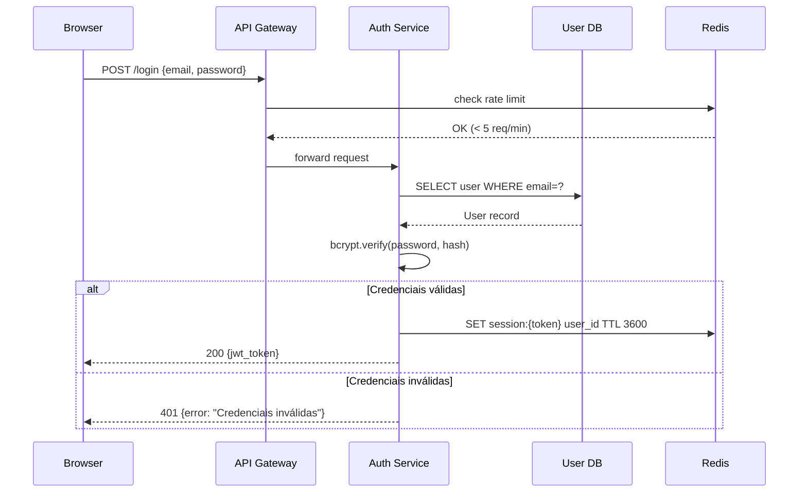

# 05 — Documentação Automatizada

> **Objetivo:** Usar IA para gerar e manter documentação técnica de qualidade — docstrings, READMEs, changelogs e diagramas — de forma consistente e integrada ao fluxo de desenvolvimento.

---

## Por que Documentação com IA?

Documentação é frequentemente a primeira coisa sacrificada sob pressão de prazo. A IA resolve isso ao:

- Reduzir o custo cognitivo de escrever documentação
- Gerar documentação **no momento certo** — junto com o código
- Manter consistência de estilo entre diferentes autores
- Atualizar documentação quando o código muda

**O que a IA não resolve:** a documentação ainda precisa ser **revisada** — a IA pode gerar descrições imprecisas ou descrever intenção diferente do que o código faz.

---

## Docstrings e Comentários de Código

### Gerando docstrings em lote

```markdown
"Adicione docstrings no estilo Google para todas as funções públicas do arquivo abaixo.

Convenções:
- Primeira linha: descrição imperativa em uma frase (máx. 72 chars)
- Args: liste apenas parâmetros não-óbvios pelo nome e tipo
- Returns: descreva o que retorna e quando retorna None
- Raises: liste apenas exceções que o caller precisa tratar
- Omita: implementação interna, referências ao autor, data

Audiência: desenvolvedor Python que nunca viu este código.

```python
[arquivo]
```
"
```

### Docstring para função complexa

```markdown
"Escreva a docstring para esta função. Ela tem lógica não-óbvia que precisa de explicação.

```python
def paginate_cursor(query, cursor_field, cursor_value, limit):
    [implementação complexa]
```

A docstring deve explicar:
- O algoritmo de cursor-based pagination usado
- Por que cursor e não offset
- O formato esperado de cursor_value
- O comportamento quando cursor_value aponta para item deletado"
```

### Convenções populares

| Estilo | Usado por | Formato |
|--------|-----------|---------|
| **Google** | Google, Anthropic | `Args:`, `Returns:`, `Raises:` com indentação |
| **NumPy** | Data science, SciPy | `Parameters`, `Returns` com separadores `---` |
| **reStructuredText** | Sphinx/Python padrão | `:param name:`, `:returns:`, `:rtype:` |
| **JSDoc** | JavaScript/TypeScript | `@param`, `@returns`, `@throws` |

---

## README de Módulo e Projeto

### Template de prompt para README

```markdown
"Escreva um README.md para este módulo/projeto.

**Código/estrutura:**
[cole o código ou descreva a estrutura]

**Estrutura obrigatória:**
1. Título + tagline de uma linha
2. O que faz (2-3 bullets, sem jargão)
3. Instalação (comandos exatos)
4. Uso básico (exemplo de código que funciona copy-paste)
5. API Reference (apenas pública, em tabela)
6. Configuração (variáveis de ambiente, se houver)
7. Limitações conhecidas (honesto sobre o que não faz)

**Tom:** técnico e direto. Sem marketing. Sem 'poderoso', 'robusto', 'elegante'.
**Audiência:** desenvolvedor que vai usar isto mas nunca viu o código."
```

### README de feature para PR

```markdown
"Gere um bloco de documentação para incluir no README do projeto.
Esta feature adiciona [descrição].

Inclua:
- Uma seção de configuração (se necessário)
- Um exemplo de uso completo (entrada → saída)
- Os limites e casos não suportados

Diff da feature:
[diff]"
```

---

## Changelog Automatizado

### Gerando changelog a partir de commits

```markdown
"Gere um changelog no formato Keep a Changelog (keepachangelog.com) para esta release.

**Versão:** 2.1.0
**Data:** 2025-04-20
**Commits desde a última release:**
```
[git log --oneline output]
```

**Regras:**
- Agrupe por: Added, Changed, Deprecated, Removed, Fixed, Security
- Inclua apenas mudanças observáveis externamente
- Omita: refatorações internas, updates de dev dependencies, formatação
- Linguagem: português do Brasil, tempo passado, voz ativa
- Seja específico: 'Adicionou paginação ao endpoint GET /users' não 'Melhorou API'"
```

### Gerando release notes para usuários finais

```markdown
"Transforme este changelog técnico em release notes para usuários finais.
Os usuários são desenvolvedores que consomem nossa API, não o time interno.

**Changelog técnico:**
[changelog]

**Para cada item:**
- Linguagem acessível (sem termos internos)
- Foque no benefício ('agora você pode...' em vez de 'adicionamos...')
- Inclua exemplos de código quando a mudança afeta como a API é usada
- Destaque mudanças breaking em seção separada no topo"
```

---

## Diagramas com Mermaid

A IA gera diagramas Mermaid que renderizam diretamente no GitHub:

### Diagrama de sequência de um fluxo

```markdown
"Gere um diagrama de sequência Mermaid para o fluxo de autenticação abaixo.

Participantes: Browser, API Gateway, Auth Service, User DB, Redis (sessions)

Fluxo:
1. Browser POST /login com email + senha
2. API Gateway valida rate limit via Redis
3. Auth Service busca usuário no User DB
4. Auth Service verifica senha (bcrypt)
5. Auth Service cria sessão no Redis
6. Retorna JWT para o Browser

Inclua o fluxo de erro para credenciais inválidas (após etapa 4).

Use sintaxe: sequenceDiagram"
```

**Resultado esperado:**


### Diagrama de arquitetura

```markdown
"Gere um diagrama Mermaid (graph TD) da arquitetura deste sistema.

Componentes:
- Frontend React
- API Gateway (Kong)
- 3 microserviços: Users, Orders, Payments
- PostgreSQL (por serviço, banco separado)
- Redis (compartilhado para cache e filas)
- RabbitMQ para eventos assíncronos

Mostre as conexões e o tipo de comunicação (REST, gRPC, AMQP)."
```

### Diagrama de entidade-relacionamento

```markdown
"Gere um diagrama ER em Mermaid (erDiagram) para este schema SQL.

```sql
[CREATE TABLE statements]
```

Inclua: cardinalidade dos relacionamentos (1-1, 1-N, N-N).
Omita: campos de auditoria (created_at, updated_at, deleted_at)."
```

---

## Documentação de API (OpenAPI)

```markdown
"Gere a spec OpenAPI 3.1 (YAML) para este endpoint FastAPI.

```python
@router.post("/users/{user_id}/orders")
async def create_order(
    user_id: UUID,
    body: CreateOrderRequest,
    current_user: User = Depends(get_current_user),
    db: AsyncSession = Depends(get_db)
) -> OrderResponse:
    ...
```

**Models:**
```python
[Pydantic models]
```

Inclua:
- Summary e description do endpoint
- Todos os parâmetros (path, query, body)
- Responses: 201, 400, 401, 403, 404, 422
- Security scheme: Bearer JWT
- Exemplos de request e response"
```

---

## Documentação Contínua: Integrando ao Fluxo

### Hook de pós-commit para docstrings

Com Claude Code hooks, você pode verificar automaticamente se novas funções têm docstring:

```json
// .claude/settings.json
{
  "hooks": {
    "PostToolUse": [{
      "matcher": "Edit|Write",
      "hooks": [{
        "type": "command",
        "command": "python scripts/check_docstrings.py"
      }]
    }]
  }
}
```

### Atualizando documentação junto com código

```markdown
"Atualizei a função process_payment — aqui está o diff:

[diff]

Atualize:
1. A docstring da função para refletir o novo comportamento
2. O README.md — seção 'Processamento de Pagamentos' — se a interface mudou
3. O CHANGELOG.md — adicione uma entrada na seção Changed"
```

---

## ✅ Pontos-chave do Capítulo

- Documentação com IA é mais eficaz quando feita **junto com o código**, não depois.
- **Revise sempre** — a IA pode descrever o que o código faz, não o que ele deveria fazer.
- **Mermaid** é o formato mais prático para diagramas em repositórios — renderiza direto no GitHub.
- Changelogs gerados pela IA precisam de **filtro**: inclua apenas mudanças externas observáveis.
- Integre via hooks para tornar documentação parte do fluxo, não uma tarefa separada.

---

## 🔗 Próxima Aula

👉 [06 — Debugging com IA](./06-debugging-com-ia.md)
