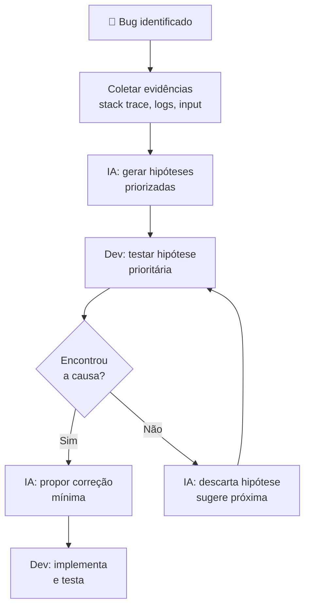

# 06 — Debugging com IA

> **Objetivo:** Usar IA para acelerar o diagnóstico de bugs — desde análise de stack trace até investigação de comportamentos intermitentes em produção.

---

## O Processo de Debugging com IA

A IA não substitui o raciocínio de debugging — ela **acelera as hipóteses** e **amplia a investigação**.



**O que não delegar completamente à IA:**
- A investigação em si (você precisa rodar o código, ler os logs reais)
- A decisão de qual hipótese testar primeiro
- A validação de que a correção realmente resolve o problema

---

## Anatomy de um Bom Prompt de Debugging

Todo prompt de debugging precisa de **4 elementos**:

```
1. CÓDIGO     — o trecho relevante (não o arquivo inteiro)
2. EVIDÊNCIAS — stack trace, logs, input que reproduz
3. ESPERADO   — o que deveria acontecer
4. INVESTIGADO — o que você já testou e descartou
```

```markdown
"[CÓDIGO]
```java
@Repository
public class OrderRepository {
    @PersistenceContext
    private EntityManager em;

    public List<Order> findByUserId(String userId) {
        return em.createQuery(
            "SELECT o FROM Order o LEFT JOIN FETCH o.items WHERE o.userId = :userId",
            Order.class
        ).setParameter("userId", userId).getResultList();
    }
}
```

[EVIDÊNCIAS]
Stack trace:
```
org.hibernate.LazyInitializationException: failed to lazily initialize a collection
  of role: com.example.Order.items, could not initialize proxy - no Session
  at OrderRepository.findByUserId(OrderRepository.java:14)
```
Ocorre apenas quando chamado a partir de um @Async task.

[ESPERADO]
Retornar lista de pedidos com items sem exceção.

[INVESTIGADO]
- O @Async task usa um executor separado sem transação ativa
- A sessão JPA é fechada antes de o lazy loading ser executado

Raciocine sobre o problema antes de propor a correção."
```

---

## Analisando Stack Traces

### Prompt para stack trace Java

```markdown
"Analise este stack trace Java e identifique:
1. O ponto exato de falha
2. O contexto que levou até ele (trace do topo)
3. A causa raiz mais provável
4. 2-3 hipóteses alternativas

Stack trace:
```
[stack trace completo]
```

Código das linhas relevantes:
```java
[código]
```

Input que reproduz: [descreva ou cole]"
```

### Prompt para erro de banco de dados

```markdown
"Estou recebendo este erro de banco de dados. Preciso da causa raiz.

Erro:
```
deadlock detected
DETAIL: Process 12345 waits for ShareLock on transaction 67890
HINT: See server log for query details.
```

Queries executadas neste fluxo (em ordem):
```sql
-- Query 1 (Thread A)
BEGIN;
UPDATE accounts SET balance = balance - 100 WHERE id = 1;
UPDATE accounts SET balance = balance + 100 WHERE id = 2;

-- Query 2 (Thread B — simultâneo)
BEGIN;
UPDATE accounts SET balance = balance - 50 WHERE id = 2;
UPDATE accounts SET balance = balance + 50 WHERE id = 1;
```

Mostre por que o deadlock ocorre e qual mudança mínima resolve."
```

---

## Debugging de Performance

### Analisando query lenta

```markdown
"Esta query está levando 4.2s para retornar. Volume: 500k registros em orders, 2M em order_items.

Query:
```sql
SELECT u.email, COUNT(o.id) as order_count, SUM(oi.price * oi.quantity) as total
FROM users u
LEFT JOIN orders o ON o.user_id = u.id
LEFT JOIN order_items oi ON oi.order_id = o.id
WHERE u.created_at > '2024-01-01'
GROUP BY u.email
ORDER BY total DESC
LIMIT 100;
```

EXPLAIN ANALYZE:
```
[cole o output completo do EXPLAIN ANALYZE]
```

Índices existentes:
- users: (id), (email), (created_at)
- orders: (id), (user_id)
- order_items: (id), (order_id)

Identifique o bottleneck e sugira a solução mais impactante primeiro."
```

### Analisando memory leak

```markdown
"Nossa aplicação Spring Boot tem uso de memória crescente ao longo do tempo.
Aumenta ~50MB por hora e não libera após GC.

Suspeito deste padrão no código:
```java
private static final Map<String, User> CACHE = new HashMap<>(); // global, ilimitado

public User getUser(String userId) {
    return CACHE.computeIfAbsent(userId, id -> userRepository.findById(id).orElseThrow());
}
```

Volume de usuários únicos por hora: ~10k

1. Este código causa o leak? Explique o mecanismo.
2. Como medir usando JVisualVM ou jmap para confirmar?
3. Qual é a correção adequada — Caffeine Cache, WeakHashMap ou outra opção?"
```

---

## Debugging de Comportamento Intermitente

Bugs que ocorrem "às vezes" são os mais difíceis. A IA ajuda a estruturar a investigação:

```markdown
"Temos um bug intermitente: aproximadamente 1 em 50 criações de pedido falha com:
'DataIntegrityViolationException: duplicate key value violates unique constraint orders_pkey'

O ID é gerado assim:
```java
String orderId = UUID.randomUUID().toString();
```

Contexto:
- 4 instâncias Spring Boot com 20 threads cada
- ~200 criações de pedido simultâneas no pico
- Falha ocorre mais no horário de pico

Hipóteses que já descartei:
- Não é resubmissão do cliente (verificamos os logs de entrada)
- UUID.randomUUID() não repete (testamos 10M de gerações)

Quais são as hipóteses restantes? Ordene por probabilidade."
```

---

## Debugging com Claude Code

Claude Code pode investigar bugs diretamente no repositório:

```bash
claude

> Temos um bug de produção: usuários reportam que às vezes o carrinho de compras
  perde itens após o login. Acontece aproximadamente 1 em 20 logins.
  
  Investigue:
  1. Leia o código de autenticação e sessão
  2. Leia o código de gerenciamento do carrinho
  3. Identifique onde dados de carrinho pré-login são mesclados com pós-login
  4. Aponte o problema mais provável com evidências do código
```

O Claude Code vai ler os arquivos relevantes, traçar o fluxo e identificar o problema sem que você precise copiar código manualmente.

---

## Debugging por Bisection

Quando você tem um bug em um sistema grande e não sabe onde está:

```markdown
"Estou tentando localizar o bug por bisection. Ajude-me a estruturar a investigação.

Comportamento errado: [descreva]
Sistema: [arquitetura simplificada]

Quais são os pontos de corte (checkpoints) que eu poderia usar para confirmar
onde o dado se corrompe? Liste em ordem de execução do fluxo."
```

---

## Documentando Bugs Encontrados

Após encontrar e corrigir, documente para o time:

```markdown
"Documentei um bug que encontrei. Gere uma entrada de post-mortem simplificado.

Bug: [descrição]
Causa raiz: [o que causou]
Como foi encontrado: [como descobrimos]
Correção aplicada: [o que foi mudado]
Impacto: [usuários afetados, período]

Formato: markdown, seções claras, sem burocracia. Max 300 palavras."
```

---

## ✅ Pontos-chave do Capítulo

- Todo prompt de debug precisa de: **código + evidências + esperado + já investigado**.
- A IA gera **hipóteses** — você testa e descarta; a IA refina com base no que você descobre.
- Para bugs intermitentes, peça à IA que **ordene hipóteses por probabilidade** — não chute aleatoriamente.
- Claude Code pode investigar **em todo o repositório** sem você precisar copiar código.
- Após resolver, **documente** — a IA ajuda a gerar post-mortems rápidos.

---

## 🔗 Próxima Aula

👉 [07 — Migração e Modernização](./07-migracao-e-modernizacao.md)
