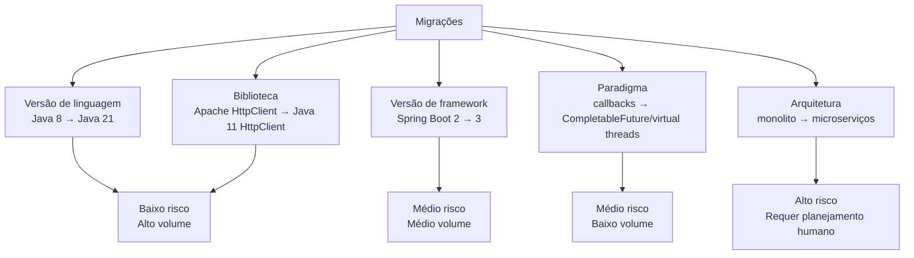
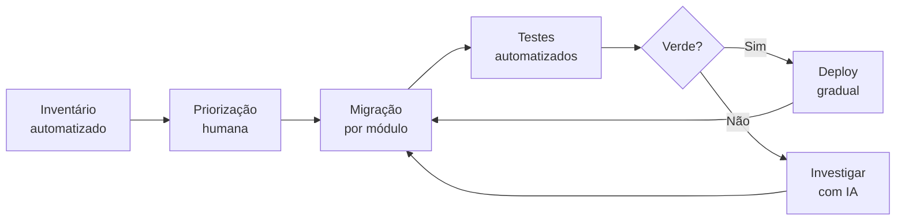

# 07 — Migração e Modernização com IA

> **Objetivo:** Usar IA para acelerar migrações de versão de linguagem/framework e modernização de código legado — mantendo segurança e correctude em cada passo.

---

## Tipos de Migração



**Onde a IA tem maior ROI:** migrações de **alto volume e baixo risco** — mudanças sintáticas, substituição de APIs, padronização.

**Onde o humano deve liderar:** migrações de arquitetura e aquelas com mudanças breaking de comportamento.

---

## Migração de Versão de Linguagem

### Java 8 → Java 21: o que muda

```markdown
"Audite este código Java 8 e identifique tudo que precisa ser atualizado para Java 21.

```java
[código]
```

Liste por categoria:
1. **Breaking changes** — coisas que vão falhar em Java 21
2. **Deprecations** — APIs obsoletas que serão removidas
3. **Melhorias disponíveis** — recursos novos que simplificam o código (records, sealed classes, pattern matching, virtual threads, etc.)

Para cada item: linha afetada + mudança necessária + exemplo de como fica."
```

**Mudanças comuns Java 9-21:**

| Feature | Antes (Java 8) | Depois (Java 21) |
|---------|-------|--------|
| Records | `@Data` (Lombok) / classe boilerplate | `record Point(int x, int y) {}` |
| Text blocks | String concatenação longa | `"""..."""` |
| Pattern matching | `instanceof` + cast manual | `instanceof String s` |
| Sealed classes | hierarquias abertas | `sealed interface + permits` |
| Virtual threads | `Thread` pesada | `Thread.ofVirtual().start(...)` |
| Switch expressions | `switch` statement | `switch (...) { case X -> y; }` |

### Exemplo: Modernizando classes de dados em lote

```markdown
"Atualize as classes de dados deste arquivo de Java 8 para Java 21.

Mudanças a fazer:
- Classes imutáveis com só getters → `record`
- Verificações `instanceof` com cast → pattern matching
- Strings multilinha concatenadas → text blocks
- `Optional.isPresent()` + `get()` → `Optional.map/orElse`
- Não mude mais nada — apenas as construções mencionadas

```java
[arquivo]
```
"
```

---

## Migração de Framework

### Auditando breaking changes

```markdown
"Estou migrando de [Framework X versão A] para [versão B].

Código atual:
```java
[código usando o framework]
```

Com base no changelog oficial entre as versões, identifique:
1. Breaking changes que afetam este código
2. APIs deprecadas que usamos
3. Novas APIs recomendadas para substituir as antigas

Changelog relevante:
[cole o changelog ou as seções de breaking changes]"
```

> ⚠️ **Importante:** Sempre cole o changelog oficial no prompt. A IA pode ter conhecimento desatualizado sobre versões específicas.

### Spring Boot 2 → 3: exemplo de migração

```markdown
"Migre este código Spring Boot 2 para as APIs recomendadas no Spring Boot 3.

Mudanças necessárias:
- `javax.*` imports → `jakarta.*`
- `WebSecurityConfigurerAdapter` → `SecurityFilterChain` bean
- `spring.datasource.initialization-mode` → `spring.sql.init.mode`
- `@SpringBootTest(webEnvironment = ...)` continua igual

```java
[arquivo com configurações e código]
```

Mostre o antes e depois de cada mudança. Não altere a lógica de negócio."
```

---

## Migração de Biblioteca

### Apache HttpClient → Java 11 HttpClient

```markdown
"Migre este código de Apache HttpClient 4 para o Java 11 HttpClient nativo.

```java
import org.apache.http.client.methods.HttpGet;
import org.apache.http.impl.client.CloseableHttpClient;
import org.apache.http.impl.client.HttpClients;

public Map<String, Object> fetchUser(String userId) throws Exception {
    try (CloseableHttpClient client = HttpClients.createDefault()) {
        HttpGet request = new HttpGet("https://api.example.com/users/" + userId);
        request.setHeader("Authorization", "Bearer " + TOKEN);
        try (var response = client.execute(request)) {
            String body = EntityUtils.toString(response.getEntity());
            return objectMapper.readValue(body, Map.class);
        }
    }
}
```

Regras:
- Use java.net.http.HttpClient (singleton reutilizável)
- Use HttpRequest.Builder para construir as requisições
- Mantenha o mesmo tratamento de erro (IOException, status != 2xx)
- Versão sync com sendAsync disponível se necessário

Output: código migrado + remoção da dependência do pom.xml."
```

---

## Migração de Paradigma: Callbacks → Async/Await

```markdown
"Migre este código Node.js de callback-style para async/await moderno.

```javascript
function processOrder(orderId, callback) {
    db.findOrder(orderId, function(err, order) {
        if (err) return callback(err);
        
        inventory.check(order.items, function(err, available) {
            if (err) return callback(err);
            if (!available) return callback(new Error('Out of stock'));
            
            payment.charge(order.total, function(err, receipt) {
                if (err) return callback(err);
                callback(null, receipt);
            });
        });
    });
}
```

Regras:
- Use async/await com try/catch
- db, inventory e payment já têm versões Promise (mesmos nomes + Async: findOrderAsync, checkAsync, chargeAsync)
- Mantenha a mesma lógica de erro
- Não mude o comportamento para chamadas válidas"
```

---

## Estratégia de Migração Incremental

Para sistemas em produção, migrações big-bang são arriscadas. A abordagem incremental com IA:



### Passo 1: Inventário automatizado

```markdown
"Analise este repositório e gere um inventário de todos os pontos que precisam
ser migrados de [versão antiga] para [versão nova].

Estrutura de arquivos:
[tree do projeto]

Conteúdo dos arquivos principais:
[arquivos principais]

Retorne uma tabela:
| Arquivo | Linha | Padrão antigo | Urgência |
|---------|-------|---------------|---------|
Urgência: BLOQUEANTE / RECOMENDADO / OPCIONAL"
```

### Passo 2: Migrar módulo por módulo

```markdown
"Migre apenas o módulo src/auth/ para [nova versão].
Não toque em outros módulos.

Arquivos do módulo:
[arquivos]

Itens identificados no inventário para este módulo:
[subset do inventário]

Confirme que:
- Os testes existentes passam após a migração
- As interfaces públicas do módulo não mudaram
- Os callers externos não precisam de mudança"
```

---

## Modernização de Código Legado

Para código que funciona mas não usa práticas modernas:

```markdown
"Modernize este código Java 8 mantendo comportamento idêntico.

```java
[código legado]
```

Aplicar onde fizer sentido (sem forçar se não melhorar):
- Records onde há classes imutáveis só com getters
- Pattern matching para instanceof com cast
- Text blocks para strings multilinha
- var onde o tipo é óbvio pelo lado direito
- Stream API onde há loops de transformação/filtro
- Optional onde pode retornar null

Não aplique se a mudança tornar o código mais confuso."
```

---

## Validando a Migração

Após migrar, sempre valide:

```markdown
"Verifique se esta migração está correta.

Código original:
```java
[código antigo]
```

Código migrado:
```java
[código novo]
```

Confirme:
1. Comportamento idêntico para todos os inputs válidos
2. Tratamento de erro equivalente
3. Performance não degradada (sem operações extras)
4. Sem imports não-utilizados ou desnecessários"
```

---

## ✅ Pontos-chave do Capítulo

- A IA tem **maior ROI** em migrações de alto volume e baixo risco — records, pattern matching, troca de biblioteca.
- **Sempre cole o changelog oficial** — a IA pode ter conhecimento desatualizado sobre versões específicas.
- **Incremental sempre** — migre módulo por módulo, com testes verdes a cada passo.
- Para código legado: **inventário automatizado primeiro**, depois priorize humanamente.
- Migrações de arquitetura (monolito → microserviços) **requerem liderança humana** — a IA pode auxiliar, não decidir.

---

## 🔗 Próxima Aula

👉 [08 — Geração de Testes](./08-geracao-de-testes.md)
