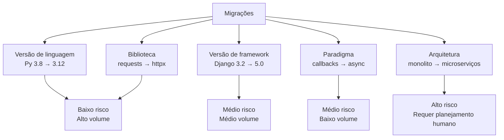
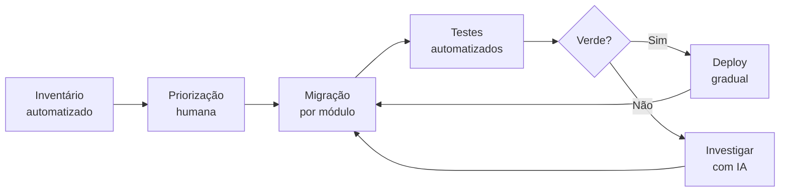

# 07 — Migração e Modernização com IA

> **Objetivo:** Usar IA para acelerar migrações de versão de linguagem/framework e modernização de código legado — mantendo segurança e correctude em cada passo.

---

## Tipos de Migração



**Onde a IA tem maior ROI:** migrações de **alto volume e baixo risco** — mudanças sintáticas, substituição de APIs, padronização.

**Onde o humano deve liderar:** migrações de arquitetura e aquelas com mudanças breaking de comportamento.

---

## Migração de Versão de Linguagem

### Python 3.8 → 3.12: o que muda

```markdown
"Audite este código Python 3.8 e identifique tudo que precisa ser atualizado para Python 3.12.

```python
[código]
```

Liste por categoria:
1. **Breaking changes** — coisas que vão falhar em 3.12
2. **Deprecations** — coisas que ainda funcionam mas serão removidas
3. **Melhorias disponíveis** — syntax nova que simplifica o código (type hints, match, etc.)

Para cada item: linha afetada + mudança necessária + exemplo de como fica."
```

**Mudanças comuns Python 3.9-3.12:**

| Feature | Antes | Depois |
|---------|-------|--------|
| Type hints built-in | `List[str]`, `Dict[str, int]` | `list[str]`, `dict[str, int]` |
| Union types | `Optional[str]` / `Union[str, None]` | `str \| None` |
| Match statement | if/elif chains | `match/case` |
| Exception groups | — | `ExceptionGroup` |
| f-string debugging | `f"x={x!r}"` | `f"{x=}"` |

### Exemplo: Modernizando type hints em lote

```markdown
"Atualize os type hints deste arquivo de Python 3.8 para Python 3.12.

Mudanças a fazer:
- `List[X]` → `list[X]`
- `Dict[K, V]` → `dict[K, V]`
- `Tuple[X, ...]` → `tuple[X, ...]`
- `Optional[X]` → `X | None`
- `Union[X, Y]` → `X | Y`
- Remover imports de `typing` que ficarem desnecessários

Não mude mais nada — apenas os type hints.

```python
[arquivo]
```
"
```

---

## Migração de Framework

### Auditando breaking changes

```markdown
"Estou migrando de [Framework X versão A] para [versão B].

Código atual:
```python
[código usando o framework]
```

Com base no changelog oficial entre as versões, identifique:
1. Breaking changes que afetam este código
2. APIs deprecadas que usamos
3. Novas APIs recomendadas para substituir as antigas

Changelog relevante:
[cole o changelog ou as seções de breaking changes]"
```

> ⚠️ **Importante:** Sempre cole o changelog oficial no prompt. A IA pode ter conhecimento desatualizado sobre versões específicas.

### Django: exemplo de migração de queryset

```markdown
"Migre estas queries Django 3.2 para usar as APIs recomendadas no Django 5.0.

Mudanças necessárias:
- `filter().update()` → `abulk_update()` onde aplicável
- `select_related` com subqueries → `prefetch_related(Prefetch(...))`
- `annotate` com `Value()` → usar `F()` expressions onde possível

```python
[arquivo com queries]
```

Mostre o antes e depois de cada mudança. Não altere a lógica de negócio."
```

---

## Migração de Biblioteca

### requests → httpx (sync para async)

```markdown
"Migre este código de requests (sync) para httpx (async).

```python
import requests

def fetch_user(user_id: str) -> dict:
    response = requests.get(
        f"https://api.example.com/users/{user_id}",
        headers={"Authorization": f"Bearer {TOKEN}"},
        timeout=10
    )
    response.raise_for_status()
    return response.json()

def fetch_orders(user_id: str) -> list:
    response = requests.get(
        f"https://api.example.com/users/{user_id}/orders",
        params={"limit": 100},
        timeout=10
    )
    response.raise_for_status()
    return response.json()
```

Regras:
- Use httpx.AsyncClient com context manager
- Reutilize o cliente para as duas chamadas (mesma session)
- Mantenha o mesmo tratamento de erro
- As funções se tornam async

Output: código migrado + as mudanças nos callers para usar await."
```

---

## Migração de Paradigma: Callbacks → Async/Await

```markdown
"Migre este código Node.js de callback-style para async/await moderno.

```javascript
function processOrder(orderId, callback) {
    db.findOrder(orderId, function(err, order) {
        if (err) return callback(err);
        
        inventory.check(order.items, function(err, available) {
            if (err) return callback(err);
            if (!available) return callback(new Error('Out of stock'));
            
            payment.charge(order.total, function(err, receipt) {
                if (err) return callback(err);
                callback(null, receipt);
            });
        });
    });
}
```

Regras:
- Use async/await com try/catch
- db, inventory e payment já têm versões Promise (mesmos nomes + Async: findOrderAsync, checkAsync, chargeAsync)
- Mantenha a mesma lógica de erro
- Não mude o comportamento para chamadas válidas"
```

---

## Estratégia de Migração Incremental

Para sistemas em produção, migrações big-bang são arriscadas. A abordagem incremental com IA:



### Passo 1: Inventário automatizado

```markdown
"Analise este repositório e gere um inventário de todos os pontos que precisam
ser migrados de [versão antiga] para [versão nova].

Estrutura de arquivos:
[tree do projeto]

Conteúdo dos arquivos principais:
[arquivos principais]

Retorne uma tabela:
| Arquivo | Linha | Padrão antigo | Urgência |
|---------|-------|---------------|---------|
Urgência: BLOQUEANTE / RECOMENDADO / OPCIONAL"
```

### Passo 2: Migrar módulo por módulo

```markdown
"Migre apenas o módulo src/auth/ para [nova versão].
Não toque em outros módulos.

Arquivos do módulo:
[arquivos]

Itens identificados no inventário para este módulo:
[subset do inventário]

Confirme que:
- Os testes existentes passam após a migração
- As interfaces públicas do módulo não mudaram
- Os callers externos não precisam de mudança"
```

---

## Modernização de Código Legado

Para código que funciona mas não usa práticas modernas:

```markdown
"Modernize este código Python mantendo comportamento idêntico.

```python
[código legado]
```

Aplicar onde fizer sentido (sem forçar se não melhorar):
- Type hints em todas as funções
- Dataclasses ou Pydantic onde há dicts de dados estruturados
- f-strings onde há concatenação ou .format()
- walrus operator (:=) onde reduz repetição
- pathlib onde há manipulação de path com os.path

Não aplique se a mudança tornar o código mais confuso."
```

---

## Validando a Migração

Após migrar, sempre valide:

```markdown
"Verifique se esta migração está correta.

Código original:
```python
[código antigo]
```

Código migrado:
```python
[código novo]
```

Confirme:
1. Comportamento idêntico para todos os inputs válidos
2. Tratamento de erro equivalente
3. Performance não degradada (sem operações extras)
4. Sem imports não-utilizados ou desnecessários"
```

---

## ✅ Pontos-chave do Capítulo

- A IA tem **maior ROI** em migrações de alto volume e baixo risco — type hints, syntax updates, troca de biblioteca.
- **Sempre cole o changelog oficial** — a IA pode ter conhecimento desatualizado sobre versões específicas.
- **Incremental sempre** — migre módulo por módulo, com testes verdes a cada passo.
- Para código legado: **inventário automatizado primeiro**, depois priorize humanamente.
- Migrações de arquitetura (monolito → microserviços) **requerem liderança humana** — a IA pode auxiliar, não decidir.

---

## 🔗 Próxima Aula

👉 [08 — Geração de Testes](./08-geracao-de-testes.md)
