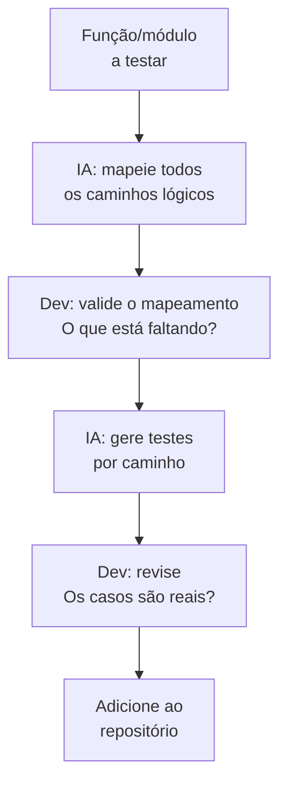

# 08 — Geração de Testes com IA

> **Objetivo:** Usar IA para aumentar cobertura de testes com qualidade — identificando edge cases, gerando fixtures e cobrindo cenários que desenvolvedores tipicamente deixam de fora.

---

## Geração de Testes ≠ Cobertura de Linhas

O erro mais comum ao usar IA para testes: **otimizar para cobertura de linhas**, não para cobertura de comportamento.

```
❌ "Gere testes para atingir 80% de cobertura"
→ A IA vai gerar testes que passam pelas linhas, mas podem não testar nada útil

✅ "Gere testes que cubram todos os cenários de negócio desta função"
→ A IA vai identificar edge cases que importam
```

**Cobertura de linhas** diz que o código foi executado.
**Cobertura de comportamento** diz que o comportamento está correto.

---

## O Processo: Mapear Antes de Gerar



**Por que mapear antes?** Quando você pede "gere testes" diretamente, a IA vai fazer escolhas sobre o que cobrir. Quando você mapeia primeiro, você controla essas escolhas.

---

## Mapeando Caminhos de Execução

```markdown
"Antes de gerar qualquer teste, mapeie todos os caminhos de execução desta função.

```python
def process_refund(order_id: str, amount: float, reason: str) -> RefundResult:
    order = get_order(order_id)
    
    if not order:
        raise OrderNotFoundError(order_id)
    
    if order.status not in ["delivered", "shipped"]:
        raise InvalidRefundError("Reembolso disponível apenas para pedidos entregues ou enviados")
    
    if amount > order.total:
        raise InvalidRefundError(f"Valor excede o total do pedido: {order.total}")
    
    if order.days_since_delivery > 30:
        raise InvalidRefundError("Prazo de reembolso expirado (30 dias)")
    
    refund = create_refund(order, amount, reason)
    notify_customer(order.customer_email, refund)
    return RefundResult(refund_id=refund.id, status="processing")
```

Liste os caminhos em forma de tabela:
| # | Cenário | Input | Output esperado |
|---|---------|-------|----------------|

Inclua: happy path, todos os erros possíveis, edge cases de valores limite."
```

**Output esperado da IA:**

| # | Cenário | Condição | Output |
|---|---------|----------|--------|
| 1 | Happy path | Pedido entregue, valor ≤ total, < 30 dias | RefundResult com status "processing" |
| 2 | Pedido não encontrado | order_id inválido | OrderNotFoundError |
| 3 | Status inválido — pending | order.status == "pending" | InvalidRefundError |
| 4 | Status inválido — cancelled | order.status == "cancelled" | InvalidRefundError |
| 5 | Valor exato igual ao total | amount == order.total | RefundResult ✅ (edge: limite inclusivo) |
| 6 | Valor acima do total | amount > order.total | InvalidRefundError |
| 7 | Exatamente 30 dias | days_since_delivery == 30 | ? (ambíguo — "> 30" ou ">= 30"?) |
| 8 | 31 dias | days_since_delivery == 31 | InvalidRefundError |
| 9 | Falha ao criar refund | create_refund() lança | ? (não tratado no código) |
| 10 | Falha ao notificar | notify_customer() lança | ? (não tratado no código) |

---

## Gerando os Testes

Com o mapeamento aprovado:

```markdown
"Gere os testes pytest para os cenários mapeados abaixo.

Função:
```python
[função]
```

Cenários aprovados:
[tabela ou lista dos cenários]

Setup:
- Mocks: get_order, create_refund, notify_customer via pytest-mock
- Fixture order_factory já existe — recebe fields como kwargs
- Use `pytest.raises` para exceções esperadas

Convenção de naming: test_process_refund_[cenario]

Organize por grupo:
- class TestHappyPath
- class TestValidationErrors
- class TestEdgeCases"
```

---

## Fixtures e Factories

A IA é excelente para gerar fixtures complexas:

```markdown
"Gere factories para os modelos de teste deste sistema de e-commerce.

Models:
```python
[Pydantic/SQLAlchemy models]
```

Para cada model, crie uma factory function que:
- Retorna uma instância com valores realistas (não 'test', '123', 'foo')
- Aceita **kwargs para sobrescrever campos específicos
- Mantém consistência de relacionamentos (ex: order.user_id deve ser de um User existente)

Use faker para dados realistas.
Framework: pytest com fixtures."
```

**Exemplo de output:**
```python
import pytest
from faker import Faker
from decimal import Decimal

fake = Faker("pt_BR")

@pytest.fixture
def user_factory(db):
    def _factory(**kwargs):
        defaults = {
            "email": fake.unique.email(),
            "name": fake.name(),
            "cpf": fake.cpf(),
            "is_active": True,
        }
        return User(**{**defaults, **kwargs})
    return _factory

@pytest.fixture
def order_factory(db, user_factory):
    def _factory(user=None, **kwargs):
        if user is None:
            user = user_factory()
        defaults = {
            "user_id": user.id,
            "status": "delivered",
            "total": Decimal("199.90"),
            "days_since_delivery": 5,
        }
        return Order(**{**defaults, **kwargs})
    return _factory
```

---

## Testes de Contrato para Integrações

Quando seu sistema se integra a sistemas externos (APIs de terceiros, filas, webhooks):

```markdown
"Gere testes de contrato para nossa integração com o gateway de pagamento PagSeguro.

Contratos que precisamos garantir:
1. POST /charges — nossa chamada tem os campos obrigatórios
2. Webhook recebido — validamos assinatura e processamos campos esperados
3. Response de erro — tratamos todos os códigos de erro documentados

Documentação da API (cole o trecho relevante):
[documentação]

Use responses library para mockar as chamadas HTTP."
```

---

## Geração Automatizada com Claude Code

Claude Code pode gerar testes para o projeto inteiro de forma sistemática:

```bash
claude

> Analise o diretório src/ e identifique todas as funções públicas sem testes correspondentes em tests/.
  
  Para cada função sem cobertura:
  1. Liste-a com o arquivo de origem
  2. Identifique os cenários críticos (happy path + principais erros)
  
  Aguarde minha aprovação antes de gerar os testes.
```

```bash
> Aprovado. Gere os testes para os primeiros 5 itens da lista,
  um arquivo de cada vez. Rode pytest após cada arquivo para confirmar.
```

---

## Testes de Mutação: Validando a Qualidade dos Testes

Testes gerados pela IA (e por humanos) podem ser **fracos** — passam mas não detectam bugs reais. Testes de mutação verificam isso.

```bash
# Python — usando mutmut
pip install mutmut
mutmut run --paths-to-mutate src/payments.py

# Após rodar, ver resultados
mutmut results
```

```markdown
"Analise estes resultados de mutation testing e identifique quais mutantes sobreviveram
(testes não detectaram a mudança).

Mutantes sobreviventes:
[output do mutmut]

Para cada mutante sobrevivente, sugira qual teste adicional detectaria a mutação."
```

---

## Quando NÃO Delegar à IA

| Cenário | Por quê delegar é arriscado |
|---------|----------------------------|
| Testes de regra de negócio complexa | A IA pode não entender as regras implícitas do domínio |
| Testes de integração com estado compartilhado | Timing e ordem de execução são sutis |
| Testes de segurança (pentest) | Requer conhecimento adversarial especializado |
| Testes de performance com SLAs específicos | Depende de infraestrutura real |

---

## Checklist: Avaliando Testes Gerados por IA

```
Qualidade dos casos:
  [ ] Cobre o happy path com valores reais (não apenas "test")?
  [ ] Cobre edge cases de limite (0, -1, max_int, string vazia)?
  [ ] Cobre todos os caminhos de erro mapeados?
  [ ] Cada teste tem apenas um assert central?

Isolamento:
  [ ] Testes independentes de ordem de execução?
  [ ] Mocks corretos — nem de mais nem de menos?
  [ ] Fixtures limpam estado após cada teste?

Qualidade do código de teste:
  [ ] Nomes descritivos (test_[função]_[cenário]_[resultado])?
  [ ] Sem lógica condicional nos testes (if, loops)?
  [ ] Asserts com mensagens úteis quando falham?
```

---

## ✅ Pontos-chave do Capítulo

- **Mapeie os caminhos antes de gerar** — você controla o que vai ser testado, não a IA.
- Otimize para **cobertura de comportamento**, não de linhas.
- Use IA para gerar **fixtures realistas** — é onde ela poupa mais tempo.
- **Testes de mutação** validam se seus testes são realmente eficazes.
- **Revise sempre** — testes gerados pela IA podem ser sintaticamente corretos mas semanticamente vazios.

---

## 🔗 Próxima Seção

👉 [Exercícios do Capítulo 02](./09-exercicios.md)
