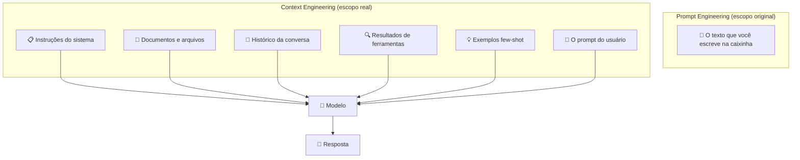
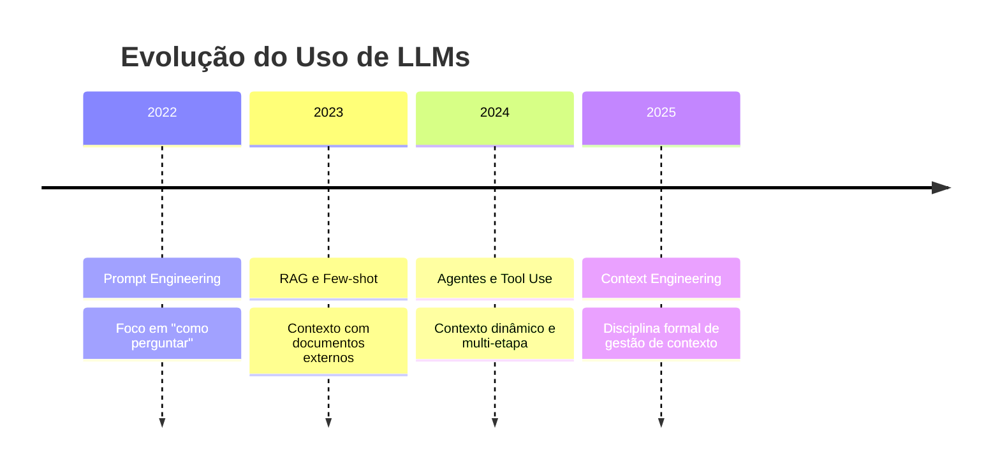

# 01 — O que é Context Engineering

> **Objetivo:** Entender o que é context engineering, por que ele vai além do prompt engineering e por que dominar essa disciplina é o diferencial entre um uso básico e avançado de IA.

---

## A Evolução: De Prompts a Contexto

No início do uso prático de LLMs, tudo era chamado de "prompt engineering". Mas à medida que os modelos evoluíram — contextos maiores, tarefas mais complexas, uso em sistemas multi-etapa — ficou claro que o prompt é apenas uma fração do que influencia a resposta.

**Context engineering** é a disciplina de construir e gerenciar tudo que o modelo recebe antes de gerar uma resposta.



> 📌 **Referência:** docs.anthropic.com/en/docs/build-with-claude/prompt-engineering/overview

---

## Prompt Engineering vs Context Engineering

| Dimensão | Prompt Engineering | Context Engineering |
|----------|--------------------|---------------------|
| **Foco** | A instrução em si | Tudo que chega ao modelo |
| **Escopo** | Um turno de conversa | A sessão inteira ou o sistema |
| **Quem pratica** | Qualquer usuário | Desenvolvedores e arquitetos |
| **Quando importa** | Tarefas simples e diretas | Tarefas complexas, agentes, sistemas |
| **Principal preocupação** | Clareza e especificidade | O que incluir, excluir e priorizar |

Prompt engineering é necessário. Context engineering é suficiente para escalar.

---

## O que Compõe o Contexto

Em uma sessão com um modelo de linguagem, o contexto é formado por camadas:

### 1. Instruções do Sistema (System Prompt)
O comportamento base do modelo — persona, restrições, objetivos. Define quem o modelo é para toda a sessão.

### 2. Documentos e Arquivos
Código, specs, documentação, logs — qualquer artefato que o modelo precisa ler para executar a tarefa.

### 3. Histórico de Conversa
Trocas anteriores na mesma sessão. O modelo usa o histórico para manter coerência.

### 4. Resultados de Ferramentas
Em sistemas agênticos: outputs de buscas, execuções de código, chamadas de API.

### 5. Exemplos (Few-shot)
Demonstrações de entrada/saída que calibram o formato e o raciocínio esperado.

### 6. O Prompt do Usuário
A instrução do momento. Apenas uma das 6 camadas acima.

---

## Por que isso Importa para Devs

Quando a tarefa é simples ("explique esta função"), o prompt é suficiente. Quando a tarefa é complexa, a qualidade do contexto determina a qualidade da resposta — não o prompt.

**Exemplos de onde context engineering muda o resultado:**

```markdown
❌ Contexto ruim — prompt bem escrito, contexto vazio:
"Refatore este código para melhorar a performance."
[sem código, sem informação sobre o sistema, sem restrições]

✅ Contexto rico — a mesma instrução com contexto:
"Refatore este código para melhorar a performance."
[código completo] + [contexto: sistema processa 10k req/s] +
[restrição: não pode usar dependências externas] +
[histórico: já tentamos cache e não resolveu]
```

O modelo com contexto rico tem todas as informações que um dev sênior teria antes de agir. O modelo sem contexto está chutando.

---

## A Metáfora do Briefing

Imagine contratar um consultor técnico especialista para resolver um problema. Você pode:

**Sem context engineering:**
> "Nosso sistema está lento. Me ajude."

**Com context engineering:**
> "Temos uma API REST em Python/FastAPI que processa pagamentos. O endpoint `/process` está com p99 de 8s em produção desde ontem. Aqui está o trecho de código relevante, o trace do Datadog e a query SQL que suspeito ser o gargalo. A constraint é que não podemos fazer downtime. Preciso de um diagnóstico e das 3 alternativas mais prováveis com trade-offs."

O consultor é igualmente capaz nos dois casos. O que muda é o que você entregou para ele trabalhar.

---

## O Campo em Evolução

O termo "context engineering" ganhou tração em 2024-2025, à medida que:

- Janelas de contexto cresceram de 8K para centenas de milhares de tokens
- Sistemas agênticos precisaram gerenciar contexto ao longo de múltiplas etapas
- Ficou claro que o maior limitante não era o modelo, mas o contexto fornecido



> 📌 **Referência:** anthropic.com/research/building-effective-agents

---

## ✅ Pontos-chave do Capítulo

- Context engineering é a disciplina de gerenciar **tudo que o modelo recebe**, não só o prompt
- O prompt é apenas uma das 6 camadas que compõem o contexto
- A qualidade do contexto determina a qualidade da resposta em tarefas complexas
- Para sistemas agênticos e tarefas longas, context engineering é indispensável
- O campo amadureceu com o crescimento das janelas de contexto e dos sistemas multi-etapa

---

## 🔗 Próxima Aula

👉 [02 — Janela de Contexto](./02-janela-de-contexto.md)
