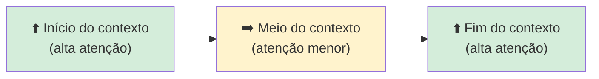
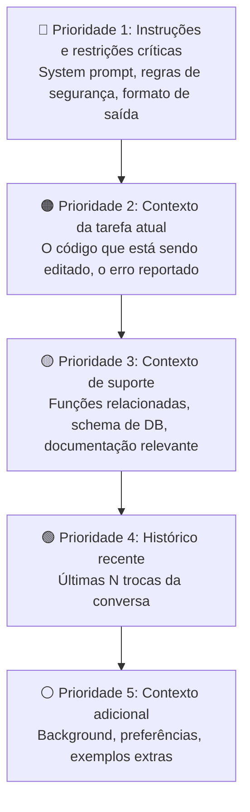
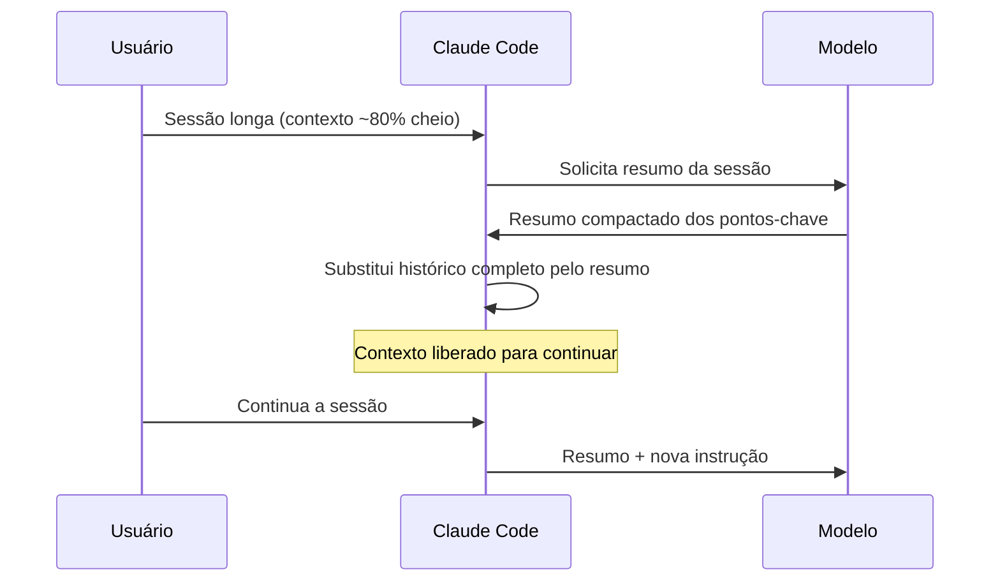

# 02 — Janela de Contexto

> **Objetivo:** Entender como funciona a janela de contexto, o que ela comporta, como o modelo prioriza informação dentro dela e o que acontece quando ela é compactada.

---

## O que é a Janela de Contexto

A janela de contexto é o limite de texto que o modelo consegue "ver" em uma única inferência. Tudo que está dentro dela é processado simultaneamente — o modelo não tem memória fora desse limite.

A unidade de medida é o **token** — aproximadamente 0,75 palavras em inglês ou ~0,6 palavras em português.

| Modelo | Contexto (tokens) | Equivalente aproximado |
|--------|:-----------------:|------------------------|
| Claude Haiku 4.5 | 200K | ~150K palavras / ~500 páginas |
| Claude Sonnet 4.6 | 200K | ~150K palavras / ~500 páginas |
| Claude Opus 4.7 | 200K | ~150K palavras / ~500 páginas |

> 📌 **Referência:** docs.anthropic.com/en/docs/about-claude/models/overview

---

## O que Cabe em 200K Tokens

Para ter intuição sobre escala:

| Artefato | Tamanho típico |
|----------|---------------|
| Função Python simples | ~200 tokens |
| Arquivo de código (500 linhas) | ~5.000 tokens |
| Repositório médio (100 arquivos) | ~500.000 tokens ⚠️ não cabe |
| Documentação técnica completa | ~50.000 tokens |
| Conversa longa de 2h | ~30.000 tokens |
| Spec de feature detalhada | ~2.000 tokens |
| Stack trace com contexto | ~1.000 tokens |

200K tokens é muito — mas repositórios reais costumam ultrapassar esse limite. Saber **o que colocar** é mais importante do que saber **quanto cabe**.

---

## Como o Modelo Processa o Contexto

O modelo não lê o contexto como um humano lê um documento — da primeira à última linha com atenção decrescente. O mecanismo de atenção (attention) permite que qualquer parte do contexto influencie qualquer outra parte.

Porém, na prática, dois efeitos são bem documentados:

### Efeito de Primazia e Recência



- **Início:** instruções do sistema, persona, restrições globais — **coloque aqui**
- **Meio:** documentos de referência, histórico longo — atenção menor
- **Fim:** a pergunta ou tarefa atual — **sempre ao final**

### Implicação prática

```markdown
❌ Ruim: colocar a instrução crítica no meio de um documento longo
✅ Bom: colocar instruções críticas no início (system prompt) e a tarefa no final (último turno)
```

> 📌 **Referência:** docs.anthropic.com/en/docs/build-with-claude/prompt-engineering/long-context-tips

---

## Prioridade de Informação

Quando o contexto está cheio ou quase cheio, o que incluir? Uma hierarquia prática:



Quando precisar cortar, corte de baixo para cima. Nunca corte P1 ou P2.

---

## Compactação de Sessão

Em sessões longas, o contexto pode se aproximar do limite. Ferramentas como Claude Code lidam com isso através de **compactação automática** (`/compact`).

### O que acontece na compactação



### O que é preservado vs perdido

| Preservado ✅ | Perdido ❌ |
|--------------|-----------|
| Decisões tomadas | Raciocínio intermediário |
| Arquivos editados | Detalhes de iterações |
| Padrões identificados | Contexto de tentativas falhas |
| Direção da tarefa | Nuances de conversas longas |

### Quando usar compactação

- A ferramenta avisa que o contexto está quase cheio
- A sessão acumulou muito histórico de debugging ou exploração
- Você vai iniciar uma nova fase da tarefa (ex.: passou de exploração para implementação)

> 📌 **Referência:** docs.anthropic.com/en/docs/claude-code/cli-reference

---

## Tokens de Entrada vs Saída

A janela de contexto cobre **entrada** (o que você envia) e **saída** (o que o modelo gera). O limite de saída é separado e menor:

| Modelo | Limite de saída |
|--------|:--------------:|
| Claude Haiku 4.5 | 8.192 tokens |
| Claude Sonnet 4.6 | 64.000 tokens |
| Claude Opus 4.7 | 32.000 tokens |

Para tarefas que geram muito texto (documentação extensa, código longo), considere dividir em múltiplas chamadas ao invés de tentar gerar tudo de uma vez.

> 📌 **Referência:** docs.anthropic.com/en/docs/about-claude/models/overview

---

## Custo e Velocidade

Tokens têm custo e afetam latência. Contexto desnecessário é desperdício duplo — financeiro e de velocidade.

```markdown
❌ Incluir o repositório inteiro quando só uma função é relevante
❌ Repetir as mesmas instruções 10 vezes no histórico
❌ Manter conversas exploratórias antigas quando a direção já mudou

✅ Incluir apenas os arquivos relacionados à tarefa atual
✅ Usar system prompt para instruções persistentes (não repetir no chat)
✅ Compactar ou reiniciar sessões quando o histórico não é mais útil
```

---

## ✅ Pontos-chave do Capítulo

- A janela de contexto é o limite do que o modelo "vê" em uma inferência — não existe memória fora dela
- Início e fim do contexto recebem mais atenção — coloque instruções críticas no início e a tarefa no final
- Quando o contexto está cheio, priorize: instruções > tarefa atual > suporte > histórico
- Compactação preserva decisões e direção, mas perde raciocínio intermediário e detalhes de iterações
- Contexto desnecessário tem custo real: financeiro e de latência

---

## 🔗 Próxima Aula

👉 [03 — Como Estruturar Contexto](./03-como-estruturar-contexto.md)
