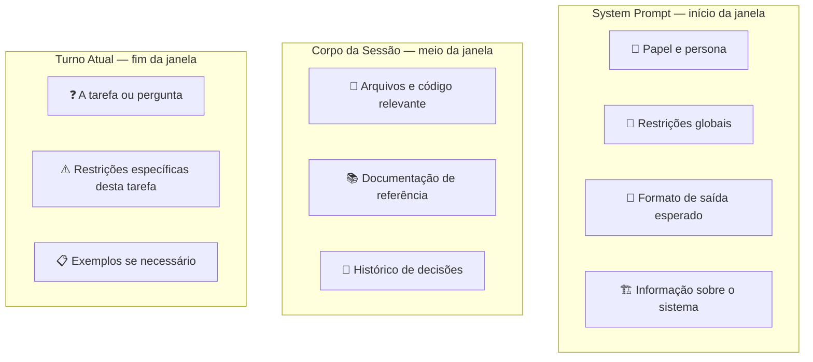
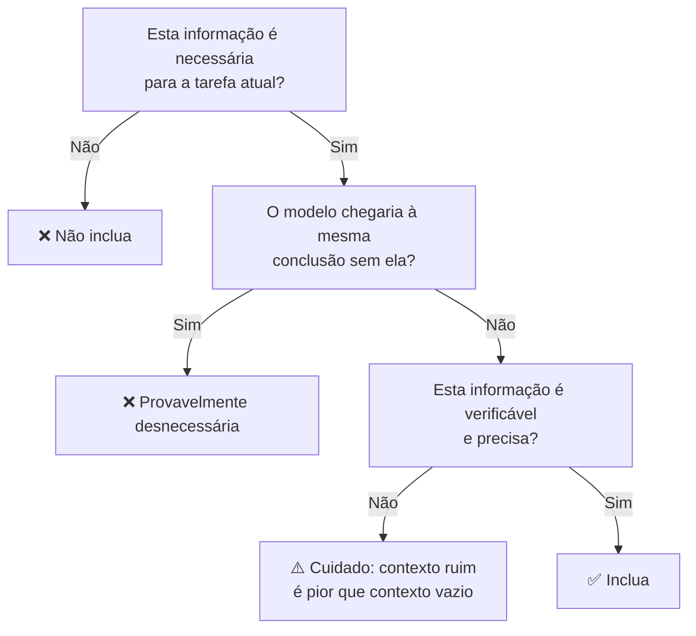

# 03 — Como Estruturar Contexto

> **Objetivo:** Aprender a hierarquia de informação dentro do contexto — o que incluir, o que omitir e como organizar para maximizar a qualidade das respostas.

---

## A Estrutura em Camadas

Um contexto bem construído não é uma colagem de informações — é uma hierarquia deliberada. Cada camada tem um propósito diferente e uma posição ideal na janela de contexto.



---

## O que SEMPRE Incluir

### 1. Papel e objetivo da sessão

O modelo performa melhor quando sabe quem ele é e qual o objetivo da sessão:

```markdown
✅ System prompt efetivo:
"Você é um revisor de código especialista em Python e FastAPI.
Seu papel nesta sessão é revisar PRs antes do merge.
Foque em: segurança, performance e aderência aos padrões do projeto.
Ignore: estilo de comentários, preferências pessoais de nomenclatura."
```

### 2. Contexto do sistema (quando relevante)

O modelo não conhece sua stack, seu time ou suas decisões passadas. Forneça o mínimo necessário para que ele não precise adivinhar:

```markdown
✅ Contexto de sistema útil:
- Stack: Python 3.11, FastAPI, PostgreSQL, Redis
- Deploy: Kubernetes, AWS EKS
- Tamanho: ~50 endpoints, 200k req/dia
- Restrição: sem dependências externas novas sem aprovação de arquitetura
```

### 3. O artefato da tarefa

O código, o erro, o documento — o objeto central da tarefa. Deve estar completo e relevante:

```markdown
✅ Incluir o arquivo inteiro se ele for pequeno (<300 linhas)
✅ Incluir o trecho relevante + suficiente contexto para entender (função, classe, módulo)
❌ Não incluir snippets isolados sem contexto de importações ou tipos
```

### 4. Restrições específicas da tarefa

O que o modelo **não pode** fazer é tão importante quanto o que ele deve fazer:

```markdown
✅ "Não mude a assinatura pública desta função — ela é usada por 40 outros módulos"
✅ "A solução deve ser compatível com Python 3.9 — não use operadores de match"
✅ "Não introduza novas dependências"
```

---

## O que NUNCA Incluir

### ❌ Código irrelevante para a tarefa

```markdown
❌ "Aqui está o repositório inteiro, me ajude com o endpoint /users/login"
✅ "Aqui está auth/routes.py e auth/models.py, me ajude com o endpoint /users/login"
```

### ❌ Histórico de conversas sobre outros assuntos

Se você mudou de tópico, considere uma nova sessão. Histórico antigo sobre outro problema polui o contexto e pode confundir o modelo.

### ❌ Instruções contraditórias

```markdown
❌ System prompt: "Seja conciso"
❌ No chat: "Me dê uma resposta bem detalhada com muitos exemplos"

✅ Defina o padrão no system prompt e só desvie explicitamente quando necessário
```

### ❌ Contexto de exploração já superado

Se você passou 30 mensagens explorando uma abordagem e decidiu não usá-la, esse histórico é ruído. Compacte ou reinicie com o que foi decidido.

---

## Hierarquia de Informação: O Princípio da Relevância

Cada pedaço de contexto deve passar por este filtro antes de entrar:



---

## Padrões de Estruturação

### Padrão 1: Contexto Cirúrgico

Para tarefas focadas (debug de função, review de PR, refactor de módulo):

```markdown
[System: papel + stack do projeto]
[Arquivo: apenas os arquivos relevantes]
[Tarefa: instrução específica + restrições]
```

### Padrão 2: Contexto de Projeto

Para sessões mais longas (implementar uma feature, refatorar um módulo):

```markdown
[System: papel + visão geral do sistema + convenções do projeto]
[Arquivos: módulo sendo trabalhado + interfaces relacionadas]
[Decisões: o que já foi decidido/tentado nesta sessão]
[Tarefa: próximo passo específico]
```

### Padrão 3: Contexto de Exploração

Para sessões de design e arquitetura:

```markdown
[System: papel de arquiteto + contexto do negócio]
[Background: problema a resolver + constraints conhecidas]
[Arte de referência: decisões passadas relevantes]
[Tarefa: pergunta ou hipótese a explorar]
```

---

## Formatação do Contexto

O modelo lê Markdown. Use-o para dar estrutura ao contexto:

```markdown
✅ Bom — contexto estruturado:
## Sistema
Stack: Node.js, TypeScript, MongoDB

## Problema
O endpoint POST /orders está retornando 500 intermitentemente.

## Código relevante
[código aqui]

## Logs do erro
[logs aqui]

## Tentativas anteriores
- Adicionamos retry com backoff: não resolveu
- Verificamos índices do MongoDB: OK

## Tarefa
Identifique a causa raiz e proponha uma correção.
```

```markdown
❌ Ruim — dump de texto sem estrutura:
"Oi tenho um endpoint que ás vezes dá 500 veja o código aqui [código] os logs são esses [logs]
já tentamos retry não sei o que está causando"
```

---

## O CLAUDE.md como Contexto Persistente

Em projetos com Claude Code, o arquivo `CLAUDE.md` é automaticamente incluído no início do contexto de toda sessão. É o lugar ideal para:

- Convenções do projeto que se aplicam a toda tarefa
- Comandos de build, test e deploy
- Arquitetura de alto nível
- Decisões técnicas permanentes

Tudo que você colocaria num onboarding para um dev novo no projeto pertence ao `CLAUDE.md`.

> 📌 **Referência:** docs.anthropic.com/en/docs/claude-code/memory

---

## ✅ Pontos-chave do Capítulo

- Contexto bem estruturado tem hierarquia: instruções > artefatos > histórico > tarefa
- Sempre inclua: papel, contexto do sistema, o artefato da tarefa e as restrições específicas
- Nunca inclua: código irrelevante, histórico de outros tópicos, instruções contraditórias
- Cada pedaço de contexto deve responder à pergunta: "o modelo chegaria à mesma conclusão sem isso?"
- Use Markdown para estruturar o contexto — headers e seções melhoram a qualidade da resposta
- `CLAUDE.md` é o mecanismo de contexto persistente para projetos no Claude Code

---

## 🔗 Próxima Aula

👉 [04 — Memória e Persistência](./04-memoria-e-persistencia.md)
