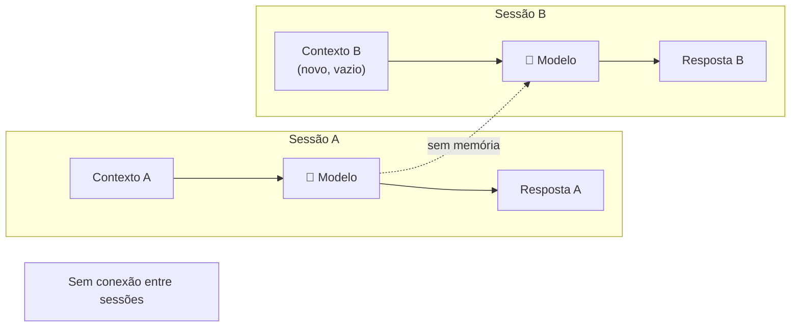
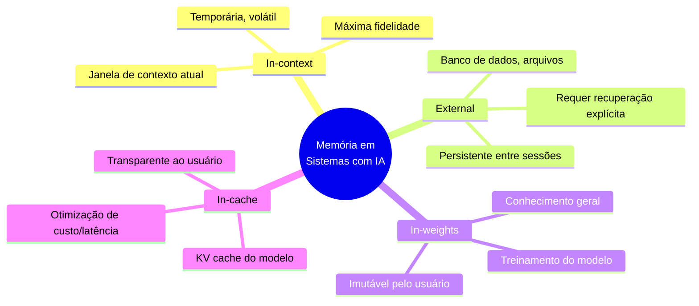
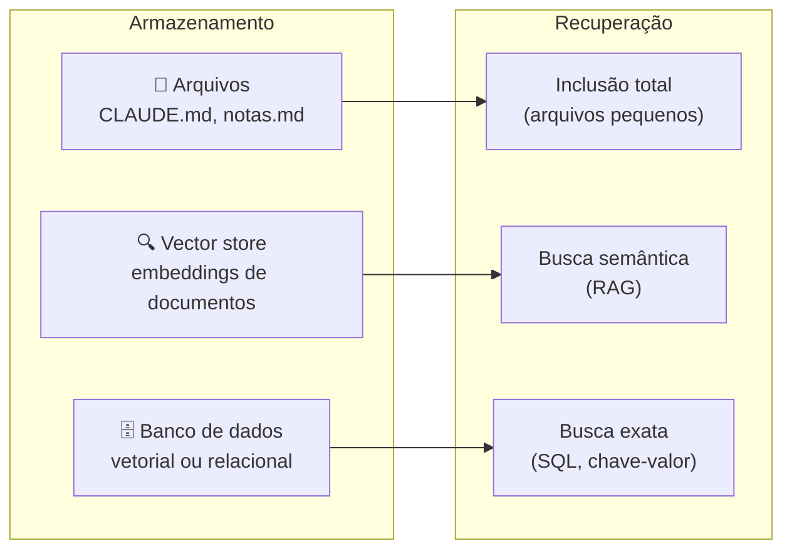

# 04 — Memória e Persistência

> **Objetivo:** Entender os tipos de memória disponíveis para sistemas com IA, como simular persistência entre sessões e quais mecanismos cada ferramenta oferece.

---

## O Problema da Memória Zero

Por padrão, modelos de linguagem não têm memória entre sessões. Cada nova conversa começa do zero — o modelo não lembra o que foi discutido ontem, não conhece seu projeto, não sabe o que foi decidido na última reunião.



A solução não é o modelo "aprender" — é você construir e fornecer o contexto relevante no início de cada sessão.

---

## Os 4 Tipos de Memória



Como desenvolvedor, você trabalha principalmente com **in-context** e **external**.

> 📌 **Referência:** anthropic.com/research/building-effective-agents

---

## Memória In-Context: Sessão Atual

É tudo que está na janela de contexto ativa. Tem a maior fidelidade — o modelo acessa diretamente — mas é volátil: some quando a sessão termina.

**Estratégias para otimizar memória in-context:**

| Estratégia | Quando usar |
|-----------|-------------|
| System prompt persistente | Instruções e contexto do projeto que valem para toda sessão |
| Compactação de histórico | Sessões longas com muito histórico de exploração |
| Sumarização progressiva | Ao fim de cada fase da tarefa, gere um resumo estruturado |
| Handoff document | Ao encerrar uma sessão longa, peça ao modelo um briefing para a próxima |

---

## Memória External: Persistência entre Sessões

Para que informação sobreviva entre sessões, ela precisa ser salva em algum lugar e recuperada no início da próxima sessão.

### Tipos de armazenamento externo



---

## CLAUDE.md: Memória de Projeto

Para projetos com Claude Code, o `CLAUDE.md` é o principal mecanismo de memória de projeto. Ele é carregado automaticamente no início de cada sessão.

### O que guardar no CLAUDE.md

```markdown
# Projeto: API de Pagamentos

## Stack
- Python 3.11 + FastAPI + PostgreSQL + Redis
- Deploy: AWS EKS, CI via GitHub Actions

## Convenções de código
- Tipos explícitos em toda assinatura de função pública
- Testes obrigatórios para toda lógica de negócio
- Sem dependências externas sem aprovação em ADR

## Arquitetura
- auth/ — autenticação e autorização
- payments/ — lógica de pagamento (núcleo)
- notifications/ — envio de emails/SMS

## Decisões técnicas
- Escolhemos Celery + Redis para filas (não SQS) — simplifica deploy local
- Não usamos ORM async — nossa carga não justifica a complexidade

## Comandos
- `make test` — roda suite completa
- `make lint` — black + ruff + mypy
- `make dev` — sobe ambiente local via docker-compose
```

> 📌 **Referência:** docs.anthropic.com/en/docs/claude-code/memory

### Localização dos arquivos CLAUDE.md

| Localização | Escopo | Quando usar |
|-------------|--------|-------------|
| `~/.claude/CLAUDE.md` | Todas as sessões (global) | Preferências pessoais, atalhos |
| `./CLAUDE.md` (raiz do repo) | Projeto inteiro | Convenções, arquitetura, comandos |
| `./src/CLAUDE.md` | Diretório específico | Regras de um módulo ou subprojeto |

---

## Notas de Sessão: Memória Manual

Para projetos sem Claude Code, ou para contexto que não pertence ao `CLAUDE.md`, uma prática efetiva é manter um arquivo de notas de sessão:

```markdown
# notas-sessao.md — atualizar ao fim de cada sessão

## Última sessão: 2025-01-15
**Tarefa:** Implementação do módulo de notificações

**Decisões tomadas:**
- Usar templates Jinja2 para emails (não HTML hardcoded)
- Fila de notificações separada da fila de pagamentos
- Rate limit: máximo 3 emails por usuário por hora

**Próximo passo:**
- Implementar o worker de envio de SMS
- Arquivo: notifications/workers/sms_worker.py
- Interface esperada: send_sms(phone, message, priority)

**Bloqueadores:**
- Precisamos de credenciais da Twilio (pedir ao ops)
```

No início da próxima sessão, inclua este arquivo no contexto antes de começar.

---

## Projects no claude.ai: Memória de Projeto na Interface

No claude.ai, a funcionalidade **Projects** oferece memória persistente sem necessidade de setup técnico:

- Instruções do projeto ficam disponíveis em toda conversa do projeto
- Documentos adicionados ficam no contexto de toda conversa
- Conversas dentro do projeto compartilham o mesmo contexto de instruções

**Ideal para:** trabalho exploratório, conversas de design, revisões sem código.

**Limitação:** não integra com o terminal ou com o fluxo de código diretamente.

> 📌 **Referência:** docs.anthropic.com/en/docs/claude-ai/projects

---

## Padrão: Handoff entre Sessões

Ao finalizar uma sessão produtiva, peça ao modelo um documento de handoff:

```markdown
"Antes de encerrarmos:
1. Resuma as decisões técnicas que tomamos nesta sessão
2. Liste o estado atual do que foi implementado
3. Descreva os próximos 3 passos em ordem de prioridade
4. Aponte qualquer dependência ou bloqueador identificado

Formate como um briefing conciso que eu possa usar no início da próxima sessão."
```

Salve o output. Na próxima sessão, inclua-o antes da sua primeira instrução.

---

## Comparativo de Mecanismos

| Mecanismo | Persistência | Esforço de setup | Melhor para |
|-----------|:------------:|:----------------:|-------------|
| System prompt / `CLAUDE.md` | ✅ Sessão | Baixo | Convenções e contexto de projeto |
| Notas de sessão (arquivo .md) | ✅ Manual | Baixo | Decisões e handoff |
| Projects (claude.ai) | ✅ Automática | Muito baixo | Trabalho exploratório e não-técnico |
| RAG / vector store | ✅ Automática | Alto | Documentação grande e buscável |
| Compactação in-session | ❌ Não persiste | Nenhum | Sessões longas, não entre sessões |

---

## ✅ Pontos-chave do Capítulo

- Modelos não têm memória entre sessões — persistência é responsabilidade da sua arquitetura
- Existem 4 tipos de memória: in-context (sessão), external (arquivos/DBs), in-weights (treinamento) e in-cache (otimização)
- `CLAUDE.md` é o mecanismo central de memória de projeto no Claude Code — carregado automaticamente em toda sessão
- Notas de sessão e documentos de handoff são práticas simples e eficazes para sessões longas
- Projects no claude.ai oferece memória persistente para trabalho exploratório sem setup técnico

---

## 🔗 Próxima Aula

👉 [05 — RAG para Devs](./05-rag-para-devs.md)
