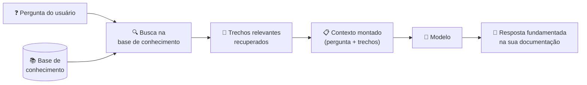
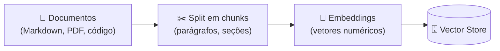
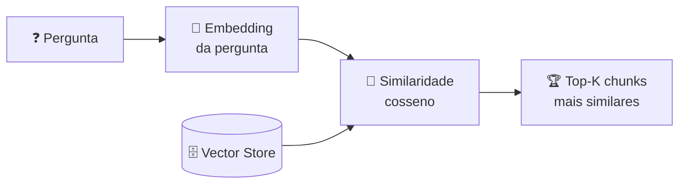

# 05 — RAG para Devs

> **Objetivo:** Entender o que é RAG, como funciona na prática, e como usar sua própria documentação técnica como contexto do modelo sem construir uma pipeline complexa.

---

## O Problema que RAG Resolve

O modelo foi treinado até uma data de corte — ele não conhece sua documentação interna, sua API privada, seu guia de arquitetura ou as decisões do seu time. Você tem duas opções:

1. **Incluir tudo no contexto** — funciona se o volume cabe na janela
2. **Recuperar só o relevante** — RAG faz isso automaticamente

RAG (Retrieval-Augmented Generation) é a técnica de buscar, dinamicamente, os trechos mais relevantes de uma base de conhecimento e incluí-los no contexto antes de gerar a resposta.



---

## Como Funciona: O Pipeline Básico

### Fase 1: Indexação (uma vez)



Cada chunk vira um vetor numérico que representa seu significado semântico.

### Fase 2: Busca (a cada pergunta)



### Fase 3: Geração (com contexto aumentado)

```markdown
[System prompt]
[Chunks recuperados da sua base de conhecimento]
[Pergunta do usuário]
→ Resposta do modelo
```

---

## Quando RAG é (e não é) a Resposta

| Situação | Abordagem recomendada |
|----------|----------------------|
| Documentação pequena (<50K tokens) | Inclua tudo no contexto — mais simples, maior fidelidade |
| Documentação média (50K–500K tokens) | RAG simples com busca semântica |
| Documentação grande (>500K tokens) | RAG com chunking e filtragem avançados |
| Informação que muda frequentemente | RAG (atualiza a base, não o sistema) |
| Informação estática e pequena | `CLAUDE.md` ou system prompt |
| Código-fonte de um repositório grande | Ferramentas especializadas (grep, AST search) |

> 📌 **Referência:** docs.anthropic.com/en/docs/build-with-claude/retrieval-augmented-generation

---

## RAG Sem Infraestrutura: Abordagem Prática

Antes de construir uma pipeline RAG completa, considere a versão manual — suficiente para muitos casos:

### Opção 1: Contexto Completo (para docs pequenas)

```bash
# Concatene sua documentação e inclua no contexto
cat docs/*.md | wc -c  # verifique o tamanho
# Se < 150K tokens (~600KB), inclua direto no contexto
```

### Opção 2: Busca com Grep (para código e docs)

```bash
# Encontre os trechos relevantes manualmente
grep -r "autenticação" docs/ --include="*.md" -l
grep -r "payment" src/ --include="*.py" -l

# Inclua apenas os arquivos encontrados no contexto
```

### Opção 3: RAG com Embeddings Locais

Para volumes maiores, um setup mínimo com Java usando o Anthropic SDK e ChromaDB:

```java
// pom.xml:
// <dependency>
//   <groupId>com.anthropic</groupId>
//   <artifactId>anthropic-java</artifactId>
//   <version>1.3.0</version>
// </dependency>
// <dependency>
//   <groupId>tech.amikos.chromadb</groupId>
//   <artifactId>chromadb-java-client</artifactId>
//   <version>0.1.7</version>
// </dependency>

import com.anthropic.client.Anthropic;
import com.anthropic.client.okhttp.AnthropicOkHttpClient;
import com.anthropic.models.messages.*;
import tech.amikos.chromadb.*;
import java.nio.file.*;
import java.util.*;

public class RagPipeline {

    private final Anthropic client = AnthropicOkHttpClient.fromEnv();
    private final ChromaClient chroma = new ChromaClient("http://localhost:8000");
    private Collection collection;

    public void indexDocs(String docsPath) throws Exception {
        collection = chroma.createCollection("docs", null, true, null);

        try (var stream = Files.walk(Path.of(docsPath))) {
            stream.filter(p -> p.toString().endsWith(".md"))
                  .forEach(path -> {
                      try {
                          String content = Files.readString(path);
                          String[] chunks = content.split("\n\n");
                          List<String> docs = new ArrayList<>();
                          List<String> ids = new ArrayList<>();
                          for (int i = 0; i < chunks.length; i++) {
                              if (chunks[i].length() > 100) {
                                  docs.add(chunks[i]);
                                  ids.add(path.getFileName() + "_" + i);
                              }
                          }
                          if (!docs.isEmpty()) {
                              collection.add(null, null, docs, ids);
                          }
                      } catch (Exception e) {
                          throw new RuntimeException(e);
                      }
                  });
        }
    }

    public String answer(String question) throws Exception {
        // Recupera chunks relevantes
        QueryResponse results = collection.query(List.of(question), 3, null, null, null);
        String context = String.join("\n\n---\n\n", results.getDocuments().get(0));

        Message response = client.messages().create(
            MessageCreateParams.builder()
                .model(Model.CLAUDE_SONNET_4_6)
                .maxTokens(1024L)
                .system("Use a documentação abaixo para responder:\n\n" + context)
                .addUserMessage(question)
                .build()
        );

        return response.content().get(0).asText().text();
    }

    public static void main(String[] args) throws Exception {
        var rag = new RagPipeline();
        rag.indexDocs("./docs");
        System.out.println(rag.answer("Como funciona a autenticação JWT?"));
    }
}
```

> 📌 **Referência:** docs.anthropic.com/en/docs/about-claude/models/overview

---

## Boas Práticas de Chunking

A qualidade do RAG depende muito de como os documentos são divididos em chunks.

| Estratégia | Como funciona | Melhor para |
|-----------|---------------|-------------|
| Por parágrafo | Split em `\n\n` | Documentação narrativa |
| Por seção | Split por `## ` | Documentação estruturada em Markdown |
| Por tamanho fixo | N tokens com overlap | PDFs e texto sem estrutura clara |
| Por função/classe | Parse de AST | Código-fonte |

**Overlap entre chunks:**

```java
// Chunk com overlap evita perda de contexto nas bordas
public static List<String> chunkWithOverlap(String text, int chunkSize, int overlap) {
    String[] words = text.split("\\s+");
    List<String> chunks = new ArrayList<>();
    for (int i = 0; i < words.length; i += chunkSize - overlap) {
        int end = Math.min(i + chunkSize, words.length);
        chunks.add(String.join(" ", Arrays.copyOfRange(words, i, end)));
    }
    return chunks;
}
```

---

## Fontes de Documentação para RAG

### O que indexar no seu projeto

```markdown
✅ Indexar:
- Documentação de APIs internas (OpenAPI specs, Markdown)
- ADRs (Architecture Decision Records)
- Guias de contribuição e convenções
- README de módulos e bibliotecas internas
- Runbooks operacionais

❌ Não indexar:
- Código-fonte completo (use grep/AST tools)
- Logs e dados de produção (sensível + volume)
- Histórico de PRs e issues (ruído)
- Documentação de terceiros (já no training data)
```

### Documentação pública como contexto

Para bibliotecas que o modelo não conhece bem (nova, obscura, ou muito atualizada), inclua a documentação oficial diretamente:

```java
// Usando java.net.http para buscar documentação atualizada
import java.net.URI;
import java.net.http.HttpClient;
import java.net.http.HttpRequest;
import java.net.http.HttpResponse;

public static String fetchDocs(String url) throws Exception {
    var httpClient = HttpClient.newHttpClient();
    var request = HttpRequest.newBuilder()
        .uri(URI.create(url))
        .GET()
        .build();
    return httpClient.send(request, HttpResponse.BodyHandlers.ofString()).body();
}

// Inclua no system prompt ou no contexto do usuário
String latestDocs = fetchDocs("https://docs.exemplo.com/api-reference");
```

---

## RAG vs Fine-tuning

Uma dúvida comum: quando usar RAG e quando fazer fine-tuning?

| | RAG | Fine-tuning |
|--|-----|-------------|
| **Para que serve** | Conhecimento específico e atualizado | Estilo, formato, comportamento |
| **Custo** | Baixo (inferência) | Alto (treinamento) |
| **Atualização** | Imediata (atualiza a base) | Exige novo treinamento |
| **Transparência** | Alta (fontes rastreáveis) | Baixa (conhecimento opaco) |
| **Melhor para** | Documentação, dados proprietários | Tom de voz, padrões de resposta |

Para a maioria dos casos de uso em desenvolvimento de software, RAG é a escolha certa.

> 📌 **Referência:** docs.anthropic.com/en/docs/build-with-claude/retrieval-augmented-generation

---

## Pipeline RAG com Claude: Exemplo Completo

```java
import com.anthropic.client.Anthropic;
import com.anthropic.client.okhttp.AnthropicOkHttpClient;
import com.anthropic.models.messages.*;
import tech.amikos.chromadb.*;
import java.nio.file.*;
import java.util.*;
import java.util.function.Function;

public class RagPipelineCompleto {

    public static Function<String, String> buildRagPipeline(String docsDir) throws Exception {
        Anthropic client = AnthropicOkHttpClient.fromEnv();
        ChromaClient chroma = new ChromaClient("http://localhost:8000");
        Collection collection = chroma.getOrCreateCollection("project_docs", null, null);

        // Indexa documentos
        try (var stream = Files.walk(Path.of(docsDir))) {
            stream.filter(p -> p.toString().endsWith(".md"))
                  .forEach(path -> {
                      try {
                          String text = Files.readString(path);
                          String[] sections = text.split("\n## ");
                          List<String> docs = new ArrayList<>();
                          List<String> ids = new ArrayList<>();
                          List<Map<String, String>> metas = new ArrayList<>();
                          for (int i = 0; i < sections.length; i++) {
                              if (sections[i].length() > 150) {
                                  docs.add(sections[i]);
                                  ids.add(path.getFileName().toString().replace(".md", "") + "_" + i);
                                  metas.add(Map.of("source", path.toString()));
                              }
                          }
                          if (!docs.isEmpty()) collection.upsert(null, metas, docs, ids);
                      } catch (Exception e) { throw new RuntimeException(e); }
                  });
        }

        return question -> {
            try {
                QueryResponse results = collection.query(List.of(question), 4, null, null, null);
                List<String> chunks  = results.getDocuments().get(0);
                List<Map<String, Object>> metadatas = results.getMetadatas().get(0);

                StringBuilder ctx = new StringBuilder();
                for (int i = 0; i < chunks.size(); i++) {
                    ctx.append("[Fonte: ").append(metadatas.get(i).get("source"))
                       .append("]\n").append(chunks.get(i)).append("\n\n---\n\n");
                }

                Message response = client.messages().create(
                    MessageCreateParams.builder()
                        .model(Model.CLAUDE_SONNET_4_6)
                        .maxTokens(2048L)
                        .system("""
                            Você é um assistente técnico com acesso à documentação do projeto.
                            Responda com base nos trechos fornecidos.
                            Se a informação não estiver nos trechos, diga explicitamente.

                            Documentação relevante:

                            """ + ctx)
                        .addUserMessage(question)
                        .build()
                );
                return response.content().get(0).asText().text();
            } catch (Exception e) { throw new RuntimeException(e); }
        };
    }

    public static void main(String[] args) throws Exception {
        var ask = buildRagPipeline("./docs");
        System.out.println(ask("Como autenticar requisições na API?"));
    }
}
```

---

## ✅ Pontos-chave do Capítulo

- RAG resolve o problema de base de conhecimento maior que a janela de contexto
- O pipeline tem 3 etapas: indexação (one-time), busca semântica (por pergunta) e geração com contexto aumentado
- Para documentação pequena (<50K tokens), inclua tudo no contexto — mais simples e maior fidelidade
- Chunking bem feito (por seção, com overlap) é crítico para a qualidade do RAG
- RAG é para conhecimento específico e atualizado; fine-tuning é para comportamento e estilo
- Indexe ADRs, specs de API e guias internos — não código-fonte completo ou dados de produção

---

## 🔗 Próxima Seção

👉 [Exercícios do Capítulo 03](./06-exercicios.md)
