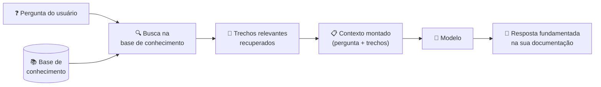
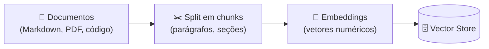
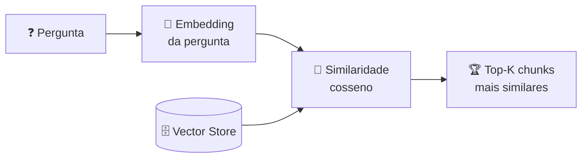

# 05 — RAG para Devs

> **Objetivo:** Entender o que é RAG, como funciona na prática, e como usar sua própria documentação técnica como contexto do modelo sem construir uma pipeline complexa.

---

## O Problema que RAG Resolve

O modelo foi treinado até uma data de corte — ele não conhece sua documentação interna, sua API privada, seu guia de arquitetura ou as decisões do seu time. Você tem duas opções:

1. **Incluir tudo no contexto** — funciona se o volume cabe na janela
2. **Recuperar só o relevante** — RAG faz isso automaticamente

RAG (Retrieval-Augmented Generation) é a técnica de buscar, dinamicamente, os trechos mais relevantes de uma base de conhecimento e incluí-los no contexto antes de gerar a resposta.



---

## Como Funciona: O Pipeline Básico

### Fase 1: Indexação (uma vez)



Cada chunk vira um vetor numérico que representa seu significado semântico.

### Fase 2: Busca (a cada pergunta)



### Fase 3: Geração (com contexto aumentado)

```markdown
[System prompt]
[Chunks recuperados da sua base de conhecimento]
[Pergunta do usuário]
→ Resposta do modelo
```

---

## Quando RAG é (e não é) a Resposta

| Situação | Abordagem recomendada |
|----------|----------------------|
| Documentação pequena (<50K tokens) | Inclua tudo no contexto — mais simples, maior fidelidade |
| Documentação média (50K–500K tokens) | RAG simples com busca semântica |
| Documentação grande (>500K tokens) | RAG com chunking e filtragem avançados |
| Informação que muda frequentemente | RAG (atualiza a base, não o sistema) |
| Informação estática e pequena | `CLAUDE.md` ou system prompt |
| Código-fonte de um repositório grande | Ferramentas especializadas (grep, AST search) |

> 📌 **Referência:** docs.anthropic.com/en/docs/build-with-claude/retrieval-augmented-generation

---

## RAG Sem Infraestrutura: Abordagem Prática

Antes de construir uma pipeline RAG completa, considere a versão manual — suficiente para muitos casos:

### Opção 1: Contexto Completo (para docs pequenas)

```bash
# Concatene sua documentação e inclua no contexto
cat docs/*.md | wc -c  # verifique o tamanho
# Se < 150K tokens (~600KB), inclua direto no contexto
```

### Opção 2: Busca com Grep (para código e docs)

```bash
# Encontre os trechos relevantes manualmente
grep -r "autenticação" docs/ --include="*.md" -l
grep -r "payment" src/ --include="*.py" -l

# Inclua apenas os arquivos encontrados no contexto
```

### Opção 3: RAG com Embeddings Locais

Para volumes maiores, um setup mínimo com Python:

```python
# pip install anthropic chromadb
import anthropic
import chromadb
from pathlib import Path

client = anthropic.Anthropic()
chroma = chromadb.Client()
collection = chroma.create_collection("docs")

# Indexação
def index_docs(docs_path: str) -> None:
    for path in Path(docs_path).glob("**/*.md"):
        content = path.read_text()
        chunks = content.split("\n\n")  # split por parágrafo
        for i, chunk in enumerate(chunks):
            if len(chunk) > 100:  # ignora chunks muito pequenos
                collection.add(
                    documents=[chunk],
                    ids=[f"{path.name}_{i}"]
                )

# Busca
def retrieve(query: str, n_results: int = 3) -> list[str]:
    results = collection.query(query_texts=[query], n_results=n_results)
    return results["documents"][0]

# Uso
index_docs("./docs")
chunks = retrieve("como funciona a autenticação JWT")
context = "\n\n---\n\n".join(chunks)

response = client.messages.create(
    model="claude-sonnet-4-6",
    max_tokens=1024,
    system=f"Use a documentação abaixo para responder:\n\n{context}",
    messages=[{"role": "user", "content": "Como funciona a autenticação JWT?"}]
)
print(response.content[0].text)
```

> 📌 **Referência:** docs.anthropic.com/en/docs/about-claude/models/overview

---

## Boas Práticas de Chunking

A qualidade do RAG depende muito de como os documentos são divididos em chunks.

| Estratégia | Como funciona | Melhor para |
|-----------|---------------|-------------|
| Por parágrafo | Split em `\n\n` | Documentação narrativa |
| Por seção | Split por `## ` | Documentação estruturada em Markdown |
| Por tamanho fixo | N tokens com overlap | PDFs e texto sem estrutura clara |
| Por função/classe | Parse de AST | Código-fonte |

**Overlap entre chunks:**

```python
# Chunk com overlap evita perda de contexto nas bordas
def chunk_with_overlap(text: str, chunk_size: int = 500, overlap: int = 100) -> list[str]:
    words = text.split()
    chunks = []
    for i in range(0, len(words), chunk_size - overlap):
        chunk = " ".join(words[i:i + chunk_size])
        chunks.append(chunk)
    return chunks
```

---

## Fontes de Documentação para RAG

### O que indexar no seu projeto

```markdown
✅ Indexar:
- Documentação de APIs internas (OpenAPI specs, Markdown)
- ADRs (Architecture Decision Records)
- Guias de contribuição e convenções
- README de módulos e bibliotecas internas
- Runbooks operacionais

❌ Não indexar:
- Código-fonte completo (use grep/AST tools)
- Logs e dados de produção (sensível + volume)
- Histórico de PRs e issues (ruído)
- Documentação de terceiros (já no training data)
```

### Documentação pública como contexto

Para bibliotecas que o modelo não conhece bem (nova, obscura, ou muito atualizada), inclua a documentação oficial diretamente:

```python
# Usando WebFetch para pegar documentação atualizada
import httpx

def fetch_docs(url: str) -> str:
    response = httpx.get(url)
    return response.text

# Inclua no system prompt ou no contexto do usuário
latest_docs = fetch_docs("https://docs.exemplo.com/api-reference")
```

---

## RAG vs Fine-tuning

Uma dúvida comum: quando usar RAG e quando fazer fine-tuning?

| | RAG | Fine-tuning |
|--|-----|-------------|
| **Para que serve** | Conhecimento específico e atualizado | Estilo, formato, comportamento |
| **Custo** | Baixo (inferência) | Alto (treinamento) |
| **Atualização** | Imediata (atualiza a base) | Exige novo treinamento |
| **Transparência** | Alta (fontes rastreáveis) | Baixa (conhecimento opaco) |
| **Melhor para** | Documentação, dados proprietários | Tom de voz, padrões de resposta |

Para a maioria dos casos de uso em desenvolvimento de software, RAG é a escolha certa.

> 📌 **Referência:** docs.anthropic.com/en/docs/build-with-claude/retrieval-augmented-generation

---

## Pipeline RAG com Claude: Exemplo Completo

```python
import anthropic
import chromadb
from pathlib import Path

def build_rag_pipeline(docs_dir: str):
    client = anthropic.Anthropic()
    chroma = chromadb.Client()
    collection = chroma.get_or_create_collection("project_docs")

    # Indexa documentos
    for path in Path(docs_dir).rglob("*.md"):
        text = path.read_text(encoding="utf-8")
        sections = [s for s in text.split("\n## ") if len(s) > 150]
        for i, section in enumerate(sections):
            collection.upsert(
                documents=[section],
                ids=[f"{path.stem}_{i}"],
                metadatas=[{"source": str(path)}]
            )

    def answer(question: str) -> str:
        # Recupera chunks relevantes
        results = collection.query(query_texts=[question], n_results=4)
        chunks = results["documents"][0]
        sources = [m["source"] for m in results["metadatas"][0]]

        context = "\n\n---\n\n".join(
            f"[Fonte: {src}]\n{chunk}"
            for src, chunk in zip(sources, chunks)
        )

        response = client.messages.create(
            model="claude-sonnet-4-6",
            max_tokens=2048,
            system=(
                "Você é um assistente técnico com acesso à documentação do projeto. "
                "Responda com base nos trechos fornecidos. "
                "Se a informação não estiver nos trechos, diga explicitamente.\n\n"
                f"Documentação relevante:\n\n{context}"
            ),
            messages=[{"role": "user", "content": question}]
        )
        return response.content[0].text

    return answer

# Uso
ask = build_rag_pipeline("./docs")
print(ask("Como autenticar requisições na API?"))
```

---

## ✅ Pontos-chave do Capítulo

- RAG resolve o problema de base de conhecimento maior que a janela de contexto
- O pipeline tem 3 etapas: indexação (one-time), busca semântica (por pergunta) e geração com contexto aumentado
- Para documentação pequena (<50K tokens), inclua tudo no contexto — mais simples e maior fidelidade
- Chunking bem feito (por seção, com overlap) é crítico para a qualidade do RAG
- RAG é para conhecimento específico e atualizado; fine-tuning é para comportamento e estilo
- Indexe ADRs, specs de API e guias internos — não código-fonte completo ou dados de produção

---

## 🔗 Próxima Seção

👉 [Exercícios do Capítulo 03](./06-exercicios.md)
