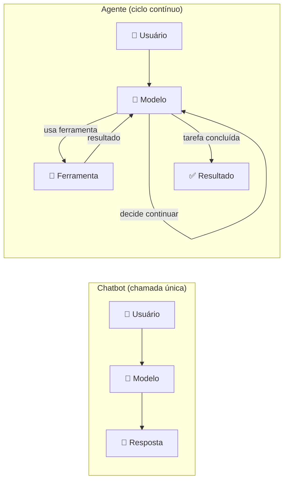
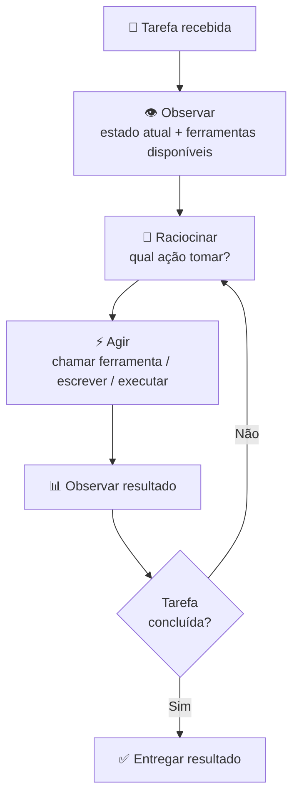
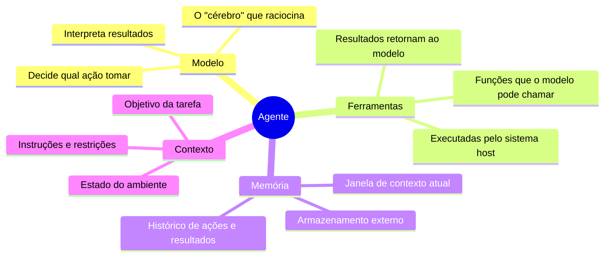
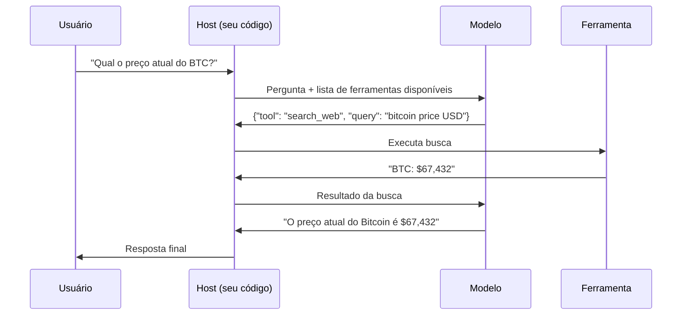

# 01 — O que São Agentes de IA

> **Objetivo:** Entender o que define um agente de IA, como ele difere de um chatbot ou de uma chamada simples de API, e qual o loop de execução que governa seu comportamento.

---

## A Diferença Fundamental

Um chatbot responde. Um agente **age**.

A distinção não é de interface — é de arquitetura. Um agente pode executar múltiplos passos, usar ferramentas externas, observar o resultado das ações e decidir o que fazer a seguir, tudo dentro de um ciclo autônomo.



---

## Definição: O que Faz um Agente

Um agente de IA é um sistema onde o modelo de linguagem **controla o fluxo de execução** de uma tarefa. Isso implica:

| Característica | Chatbot | Agente |
|---------------|:-------:|:------:|
| Múltiplos passos | ❌ | ✅ |
| Usa ferramentas externas | ❌ | ✅ |
| Observa resultados e reage | ❌ | ✅ |
| Toma decisões intermediárias | ❌ | ✅ |
| Loop autônomo de execução | ❌ | ✅ |
| Risco de ações com efeito colateral | ❌ | ✅ |

> 📌 **Referência:** anthropic.com/research/building-effective-agents

---

## O Loop de Execução

Todo agente opera em alguma variação deste ciclo fundamental:



Este ciclo — chamado de **ReAct** (Reasoning + Acting) — é a base da maioria dos agentes práticos.

> 📌 **Referência:** docs.anthropic.com/en/docs/build-with-claude/agents-and-tools/agents-overview

---

## Componentes de um Agente



### O modelo não executa ferramentas diretamente

Um ponto crítico de entender: o modelo **declara** a intenção de usar uma ferramenta. O sistema host (seu código) **executa** a ferramenta e devolve o resultado ao modelo.



---

## Quando Usar Agentes

Agentes adicionam complexidade. Nem toda tarefa precisa de um agente.

### Use agentes quando:

```markdown
✅ A tarefa tem múltiplos passos que dependem de resultados anteriores
✅ Você precisa consultar sistemas externos (DB, API, arquivos)
✅ O caminho para a solução não é determinístico de antemão
✅ A tarefa requer tomada de decisão intermediária
✅ O trabalho pode ser paralelizado com subagentes
```

### Não use agentes quando:

```markdown
❌ Uma chamada simples de API resolve o problema
❌ O fluxo é fixo e previsível (use código normal)
❌ Erros têm consequências irreversíveis graves (ex.: deleção em produção sem supervisão)
❌ A latência de múltiplas chamadas ao modelo é inaceitável
❌ O custo de tokens de um loop agêntico não justifica o ganho
```

---

## Exemplos Práticos no Desenvolvimento

| Tarefa | Abordagem |
|--------|-----------|
| "Explique esta função" | Chatbot — uma chamada |
| "Refatore este módulo inteiro" | Agente — lê arquivos, edita, valida |
| "Implemente a feature X com testes" | Agente — planeja, coda, roda testes, corrige |
| "Analise o repo e identifique vulnerabilidades" | Agente — navega arquivos, busca padrões, agrega |
| "Faça o deploy desta feature" | Agente com supervisão humana |

---

## Agentes na Prática: Claude Code

O Claude Code é um exemplo direto de agente de desenvolvimento. Ele:
1. Recebe uma tarefa do usuário
2. Usa ferramentas (ler arquivos, executar código, editar arquivos, buscar na web)
3. Observa os resultados
4. Itera até concluir
5. Pede aprovação humana quando necessário

Quando você diz `> Implemente testes para o módulo auth`, o Claude Code não responde — ele age.

> 📌 **Referência:** docs.anthropic.com/en/docs/claude-code/overview

---

## ✅ Pontos-chave do Capítulo

- Agentes diferem de chatbots porque controlam o fluxo de execução via loop autônomo
- O ciclo fundamental é: Observar → Raciocinar → Agir → Observar resultado → repetir
- O modelo declara intenções; o host executa ferramentas e devolve resultados
- Agentes são justificados para tarefas multi-passo, não-determinísticas e que requerem ferramentas externas
- Complexidade extra exige responsabilidade extra: agentes com ações irreversíveis precisam de supervisão

---

## 🔗 Próxima Aula

👉 [02 — Topologias de Agentes](./02-topologias-de-agentes.md)
