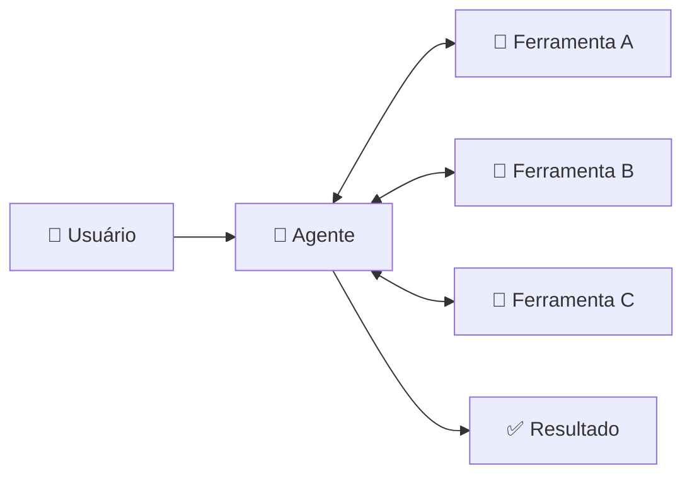
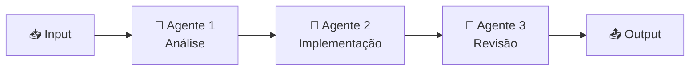
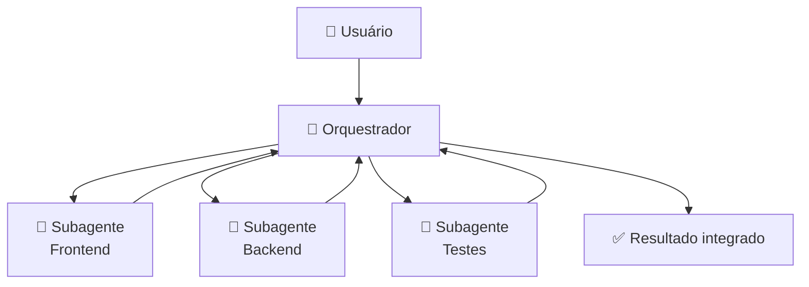
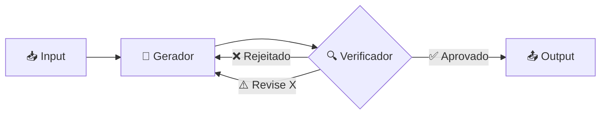
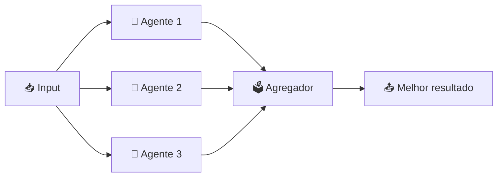
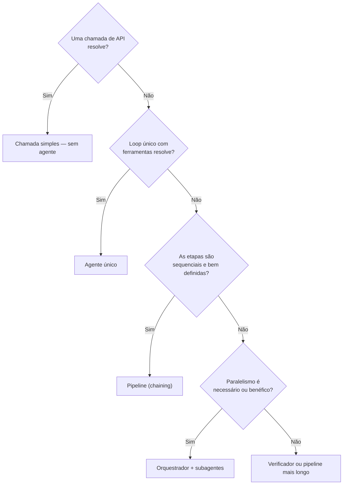

# 02 — Topologias de Agentes

> **Objetivo:** Conhecer os padrões arquiteturais de sistemas agênticos — de um único agente a redes complexas — e saber quando aplicar cada topologia.

---

## Por que Topologia Importa

Um agente único resolve muitas tarefas. Mas tarefas complexas, longas ou paralelizáveis se beneficiam de múltiplos agentes com responsabilidades distintas. A topologia define como esses agentes se organizam e se comunicam.

A regra prática: **comece com o mais simples que resolve o problema**. Complexidade de topologia tem custo real em depuração, custo de tokens e latência.

> 📌 **Referência:** anthropic.com/research/building-effective-agents

---

## Topologia 1: Agente Único

O modelo opera em loop sozinho, com acesso a um conjunto de ferramentas.



**Quando usar:**
- Tarefa com um único domínio de responsabilidade
- Volume de contexto cabe em uma única janela
- Sem necessidade de paralelismo

**Exemplos:** Claude Code em uma única tarefa, assistente de code review, gerador de documentação.

---

## Topologia 2: Prompt Chaining (Pipeline)

A saída de um modelo vira entrada do próximo. Cada etapa tem um prompt especializado.



**Quando usar:**
- Tarefa pode ser dividida em etapas sequenciais bem definidas
- Cada etapa tem critérios claros de entrada e saída
- Qualidade melhora com especialização por etapa

**Exemplo prático:**

```
Etapa 1: Analise os requisitos → gere especificação técnica
Etapa 2: Especificação → gere código
Etapa 3: Código → gere testes
Etapa 4: Testes → gere documentação
```

**Vantagem sobre agente único:** cada modelo recebe contexto limpo e especializado, sem o ruído do histórico completo.

---

## Topologia 3: Orquestrador + Subagentes

Um agente orquestrador divide a tarefa e delega para subagentes especializados. Os subagentes reportam de volta ao orquestrador.



**Quando usar:**
- Tarefa muito grande para um único contexto
- Subtarefas têm domínios de conhecimento distintos
- Paralelismo reduz tempo total significativamente

**Responsabilidades do orquestrador:**
- Decompor a tarefa em subtarefas
- Alocar contexto relevante para cada subagente
- Integrar os resultados
- Resolver conflitos ou inconsistências

**Responsabilidades do subagente:**
- Executar a subtarefa com o contexto recebido
- Retornar resultado estruturado
- Não tomar decisões fora do seu escopo

---

## Topologia 4: Verificador (Checker)

Um agente executa; outro verifica. O verificador pode aprovar, rejeitar ou solicitar revisão.



**Quando usar:**
- Alta exigência de qualidade ou correção
- O gerador tende a cometer erros específicos previsíveis
- Custo de revisão humana é alto

**Exemplo:** gerador escreve código → verificador roda os testes e inspeciona a cobertura → se falhar, devolve com diagnóstico.

**Cuidado:** loops de geração/verificação podem ser infinitos. Defina um número máximo de iterações.

---

## Topologia 5: Paralelização com Votação

Múltiplos agentes independentes resolvem o mesmo problema. Um agregador combina ou escolhe o melhor resultado.



**Quando usar:**
- Alta variabilidade nas respostas individuais
- Problema tem solução objetivamente verificável (ex.: testes)
- Custo de rodadas extras é menor que o custo de erros

**Exemplos:** múltiplas implementações → escolhe a que passa mais testes; múltiplas revisões de segurança → agrega os achados.

---

## Comparativo de Topologias

| Topologia | Complexidade | Paralelismo | Melhor para |
|-----------|:-----------:|:-----------:|-------------|
| Agente único | ⭐ | ❌ | Tarefas simples e focadas |
| Pipeline (chaining) | ⭐⭐ | ❌ | Tarefas sequenciais com etapas definidas |
| Orquestrador + subagentes | ⭐⭐⭐ | ✅ | Tarefas grandes e paralelizáveis |
| Verificador | ⭐⭐ | ❌ | Alta exigência de qualidade |
| Paralelização + votação | ⭐⭐⭐ | ✅ | Alta variabilidade, resultado verificável |

---

## Princípio de Design: Menor Topologia Suficiente



Cada nível acima do anterior adiciona: mais chamadas ao modelo, mais tokens, mais pontos de falha, mais custo de depuração.

---

## ✅ Pontos-chave do Capítulo

- Existem 5 topologias principais: agente único, pipeline, orquestrador+subagentes, verificador e paralelização com votação
- Comece sempre com a topologia mais simples que resolve o problema
- Orquestrador+subagentes é ideal para tarefas grandes que excedem uma janela de contexto
- Verificadores aumentam qualidade mas podem criar loops infinitos — sempre defina um limite de iterações
- Paralelização com votação compensa a variabilidade dos modelos quando o custo extra vale a confiabilidade

---

## 🔗 Próxima Aula

👉 [03 — Multi-Agent Workflows](./03-multi-agent-workflows.md)
