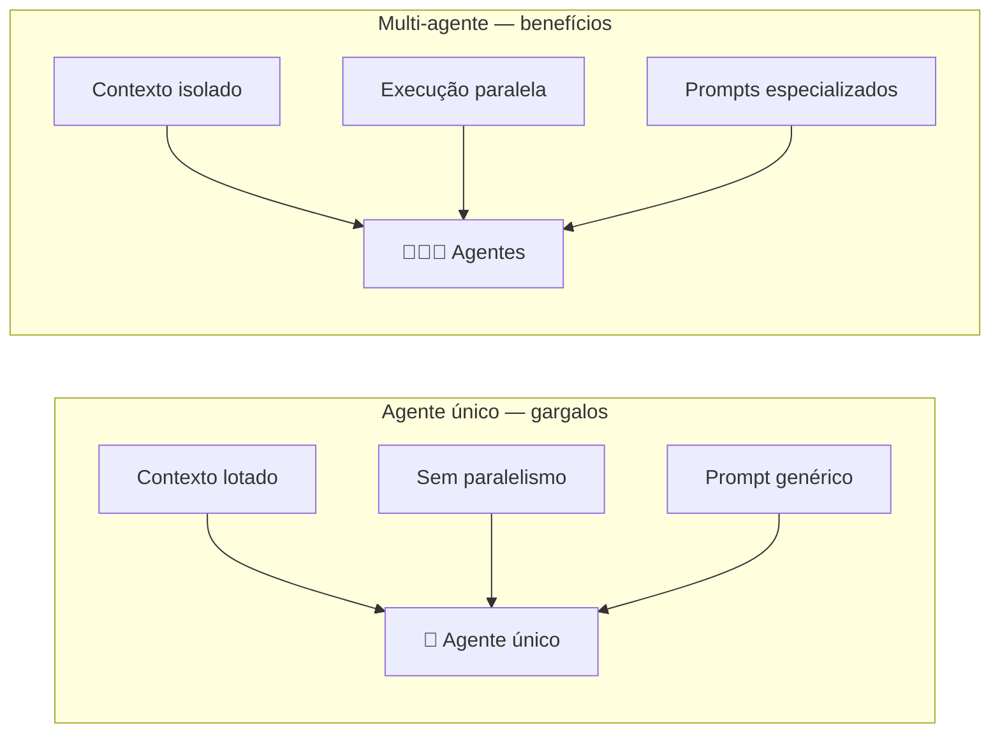
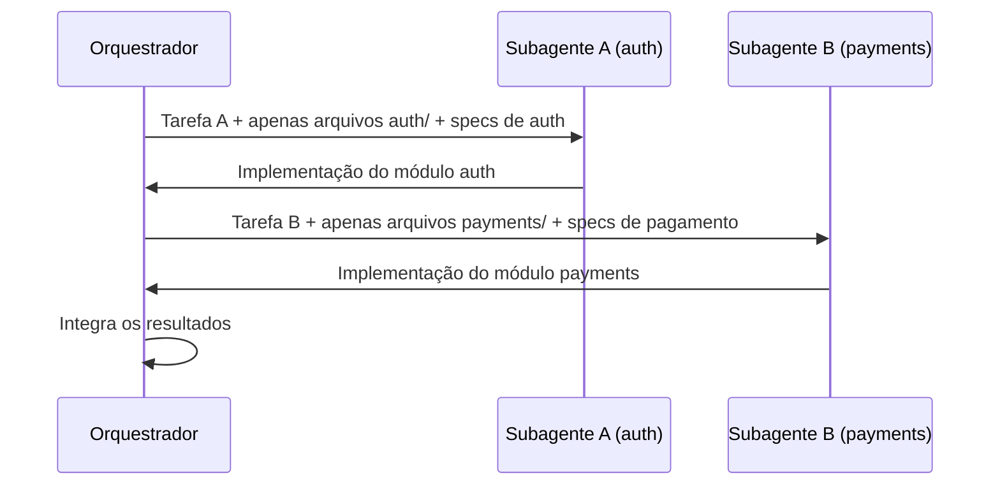
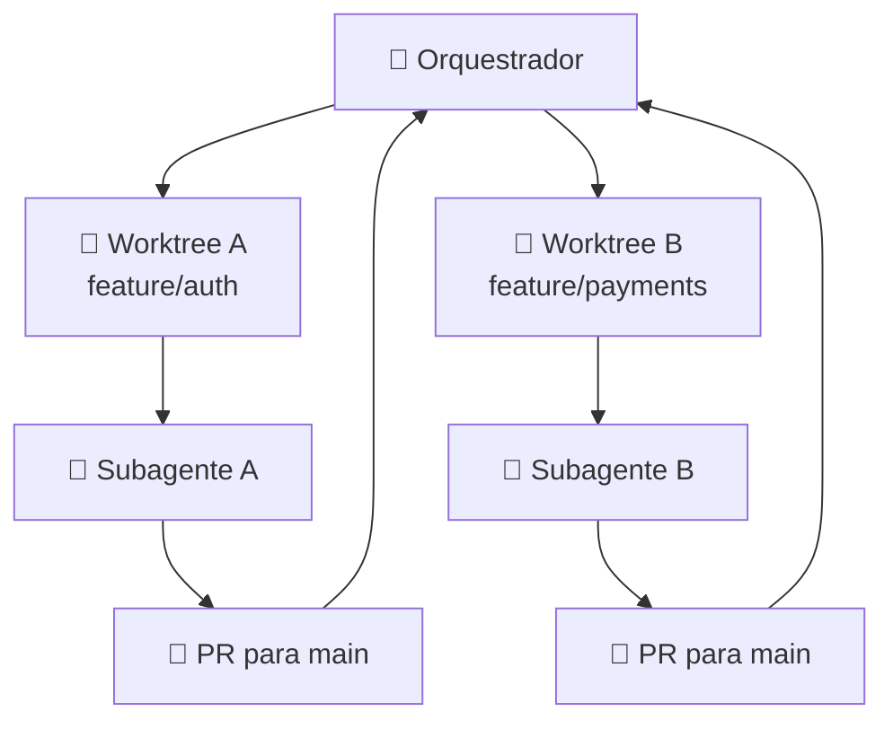
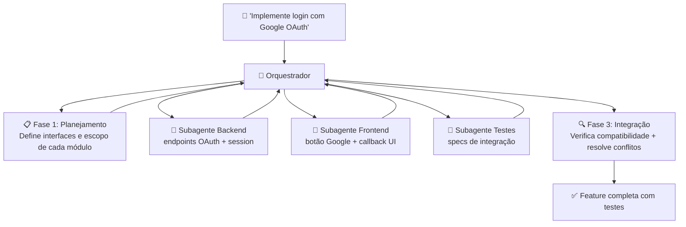

# 03 — Multi-Agent Workflows

> **Objetivo:** Aprender a projetar fluxos com múltiplos agentes — como delegar tarefas, isolar contexto, usar paralelismo e integrar resultados sem perder coerência.

---

## Por que Múltiplos Agentes

Três razões principais justificam sistemas multi-agente:

1. **Tarefas longas demais** para uma janela de contexto única
2. **Domínios distintos** que se beneficiam de prompts especializados
3. **Paralelismo** que reduz tempo total de execução



> 📌 **Referência:** anthropic.com/research/building-effective-agents

---

## Padrão 1: Delegação com Contexto Cirúrgico

O orquestrador não passa o contexto inteiro para cada subagente — passa apenas o que aquele subagente precisa.



**Por que isso importa:** subagentes com contexto cirúrgico produzem respostas mais precisas, custam menos tokens e têm menos risco de "contaminar" decisões entre domínios.

---

## Padrão 2: Execução Paralela

Quando subtarefas são independentes, execute em paralelo. O tempo total será o da tarefa mais longa, não a soma de todas.

```mermaid
gantt
    title Paralelo vs Sequencial (exemplo: 3 módulos)
    dateFormat  s
    axisFormat %Ss

    section Sequencial
    Módulo A     :a1, 0, 3s
    Módulo B     :a2, after a1, 3s
    Módulo C     :a3, after a2, 3s

    section Paralelo
    Módulo A     :b1, 0, 3s
    Módulo B     :b2, 0, 3s
    Módulo C     :b3, 0, 3s
```



Sequencial: 9s. Paralelo: 3s.

**Em Python com asyncio e Anthropic SDK:**

```python
import asyncio
import anthropic

client = anthropic.AsyncAnthropic()

async def run_subagent(task: str, context: str) -> str:
    response = await client.messages.create(
        model="claude-sonnet-4-6",
        max_tokens=4096,
        system=f"Você é um especialista em desenvolvimento de software.\n\nContexto do projeto:\n{context}",
        messages=[{"role": "user", "content": task}]
    )
    return response.content[0].text

async def run_parallel_agents(subtasks: list[dict]) -> list[str]:
    tasks = [
        run_subagent(st["task"], st["context"])
        for st in subtasks
    ]
    return await asyncio.gather(*tasks)

# Uso
subtasks = [
    {"task": "Implemente o módulo de autenticação JWT", "context": "...contexto auth..."},
    {"task": "Implemente o módulo de pagamentos", "context": "...contexto payments..."},
    {"task": "Implemente os testes de integração", "context": "...contexto testes..."},
]

results = asyncio.run(run_parallel_agents(subtasks))
```

> 📌 **Referência:** docs.anthropic.com/en/docs/about-claude/models/overview

---

## Padrão 3: Handoff Estruturado

Quando subagentes executam em sequência, o resultado de um precisa ser passado de forma estruturada para o próximo.

```python
from dataclasses import dataclass

@dataclass
class AgentResult:
    status: str          # "success" | "error" | "needs_review"
    output: str          # o resultado principal
    artifacts: list[str] # arquivos criados/modificados
    notes: str           # observações para o próximo agente

def build_handoff_prompt(previous: AgentResult, next_task: str) -> str:
    return f"""
Contexto do passo anterior:
- Status: {previous.status}
- Output: {previous.output}
- Artefatos gerados: {', '.join(previous.artifacts)}
- Observações: {previous.notes}

Sua tarefa: {next_task}
"""
```

---

## Padrão 4: Subagente com Worktree Isolado

Para tarefas que modificam arquivos (código, documentação), cada subagente opera em um worktree Git separado. Isso evita conflitos e permite paralelismo sem colisão.



O Claude Code usa este padrão nativamente quando você cria subagentes com `isolation: "worktree"`.

> 📌 **Referência:** docs.anthropic.com/en/docs/claude-code/sub-agents

---

## Gerenciando Coerência entre Agentes

O principal risco de sistemas multi-agente é a **incoerência**: dois subagentes tomando decisões incompatíveis porque não compartilham contexto.

### Estratégias de coerência

| Estratégia | Mecanismo | Custo |
|-----------|-----------|-------|
| Contexto compartilhado no orquestrador | Passa decisões críticas para todos os subagentes | Tokens extras por subagente |
| Contrato de interface | Define interfaces antes de implementar | Overhead de planejamento |
| Verificação pós-execução | Orquestrador verifica compatibilidade ao integrar | Possível retrabalho |
| Agente verificador dedicado | Agente especializado em detectar inconsistências | Custo adicional de um agente |

### Definindo contratos de interface antes de paralelizar

```markdown
Antes de delegar para subagentes paralelos:

"Antes de implementar, os subagentes precisam acordar as interfaces.
Defina as assinaturas de funções públicas que cada módulo vai expor,
sem implementar ainda. Subagente A define o que vai chamar do B;
Subagente B define o que vai chamar do A."
```

---

## Fluxo Completo: Exemplo de Feature com Multi-Agentes



---

## Quando Multi-Agente Não Vale

```markdown
❌ Overhead maior que o ganho:
- Tarefa leva 2min com agente único, 3min com multi-agente (overhead de coordenação)

❌ Dependências sequenciais eliminam o paralelismo:
- Se B precisa do resultado de A, não há ganho em paralelo

❌ Contexto compartilhado muito grande:
- Se todos os subagentes precisam do mesmo contexto enorme, você não economizou tokens

❌ Depuração muito complexa:
- Falha em sistema multi-agente é mais difícil de rastrear do que em agente único
```

---

## ✅ Pontos-chave do Capítulo

- Passe contexto cirúrgico para cada subagente — apenas o que aquele agente precisa
- Paralelize subtarefas independentes: o tempo total é o da tarefa mais longa, não a soma
- Use handoff estruturado (status, output, artefatos, notas) para transferências entre agentes sequenciais
- Defina interfaces antes de paralelizar para garantir coerência entre subagentes
- Multi-agente não é sempre melhor — meça o overhead de coordenação versus o ganho real

---

## 🔗 Próxima Aula

👉 [04 — Ferramentas e Tool Use](./04-ferramentas-e-tool-use.md)
