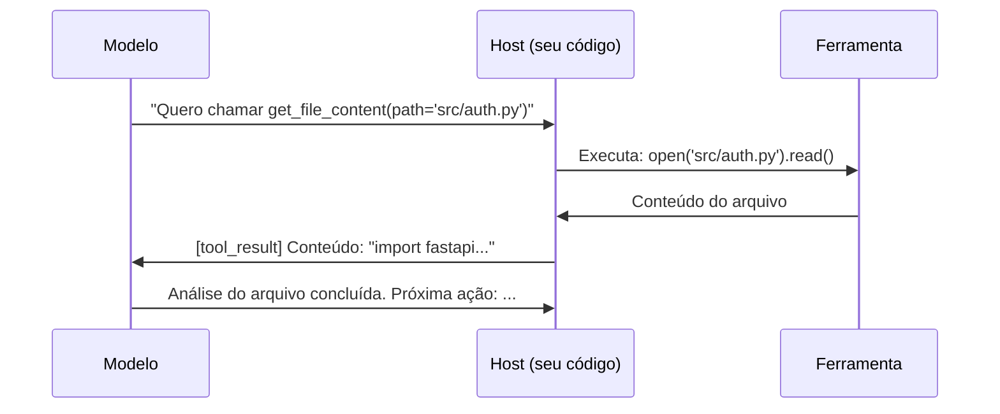
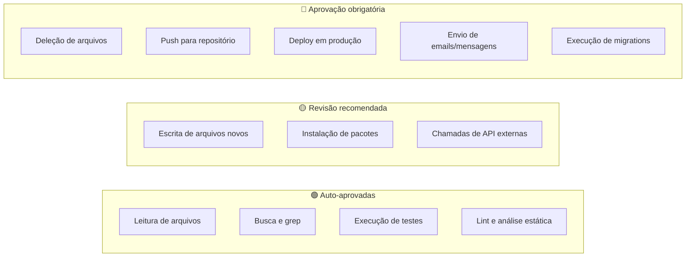

# 04 — Ferramentas e Tool Use

> **Objetivo:** Entender como agentes usam ferramentas (tool use / function calling), como implementar ferramentas customizadas e quais padrões governam a aprovação humana de ações.

---

## O que é Tool Use

Tool use (também chamado de function calling) é o mecanismo pelo qual um modelo declara que quer chamar uma função externa. O sistema host executa a função e devolve o resultado.

O modelo não executa código — ele descreve o que quer fazer. Você executa.



> 📌 **Referência:** docs.anthropic.com/en/docs/build-with-claude/tool-use

---

## Definindo Ferramentas

Cada ferramenta tem: nome, descrição e schema de parâmetros. A descrição é crítica — é o que o modelo lê para decidir se e como usar a ferramenta.

```python
import anthropic

tools = [
    {
        "name": "read_file",
        "description": (
            "Lê o conteúdo de um arquivo do sistema de arquivos. "
            "Use quando precisar analisar código existente, ler configurações ou "
            "inspecionar qualquer arquivo de texto. Retorna o conteúdo como string."
        ),
        "input_schema": {
            "type": "object",
            "properties": {
                "path": {
                    "type": "string",
                    "description": "Caminho relativo ao diretório do projeto (ex: 'src/auth.py')"
                }
            },
            "required": ["path"]
        }
    },
    {
        "name": "write_file",
        "description": (
            "Escreve ou substitui o conteúdo de um arquivo. "
            "Use para criar novos arquivos ou modificar existentes. "
            "ATENÇÃO: sobrescreve o arquivo inteiro — inclua o conteúdo completo."
        ),
        "input_schema": {
            "type": "object",
            "properties": {
                "path": {"type": "string", "description": "Caminho do arquivo"},
                "content": {"type": "string", "description": "Conteúdo completo a escrever"}
            },
            "required": ["path", "content"]
        }
    },
    {
        "name": "run_tests",
        "description": "Executa a suite de testes do projeto. Retorna stdout, stderr e código de saída.",
        "input_schema": {
            "type": "object",
            "properties": {
                "path": {
                    "type": "string",
                    "description": "Caminho específico de testes (opcional). Vazio = todos os testes.",
                    "default": ""
                }
            }
        }
    }
]
```

---

## Loop de Tool Use: Implementação Completa

```python
import subprocess
from pathlib import Path
import anthropic

client = anthropic.Anthropic()

def read_file(path: str) -> str:
    try:
        return Path(path).read_text(encoding="utf-8")
    except FileNotFoundError:
        return f"Erro: arquivo '{path}' não encontrado"

def write_file(path: str, content: str) -> str:
    Path(path).parent.mkdir(parents=True, exist_ok=True)
    Path(path).write_text(content, encoding="utf-8")
    return f"Arquivo '{path}' escrito com sucesso ({len(content)} chars)"

def run_tests(path: str = "") -> str:
    cmd = ["python", "-m", "pytest", path, "-v"] if path else ["python", "-m", "pytest", "-v"]
    result = subprocess.run(cmd, capture_output=True, text=True, timeout=60)
    return f"Exit code: {result.returncode}\n{result.stdout}\n{result.stderr}"

TOOL_HANDLERS = {
    "read_file": lambda args: read_file(args["path"]),
    "write_file": lambda args: write_file(args["path"], args["content"]),
    "run_tests": lambda args: run_tests(args.get("path", "")),
}

def run_agent(task: str, max_iterations: int = 10) -> str:
    messages = [{"role": "user", "content": task}]

    for _ in range(max_iterations):
        response = client.messages.create(
            model="claude-sonnet-4-6",
            max_tokens=4096,
            tools=tools,
            messages=messages
        )

        # Adiciona resposta do modelo ao histórico
        messages.append({"role": "assistant", "content": response.content})

        # Tarefa concluída
        if response.stop_reason == "end_turn":
            return next(
                (b.text for b in response.content if hasattr(b, "text")),
                "Tarefa concluída."
            )

        # Executa ferramentas solicitadas
        if response.stop_reason == "tool_use":
            tool_results = []
            for block in response.content:
                if block.type == "tool_use":
                    handler = TOOL_HANDLERS.get(block.name)
                    if handler:
                        result = handler(block.input)
                    else:
                        result = f"Ferramenta '{block.name}' não reconhecida"

                    tool_results.append({
                        "type": "tool_result",
                        "tool_use_id": block.id,
                        "content": result
                    })

            messages.append({"role": "user", "content": tool_results})

    return "Limite de iterações atingido."
```

> 📌 **Referência:** docs.anthropic.com/en/docs/build-with-claude/tool-use/implement-tool-use

---

## Boas Práticas de Descrição de Ferramentas

A descrição determina se o modelo vai usar a ferramenta corretamente.

| ❌ Descrição ruim | ✅ Descrição boa |
|------------------|-----------------|
| "Lê um arquivo" | "Lê o conteúdo de um arquivo de texto do disco. Use para inspecionar código, configs ou qualquer arquivo antes de modificar." |
| "Escreve arquivo" | "Escreve conteúdo em um arquivo, criando-o se não existir. ATENÇÃO: sobrescreve o arquivo inteiro. Inclua o conteúdo completo, não apenas as mudanças." |
| "Executa algo" | "Executa um comando shell no diretório do projeto. Retorna stdout, stderr e código de saída. Use apenas para comandos de leitura ou build — nunca para deleção." |

---

## Aprovação Humana: O Padrão de Interrupção

Nem toda ação deve ser executada automaticamente. Para ações com efeito colateral irreversível, implemente aprovação humana.

```python
ACTIONS_REQUIRING_APPROVAL = {
    "delete_file",
    "run_migration",
    "deploy",
    "send_email",
    "push_to_remote",
}

def execute_with_approval(tool_name: str, tool_args: dict) -> str:
    if tool_name in ACTIONS_REQUIRING_APPROVAL:
        print(f"\n⚠️  Aprovação necessária:")
        print(f"   Ferramenta: {tool_name}")
        print(f"   Argumentos: {tool_args}")
        confirm = input("   Executar? (s/N): ").strip().lower()
        if confirm != "s":
            return f"Ação '{tool_name}' cancelada pelo usuário."

    handler = TOOL_HANDLERS.get(tool_name)
    if not handler:
        return f"Ferramenta '{tool_name}' não encontrada"
    return handler(tool_args)
```

### Classificação de ações por risco



---

## Ferramentas Mais Comuns em Desenvolvimento

| Ferramenta | Uso típico | Risco |
|-----------|-----------|:-----:|
| `read_file` | Inspecionar código e configs | 🟢 Baixo |
| `list_files` | Explorar estrutura do projeto | 🟢 Baixo |
| `search_code` | Buscar padrões com grep/ripgrep | 🟢 Baixo |
| `run_tests` | Executar suite de testes | 🟢 Baixo |
| `write_file` | Criar ou modificar arquivos | 🟡 Médio |
| `run_command` | Executar comandos shell | 🟡 Médio |
| `call_api` | Chamar APIs externas | 🟡 Médio |
| `delete_file` | Remover arquivos | 🔴 Alto |
| `git_push` | Enviar commits ao remoto | 🔴 Alto |

---

## Tool Use com Streaming (para UX mais responsiva)

```python
with client.messages.stream(
    model="claude-sonnet-4-6",
    max_tokens=4096,
    tools=tools,
    messages=messages
) as stream:
    for event in stream:
        if hasattr(event, "type"):
            if event.type == "content_block_start":
                if hasattr(event.content_block, "name"):
                    print(f"\n🔧 Usando ferramenta: {event.content_block.name}")
            elif event.type == "text":
                print(event.text, end="", flush=True)
```

> 📌 **Referência:** docs.anthropic.com/en/docs/build-with-claude/tool-use/streaming-with-tool-use

---

## ✅ Pontos-chave do Capítulo

- Tool use é o mecanismo pelo qual o modelo declara intenções — você executa as ferramentas
- A descrição da ferramenta determina se o modelo vai usá-la corretamente — invista nela
- Implemente um loop de até N iterações que processa tool_use e end_turn adequadamente
- Classifique ações por risco e adicione aprovação humana para ações irreversíveis
- Ações de leitura podem ser auto-aprovadas; deleção, push e deploy exigem confirmação humana

---

## 🔗 Próxima Aula

👉 [05 — Loops Agênticos](./05-loops-agenticos.md)
