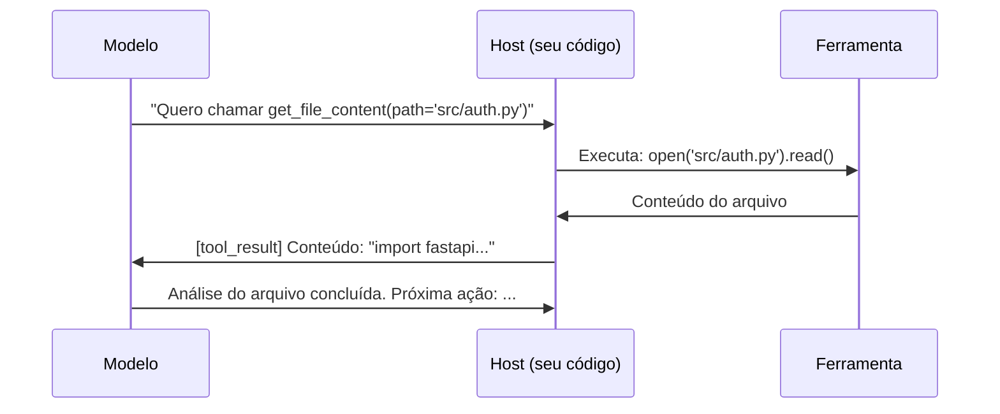
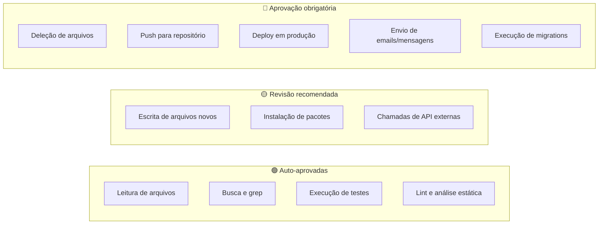

# 04 — Ferramentas e Tool Use

> **Objetivo:** Entender como agentes usam ferramentas (tool use / function calling), como implementar ferramentas customizadas e quais padrões governam a aprovação humana de ações.

---

## O que é Tool Use

Tool use (também chamado de function calling) é o mecanismo pelo qual um modelo declara que quer chamar uma função externa. O sistema host executa a função e devolve o resultado.

O modelo não executa código — ele descreve o que quer fazer. Você executa.



> 📌 **Referência:** docs.anthropic.com/en/docs/build-with-claude/tool-use

---

## Definindo Ferramentas

Cada ferramenta tem: nome, descrição e schema de parâmetros. A descrição é crítica — é o que o modelo lê para decidir se e como usar a ferramenta.

```java
// pom.xml:
// <dependency>
//   <groupId>com.anthropic</groupId>
//   <artifactId>anthropic-java</artifactId>
//   <version>1.3.0</version>
// </dependency>

import com.anthropic.client.Anthropic;
import com.anthropic.client.okhttp.AnthropicOkHttpClient;
import com.anthropic.models.messages.*;
import java.util.*;

List<ToolParam> tools = List.of(
    ToolParam.builder()
        .name("read_file")
        .description(
            "Lê o conteúdo de um arquivo do sistema de arquivos. " +
            "Use quando precisar analisar código existente, ler configurações ou " +
            "inspecionar qualquer arquivo de texto. Retorna o conteúdo como string."
        )
        .inputSchema(ToolParam.InputSchema.builder()
            .type(ToolParam.InputSchema.Type.OBJECT)
            .properties(Map.of(
                "path", Map.of(
                    "type", "string",
                    "description", "Caminho relativo ao projeto (ex: 'src/Auth.java')"
                )
            ))
            .required(List.of("path"))
            .build())
        .build(),
    ToolParam.builder()
        .name("write_file")
        .description(
            "Escreve ou substitui o conteúdo de um arquivo. " +
            "Use para criar novos arquivos ou modificar existentes. " +
            "ATENÇÃO: sobrescreve o arquivo inteiro — inclua o conteúdo completo."
        )
        .inputSchema(ToolParam.InputSchema.builder()
            .type(ToolParam.InputSchema.Type.OBJECT)
            .properties(Map.of(
                "path",    Map.of("type", "string", "description", "Caminho do arquivo"),
                "content", Map.of("type", "string", "description", "Conteúdo completo a escrever")
            ))
            .required(List.of("path", "content"))
            .build())
        .build(),
    ToolParam.builder()
        .name("run_tests")
        .description("Executa a suite de testes do projeto. Retorna stdout e código de saída.")
        .inputSchema(ToolParam.InputSchema.builder()
            .type(ToolParam.InputSchema.Type.OBJECT)
            .properties(Map.of(
                "path", Map.of(
                    "type", "string",
                    "description", "Caminho específico de testes (opcional). Vazio = todos os testes.",
                    "default", ""
                )
            ))
            .build())
        .build()
);
```

---

## Loop de Tool Use: Implementação Completa

```java
import com.anthropic.client.Anthropic;
import com.anthropic.client.okhttp.AnthropicOkHttpClient;
import com.anthropic.models.messages.*;
import java.io.*;
import java.nio.file.*;
import java.util.*;
import java.util.function.Function;

public class ToolAgent {

    private static final Anthropic client = AnthropicOkHttpClient.fromEnv();

    static String readFile(String path) {
        try {
            return Files.readString(Path.of(path));
        } catch (IOException e) {
            return "Erro: arquivo '" + path + "' não encontrado";
        }
    }

    static String writeFile(String path, String content) {
        try {
            Path p = Path.of(path);
            Files.createDirectories(p.getParent());
            Files.writeString(p, content);
            return "Arquivo '" + path + "' escrito (" + content.length() + " chars)";
        } catch (IOException e) {
            return "Erro: " + e.getMessage();
        }
    }

    static String runTests(String path) {
        try {
            List<String> cmd = path.isEmpty()
                ? List.of("mvn", "test")
                : List.of("mvn", "test", "-Dtest=" + path);
            Process proc = new ProcessBuilder(cmd).redirectErrorStream(true).start();
            String out = new String(proc.getInputStream().readAllBytes());
            return "Exit code: " + proc.waitFor() + "\n" + out;
        } catch (Exception e) {
            return "Erro: " + e.getMessage();
        }
    }

    @SuppressWarnings("unchecked")
    static final Map<String, Function<Map<String, Object>, String>> TOOL_HANDLERS = Map.of(
        "read_file",  args -> readFile((String) args.get("path")),
        "write_file", args -> writeFile((String) args.get("path"), (String) args.get("content")),
        "run_tests",  args -> runTests((String) args.getOrDefault("path", ""))
    );

    @SuppressWarnings("unchecked")
    static String runAgent(String task, int maxIterations) {
        List<MessageParam> messages = new ArrayList<>(List.of(
            MessageParam.builder().role(MessageParam.Role.USER).content(task).build()
        ));

        for (int i = 0; i < maxIterations; i++) {
            Message response = client.messages().create(
                MessageCreateParams.builder()
                    .model(Model.CLAUDE_SONNET_4_6)
                    .maxTokens(4096L)
                    .tools(tools)
                    .messages(messages)
                    .build()
            );

            messages.add(MessageParam.builder()
                .role(MessageParam.Role.ASSISTANT)
                .content(response.content())
                .build());

            if (response.stopReason() == StopReason.END_TURN) {
                return response.content().stream()
                    .filter(ContentBlock::isText)
                    .map(b -> b.asText().text())
                    .findFirst()
                    .orElse("Tarefa concluída.");
            }

            if (response.stopReason() == StopReason.TOOL_USE) {
                List<ContentBlockParam> toolResults = new ArrayList<>();
                for (ContentBlock block : response.content()) {
                    if (block.isToolUse()) {
                        ToolUseBlock use = block.asToolUse();
                        var handler = TOOL_HANDLERS.get(use.name());
                        String result = handler != null
                            ? handler.apply((Map<String, Object>) use.input())
                            : "Ferramenta '" + use.name() + "' não reconhecida";
                        toolResults.add(ContentBlockParam.ofToolResult(
                            ToolResultBlockParam.builder()
                                .toolUseId(use.id())
                                .content(result)
                                .build()
                        ));
                    }
                }
                messages.add(MessageParam.builder()
                    .role(MessageParam.Role.USER)
                    .content(toolResults)
                    .build());
            }
        }
        return "Limite de iterações atingido.";
    }
}
```

> 📌 **Referência:** docs.anthropic.com/en/docs/build-with-claude/tool-use/implement-tool-use

---

## Boas Práticas de Descrição de Ferramentas

A descrição determina se o modelo vai usar a ferramenta corretamente.

| ❌ Descrição ruim | ✅ Descrição boa |
|------------------|-----------------|
| "Lê um arquivo" | "Lê o conteúdo de um arquivo de texto do disco. Use para inspecionar código, configs ou qualquer arquivo antes de modificar." |
| "Escreve arquivo" | "Escreve conteúdo em um arquivo, criando-o se não existir. ATENÇÃO: sobrescreve o arquivo inteiro. Inclua o conteúdo completo, não apenas as mudanças." |
| "Executa algo" | "Executa um comando shell no diretório do projeto. Retorna stdout, stderr e código de saída. Use apenas para comandos de leitura ou build — nunca para deleção." |

---

## Aprovação Humana: O Padrão de Interrupção

Nem toda ação deve ser executada automaticamente. Para ações com efeito colateral irreversível, implemente aprovação humana.

```java
import java.util.*;

static final Set<String> ACTIONS_REQUIRING_APPROVAL = Set.of(
    "delete_file", "run_migration", "deploy", "send_email", "push_to_remote"
);

@SuppressWarnings("unchecked")
static String executeWithApproval(String toolName, Map<String, Object> toolArgs) {
    if (ACTIONS_REQUIRING_APPROVAL.contains(toolName)) {
        System.out.println("\n⚠️  Aprovação necessária:");
        System.out.println("   Ferramenta: " + toolName);
        System.out.println("   Argumentos: " + toolArgs);
        System.out.print("   Executar? (s/N): ");
        String confirm = new Scanner(System.in).nextLine().trim().toLowerCase();
        if (!confirm.equals("s")) {
            return "Ação '" + toolName + "' cancelada pelo usuário.";
        }
    }
    var handler = TOOL_HANDLERS.get(toolName);
    if (handler == null) return "Ferramenta '" + toolName + "' não encontrada";
    return handler.apply(toolArgs);
}
```

### Classificação de ações por risco



---

## Ferramentas Mais Comuns em Desenvolvimento

| Ferramenta | Uso típico | Risco |
|-----------|-----------|:-----:|
| `read_file` | Inspecionar código e configs | 🟢 Baixo |
| `list_files` | Explorar estrutura do projeto | 🟢 Baixo |
| `search_code` | Buscar padrões com grep/ripgrep | 🟢 Baixo |
| `run_tests` | Executar suite de testes | 🟢 Baixo |
| `write_file` | Criar ou modificar arquivos | 🟡 Médio |
| `run_command` | Executar comandos shell | 🟡 Médio |
| `call_api` | Chamar APIs externas | 🟡 Médio |
| `delete_file` | Remover arquivos | 🔴 Alto |
| `git_push` | Enviar commits ao remoto | 🔴 Alto |

---

## Tool Use com Streaming (para UX mais responsiva)

```java
try (var stream = client.messages().stream(
    MessageCreateParams.builder()
        .model(Model.CLAUDE_SONNET_4_6)
        .maxTokens(4096L)
        .tools(tools)
        .messages(messages)
        .build())) {

    stream.stream().forEach(event -> {
        if (event.isContentBlockStart()) {
            var block = event.asContentBlockStart().contentBlock();
            if (block.isToolUse()) {
                System.out.println("\n🔧 Usando ferramenta: " + block.asToolUse().name());
            }
        } else if (event.isContentBlockDelta()) {
            var delta = event.asContentBlockDelta().delta();
            if (delta.isTextDelta()) {
                System.out.print(delta.asTextDelta().text());
                System.out.flush();
            }
        }
    });
}
```

> 📌 **Referência:** docs.anthropic.com/en/docs/build-with-claude/tool-use/streaming-with-tool-use

---

## ✅ Pontos-chave do Capítulo

- Tool use é o mecanismo pelo qual o modelo declara intenções — você executa as ferramentas
- A descrição da ferramenta determina se o modelo vai usá-la corretamente — invista nela
- Implemente um loop de até N iterações que processa tool_use e end_turn adequadamente
- Classifique ações por risco e adicione aprovação humana para ações irreversíveis
- Ações de leitura podem ser auto-aprovadas; deleção, push e deploy exigem confirmação humana

---

## 🔗 Próxima Aula

👉 [05 — Loops Agênticos](./05-loops-agenticos.md)
