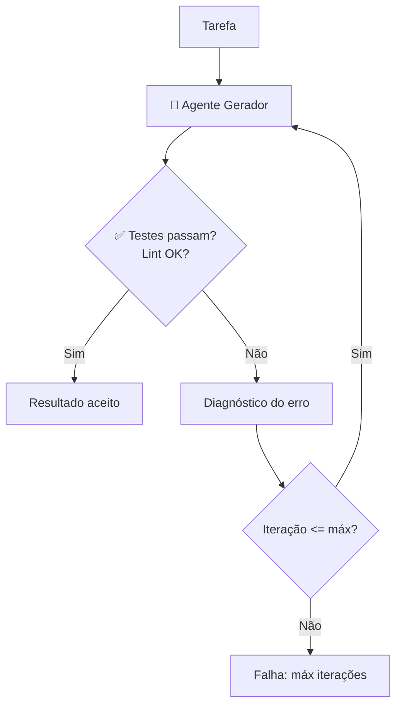

# 05 — Loops Agênticos

> **Objetivo:** Entender a anatomia do loop agêntico, como controlar sua execução, quais são os pontos de falha comuns e como construir loops robustos que terminam de forma previsível.

---

## O Ciclo Fundamental

Todo agente executa alguma variação do ciclo **Observe → Plan → Act → Observe**. Compreender esse ciclo é essencial para depurar, limitar e confiar em sistemas agênticos.


> 📌 **Referência:** anthropic.com/research/building-effective-agents

---

## Critérios de Parada

O loop deve ter critérios de parada claros. Sem eles, o agente pode iterar indefinidamente ou em direção errada.

### Tipos de critério de parada

| Critério | Quando usar | Exemplo |
|---------|------------|---------|
| **Por conclusão** | O agente declara que terminou | `stop_reason == "end_turn"` sem tool_use pendente |
| **Por limite de iterações** | Fallback de segurança sempre | `if iteration >= max_iterations: break` |
| **Por validação externa** | Resultado verificável objetivamente | Testes passando, lint sem erros |
| **Por timeout** | Tarefas com SLA | `if elapsed > timeout: abort` |
| **Por sinalização humana** | Supervisão contínua | Usuário pressiona Ctrl+C ou aprova parada |

### Implementando critérios robustos

```python
import time
from dataclasses import dataclass, field

@dataclass
class AgentConfig:
    max_iterations: int = 15
    timeout_seconds: int = 300
    max_cost_usd: float = 1.0

@dataclass
class AgentState:
    iteration: int = 0
    start_time: float = field(default_factory=time.time)
    input_tokens: int = 0
    output_tokens: int = 0

    def elapsed(self) -> float:
        return time.time() - self.start_time

    def estimated_cost(self) -> float:
        # claude-sonnet-4-6: $3/MTok input, $15/MTok output
        return (self.input_tokens * 3 + self.output_tokens * 15) / 1_000_000

def should_stop(state: AgentState, config: AgentConfig) -> tuple[bool, str]:
    if state.iteration >= config.max_iterations:
        return True, f"Limite de {config.max_iterations} iterações atingido"
    if state.elapsed() > config.timeout_seconds:
        return True, f"Timeout de {config.timeout_seconds}s atingido"
    if state.estimated_cost() > config.max_cost_usd:
        return True, f"Limite de custo ${config.max_cost_usd} atingido"
    return False, ""
```

---

## Padrões de Loop na Prática

### Loop básico com controle de parada

```python
import anthropic

client = anthropic.Anthropic()

def run_agent_loop(
    task: str,
    tools: list,
    tool_handlers: dict,
    config: AgentConfig = AgentConfig()
) -> str:
    messages = [{"role": "user", "content": task}]
    state = AgentState()

    while True:
        stop, reason = should_stop(state, config)
        if stop:
            return f"[Agente interrompido: {reason}]"

        response = client.messages.create(
            model="claude-sonnet-4-6",
            max_tokens=4096,
            tools=tools,
            messages=messages
        )

        state.iteration += 1
        state.input_tokens += response.usage.input_tokens
        state.output_tokens += response.usage.output_tokens

        messages.append({"role": "assistant", "content": response.content})

        if response.stop_reason == "end_turn":
            return next(
                (b.text for b in response.content if hasattr(b, "text")),
                "Concluído."
            )

        if response.stop_reason == "tool_use":
            tool_results = []
            for block in response.content:
                if block.type == "tool_use":
                    handler = tool_handlers.get(block.name)
                    result = handler(block.input) if handler else f"Ferramenta não encontrada: {block.name}"
                    tool_results.append({
                        "type": "tool_result",
                        "tool_use_id": block.id,
                        "content": result
                    })
            messages.append({"role": "user", "content": tool_results})
```

---

## Loops com Verificação de Qualidade

Um padrão poderoso: o agente executa até que um critério de qualidade seja atendido — não apenas até declarar que terminou.



```python
def run_until_tests_pass(task: str, max_retries: int = 5) -> str:
    result = run_agent_loop(task, tools, tool_handlers)

    for attempt in range(max_retries):
        test_output = run_tests()
        if "failed" not in test_output and "error" not in test_output.lower():
            return f"✅ Concluído após {attempt + 1} tentativas\n{result}"

        fix_prompt = (
            f"Os testes falharam após sua implementação. Corrija:\n\n"
            f"Output dos testes:\n{test_output}\n\n"
            f"Sua implementação anterior:\n{result}"
        )
        result = run_agent_loop(fix_prompt, tools, tool_handlers)

    return f"❌ Não foi possível fazer os testes passarem em {max_retries} tentativas"
```

---

## Armadilhas Comuns em Loops Agênticos

### 1. Loop infinito por tarefa mal definida

```markdown
❌ Tarefa vaga que nunca termina:
"Melhore o código do projeto"

✅ Tarefa com critério claro de conclusão:
"Refatore auth.py para reduzir a complexidade ciclomática das funções
acima de 10. A tarefa está concluída quando todas as funções estiverem
abaixo de 10 e os testes passarem."
```

### 2. Spiral of failure (espiral de erros)

O agente tenta corrigir um erro, introduz outro, tenta corrigir esse, e assim por diante.

**Solução:** limite de iterações + checkpoint de estado limpo.

```python
# Salve o estado antes de cada iteração
# Se detectar que está em espiral, restaure ao último bom estado
def detect_spiral(error_history: list[str], window: int = 3) -> bool:
    if len(error_history) < window:
        return False
    recent = error_history[-window:]
    return len(set(recent)) == 1  # mesmo erro repetindo
```

### 3. Context overflow silencioso

Em loops longos, o histórico de mensagens pode ultrapassar a janela de contexto.

```python
def trim_messages_if_needed(messages: list, max_tokens: int = 150_000) -> list:
    # Estimativa simples: 4 chars = 1 token
    total = sum(len(str(m)) // 4 for m in messages)
    if total > max_tokens:
        # Mantém system prompt (messages[0]) e as últimas N mensagens
        return [messages[0]] + messages[-10:]
    return messages
```

### 4. Ação repetida sem progresso

O agente chama a mesma ferramenta com os mesmos argumentos repetidamente.

```python
def detect_repeated_actions(action_log: list[tuple], window: int = 3) -> bool:
    if len(action_log) < window:
        return False
    recent = action_log[-window:]
    return len(set(recent)) == 1
```

---

## Observabilidade do Loop

Logs estruturados são essenciais para depurar loops agênticos:

```python
import json
from datetime import datetime

def log_iteration(iteration: int, action: str, result: str, state: AgentState) -> None:
    log = {
        "timestamp": datetime.utcnow().isoformat(),
        "iteration": iteration,
        "action": action,
        "result_preview": result[:200],
        "elapsed_s": round(state.elapsed(), 2),
        "tokens": state.input_tokens + state.output_tokens,
        "estimated_cost_usd": round(state.estimated_cost(), 4)
    }
    print(json.dumps(log))
```

---

## ✅ Pontos-chave do Capítulo

- Todo loop agêntico precisa de critérios de parada explícitos: por conclusão, por iterações, por timeout e por custo
- Loops com verificação de qualidade (ex.: testes passando) são mais confiáveis que loops que terminam na auto-declaração do agente
- Espirais de erros, context overflow e ações repetidas são as armadilhas mais comuns — detecte e trate explicitamente
- Logs estruturados por iteração são indispensáveis para depurar comportamento agêntico
- Defina o critério de conclusão da tarefa antes de iniciar o loop — ambiguidade no objetivo gera loops que nunca terminam

---

## 🔗 Próxima Aula

👉 [06 — Human-in-the-Loop](./06-human-in-the-loop.md)
