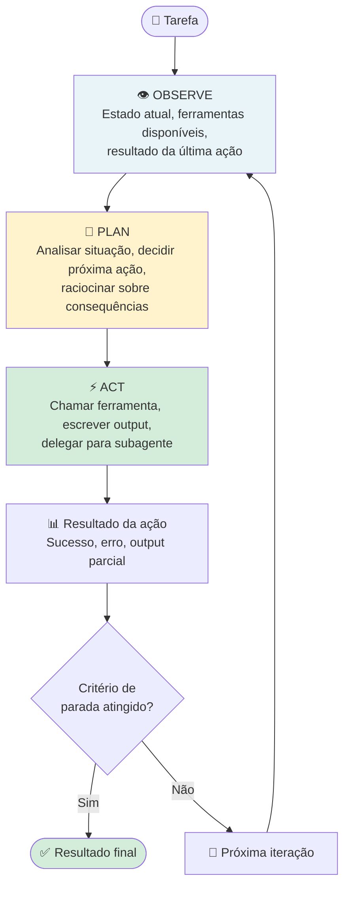
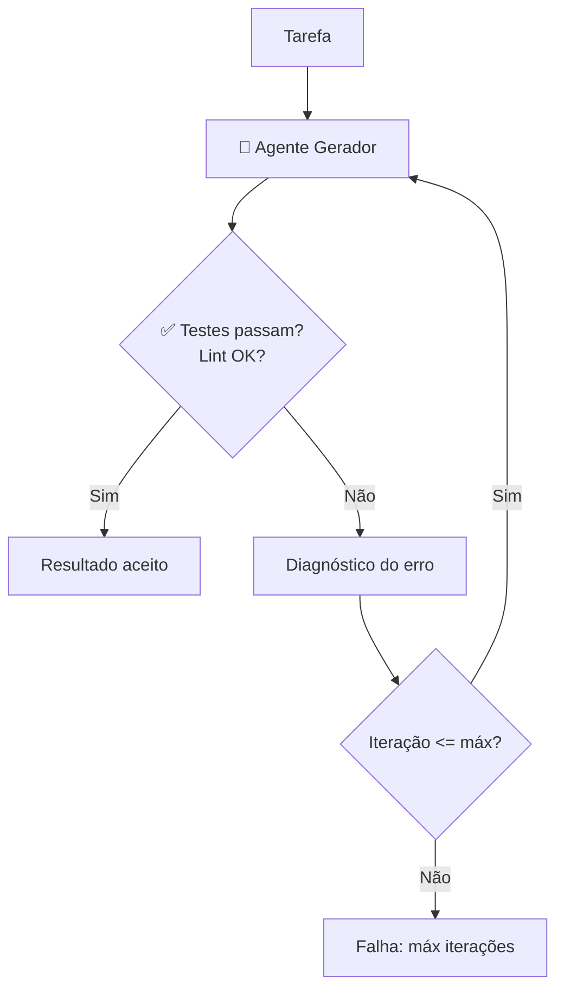

# 05 — Loops Agênticos

> **Objetivo:** Entender a anatomia do loop agêntico, como controlar sua execução, quais são os pontos de falha comuns e como construir loops robustos que terminam de forma previsível.

---

## O Ciclo Fundamental

Todo agente executa alguma variação do ciclo **Observe → Plan → Act → Observe**. Compreender esse ciclo é essencial para depurar, limitar e confiar em sistemas agênticos.



> 📌 **Referência:** anthropic.com/research/building-effective-agents

---

## Critérios de Parada

O loop deve ter critérios de parada claros. Sem eles, o agente pode iterar indefinidamente ou em direção errada.

### Tipos de critério de parada

| Critério | Quando usar | Exemplo |
|---------|------------|---------|
| **Por conclusão** | O agente declara que terminou | `stop_reason == "end_turn"` sem tool_use pendente |
| **Por limite de iterações** | Fallback de segurança sempre | `if iteration >= max_iterations: break` |
| **Por validação externa** | Resultado verificável objetivamente | Testes passando, lint sem erros |
| **Por timeout** | Tarefas com SLA | `if elapsed > timeout: abort` |
| **Por sinalização humana** | Supervisão contínua | Usuário pressiona Ctrl+C ou aprova parada |

### Implementando critérios robustos

```java
public record AgentConfig(
    int maxIterations,    // default: 15
    int timeoutSeconds,   // default: 300
    double maxCostUsd     // default: 1.0
) {
    public AgentConfig() { this(15, 300, 1.0); }
}

public class AgentState {
    int iteration = 0;
    long startTime = System.currentTimeMillis();
    long inputTokens = 0;
    long outputTokens = 0;

    double elapsed() { return (System.currentTimeMillis() - startTime) / 1000.0; }

    // claude-sonnet-4-6: $3/MTok input, $15/MTok output
    double estimatedCost() {
        return (inputTokens * 3 + outputTokens * 15) / 1_000_000.0;
    }
}

record StopDecision(boolean stop, String reason) {}

static StopDecision shouldStop(AgentState state, AgentConfig config) {
    if (state.iteration >= config.maxIterations())
        return new StopDecision(true, "Limite de " + config.maxIterations() + " iterações atingido");
    if (state.elapsed() > config.timeoutSeconds())
        return new StopDecision(true, "Timeout de " + config.timeoutSeconds() + "s atingido");
    if (state.estimatedCost() > config.maxCostUsd())
        return new StopDecision(true, "Limite de custo $" + config.maxCostUsd() + " atingido");
    return new StopDecision(false, "");
}
```

---

## Padrões de Loop na Prática

### Loop básico com controle de parada

```java
import com.anthropic.client.Anthropic;
import com.anthropic.client.okhttp.AnthropicOkHttpClient;
import com.anthropic.models.messages.*;
import java.util.*;
import java.util.function.Function;

public class AgentLoop {

    private static final Anthropic client = AnthropicOkHttpClient.fromEnv();

    @SuppressWarnings("unchecked")
    static String runAgentLoop(
        String task,
        List<ToolParam> tools,
        Map<String, Function<Map<String, Object>, String>> toolHandlers,
        AgentConfig config
    ) {
        List<MessageParam> messages = new ArrayList<>(List.of(
            MessageParam.builder().role(MessageParam.Role.USER).content(task).build()
        ));
        AgentState state = new AgentState();

        while (true) {
            StopDecision stop = shouldStop(state, config);
            if (stop.stop()) return "[Agente interrompido: " + stop.reason() + "]";

            Message response = client.messages().create(
                MessageCreateParams.builder()
                    .model(Model.CLAUDE_SONNET_4_6)
                    .maxTokens(4096L)
                    .tools(tools)
                    .messages(messages)
                    .build()
            );

            state.iteration++;
            state.inputTokens  += response.usage().inputTokens();
            state.outputTokens += response.usage().outputTokens();

            messages.add(MessageParam.builder()
                .role(MessageParam.Role.ASSISTANT)
                .content(response.content())
                .build());

            if (response.stopReason() == StopReason.END_TURN) {
                return response.content().stream()
                    .filter(ContentBlock::isText)
                    .map(b -> b.asText().text())
                    .findFirst()
                    .orElse("Concluído.");
            }

            if (response.stopReason() == StopReason.TOOL_USE) {
                List<ContentBlockParam> toolResults = new ArrayList<>();
                for (ContentBlock block : response.content()) {
                    if (block.isToolUse()) {
                        ToolUseBlock use = block.asToolUse();
                        var handler = toolHandlers.get(use.name());
                        String result = handler != null
                            ? handler.apply((Map<String, Object>) use.input())
                            : "Ferramenta não encontrada: " + use.name();
                        toolResults.add(ContentBlockParam.ofToolResult(
                            ToolResultBlockParam.builder()
                                .toolUseId(use.id())
                                .content(result)
                                .build()
                        ));
                    }
                }
                messages.add(MessageParam.builder()
                    .role(MessageParam.Role.USER)
                    .content(toolResults)
                    .build());
            }
        }
    }
}
```

---

## Loops com Verificação de Qualidade

Um padrão poderoso: o agente executa até que um critério de qualidade seja atendido — não apenas até declarar que terminou.



```java
static String runUntilTestsPass(String task, int maxRetries) {
    String result = runAgentLoop(task, tools, toolHandlers, new AgentConfig());

    for (int attempt = 0; attempt < maxRetries; attempt++) {
        String testOutput = runTests("");
        if (!testOutput.contains("FAILED") && !testOutput.toLowerCase().contains("error")) {
            return "✅ Concluído após " + (attempt + 1) + " tentativas\n" + result;
        }
        String fixPrompt =
            "Os testes falharam após sua implementação. Corrija:\n\n" +
            "Output dos testes:\n" + testOutput + "\n\n" +
            "Sua implementação anterior:\n" + result;
        result = runAgentLoop(fixPrompt, tools, toolHandlers, new AgentConfig());
    }
    return "❌ Não foi possível fazer os testes passarem em " + maxRetries + " tentativas";
}
```

---

## Armadilhas Comuns em Loops Agênticos

### 1. Loop infinito por tarefa mal definida

```markdown
❌ Tarefa vaga que nunca termina:
"Melhore o código do projeto"

✅ Tarefa com critério claro de conclusão:
"Refatore auth.py para reduzir a complexidade ciclomática das funções
acima de 10. A tarefa está concluída quando todas as funções estiverem
abaixo de 10 e os testes passarem."
```

### 2. Spiral of failure (espiral de erros)

O agente tenta corrigir um erro, introduz outro, tenta corrigir esse, e assim por diante.

**Solução:** limite de iterações + checkpoint de estado limpo.

```java
// Salve o estado antes de cada iteração
// Se detectar que está em espiral, restaure ao último bom estado
static boolean detectSpiral(List<String> errorHistory, int window) {
    if (errorHistory.size() < window) return false;
    List<String> recent = errorHistory.subList(errorHistory.size() - window, errorHistory.size());
    return new HashSet<>(recent).size() == 1; // mesmo erro repetindo
}
```

### 3. Context overflow silencioso

Em loops longos, o histórico de mensagens pode ultrapassar a janela de contexto.

```java
static List<MessageParam> trimMessagesIfNeeded(List<MessageParam> messages, int maxTokens) {
    // Estimativa simples: 4 chars = 1 token
    long total = messages.stream().mapToLong(m -> m.toString().length() / 4).sum();
    if (total > maxTokens) {
        // Mantém a primeira mensagem (tarefa original) e as últimas 10
        List<MessageParam> trimmed = new ArrayList<>();
        trimmed.add(messages.get(0));
        trimmed.addAll(messages.subList(Math.max(1, messages.size() - 10), messages.size()));
        return trimmed;
    }
    return messages;
}
```

### 4. Ação repetida sem progresso

O agente chama a mesma ferramenta com os mesmos argumentos repetidamente.

```java
static boolean detectRepeatedActions(List<String> actionLog, int window) {
    if (actionLog.size() < window) return false;
    List<String> recent = actionLog.subList(actionLog.size() - window, actionLog.size());
    return new HashSet<>(recent).size() == 1;
}
```

---

## Observabilidade do Loop

Logs estruturados são essenciais para depurar loops agênticos:

```java
import com.fasterxml.jackson.databind.ObjectMapper;
import java.time.Instant;
import java.util.*;

private static final ObjectMapper mapper = new ObjectMapper();

static void logIteration(int iteration, String action, String result, AgentState state) {
    try {
        Map<String, Object> log = Map.of(
            "timestamp",          Instant.now().toString(),
            "iteration",          iteration,
            "action",             action,
            "result_preview",     result.substring(0, Math.min(200, result.length())),
            "elapsed_s",          Math.round(state.elapsed() * 100) / 100.0,
            "tokens",             state.inputTokens + state.outputTokens,
            "estimated_cost_usd", Math.round(state.estimatedCost() * 10000) / 10000.0
        );
        System.out.println(mapper.writeValueAsString(log));
    } catch (Exception e) {
        System.err.println("Erro ao logar iteração: " + e.getMessage());
    }
}
```

---

## ✅ Pontos-chave do Capítulo

- Todo loop agêntico precisa de critérios de parada explícitos: por conclusão, por iterações, por timeout e por custo
- Loops com verificação de qualidade (ex.: testes passando) são mais confiáveis que loops que terminam na auto-declaração do agente
- Espirais de erros, context overflow e ações repetidas são as armadilhas mais comuns — detecte e trate explicitamente
- Logs estruturados por iteração são indispensáveis para depurar comportamento agêntico
- Defina o critério de conclusão da tarefa antes de iniciar o loop — ambiguidade no objetivo gera loops que nunca terminam

---

## 🔗 Próxima Aula

👉 [06 — Human-in-the-Loop](./06-human-in-the-loop.md)
