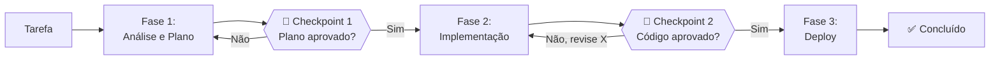
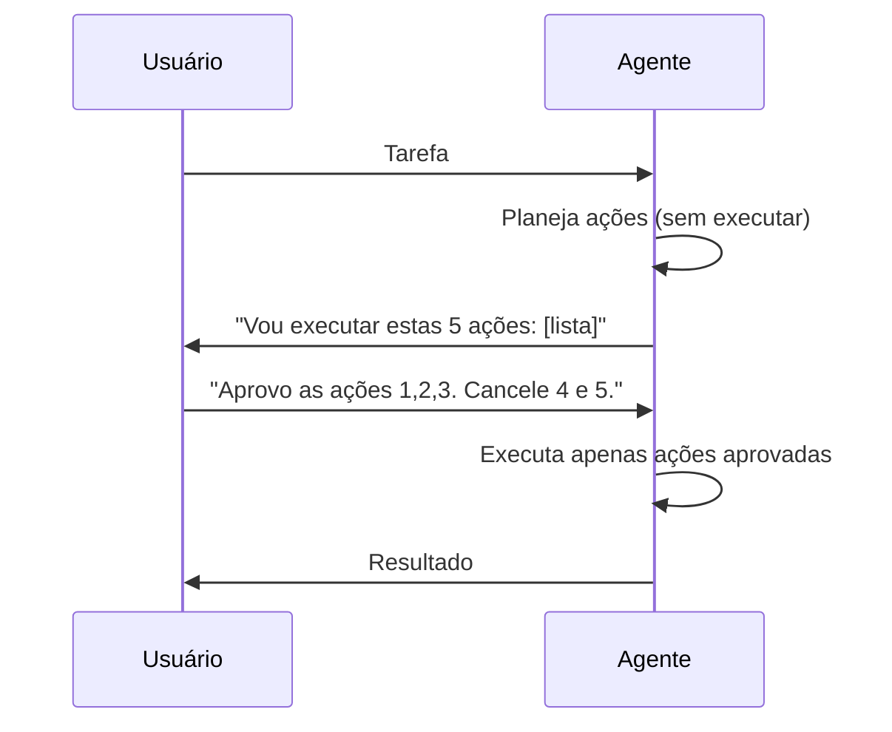

# 06 — Human-in-the-Loop

> **Objetivo:** Definir onde e como manter controle humano em sistemas agênticos — quando interromper, como estruturar checkpoints e como calibrar autonomia sem abrir mão de segurança.

---

## Por que Controle Humano é Necessário

Agentes autônomos amplificam capacidade — e também amplificam erros. Um agente que age sem supervisão pode:

- Deletar arquivos errados com confiança
- Fazer commits com código quebrado
- Enviar mensagens para as pessoas erradas
- Consumir créditos de API sem perceber

O controle humano não é uma limitação do sistema — é uma feature de segurança.

> 📌 **Referência:** anthropic.com/research/building-effective-agents

---

## O Espectro de Autonomia

```mermaid
flowchart LR
    subgraph "← Mais Controle"
        A["Aprovação para<br/>cada ação"]
    end

    subgraph ""
        B["Aprovação para<br/>ações de risco"]
        C["Checkpoints<br/>por fase"]
        D["Revisão do<br/>resultado final"]
    end

    subgraph "Mais Autonomia →"
        E["Totalmente<br/>autônomo"]
    end

    A --> B --> C --> D --> E
```

Não existe ponto certo no espectro — depende do risco da ação, da confiança no agente e do custo de erro.

---

## Padrão 1: Aprovação por Ação

O mais conservador. O agente para antes de cada ação e aguarda confirmação.

**Quando usar:** ações novas ou não testadas, ambiente de produção, dados sensíveis.

```java
static boolean requestApproval(String actionName, Map<String, Object> actionArgs) {
    System.out.println("\n" + "=".repeat(50));
    System.out.println("⚠️  O agente quer executar: " + actionName);
    System.out.println("   Argumentos: " + actionArgs);
    System.out.println("=".repeat(50));
    System.out.print("Aprovar? [s/N]: ");
    String response = new Scanner(System.in).nextLine().trim().toLowerCase();
    return response.equals("s");
}
```

**Desvantagem:** interrompe demais tarefas simples. Use apenas para ações de alto risco.

---

## Padrão 2: Checkpoints por Fase

O agente executa uma fase completa autonomamente, depois apresenta o resultado e aguarda aprovação para continuar.



```java
static String runWithCheckpoints(String task) {
    record Phase(String name, String instruction) {}
    List<Phase> phases = List.of(
        new Phase("análise e planejamento", "Analise o problema e proponha um plano de implementação detalhado."),
        new Phase("implementação",          "Execute o plano aprovado. Implemente o código conforme planejado."),
        new Phase("testes e validação",     "Escreva e execute testes. Verifique que a implementação está correta.")
    );

    Scanner scanner = new Scanner(System.in);
    String context = task;

    for (Phase phase : phases) {
        System.out.println("\n🔄 Iniciando fase: " + phase.name());
        String result = runAgentLoop(phase.instruction() + "\n\nContexto: " + context);
        System.out.println("\n📋 Resultado da fase '" + phase.name() + "':\n" + result);

        System.out.print("\nAprovar fase '" + phase.name() + "' e continuar? [s/N/feedback]: ");
        String approval = scanner.nextLine().trim();

        if (approval.equalsIgnoreCase("n")) {
            return "Processo encerrado pelo usuário na fase '" + phase.name() + "'";
        }
        if (!approval.equalsIgnoreCase("s") && !approval.isEmpty()) {
            context = context + "\n\nFeedback do revisor humano: " + approval;
            continue; // re-executa a fase com o feedback
        }
        context = context + "\n\nResultado da fase '" + phase.name() + "':\n" + result;
    }
    return context;
}
```

---

## Padrão 3: Interrupção por Gatilho

O agente executa autonomamente, mas um conjunto de condições dispara uma pausa para revisão.

```java
import java.util.*;
import java.util.function.BiPredicate;

static final List<BiPredicate<String, Map<String, Object>>> INTERRUPT_TRIGGERS = List.of(
    (action, args) -> action.equals("delete_file"),
    (action, args) -> action.equals("write_file") && ((String) args.getOrDefault("path", "")).contains("prod"),
    (action, args) -> action.equals("run_command") && ((String) args.getOrDefault("cmd", "")).contains("rm"),
    (action, args) -> action.equals("call_api") && "DELETE".equals(args.get("method"))
);

static boolean shouldInterrupt(String action, Map<String, Object> args) {
    return INTERRUPT_TRIGGERS.stream().anyMatch(trigger -> trigger.test(action, args));
}
```

---

## Padrão 4: Dry Run antes de Executar

O agente planeja todas as ações sem executar. Você revisa o plano e aprova a execução em lote.



```java
import com.anthropic.client.Anthropic;
import com.anthropic.client.okhttp.AnthropicOkHttpClient;
import com.anthropic.models.messages.*;
import com.fasterxml.jackson.core.type.TypeReference;
import com.fasterxml.jackson.databind.ObjectMapper;
import java.util.*;

private static final Anthropic client = AnthropicOkHttpClient.fromEnv();
private static final ObjectMapper mapper = new ObjectMapper();

static List<Map<String, Object>> dryRun(String task) throws Exception {
    Message response = client.messages().create(
        MessageCreateParams.builder()
            .model(Model.CLAUDE_SONNET_4_6)
            .maxTokens(2048L)
            .system("""
                Você deve planejar as ações sem executá-las.
                Responda APENAS com uma lista JSON de ações no formato:
                [{"tool": "nome", "args": {...}, "reason": "por que esta ação"}]
                """)
            .addUserMessage(task)
            .build()
    );
    String json = response.content().get(0).asText().text();
    return mapper.readValue(json, new TypeReference<>() {});
}

@SuppressWarnings("unchecked")
static List<String> executeApprovedPlan(List<Map<String, Object>> plan, Set<Integer> approvedIndices) {
    List<String> results = new ArrayList<>();
    for (int i = 0; i < plan.size(); i++) {
        Map<String, Object> action = plan.get(i);
        String toolName = (String) action.get("tool");
        if (approvedIndices.contains(i)) {
            var handler = TOOL_HANDLERS.get(toolName);
            String result = handler != null
                ? handler.apply((Map<String, Object>) action.get("args"))
                : "Ferramenta não encontrada";
            results.add("✅ " + toolName + ": " + result);
        } else {
            results.add("⏭️  " + toolName + ": pulado");
        }
    }
    return results;
}
```

---

## Calibrando Autonomia por Contexto

Diferentes contextos pedem diferentes níveis de autonomia:

| Contexto | Autonomia recomendada | Justificativa |
|----------|:---------------------:|---------------|
| Ambiente local de desenvolvimento | Alta | Reversível, sem impacto externo |
| CI/CD em branch de feature | Alta | Isolado, sem efeito em produção |
| PR para branch principal | Média | Checkpoint antes do merge |
| Deploy em staging | Média | Aprovação antes de avançar |
| Deploy em produção | Baixa | Checkpoint explícito sempre |
| Dados de usuários | Baixa | Compliance e privacidade |
| Comunicação externa (email, Slack) | Baixa | Irreversível e visível |

---

## Como Apresentar Ações para Revisão

A revisão humana é tão boa quanto a clareza da apresentação. O agente deve facilitar a aprovação — não apenas pedir "ok?".

```markdown
✅ Apresentação clara para revisão:

📋 Plano de ação para: "Refatorar módulo de autenticação"

Ação 1 de 4: Ler arquivo atual
  → read_file(path="src/auth/handler.py")
  → Não tem efeito colateral

Ação 2 de 4: Criar versão refatorada
  → write_file(path="src/auth/handler.py", content=[320 linhas])
  → Modifica: src/auth/handler.py
  → Reversível via git

Ação 3 de 4: Executar testes
  → run_tests(path="tests/test_auth.py")
  → Não tem efeito colateral

Ação 4 de 4: Executar lint
  → run_command(cmd="ruff check src/auth/")
  → Não tem efeito colateral

Ações irreversíveis: nenhuma
Arquivos modificados: 1 (src/auth/handler.py)
```

---

## Feedback Estruturado ao Rejeitar

Quando o humano rejeita ou solicita revisão, o feedback deve ser acionável:

```java
static Map<String, String> collectRejectionFeedback(String action) {
    Scanner scanner = new Scanner(System.in);
    System.out.println("\nVocê rejeitou: " + action);
    System.out.println("Selecione o motivo (ou escreva feedback livre):");
    System.out.println("1. Ação incorreta — use outra ferramenta");
    System.out.println("2. Argumentos errados — corrija os parâmetros");
    System.out.println("3. Momento errado — execute depois de outra ação");
    System.out.println("4. Não necessária — pule esta ação");
    System.out.println("5. Feedback livre");
    System.out.print("Opção: ");

    String choice = scanner.nextLine().trim();
    Map<String, String> reasons = Map.of(
        "1", "Ação incorreta",
        "2", "Argumentos errados",
        "3", "Momento errado",
        "4", "Não necessária"
    );

    if (reasons.containsKey(choice)) {
        System.out.print("Detalhes (opcional): ");
        return Map.of("reason", reasons.get(choice), "feedback", scanner.nextLine());
    }
    return Map.of("reason", "Livre", "feedback", choice);
}
```

---

## ✅ Pontos-chave do Capítulo

- Autonomia amplifica tanto capacidade quanto erros — calibre ao contexto e risco
- Quatro padrões principais: aprovação por ação, checkpoints por fase, interrupção por gatilho e dry run
- Ambiente local e CI em feature branch suportam alta autonomia; produção e comunicação externa exigem checkpoints
- Apresente ações para revisão com clareza: o que vai fazer, quais arquivos serão afetados, se é reversível
- Feedback de rejeição deve ser estruturado e acionável — não apenas "não"

---

## 🔗 Próxima Aula

👉 [07 — Segurança em Agentes](./07-seguranca-em-agentes.md)
