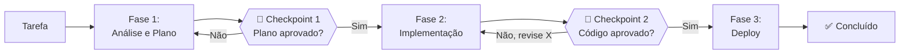
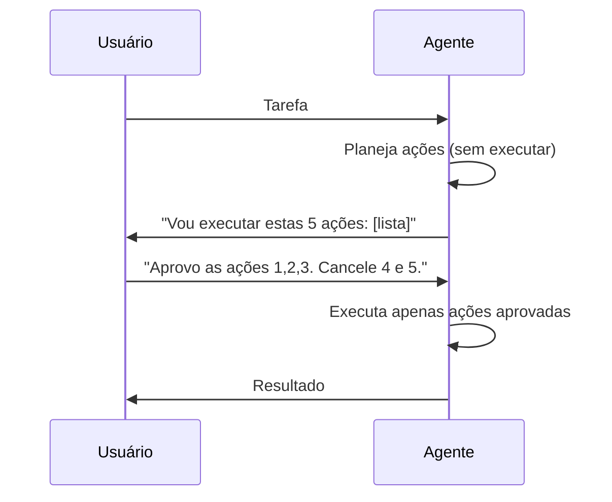

# 06 — Human-in-the-Loop

> **Objetivo:** Definir onde e como manter controle humano em sistemas agênticos — quando interromper, como estruturar checkpoints e como calibrar autonomia sem abrir mão de segurança.

---

## Por que Controle Humano é Necessário

Agentes autônomos amplificam capacidade — e também amplificam erros. Um agente que age sem supervisão pode:

- Deletar arquivos errados com confiança
- Fazer commits com código quebrado
- Enviar mensagens para as pessoas erradas
- Consumir créditos de API sem perceber

O controle humano não é uma limitação do sistema — é uma feature de segurança.

> 📌 **Referência:** anthropic.com/research/building-effective-agents

---

## O Espectro de Autonomia

```mermaid
flowchart LR
    subgraph "← Mais Controle"
        A["Aprovação para<br/>cada ação"]
    end

    subgraph ""
        B["Aprovação para<br/>ações de risco"]
        C["Checkpoints<br/>por fase"]
        D["Revisão do<br/>resultado final"]
    end

    subgraph "Mais Autonomia →"
        E["Totalmente<br/>autônomo"]
    end

    A --> B --> C --> D --> E
```

Não existe ponto certo no espectro — depende do risco da ação, da confiança no agente e do custo de erro.

---

## Padrão 1: Aprovação por Ação

O mais conservador. O agente para antes de cada ação e aguarda confirmação.

**Quando usar:** ações novas ou não testadas, ambiente de produção, dados sensíveis.

```python
def request_approval(action_name: str, action_args: dict) -> bool:
    print("\n" + "="*50)
    print(f"⚠️  O agente quer executar: {action_name}")
    print(f"   Argumentos: {action_args}")
    print("="*50)
    response = input("Aprovar? [s/N]: ").strip().lower()
    return response == "s"
```

**Desvantagem:** interrompe demais tarefas simples. Use apenas para ações de alto risco.

---

## Padrão 2: Checkpoints por Fase

O agente executa uma fase completa autonomamente, depois apresenta o resultado e aguarda aprovação para continuar.



```python
def run_with_checkpoints(task: str) -> str:
    phases = [
        ("análise e planejamento", "Analise o problema e proponha um plano de implementação detalhado."),
        ("implementação", "Execute o plano aprovado. Implemente o código conforme planejado."),
        ("testes e validação", "Escreva e execute testes. Verifique que a implementação está correta."),
    ]

    context = task
    for phase_name, phase_instruction in phases:
        print(f"\n🔄 Iniciando fase: {phase_name}")
        result = run_agent_loop(f"{phase_instruction}\n\nContexto: {context}")
        print(f"\n📋 Resultado da fase '{phase_name}':\n{result}")

        approval = input(f"\nAprovar fase '{phase_name}' e continuar? [s/N/feedback]: ").strip()
        if approval.lower() == "n":
            return f"Processo encerrado pelo usuário na fase '{phase_name}'"
        if approval.lower() not in ("s", ""):
            context = f"{context}\n\nFeedback do revisor humano: {approval}"
            # Re-executa a fase com o feedback
            continue

        context = f"{context}\n\nResultado da fase '{phase_name}':\n{result}"

    return context
```

---

## Padrão 3: Interrupção por Gatilho

O agente executa autonomamente, mas um conjunto de condições dispara uma pausa para revisão.

```python
INTERRUPT_TRIGGERS = [
    lambda action, args: action == "delete_file",
    lambda action, args: action == "write_file" and "prod" in args.get("path", ""),
    lambda action, args: action == "run_command" and "rm" in args.get("cmd", ""),
    lambda action, args: action == "call_api" and args.get("method") == "DELETE",
]

def should_interrupt(action: str, args: dict) -> bool:
    return any(trigger(action, args) for trigger in INTERRUPT_TRIGGERS)
```

---

## Padrão 4: Dry Run antes de Executar

O agente planeja todas as ações sem executar. Você revisa o plano e aprova a execução em lote.



```python
def dry_run(task: str) -> list[dict]:
    response = client.messages.create(
        model="claude-sonnet-4-6",
        max_tokens=2048,
        system=(
            "Você deve planejar as ações sem executá-las. "
            "Responda APENAS com uma lista JSON de ações no formato: "
            '[{"tool": "nome", "args": {...}, "reason": "por que esta ação"}]'
        ),
        messages=[{"role": "user", "content": task}]
    )
    import json
    return json.loads(response.content[0].text)

def execute_approved_plan(plan: list[dict], approved_indices: list[int]) -> list[str]:
    results = []
    for i, action in enumerate(plan):
        if i in approved_indices:
            handler = TOOL_HANDLERS.get(action["tool"])
            result = handler(action["args"]) if handler else "Ferramenta não encontrada"
            results.append(f"✅ {action['tool']}: {result}")
        else:
            results.append(f"⏭️  {action['tool']}: pulado")
    return results
```

---

## Calibrando Autonomia por Contexto

Diferentes contextos pedem diferentes níveis de autonomia:

| Contexto | Autonomia recomendada | Justificativa |
|----------|:---------------------:|---------------|
| Ambiente local de desenvolvimento | Alta | Reversível, sem impacto externo |
| CI/CD em branch de feature | Alta | Isolado, sem efeito em produção |
| PR para branch principal | Média | Checkpoint antes do merge |
| Deploy em staging | Média | Aprovação antes de avançar |
| Deploy em produção | Baixa | Checkpoint explícito sempre |
| Dados de usuários | Baixa | Compliance e privacidade |
| Comunicação externa (email, Slack) | Baixa | Irreversível e visível |

---

## Como Apresentar Ações para Revisão

A revisão humana é tão boa quanto a clareza da apresentação. O agente deve facilitar a aprovação — não apenas pedir "ok?".

```markdown
✅ Apresentação clara para revisão:

📋 Plano de ação para: "Refatorar módulo de autenticação"

Ação 1 de 4: Ler arquivo atual
  → read_file(path="src/auth/handler.py")
  → Não tem efeito colateral

Ação 2 de 4: Criar versão refatorada
  → write_file(path="src/auth/handler.py", content=[320 linhas])
  → Modifica: src/auth/handler.py
  → Reversível via git

Ação 3 de 4: Executar testes
  → run_tests(path="tests/test_auth.py")
  → Não tem efeito colateral

Ação 4 de 4: Executar lint
  → run_command(cmd="ruff check src/auth/")
  → Não tem efeito colateral

Ações irreversíveis: nenhuma
Arquivos modificados: 1 (src/auth/handler.py)
```

---

## Feedback Estruturado ao Rejeitar

Quando o humano rejeita ou solicita revisão, o feedback deve ser acionável:

```python
def collect_rejection_feedback(action: str) -> dict:
    print(f"\nVocê rejeitou: {action}")
    print("Selecione o motivo (ou escreva feedback livre):")
    print("1. Ação incorreta — use outra ferramenta")
    print("2. Argumentos errados — corrija os parâmetros")
    print("3. Momento errado — execute depois de outra ação")
    print("4. Não necessária — pule esta ação")
    print("5. Feedback livre")

    choice = input("Opção: ").strip()
    reasons = {
        "1": "Ação incorreta",
        "2": "Argumentos errados",
        "3": "Momento errado",
        "4": "Não necessária"
    }

    if choice in reasons:
        return {"reason": reasons[choice], "feedback": input("Detalhes (opcional): ")}
    return {"reason": "Livre", "feedback": choice}
```

---

## ✅ Pontos-chave do Capítulo

- Autonomia amplifica tanto capacidade quanto erros — calibre ao contexto e risco
- Quatro padrões principais: aprovação por ação, checkpoints por fase, interrupção por gatilho e dry run
- Ambiente local e CI em feature branch suportam alta autonomia; produção e comunicação externa exigem checkpoints
- Apresente ações para revisão com clareza: o que vai fazer, quais arquivos serão afetados, se é reversível
- Feedback de rejeição deve ser estruturado e acionável — não apenas "não"

---

## 🔗 Próxima Aula

👉 [07 — Segurança em Agentes](./07-seguranca-em-agentes.md)
