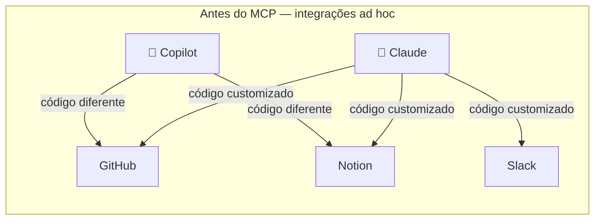
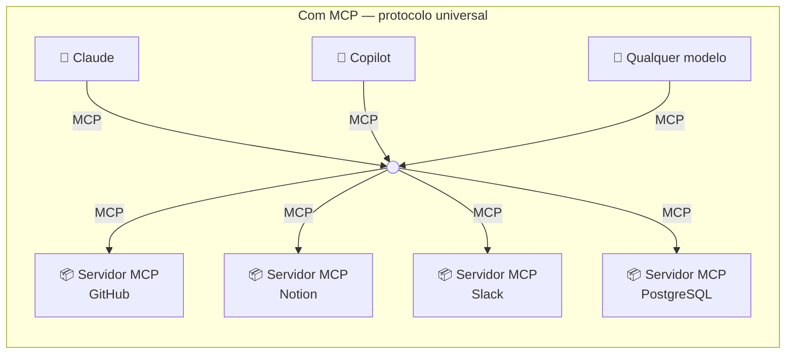
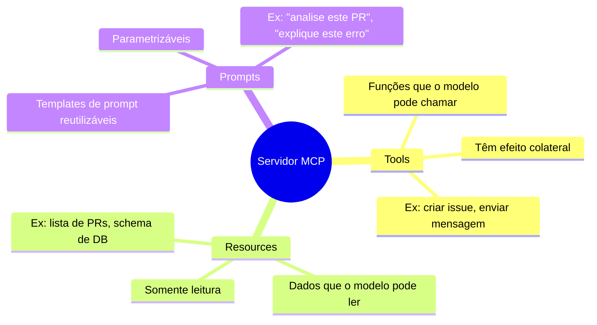

# 01 — O que é MCP

> **Objetivo:** Entender o problema que o Model Context Protocol resolve, como ele funciona conceitualmente e por que se tornou o padrão de integração entre modelos de IA e ferramentas externas.

---

## O Problema antes do MCP

Antes do MCP, cada integração entre um modelo de IA e uma ferramenta externa era construída do zero: código customizado, autenticação customizada, formato de dados customizado.



Cada combinação de modelo + ferramenta exigia implementação separada. N modelos × M ferramentas = N×M integrações.

---

## A Solução: Um Protocolo Universal

O MCP (Model Context Protocol) define um protocolo padrão de comunicação entre modelos de IA e sistemas externos. Com ele, qualquer modelo compatível fala com qualquer servidor MCP sem código customizado.



N modelos + M ferramentas = N + M implementações.

> 📌 **Referência:** modelcontextprotocol.io/introduction

---

## A Analogia do USB-C

MCP é para modelos de IA o que USB-C é para dispositivos:

| USB-C | MCP |
|-------|-----|
| Padrão de conector físico | Padrão de protocolo de comunicação |
| Qualquer cabo USB-C em qualquer porta | Qualquer cliente MCP em qualquer servidor |
| Fabricantes adotam para interoperabilidade | Serviços adotam para ser acessíveis por IA |
| Um conector, múltiplos protocolos (dados, vídeo, energia) | Um protocolo, múltiplas primitivas (tools, resources, prompts) |

---

## O que MCP Expõe

Um servidor MCP pode expor três tipos de primitivas:



### Tools (ferramentas)
Ações executáveis. O modelo declara a intenção de chamar; o servidor executa.
```
create_issue(title, body, labels) → Issue criada
query_database(sql) → Resultado da query
send_message(channel, text) → Mensagem enviada
```

### Resources (recursos)
Dados para leitura. O modelo pode acessar sem efeito colateral.
```
github://repos/org/repo/issues → Lista de issues
postgres://schema/users → Schema da tabela users
file:///src/auth.py → Conteúdo do arquivo
```

### Prompts (templates)
Workflows reutilizáveis que o usuário ou o modelo pode invocar.
```
review_pr(pr_number) → Prompt estruturado para revisar um PR específico
explain_error(error_message) → Prompt para diagnóstico de erro
```

> 📌 **Referência:** modelcontextprotocol.io/docs/concepts/tools

---

## Ecossistema Atual

O MCP foi lançado pela Anthropic em novembro de 2024 e rapidamente ganhou adoção:

| Categoria | Exemplos de servidores MCP |
|-----------|---------------------------|
| Controle de versão | GitHub, GitLab |
| Produtividade | Notion, Google Drive, Obsidian |
| Comunicação | Slack |
| Bancos de dados | PostgreSQL, SQLite, MySQL |
| Infraestrutura | AWS, Docker, Kubernetes |
| Monitoramento | Sentry, Datadog |
| Ferramentas de dev | Puppeteer, Browserbase |
| Sistema de arquivos | Filesystem local |

> 📌 **Referência:** github.com/modelcontextprotocol/servers

---

## MCP vs Tool Use Direto

| | Tool Use direto (API) | MCP |
|--|----------------------|-----|
| **Setup** | Código no cliente | Servidor separado |
| **Reutilização** | Por implementação | Qualquer cliente MCP |
| **Padronização** | Ad hoc | Protocolo definido |
| **Distribuição** | Manual | Instala e conecta |
| **Melhor para** | Ferramentas internas simples | Integrações reutilizáveis e distribuíveis |

Tool use direto ainda faz sentido para ferramentas simples e internas. MCP faz sentido quando você quer reutilização, distribuição ou integração com ecossistema existente.

---

## Hosts que Suportam MCP

| Host | Suporte MCP |
|------|:-----------:|
| Claude Code | ✅ Nativo |
| Claude Desktop | ✅ Nativo |
| VS Code (Copilot) | ✅ Via Agent Mode |
| Cursor | ✅ Nativo |
| Continue.dev | ✅ Nativo |

> 📌 **Referência:** docs.anthropic.com/en/docs/claude-code/mcp

---

## ✅ Pontos-chave do Capítulo

- MCP resolve o problema N×M de integrações entre modelos e ferramentas externas
- É um protocolo padrão: qualquer modelo compatível fala com qualquer servidor MCP
- Um servidor MCP expõe três primitivas: tools (ações), resources (dados) e prompts (templates)
- Foi lançado pela Anthropic em 2024 e tem ecossistema crescente com centenas de servidores
- Tool use direto ainda é válido para ferramentas simples; MCP é para integrações reutilizáveis

---

## 🔗 Próxima Aula

👉 [02 — Arquitetura Host, Client e Server](./02-arquitetura-host-client-server.md)
