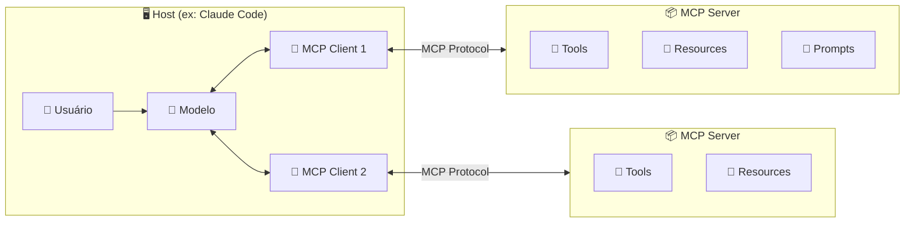
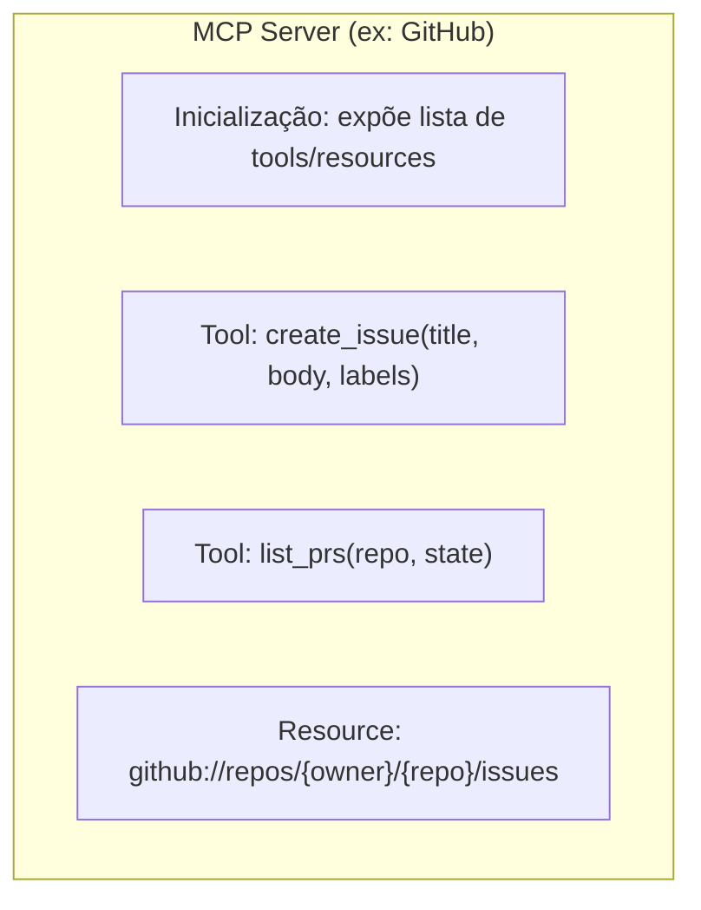
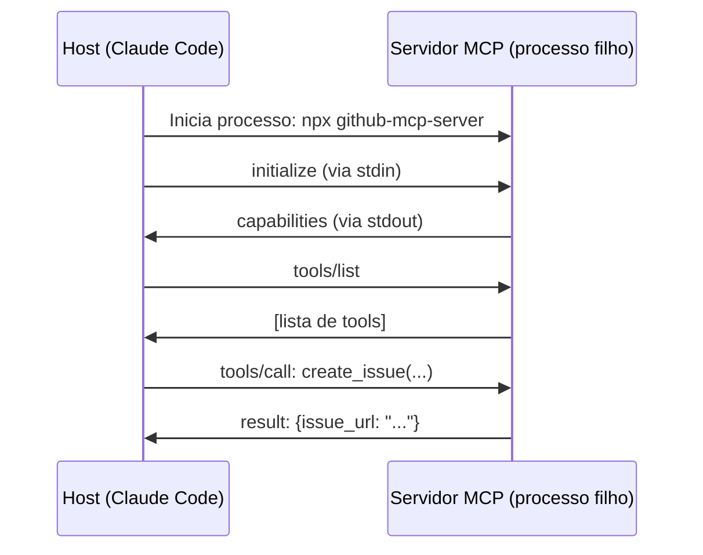
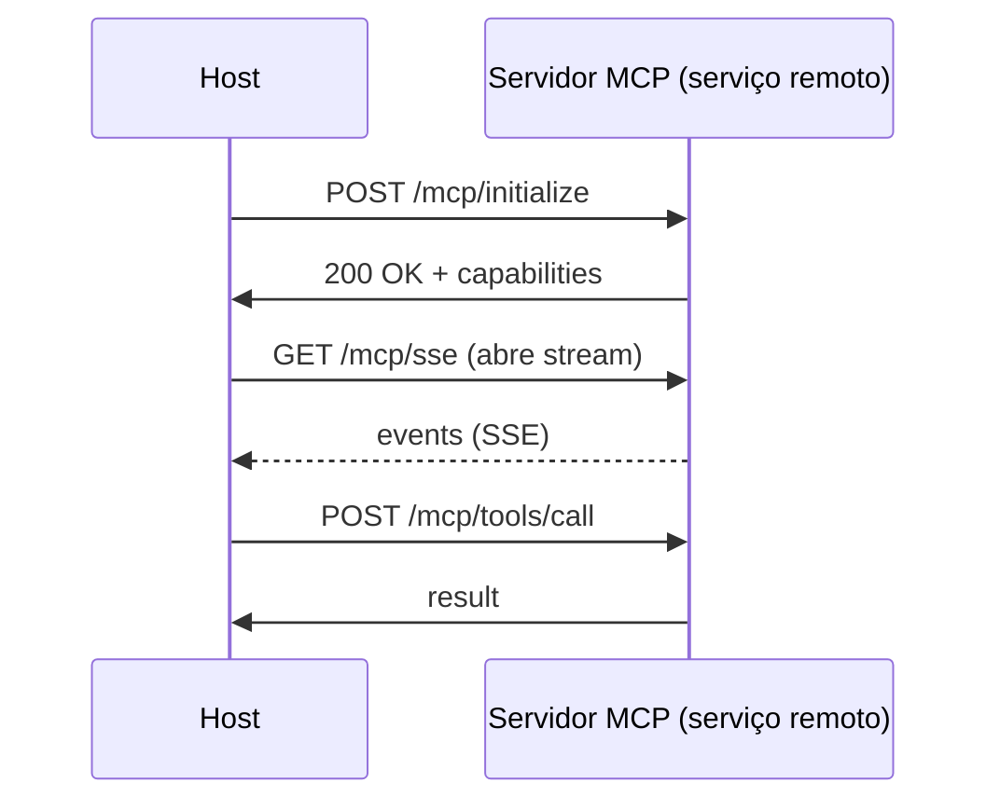
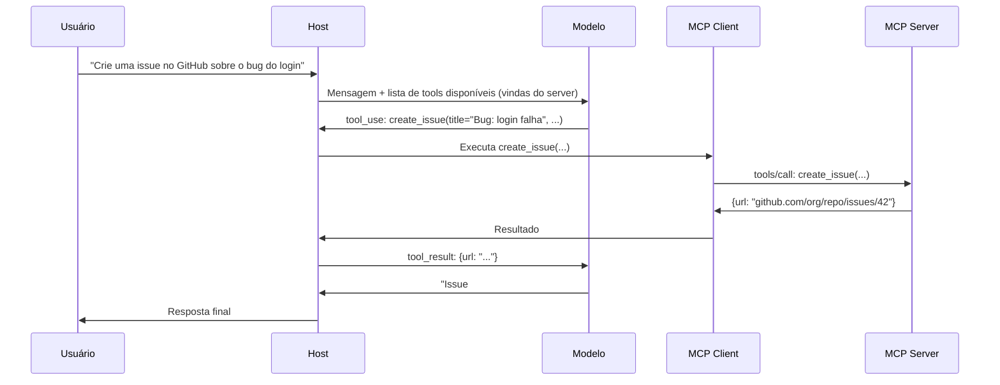
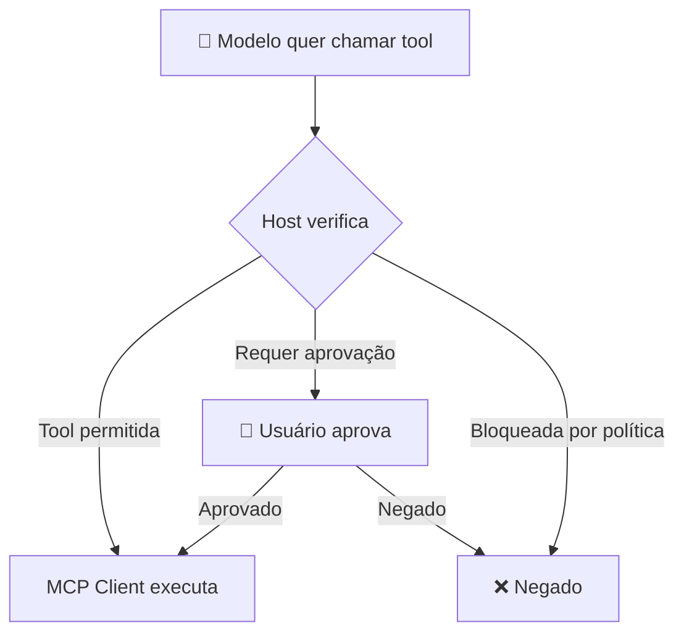

# 02 — Arquitetura Host, Client e Server

> **Objetivo:** Entender os três papéis na arquitetura MCP — host, client e server — e como eles se comunicam para que um modelo de IA possa usar ferramentas externas.

---

## Os Três Papéis



| Papel | O que é | Exemplos |
|-------|---------|---------|
| **Host** | A aplicação que o usuário usa | Claude Code, Claude Desktop, VS Code |
| **Client** | Componente do host que fala MCP | Embutido no host, um por servidor |
| **Server** | Processo que expõe tools/resources/prompts | github-mcp, postgres-mcp, filesystem-mcp |

> 📌 **Referência:** modelcontextprotocol.io/docs/concepts/architecture

---

## O Host

O host é a aplicação que o usuário usa diretamente. Ele:

- Gerencia a sessão com o modelo
- Mantém as conexões MCP com os servidores configurados
- Controla quais servidores o modelo pode acessar
- Aplica políticas de segurança (aprovação de ações)

O host decide **quais servidores MCP estão disponíveis** — o modelo só vê as ferramentas que o host autoriza.

---

## O Client

Cada servidor MCP tem um client correspondente dentro do host. O client:

- Mantém a conexão com o servidor (local ou remoto)
- Traduz chamadas do modelo para o protocolo MCP
- Devolve resultados ao modelo

O desenvolvedor geralmente não implementa o client — ele já vem no host (Claude Code, Claude Desktop etc.).

---

## O Server

O servidor MCP é onde a integração real acontece. Ele:

- Roda como processo separado (local) ou serviço remoto
- Expõe tools, resources e/ou prompts via protocolo MCP
- É agnóstico do modelo — qualquer host MCP pode usá-lo



---

## Transporte: Como Client e Server se Comunicam

O protocolo MCP suporta dois mecanismos de transporte:

### stdio (local)
O host inicia o servidor como processo filho e se comunica via stdin/stdout.



**Quando usar:** servidores locais, desenvolvimento, integração com sistema de arquivos.

### HTTP + SSE (remoto)
O servidor roda como serviço web. O client se conecta via HTTP.



**Quando usar:** servidores compartilhados, SaaS, integração com serviços externos.

> 📌 **Referência:** modelcontextprotocol.io/docs/concepts/transports

---

## Ciclo de Vida de uma Chamada MCP



---

## Descoberta de Capabilities

Quando o host conecta a um servidor MCP, ocorre um handshake de capabilities:

```json
// Servidor anuncia o que suporta
{
  "capabilities": {
    "tools": { "listChanged": true },
    "resources": { "subscribe": true, "listChanged": true },
    "prompts": { "listChanged": false }
  }
}
```

O modelo só vê as ferramentas que o servidor expõe naquele momento. Se o servidor atualizar sua lista de tools, o host pode ser notificado (se `listChanged: true`).

---

## Segurança na Arquitetura

O host é a última linha de defesa:



O modelo não tem acesso direto ao servidor — tudo passa pelo host, que pode:
- Bloquear tools específicas
- Exigir aprovação humana
- Logar todas as chamadas
- Limitar rate de chamadas

---

## ✅ Pontos-chave do Capítulo

- Três papéis: host (aplicação do usuário), client (componente do host), server (serviço de integração)
- O model nunca acessa o servidor diretamente — o host controla tudo
- Dois transportes: stdio para servidores locais, HTTP+SSE para serviços remotos
- O handshake de capabilities define o que o servidor expõe em cada sessão
- O host é a camada de segurança: pode bloquear tools, exigir aprovação e logar chamadas

---

## 🔗 Próxima Aula

👉 [03 — Servidores MCP Prontos](./03-servidores-mcp-prontos.md)
