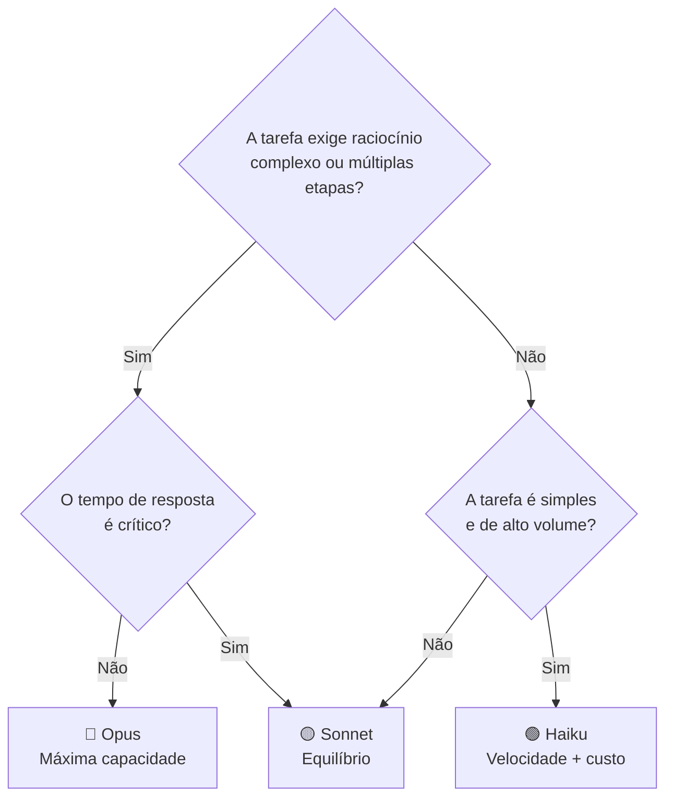
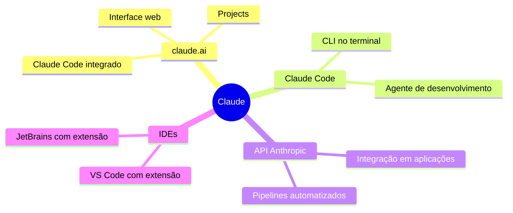

# 01 — Visão Geral e Modelos Claude

> **Objetivo:** Entender a família de modelos Claude, as diferenças entre eles e como escolher o modelo certo para cada caso de uso.

---

## A Família Claude

Claude é a família de modelos de linguagem da Anthropic. A nomenclatura segue o padrão `claude-{família}-{variante}`:

| Modelo | ID | Posicionamento |
|--------|----|----------------|
| Claude Opus 4 | `claude-opus-4-7` | Máxima capacidade de raciocínio — tarefas complexas, agênticas e de longa duração |
| Claude Sonnet 4 | `claude-sonnet-4-6` | Equilíbrio entre capacidade e velocidade — uso geral e produção |
| Claude Haiku 4 | `claude-haiku-4-5-20251001` | Alta velocidade e baixo custo — tarefas simples, alta throughput |

> 📌 **Referência:** docs.anthropic.com/en/docs/about-claude/models/overview

---

## Quando Usar Cada Modelo



### Opus — quando justifica o custo

```markdown
✅ Usar Opus para:
- Tarefas agênticas longas e complexas
- Análise de arquitetura e revisões profundas
- Geração de código com raciocínio multi-etapa
- Quando a qualidade do output é mais importante que latência ou custo
```

### Sonnet — o padrão para produção

```markdown
✅ Usar Sonnet para:
- A maioria das tarefas de desenvolvimento (padrão recomendado)
- Assistentes de código em produção
- Pipelines que precisam de equilíbrio entre velocidade e qualidade
- Claude Code (configuração padrão)
```

### Haiku — volume e velocidade

```markdown
✅ Usar Haiku para:
- Classificação e extração de dados em larga escala
- Completions rápidos em IDEs
- Pré-processamento antes de chamar Sonnet/Opus
- Testes e desenvolvimento onde custo importa
```

---

## Janelas de Contexto e Limites de Output

| Modelo | Contexto | Output máximo |
|--------|:--------:|:-------------:|
| Opus 4.7 | 200K tokens | 32K tokens |
| Sonnet 4.6 | 200K tokens | 64K tokens |
| Haiku 4.5 | 200K tokens | 8K tokens |

> 📌 **Referência:** docs.anthropic.com/en/docs/about-claude/models/overview

---

## Capacidades por Modelo

| Capacidade | Haiku | Sonnet | Opus |
|-----------|:-----:|:------:|:----:|
| Visão (imagens) | ✅ | ✅ | ✅ |
| Tool use | ✅ | ✅ | ✅ |
| Extended thinking | ✅ | ✅ | ✅ |
| Batch API | ✅ | ✅ | ✅ |
| Prompt caching | ✅ | ✅ | ✅ |

---

## Onde Usar Claude



---

## Selecting the Right Interface

| Interface | Melhor para |
|-----------|-------------|
| **claude.ai** | Exploração, conversas longas, não-código |
| **Claude Code (CLI)** | Desenvolvimento, automação, repositórios |
| **API direta** | Aplicações próprias, pipelines, automação |
| **IDE Extension** | Completions inline e chat durante código |

---

## Filosofia de Design: Constitutional AI

Claude foi treinado com Constitutional AI (CAI) — uma abordagem onde o modelo aprende a ser útil, inofensivo e honesto a partir de um conjunto de princípios. Na prática para desenvolvedores:

- Claude tende a ser direto sobre incertezas ("não tenho certeza sobre X")
- Recusa pedidos claramente prejudiciais, mas não é excessivamente conservador
- Prefere dar respostas corretas a respostas rápidas quando há ambiguidade

> 📌 **Referência:** anthropic.com/research/constitutional-ai-harmlessness-from-ai-feedback

---

## ✅ Pontos-chave do Capítulo

- Três variantes: Opus (máxima capacidade), Sonnet (uso geral e produção) e Haiku (velocidade e custo)
- Sonnet é o padrão recomendado para a maioria dos casos de desenvolvimento
- Todos os modelos têm 200K tokens de contexto; o output máximo varia por modelo
- Claude está disponível via claude.ai, Claude Code CLI, API direta e extensões de IDE

---

## 🔗 Próxima Aula

👉 [02 — Interface claude.ai](./02-claude-ai-interface.md)
