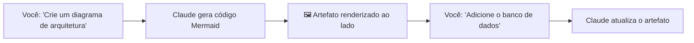

# 02 — Interface claude.ai

> **Objetivo:** Dominar o uso da interface web do claude.ai para tarefas de desenvolvimento — conversas, artefatos, upload de arquivos e o uso efetivo de memória na interface.

---

## Visão Geral da Interface

O claude.ai é a interface web do Claude. Para desenvolvedores, oferece:

- Conversas com contexto persistente (via Projects)
- Upload de arquivos e documentos para análise
- Geração de artefatos (código, diagramas, documentos)
- Memória entre conversas (dentro de um Project)

> 📌 **Referência:** docs.anthropic.com/en/docs/claude-ai/overview

---

## Conversas e Contexto

Cada conversa no claude.ai mantém seu próprio contexto. O histórico dentro de uma conversa é preservado e visível ao modelo.

**Boas práticas:**

```markdown
✅ Iniciar nova conversa quando:
- Muda completamente de tópico/projeto
- O histórico anterior não é mais relevante
- Quer evitar que decisões anteriores influenciem a nova tarefa

✅ Continuar na mesma conversa quando:
- A tarefa é uma continuação direta do que foi feito
- Decisões anteriores são contexto necessário
- Está iterando sobre um mesmo artefato
```

---

## Upload de Arquivos

O claude.ai suporta upload direto de arquivos para análise:

| Tipo | Uso típico |
|------|-----------|
| Código (`.py`, `.ts`, `.go`…) | Revisão, refatoração, debugging |
| Texto (`.md`, `.txt`) | Análise de documentação, specs |
| PDF | Leitura de documentos técnicos |
| Imagens (`.png`, `.jpg`) | Análise de screenshots, diagramas |
| CSV / dados | Análise exploratória |

**Limite:** o arquivo entra no contexto da conversa — arquivos grandes consomem tokens.

---

## Artefatos

Quando Claude gera código, documentos ou diagramas extensos, ele pode criá-los como **artefatos** — blocos de conteúdo com renderização e controles próprios.



**Tipos de artefatos:**
- Código (qualquer linguagem) — com syntax highlighting
- Markdown — renderizado
- HTML/React — renderizado e executável
- SVG — renderizado
- Mermaid — diagramas renderizados

**Fluxo típico com artefatos:**
1. Peça ao Claude para criar um componente, spec ou documento
2. O artefato aparece ao lado da conversa
3. Itere pedindo modificações — Claude atualiza o mesmo artefato
4. Copie ou baixe o resultado final

---

## Memória no claude.ai

O claude.ai tem um mecanismo de **memória** que persiste informações entre conversas (fora de Projects):

- Claude pode salvar fatos sobre você e suas preferências
- Aparece como "Memórias" nas configurações
- Você pode ver, editar e deletar memórias

**Para desenvolvimento:** a memória é útil para preferências pessoais (linguagem favorita, estilo de código), mas não substitui Projects para contexto de projeto específico.

> 📌 **Referência:** docs.anthropic.com/en/docs/claude-ai/memory

---

## Atalhos e Produtividade

| Ação | Atalho |
|------|--------|
| Nova conversa | `Ctrl/Cmd + K` → "Nova conversa" |
| Enviar mensagem | `Enter` |
| Nova linha na mensagem | `Shift + Enter` |
| Copiar bloco de código | Clique no ícone de cópia |

---

## Limitações da Interface Web vs Claude Code

| Aspecto | claude.ai | Claude Code |
|---------|:---------:|:-----------:|
| Acesso ao sistema de arquivos | ❌ (só upload manual) | ✅ Nativo |
| Execução de código | ❌ | ✅ |
| Integração com git | ❌ | ✅ |
| Servidores MCP | ❌ | ✅ |
| Automação / headless | ❌ | ✅ |
| Ideal para | Exploração e design | Desenvolvimento |

---

## Quando Usar claude.ai em vez do Claude Code

```markdown
✅ Prefira claude.ai para:
- Conversas exploratórias antes de implementar
- Análise de documentos PDF ou imagens
- Geração de specs, RFCs, ADRs
- Quando você não está em um projeto de código
- Feedback em texto, não em código

✅ Prefira Claude Code para:
- Qualquer tarefa que envolva arquivos do projeto
- Execução de comandos e testes
- Múltiplas iterações sobre código real
- Automação de tarefas repetitivas
```

---

## ✅ Pontos-chave do Capítulo

- claude.ai é ideal para exploração, análise de documentos e conversas de design
- Artefatos permitem iterar sobre código e documentos com renderização ao vivo
- Upload de arquivos funciona, mas substitua por Claude Code para trabalho intenso em código
- A memória persiste preferências entre conversas; Projects persiste contexto de projeto
- Para desenvolvimento sério, Claude Code supera a interface web em quase todos os aspectos práticos

---

## 🔗 Próxima Aula

👉 [03 — Projects e Contexto Persistente](./03-projects-e-contexto-persistente.md)
