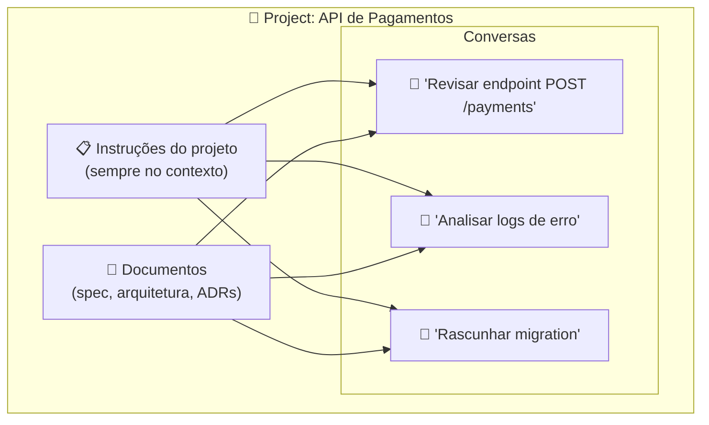

# 03 — Projects e Contexto Persistente

> **Objetivo:** Usar Projects no claude.ai para criar workspaces com contexto persistente, instruções fixas e documentos compartilhados entre conversas.

---

## O que são Projects

Projects são workspaces no claude.ai onde:
- As instruções do projeto ficam disponíveis em **toda conversa** dentro do projeto
- Documentos carregados ficam no contexto de **toda conversa**
- Conversas relacionadas ficam organizadas no mesmo lugar



> 📌 **Referência:** docs.anthropic.com/en/docs/claude-ai/projects

---

## Criando e Configurando um Project

1. No claude.ai, clique em **"Projects"** na barra lateral
2. Clique em **"New project"**
3. Dê um nome e configure as **instruções do projeto**

### O que colocar nas instruções do projeto

As instruções funcionam como um system prompt persistente. Inclua:

```markdown
# Projeto: API de Pagamentos

## Stack
Python 3.11 + FastAPI + PostgreSQL + Celery + Redis

## Contexto
API de processamento de pagamentos para e-commerce.
~200k transações/dia. PCI-DSS compliant.

## Estilo de resposta
- Seja direto e técnico — minha equipe tem 5+ anos de experiência
- Prefira soluções com menos dependências externas
- Sempre aponte riscos de segurança em código de pagamento
- Cite a documentação oficial quando relevante

## O que nunca fazer
- Não sugira armazenar dados de cartão sem criptografia
- Não use threading direto — usamos Celery para async
- Não quebre a API pública sem warning de deprecation
```

---

## Adicionando Documentos ao Project

Documentos carregados ficam disponíveis em todas as conversas do projeto:

```markdown
✅ Bons candidatos para upload:
- Spec de API (OpenAPI YAML ou Markdown)
- Documento de arquitetura
- ADRs (Architecture Decision Records)
- Guia de contribuição
- Glossário do domínio

❌ Evite fazer upload de:
- Arquivos com credenciais
- Logs de produção com dados de usuários
- Arquivos muito grandes (consomem tokens em toda conversa)
```

**Formatos suportados:** Markdown, texto, PDF, código, CSV.

---

## Projects vs Conversas Avulsas

| Aspecto | Conversa avulsa | Dentro de um Project |
|---------|:---------------:|:--------------------:|
| Instruções persistem | ❌ | ✅ |
| Documentos persistem | ❌ | ✅ |
| Organização por tema | ❌ | ✅ |
| Ideal para | Pergunta pontual | Trabalho contínuo num projeto |

---

## Padrão: Project por Repositório

A organização mais prática para desenvolvedores é um Project por repositório ou sistema:

```
📁 Project: backend-api
   📄 docs/architecture.md
   📄 docs/api-spec.yaml
   📋 Instruções: stack, convenções, restrições

📁 Project: frontend-web
   📄 docs/component-guide.md
   📋 Instruções: React, design system, padrões

📁 Project: infra-aws
   📄 docs/infraestrutura.md
   📋 Instruções: AWS, Terraform, políticas de segurança
```

---

## Projects no Plano Free vs Pro

| Feature | Free | Pro/Team |
|---------|:----:|:--------:|
| Criar Projects | ✅ | ✅ |
| Documentos por project | Limitado | Mais amplo |
| Projects compartilhados (Team) | ❌ | ✅ |

> 📌 **Referência:** docs.anthropic.com/en/docs/claude-ai/projects

---

## Projects vs CLAUDE.md (Claude Code)

| | Projects (claude.ai) | CLAUDE.md (Claude Code) |
|--|---------------------|------------------------|
| **Contexto persistente** | ✅ (por project) | ✅ (por sessão) |
| **Acesso a arquivos** | ❌ (só upload) | ✅ (sistema de arquivos) |
| **Execução de código** | ❌ | ✅ |
| **Quando usar** | Exploração e design | Desenvolvimento ativo |

Para projetos com código ativo, CLAUDE.md no Claude Code é mais poderoso. Projects brilha para trabalho de design, documentação e exploração.

---

## ✅ Pontos-chave do Capítulo

- Projects criam workspaces com instruções e documentos persistentes para todas as conversas do projeto
- As instruções do projeto funcionam como system prompt compartilhado — invista em escrevê-las bem
- Organize um Project por repositório ou sistema para manter contexto relevante
- Upload de spec de API, arquitetura e ADRs transforma o Project em base de conhecimento do projeto
- Para desenvolvimento ativo com código, Claude Code + CLAUDE.md é mais poderoso que Projects

---

## 🔗 Próxima Seção

👉 [Exercícios do Capítulo 06 — Raiz](./04-exercicios.md)
