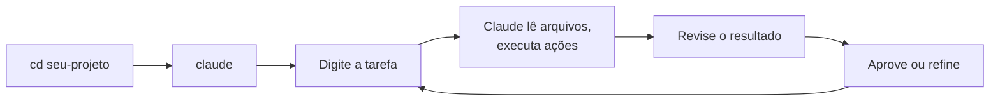
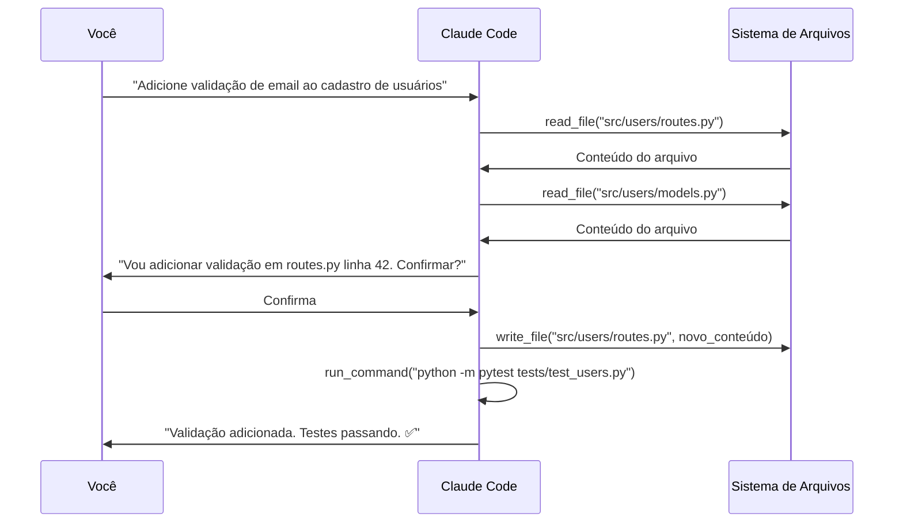

# 02 — Primeiros Passos

> **Objetivo:** Executar as primeiras tarefas reais com o Claude Code, entender o fluxo de trabalho básico e os comandos essenciais da sessão.

---

## O Fluxo Básico



Cada "tarefa" é uma instrução em linguagem natural. O Claude interpreta, executa usando ferramentas (leitura de arquivo, edição, execução de comando) e entrega o resultado.

---

## Comandos Essenciais da Sessão

| Comando | O que faz |
|---------|-----------|
| `/help` | Lista todos os comandos disponíveis |
| `/clear` | Limpa o histórico da sessão atual |
| `/compact` | Compacta o histórico para liberar contexto |
| `/init` | Gera CLAUDE.md analisando o repositório |
| `/permissions` | Exibe e ajusta permissões de ferramentas |
| `/status` | Mostra estado da sessão (tokens usados, etc.) |
| `Ctrl+C` | Interrompe a ação em andamento |
| `Ctrl+D` ou `/exit` | Encerra a sessão |

> 📌 **Referência:** docs.anthropic.com/en/docs/claude-code/cli-reference

---

## Primeiras Tarefas para Tentar

### Exploração de codebase
```
"Explique a estrutura geral deste projeto — o que cada diretório principal faz"
```

### Análise de código
```
"Leia src/auth/handler.py e me diga se há algum problema de segurança evidente"
```

### Debugging
```
"Estou recebendo este erro: [cole o erro]. Identifique a causa e proponha correção"
```

### Geração de testes
```
"Gere testes unitários para a função calculate_discount em services/pricing.py"
```

### Documentação
```
"Adicione docstrings às funções públicas do módulo payments/ que não têm documentação"
```

---

## Como o Claude Code Executa Tarefas

Cada instrução dispara um loop interno:



---

## Aprovações e Permissões

Por padrão, o Claude Code pede confirmação antes de:
- Escrever ou modificar arquivos
- Executar comandos no terminal
- Operações com potencial destrutivo

```
╔═════════════════════════════════════════════╗
║  Claude quer executar:                      ║
║  write_file("src/auth.py")                  ║
║                                             ║
║  [A] Aprovar  [S] Sempre aprovar  [N] Negar ║
╚═════════════════════════════════════════════╝
```

- **A (Aprovar):** permite esta vez
- **S (Sempre):** adiciona à lista de permissões automáticas
- **N (Negar):** bloqueia e informa o Claude

---

## Editando Sua Instrução

Se perceber que a instrução ficou incompleta após enviar, você pode:

1. Pressionar `Ctrl+C` para interromper o Claude se ainda estiver processando
2. Enviar uma mensagem de correção: "na verdade, apenas modifique o arquivo X, não o Y"

O Claude mantém o histórico da sessão e adapta o comportamento.

---

## Verificando o que Foi Feito

Após uma modificação, é boa prática pedir um resumo:

```
"O que você modificou? Me mostre as mudanças principais"
```

Ou use o git:

```bash
git diff  # fora do Claude Code
```

---

## Interagindo com o Git

O Claude Code pode usar git diretamente:

```
"Faça commit das mudanças com uma mensagem descritiva"
"Qual é o status atual do repositório?"
"Mostre o diff das últimas mudanças"
```

> ⚠️ Push para remoto sempre requer confirmação explícita.

---

## ✅ Pontos-chave do Capítulo

- O fluxo básico: abra o terminal no projeto → `claude` → descreva a tarefa → revise → aprove
- `/compact` libera contexto em sessões longas; `/clear` reinicia do zero
- O Claude pede confirmação antes de ações com efeito colateral — revise antes de aprovar
- `Ctrl+C` interrompe ações em andamento sem encerrar a sessão
- Após modificações, verifique com `git diff` ou peça um resumo ao Claude

---

## 🔗 Próxima Aula

👉 [03 — CLAUDE.md: Guia Completo](./03-CLAUDE-md-guia-completo.md)
