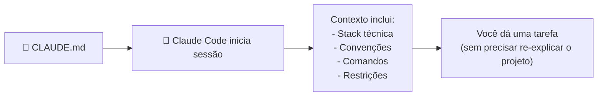

# 03 — CLAUDE.md: Guia Completo

> **Objetivo:** Dominar o arquivo CLAUDE.md — o principal mecanismo de memória de projeto do Claude Code — entendendo onde criar, o que incluir e como estruturar para máxima eficácia.

---

## O que é o CLAUDE.md

O `CLAUDE.md` é um arquivo Markdown carregado automaticamente pelo Claude Code no início de toda sessão. Ele serve como briefing persistente — informações que você não quer repetir toda vez que abre uma nova sessão.



> 📌 **Referência:** docs.anthropic.com/en/docs/claude-code/memory

---

## Hierarquia de Arquivos CLAUDE.md

O Claude Code carrega múltiplos arquivos CLAUDE.md em cascata:

```
~/.claude/CLAUDE.md          ← Global: preferências pessoais
seu-projeto/CLAUDE.md        ← Projeto: convenções e arquitetura
seu-projeto/src/CLAUDE.md    ← Subdiretório: regras específicas do módulo
```

**Ordem de carregamento:** global → projeto → subdiretório. Todos são carregados e concatenados no contexto.

---

## Gerando com /init

```bash
cd seu-projeto
claude
/init
```

O `/init` analisa o repositório e gera um `CLAUDE.md` com:
- Linguagem e framework detectados
- Comandos de build, test e lint inferidos do `package.json`, `Makefile`, etc.
- Estrutura de diretórios resumida

O resultado é um ponto de partida — edite para adicionar contexto que o `/init` não consegue inferir (decisões técnicas, restrições de negócio, histórico).

---

## Estrutura Recomendada

```markdown
# Projeto: [Nome]

## Visão Geral
[1-3 frases sobre o que o sistema faz e por quê existe]

## Stack
[Linguagem, framework, banco de dados, infraestrutura]

## Arquitetura
[Módulos principais e responsabilidades — não precisa ser exaustivo]

## Comandos Essenciais
[Build, test, lint, dev server — os que o Claude vai precisar usar]

## Convenções de Código
[Padrões do projeto que um dev novo precisaria saber]

## Decisões Técnicas
[Por que escolhemos X em vez de Y — com contexto suficiente para não reverter sem motivo]

## O que NUNCA fazer
[Restrições críticas — o que quebraria o sistema ou violaria políticas]

## Dependências e Integrações
[Sistemas externos que o projeto usa]
```

---

## Exemplo de CLAUDE.md Real

```markdown
# Projeto: Plataforma de Cursos Online

## Visão Geral
API REST + frontend para plataforma de cursos com 50k usuários ativos.
Processamento de pagamentos via Stripe. LGPD-compliant.

## Stack
- Backend: Python 3.11 + FastAPI + SQLAlchemy 2.0
- Banco: PostgreSQL 15 + Redis (cache + sessões)
- Frontend: Next.js 14 + TypeScript + Tailwind
- Deploy: AWS ECS + RDS + ElastiCache
- CI: GitHub Actions

## Arquitetura
- `api/` — FastAPI: rotas, dependências, schemas Pydantic
- `services/` — lógica de negócio (sem acoplamento a HTTP)
- `models/` — SQLAlchemy models
- `workers/` — Celery tasks (email, relatórios, processamento)
- `frontend/` — Next.js app

## Comandos Essenciais
```bash
make dev          # sobe API + DB local via docker-compose
make test         # pytest com cobertura mínima de 80%
make lint         # ruff + mypy + black
make migration    # alembic revision --autogenerate -m "descrição"
make migrate      # alembic upgrade head
```

## Convenções de Código
- Tipos explícitos em toda assinatura pública (mypy strict)
- Services nunca importam de `api/` — fluxo é api → service → model
- Toda rota nova precisa de teste de integração em `tests/api/`
- Senhas e tokens: sempre bcrypt + secrets. Nunca logging de dados sensíveis.
- Datas: sempre UTC no banco. Converter para timezone do usuário apenas na apresentação.

## Decisões Técnicas
- SQLAlchemy 2.0 async: escolhemos por performance com async FastAPI
- Celery + Redis: não SQS — simplifica ambiente local e testes
- Pydantic v2: breaking change migrado em out/2024, não voltar para v1
- Sem ORM para queries analíticas complexas — SQL direto com `text()`

## Nunca Fazer
- Não commitar credenciais — usar `.env` local + Secrets Manager em prod
- Não usar `SELECT *` em queries de produção — sempre listar colunas
- Não quebrar contratos de API pública sem deprecation de 2 sprints
- Não dar acesso de escrita ao banco no ambiente de testes automatizados

## Integrações Externas
- Stripe: `STRIPE_SECRET_KEY` + `STRIPE_WEBHOOK_SECRET` no .env
- SendGrid: `SENDGRID_API_KEY` para emails
- S3: `AWS_BUCKET_NAME` para uploads de material do curso
```

---

## CLAUDE.md Global: Preferências Pessoais

O `~/.claude/CLAUDE.md` se aplica a **todos** os projetos. Use para:

```markdown
# Preferências Globais

## Estilo de Resposta
- Seja direto e técnico — tenho 8 anos de experiência em backend Python
- Prefiro soluções simples a elegantes quando há trade-off
- Sempre aponte quando uma solução tem dívida técnica

## Idioma
- Código sempre em inglês (variáveis, funções, comentários)
- Explicações em português do Brasil

## Git
- Mensagens de commit em inglês, no imperativo
- Prefiro commits pequenos e focados
```

---

## Atualizando o CLAUDE.md Durante a Sessão

Quando o Claude tomar uma decisão importante na sessão, peça para atualizar o CLAUDE.md:

```
"Acabamos de decidir usar Celery em vez de threading.
Adicione isso ao CLAUDE.md como decisão técnica com a justificativa."
```

Isso transforma decisões efêmeras em memória persistente.

---

## ✅ Pontos-chave do Capítulo

- CLAUDE.md é carregado automaticamente em toda sessão — é a memória persistente do projeto
- Hierarquia: global (`~/.claude/`) → projeto (raiz) → subdiretório — todos concatenados
- `/init` gera um ponto de partida; edite para adicionar o que a análise automática não detecta
- Inclua sempre: stack, comandos, convenções, decisões técnicas e o que nunca fazer
- Peça ao Claude para atualizar o CLAUDE.md quando decisões importantes são tomadas na sessão

---

## 🔗 Próxima Aula

👉 [04 — Skills: Criando e Usando](./04-skills-criando-e-usando.md)
