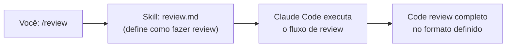

# 04 — Skills: Criando e Usando

> **Objetivo:** Entender o que são Skills no Claude Code, como usar Skills existentes e como criar Skills customizadas para automatizar fluxos repetitivos do seu projeto.

---

## O que são Skills

Skills são comandos reutilizáveis que encapsulam um fluxo de trabalho. Você as invoca com `/nome-da-skill` e o Claude executa a tarefa conforme definida no arquivo da Skill.



> 📌 **Referência:** docs.anthropic.com/en/docs/claude-code/skills

---

## Usando Skills Existentes

Skills ficam em `.claude/skills/` (projeto) ou `~/.claude/skills/` (global).

```bash
# Listar skills disponíveis
/help

# Executar uma skill
/review
/test
/document
```

Para ver detalhes de uma skill:
```bash
/skill-name --help
```

---

## Estrutura de um Arquivo de Skill

```markdown
---
name: review
description: Faz code review do diff atual seguindo as convenções do projeto
---

# Code Review

Analise o diff atual (`git diff HEAD`) e produza um code review estruturado.

## O que verificar

1. **Segurança** — injeção, autenticação, dados expostos
2. **Performance** — queries N+1, operações desnecessárias
3. **Manutenibilidade** — clareza, acoplamento, cobertura de testes
4. **Convenções** — siga os padrões definidos no CLAUDE.md

## Formato de saída

Para cada achado:
- **Arquivo:Linha** — Descrição do problema
- Severidade: 🔴 Bloqueador / 🟡 Atenção / 🟢 Sugestão
- Sugestão de correção (código quando aplicável)

Termine com:
- ✅ Pontos positivos do PR
- 📊 Resumo: N bloqueadores, M atenções, K sugestões
```

**Frontmatter obrigatório:**
- `name` — o nome do comando slash (sem `/`)
- `description` — aparece no `/help`

---

## Criando sua Primeira Skill

Crie o arquivo em `.claude/skills/`:

```bash
mkdir -p .claude/skills
```

**Exemplo: Skill de geração de migration**

```markdown
---
name: migration
description: Gera uma migration Alembic baseada nas mudanças nos models SQLAlchemy
---

# Gerar Migration

## Contexto
Este projeto usa SQLAlchemy 2.0 + Alembic para migrações de banco de dados.

## Passos

1. Leia os arquivos em `models/` que foram modificados recentemente
2. Identifique as mudanças de schema (novas tabelas, colunas, índices, constraints)
3. Execute `make migration` para gerar a migration automática:
   ```bash
   alembic revision --autogenerate -m "[descrição curta]"
   ```
4. Leia o arquivo de migration gerado em `alembic/versions/`
5. Verifique se a migration está correta — compare com o que você identificou no passo 2
6. Se houver problemas, edite o arquivo gerado e explique o que foi corrigido
7. Execute `make migrate` para aplicar localmente e confirme que funcionou

## Critério de conclusão
Migration gerada, aplicada localmente sem erros e com downgrade definido.
```

---

## Skills com Parâmetros

Skills podem receber argumentos:

```markdown
---
name: explain
description: Explica um arquivo ou função em detalhes
---

# Explicar Código

Explique o arquivo ou função passado como argumento: `$ARGUMENTS`

Se `$ARGUMENTS` for um caminho de arquivo, leia e explique o arquivo inteiro.
Se for um nome de função, encontre no projeto e explique.

Explique:
1. O que faz (propósito)
2. Como funciona (lógica principal)
3. Dependências e quem chama
4. Casos de borda e limitações conhecidas
```

Uso:
```bash
/explain src/auth/jwt_handler.py
/explain calculate_discount
```

---

## Skills Mais Úteis para Desenvolvimento

| Skill | O que faz |
|-------|-----------|
| `/review` | Code review do diff atual |
| `/test` | Gera testes para o arquivo atual |
| `/document` | Adiciona docstrings ao módulo |
| `/migration` | Gera migration a partir de mudanças nos models |
| `/debug` | Análise estruturada de um erro |
| `/pr` | Prepara mensagem de PR com contexto |
| `/refactor` | Refatora seguindo as convenções do projeto |

---

## Skills no Global vs Projeto

| Localização | Escopo | Quando usar |
|------------|--------|-------------|
| `~/.claude/skills/` | Todos os projetos | Fluxos genéricos (review, debug) |
| `.claude/skills/` | Este projeto | Fluxos específicos (migration, deploy) |

---

## ✅ Pontos-chave do Capítulo

- Skills são comandos reutilizáveis invocados com `/nome` que encapsulam fluxos de trabalho
- Arquivo Markdown com frontmatter (`name`, `description`) + instruções em linguagem natural
- Use `$ARGUMENTS` para receber parâmetros na chamada da skill
- Skills globais em `~/.claude/skills/`; skills de projeto em `.claude/skills/`
- Encapsule qualquer fluxo que você executa mais de uma vez por semana em uma skill

---

## 🔗 Próxima Aula

👉 [05 — Hooks: Automação de Ciclo](./05-hooks-automacao-de-ciclo.md)
