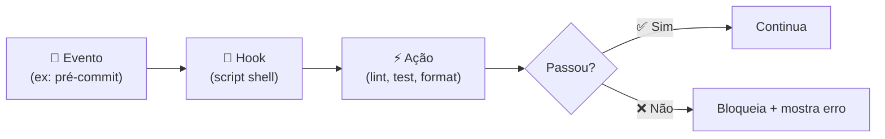

# 05 — Hooks: Automação de Ciclo

> **Objetivo:** Configurar hooks no Claude Code para executar ações automáticas em resposta a eventos do ciclo de desenvolvimento — antes de commits, após edições, ao iniciar sessões.

---

## O que são Hooks

Hooks são scripts shell que o Claude Code executa automaticamente em resposta a eventos específicos. Eles permitem automatizar verificações, formatação e validações sem precisar lembrar de executar manualmente.



> 📌 **Referência:** docs.anthropic.com/en/docs/claude-code/hooks

---

## Eventos Disponíveis

| Evento | Quando dispara |
|--------|---------------|
| `PreToolUse` | Antes de o Claude usar qualquer ferramenta |
| `PostToolUse` | Após o Claude usar uma ferramenta |
| `Stop` | Quando o Claude termina uma tarefa |
| `Notification` | Quando o Claude gera uma notificação |

### PreToolUse — o mais usado

Dispara antes de qualquer chamada de ferramenta. Você pode filtrar por nome de ferramenta:

```json
{
  "hooks": {
    "PreToolUse": [
      {
        "matcher": "Write",
        "hooks": [{ "type": "command", "command": "ruff check $FILE" }]
      }
    ]
  }
}
```

---

## Configurando Hooks

Hooks são configurados em `.claude/settings.json` (projeto) ou `~/.claude/settings.json` (global):

```json
{
  "hooks": {
    "PreToolUse": [
      {
        "matcher": "Write",
        "hooks": [
          {
            "type": "command",
            "command": "echo 'Arquivo a ser escrito: $CLAUDE_TOOL_INPUT_PATH'"
          }
        ]
      }
    ],
    "PostToolUse": [
      {
        "matcher": "Write",
        "hooks": [
          {
            "type": "command",
            "command": "ruff check --fix $CLAUDE_TOOL_INPUT_PATH 2>&1 || true"
          }
        ]
      }
    ],
    "Stop": [
      {
        "hooks": [
          {
            "type": "command",
            "command": "python -m pytest --tb=short -q 2>&1 | tail -5"
          }
        ]
      }
    ]
  }
}
```

---

## Variáveis de Ambiente em Hooks

O Claude Code injeta variáveis no ambiente dos hooks:

| Variável | Valor |
|----------|-------|
| `$CLAUDE_TOOL_NAME` | Nome da ferramenta sendo usada |
| `$CLAUDE_TOOL_INPUT_PATH` | Caminho do arquivo (para Write/Read) |
| `$CLAUDE_TOOL_INPUT` | JSON completo dos argumentos da ferramenta |

---

## Exemplos de Hooks Úteis

### Hook de lint automático após edição

```json
{
  "hooks": {
    "PostToolUse": [
      {
        "matcher": "Write",
        "hooks": [{
          "type": "command",
          "command": "if [[ '$CLAUDE_TOOL_INPUT_PATH' == *.py ]]; then ruff check --fix '$CLAUDE_TOOL_INPUT_PATH'; fi"
        }]
      }
    ]
  }
}
```

### Hook de teste após modificação de arquivo de código

```json
{
  "hooks": {
    "PostToolUse": [
      {
        "matcher": "Write",
        "hooks": [{
          "type": "command",
          "command": "python -m pytest tests/ -x -q --tb=short 2>&1 | tail -20"
        }]
      }
    ]
  }
}
```

### Hook de notificação ao terminar tarefa longa

```json
{
  "hooks": {
    "Stop": [
      {
        "hooks": [{
          "type": "command",
          "command": "osascript -e 'display notification \"Claude terminou a tarefa\" with title \"Claude Code\"'"
        }]
      }
    ]
  }
}
```

### Hook de segurança — bloquear escrita em prod

```json
{
  "hooks": {
    "PreToolUse": [
      {
        "matcher": "Write",
        "hooks": [{
          "type": "command",
          "command": "if echo '$CLAUDE_TOOL_INPUT_PATH' | grep -q 'config/production'; then echo 'BLOQUEADO: não escreva em config de produção' >&2; exit 1; fi"
        }]
      }
    ]
  }
}
```

Se o hook retornar código de saída diferente de 0, o Claude Code bloqueia a ação e mostra o stderr como mensagem de erro.

---

## Gerenciando Hooks com /hooks

Dentro de uma sessão Claude Code:

```bash
/hooks          # lista hooks configurados
/hooks add      # assistente guiado para adicionar hook
/hooks remove   # remove um hook
```

---

## Boas Práticas

```markdown
✅ DO:
- Hooks rápidos (< 3s) — hooks lentos travam o fluxo
- Use `|| true` para hooks informativos que não devem bloquear
- Teste o script manualmente antes de configurar como hook
- Hooks de lint com --fix são mais úteis que só reportar erros

❌ DON'T:
- Hooks que rodam suite completa de testes (lento demais)
- Hooks que fazem chamadas de rede externas
- Hooks que modificam arquivos que o Claude está editando (conflito)
```

---

## ✅ Pontos-chave do Capítulo

- Hooks executam scripts shell automaticamente em resposta a eventos do Claude Code
- Quatro eventos: `PreToolUse`, `PostToolUse`, `Stop` e `Notification`
- `PreToolUse` com `matcher` de ferramenta específica é o padrão mais comum
- Hook com exit code != 0 bloqueia a ação; o stderr vira mensagem de erro para o Claude
- Configure em `.claude/settings.json` para o projeto ou `~/.claude/settings.json` globalmente

---

## 🔗 Próxima Aula

👉 [06 — Subagents e Paralelismo](./06-subagents-paralelismo.md)
