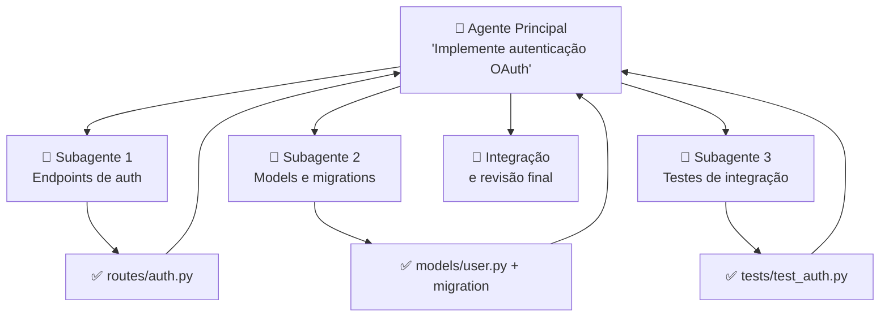
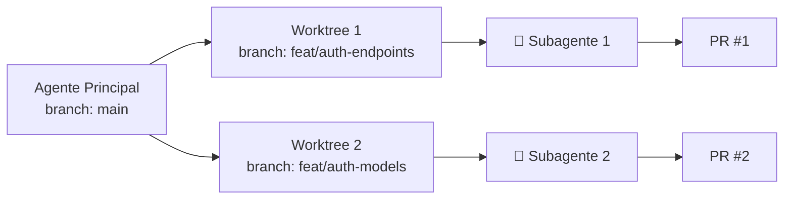

# 06 — Subagents e Paralelismo

> **Objetivo:** Usar subagentes no Claude Code para executar tarefas em paralelo com contexto isolado, entendendo quando isso acelera o trabalho e como integrar os resultados.

---

## O que são Subagents no Claude Code

Subagents são instâncias do Claude Code que o agente principal cria para executar subtarefas em paralelo. Cada subagente tem:

- Contexto isolado (não compartilha histórico com o principal)
- Ferramentas próprias
- Opcionalmente, um worktree Git separado



> 📌 **Referência:** docs.anthropic.com/en/docs/claude-code/sub-agents

---

## Quando Usar Subagents

```markdown
✅ Use subagents quando:
- Subtarefas são independentes (não dependem uma da outra)
- O trabalho total excede uma janela de contexto confortável
- Domínios distintos se beneficiam de contextos especializados
- O tempo de execução é crítico e paralelismo ajuda

❌ Não use quando:
- Subtarefas têm dependências sequenciais fortes
- O overhead de coordenação supera o ganho
- A tarefa é simples e cabe em um único contexto
```

---

## Criando Subagents

No Claude Code, você pode criar subagents explicitamente numa instrução:

```
"Implemente o módulo de notificações. Use subagentes paralelos para:
1. Backend: endpoints REST e lógica de envio em notifications/
2. Templates: templates de email em templates/email/
3. Testes: cobertura completa em tests/test_notifications.py

Cada subagente deve trabalhar de forma independente. Integre os resultados ao final."
```

O Claude Code interpreta a instrução e cria os subagentes conforme necessário.

---

## Worktrees Isolados

Para subagents que modificam arquivos, worktrees Git isolados evitam conflitos:



O Claude Code cria e gerencia os worktrees automaticamente quando instruído.

---

## Coordenando Subagents: Definindo Interfaces Primeiro

Antes de paralelizar, garanta que os subagentes vão produzir saídas compatíveis:

```
"Antes de implementar, os subagentes precisam acordar as interfaces.
Fase 1 (síncrona): defina as assinaturas das funções públicas que cada módulo vai expor.
Fase 2 (paralela): cada subagente implementa seu módulo seguindo as interfaces acordadas."
```

Isso evita o problema clássico de dois subagentes implementando interfaces incompatíveis.

---

## Exemplo Prático: Feature com Subagents

**Instrução para o Claude Code:**

```
"Implemente a feature de 'exportação de relatórios em PDF'.

Divida em 3 subagentes paralelos:

Subagente 1 — Backend:
- Contexto: apenas arquivos em reports/
- Tarefa: endpoint POST /api/reports/export que gera PDF
- Retorne: arquivos modificados + interface da função principal

Subagente 2 — Frontend:  
- Contexto: apenas arquivos em frontend/src/reports/
- Tarefa: botão 'Exportar PDF' no componente ReportsList
- Retorne: arquivos modificados

Subagente 3 — Testes:
- Contexto: interface do Subagente 1 (aguarde o resultado)
- Tarefa: testes de integração para o endpoint
- Retorne: arquivo de testes

Integre os resultados e garanta que os testes passam."
```

---

## Limites e Custos

Cada subagente é uma instância separada do modelo — cada chamada de ferramenta consome tokens.

| Aspecto | Impacto |
|---------|---------|
| Contexto de cada subagente | Isolado — não cresce com o histórico do principal |
| Custo de tokens | Multiplicado pelo número de subagentes |
| Tempo total | Determinado pelo subagente mais lento |
| Coordenação | Overhead do agente principal para integrar |

**Regra prática:** subagents valem quando o ganho de paralelismo ou isolamento de contexto supera o custo de coordenação.

---

## Verificando o Trabalho dos Subagents

Após a execução, peça ao agente principal para verificar a coerência:

```
"Verifique se os resultados dos subagentes são compatíveis:
1. As interfaces estão alinhadas?
2. Os imports estão corretos entre os módulos?
3. Os testes cobrem o código implementado?
Corrija qualquer inconsistência."
```

---

## ✅ Pontos-chave do Capítulo

- Subagents são instâncias paralelas do Claude Code com contexto isolado
- Ideais para tarefas independentes que se beneficiam de paralelismo ou especialização de contexto
- Worktrees Git isolados evitam conflitos quando subagents modificam arquivos
- Defina interfaces antes de paralelizar para garantir compatibilidade entre subagents
- O custo de tokens é multiplicado — avalie se o ganho justifica

---

## 🔗 Próxima Aula

👉 [07 — Permissões e Modos](./07-permissoes-e-modos.md)
