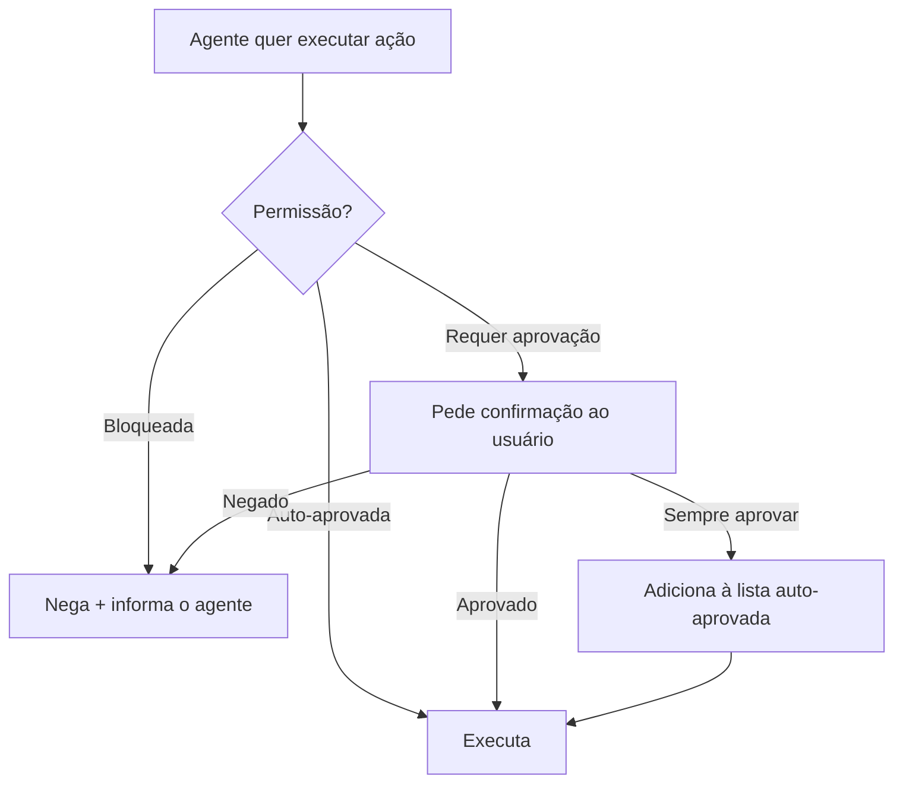

# 07 — Permissões e Modos

> **Objetivo:** Entender o sistema de permissões do Claude Code, configurar níveis de aprovação por tipo de ação e usar os modos disponíveis para calibrar autonomia.

---

## O Sistema de Permissões

O Claude Code controla quais ações o agente pode executar automaticamente e quais exigem aprovação humana. Esse sistema é configurável por projeto e globalmente.



> 📌 **Referência:** docs.anthropic.com/en/docs/claude-code/settings

---

## Visualizando Permissões Atuais

```bash
# Dentro de uma sessão
/permissions
```

Mostra três categorias:
- **Permitidas automaticamente** — executa sem perguntar
- **Sempre pedir** — sempre pede confirmação
- **Bloqueadas** — nunca executa

---

## Configurando Permissões no settings.json

```json
{
  "permissions": {
    "allow": [
      "Bash(git status)",
      "Bash(git diff*)",
      "Bash(python -m pytest*)",
      "Bash(ruff check*)",
      "Read(*)",
      "Write(src/*)",
      "Write(tests/*)"
    ],
    "deny": [
      "Bash(rm*)",
      "Bash(git push*)",
      "Bash(sudo*)",
      "Write(config/production*)"
    ]
  }
}
```

**Sintaxe dos padrões:**
- `Bash(comando)` — comando específico
- `Bash(prefixo*)` — comandos que começam com o prefixo
- `Read(*)` — leitura de qualquer arquivo
- `Write(diretório/*)` — escrita em diretório específico

---

## Modos de Operação

### Modo padrão (interativo)
O comportamento padrão — pede confirmação para ações não-pré-aprovadas.

```bash
claude
```

### Modo Auto (--dangerously-skip-permissions)
Executa sem pedir confirmação. **Use apenas em ambientes controlados.**

```bash
claude --dangerously-skip-permissions
```

**Quando é seguro usar:**
- CI/CD com escopo bem definido
- Ambiente de desenvolvimento local isolado
- Scripts automatizados onde o escopo é conhecido

**Nunca use em:**
- Acesso a sistemas de produção
- Repositórios com dados sensíveis
- Qualquer ambiente compartilhado

### Modo Sandbox
Executa com restrições de sistema operacional — sem acesso à rede, filesystem limitado.

```bash
claude --sandbox
```

Útil para executar código não confiável ou testar scripts sem risco.

---

## Fluxo de Aprovação na Sessão

Quando o Claude pede confirmação, você tem opções:

```
╔══════════════════════════════════════════════════╗
║  Claude quer executar:                           ║
║  Bash: python -m pytest tests/test_auth.py -v   ║
║                                                  ║
║  [Enter] Aprovar  [e] Editar  [n] Negar          ║
║  [a] Sempre aprovar este padrão                  ║
╚══════════════════════════════════════════════════╝
```

- **Enter / y** — aprova esta vez
- **e** — edita o comando antes de executar
- **n** — nega e informa o Claude
- **a** — adiciona ao settings.json como auto-aprovado

---

## Permissões por Ambiente

Configure permissões diferentes para desenvolvimento e CI:

```json
// .claude/settings.json — desenvolvimento (mais restritivo)
{
  "permissions": {
    "allow": ["Read(*)", "Bash(git status)", "Bash(git diff*)"],
    "deny": ["Bash(git push*)", "Bash(rm*)"]
  }
}
```

```json
// .claude/settings.local.json — desenvolvimento pessoal (não versionado)
{
  "permissions": {
    "allow": [
      "Read(*)", "Write(src/*)", "Write(tests/*)",
      "Bash(python -m pytest*)", "Bash(ruff*)", "Bash(git *)"
    ]
  }
}
```

> `.claude/settings.local.json` nunca deve ir para o git — adicione ao `.gitignore`.

---

## Boas Práticas de Permissões

```markdown
✅ Auto-aprovar (baixo risco):
- Leitura de arquivos (Read)
- git status, git diff, git log
- Execução de testes
- Lint e formatação

⚠️ Sempre pedir (médio risco):
- Escrita de arquivos novos
- git commit
- Instalação de pacotes

🔴 Sempre bloquear (alto risco):
- git push (empurrar para remoto)
- rm e deleção de arquivos
- Comandos com sudo
- Acesso a config de produção
```

---

## ✅ Pontos-chave do Capítulo

- O sistema de permissões controla o que o agente executa automaticamente vs o que pede confirmação
- Configure em `settings.json` com `allow` e `deny` usando padrões com wildcard
- `--dangerously-skip-permissions` remove todas as confirmações — use só em ambientes controlados
- `settings.local.json` permite configuração pessoal sem versionar (adicione ao .gitignore)
- Padronize: leituras auto-aprovadas, writes revisados, push sempre bloqueado

---

## 🔗 Próxima Aula

👉 [08 — MCP no Claude Code](./08-mcp-no-claude-code.md)
