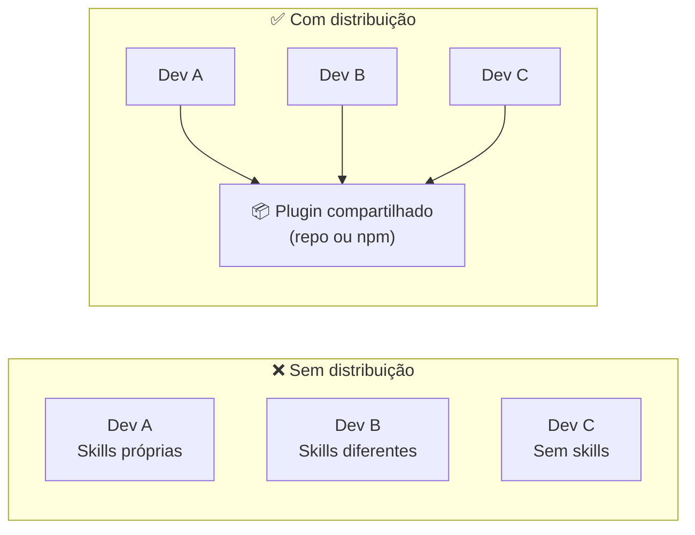

# 09 — Plugins e Distribuição

> **Objetivo:** Empacotar Skills, Hooks e servidores MCP em plugins reutilizáveis, e distribuir configurações padronizadas para seu time.

---

## O Problema da Distribuição

Skills e Hooks criados no seu `.claude/` são locais. Para que o time inteiro use os mesmos fluxos padronizados, você precisa de uma estratégia de distribuição.



---

## Estratégia 1: Skills no Repositório do Projeto

A forma mais simples: coloque as skills em `.claude/skills/` e versione junto com o código.

```
seu-projeto/
└── .claude/
    ├── settings.json      ← configurações do projeto
    └── skills/
        ├── review.md      ← skill de code review
        ├── migration.md   ← skill de migration
        └── deploy.md      ← skill de deploy
```

Qualquer dev que clonar o repositório terá as skills disponíveis.

**Vantagem:** zero setup, junto com o código.
**Limitação:** skills específicas do projeto, não reutilizáveis em outros repos.

---

## Estratégia 2: Repositório de Skills Compartilhadas

Para skills usadas em múltiplos projetos, crie um repositório central:

```
org-claude-skills/
├── README.md
├── skills/
│   ├── review.md
│   ├── security-check.md
│   ├── document.md
│   └── test.md
└── hooks/
    ├── lint-on-write.json
    └── test-on-stop.json
```

**Distribuição via script de setup:**

```bash
#!/bin/bash
# setup-claude.sh — roda na máquina de cada dev

SKILLS_REPO="git@github.com:org/claude-skills.git"
SKILLS_DIR="$HOME/.claude/org-skills"

# Clona ou atualiza
if [ -d "$SKILLS_DIR" ]; then
    git -C "$SKILLS_DIR" pull
else
    git clone "$SKILLS_REPO" "$SKILLS_DIR"
fi

# Cria symlinks nas skills globais
mkdir -p "$HOME/.claude/skills"
for skill in "$SKILLS_DIR/skills/"*.md; do
    ln -sf "$skill" "$HOME/.claude/skills/$(basename $skill)"
done

echo "✅ Skills da org instaladas em ~/.claude/skills/"
```

---

## Estratégia 3: Plugin npm

Para times maiores ou distribuição externa, empacote como módulo npm:

```
meu-plugin-claude/
├── package.json
├── README.md
├── skills/
│   ├── review.md
│   └── test.md
├── hooks/
│   └── settings-fragment.json
└── install.js          ← script de instalação
```

```json
// package.json
{
  "name": "@org/claude-plugin",
  "version": "1.0.0",
  "scripts": {
    "postinstall": "node install.js"
  }
}
```

```javascript
// install.js
const fs = require('fs');
const path = require('path');
const os = require('os');

const CLAUDE_DIR = path.join(os.homedir(), '.claude');
const SKILLS_DIR = path.join(CLAUDE_DIR, 'skills');

fs.mkdirSync(SKILLS_DIR, { recursive: true });

// Copia skills
const skillsSource = path.join(__dirname, 'skills');
for (const file of fs.readdirSync(skillsSource)) {
    fs.copyFileSync(
        path.join(skillsSource, file),
        path.join(SKILLS_DIR, file)
    );
}

console.log('✅ Plugin Claude instalado');
```

```bash
npm install -g @org/claude-plugin
```

---

## Versionando Configurações do Time

O `.claude/settings.json` deve ser versionado para que todos compartilhem:

```json
// .claude/settings.json — versionar no git
{
  "mcpServers": {
    "github": {
      "command": "npx",
      "args": ["-y", "@modelcontextprotocol/server-github"],
      "env": { "GITHUB_TOKEN": "${GITHUB_TOKEN}" }
    }
  },
  "permissions": {
    "allow": ["Read(*)", "Bash(python -m pytest*)", "Bash(ruff*)"],
    "deny": ["Bash(git push*)", "Bash(rm*)"]
  }
}
```

```json
// .claude/settings.local.json — no .gitignore
{
  "permissions": {
    "allow": ["Write(src/*)", "Write(tests/*)"]
  }
}
```

Adicione ao `.gitignore`:
```
.claude/settings.local.json
```

---

## Documentando para o Time

No `CLAUDE.md` do projeto, documente como usar as skills:

```markdown
## Skills Disponíveis

Execute `/help` para ver todas. As mais usadas:

| Skill | Uso | Quando usar |
|-------|-----|-------------|
| `/review` | Sem argumentos | Antes de abrir um PR |
| `/test <arquivo>` | Caminho do arquivo | Ao criar novo módulo |
| `/migration` | Sem argumentos | Após modificar models |
| `/explain <função>` | Nome ou caminho | Para entender código legado |

Para instalar as skills da org: `bash scripts/setup-claude.sh`
```

---

## ✅ Pontos-chave do Capítulo

- Skills em `.claude/skills/` do repositório são a distribuição mais simples — versionadas junto com o código
- Para skills multi-projeto, use um repositório central com script de setup ou symlinks
- Módulos npm são a opção para distribuição mais formal com versionamento semântico
- `.claude/settings.json` versiona configurações do time; `.claude/settings.local.json` fica no gitignore
- Documente skills disponíveis e como instalá-las no `CLAUDE.md`

---

## 🔗 Próxima Aula

👉 [10 — Slash Commands](./10-slash-commands.md)
