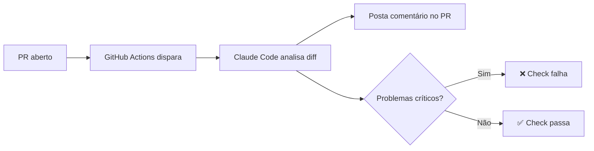

# 11 — Fluxos Avançados

> **Objetivo:** Dominar o modo headless para CI/CD, orquestração de múltiplas instâncias e padrões de uso avançado do Claude Code em pipelines automatizados.

---

## Modo Headless: Claude Code sem Interface

O modo headless permite usar o Claude Code em scripts, CI/CD e automações — sem interface interativa.

```bash
# Execução one-shot
claude -p "Analise src/ e liste problemas de segurança" --output-format json

# Com contexto de arquivo
claude -p "$(cat tarefa.txt)"

# Sem confirmações (use com cuidado)
claude --dangerously-skip-permissions -p "Execute os testes e corrija falhas"
```

> 📌 **Referência:** docs.anthropic.com/en/docs/claude-code/cli-reference

---

## Flags Importantes para Headless

| Flag | Efeito |
|------|--------|
| `-p "tarefa"` | Executa tarefa e sai |
| `--output-format json` | Output em JSON estruturado |
| `--output-format stream-json` | Streaming JSON linha a linha |
| `--dangerously-skip-permissions` | Remove todas as confirmações |
| `--model modelo` | Define o modelo |
| `--max-turns N` | Limita iterações do agente |
| `--no-ansi` | Remove cores (logs limpos) |
| `--continue` | Continua sessão anterior |

---

## Integrando com CI/CD

### GitHub Actions

```yaml
# .github/workflows/claude-review.yml
name: AI Code Review

on:
  pull_request:
    types: [opened, synchronize]

jobs:
  review:
    runs-on: ubuntu-latest
    steps:
      - uses: actions/checkout@v4
        with:
          fetch-depth: 0

      - name: Setup Node.js
        uses: actions/setup-node@v4
        with:
          node-version: '20'

      - name: Install Claude Code
        run: npm install -g @anthropic-ai/claude-code

      - name: Run AI Review
        env:
          ANTHROPIC_API_KEY: ${{ secrets.ANTHROPIC_API_KEY }}
        run: |
          DIFF=$(git diff origin/main...HEAD)
          claude --dangerously-skip-permissions \
                 --no-ansi \
                 -p "Revise este diff e identifique problemas de segurança, performance e qualidade.
                     Seja conciso. Formato: lista de achados com severidade.
                     
                     Diff:
                     $DIFF"
```

### Verificação Automática de Segurança

```bash
#!/bin/bash
# scripts/security-check.sh

set -e

echo "🔍 Iniciando verificação de segurança..."

RESULT=$(claude --dangerously-skip-permissions \
               --output-format json \
               --max-turns 5 \
               -p "Analise o código em src/ e identifique:
                   1. Credenciais ou segredos hardcoded
                   2. Injeção de SQL ou command injection
                   3. Autenticação/autorização faltando
                   4. Dados sensíveis expostos em logs
                   
                   Retorne JSON: {\"issues\": [{\"file\", \"line\", \"severity\", \"description\"}]}")

CRITICAL=$(echo $RESULT | python3 -c "
import sys, json
data = json.load(sys.stdin)
critical = [i for i in data.get('issues', []) if i.get('severity') == 'critical']
print(len(critical))
")

if [ "$CRITICAL" -gt "0" ]; then
    echo "❌ $CRITICAL problema(s) crítico(s) encontrado(s)"
    echo $RESULT | python3 -m json.tool
    exit 1
fi

echo "✅ Nenhum problema crítico encontrado"
```

---

## Múltiplas Instâncias em Paralelo

Para tarefas que podem ser paralelizadas externamente:

```bash
#!/bin/bash
# Analisa múltiplos módulos em paralelo

MODULES=("auth" "payments" "notifications" "reports")

for module in "${MODULES[@]}"; do
    (
        claude --dangerously-skip-permissions \
               --no-ansi \
               -p "Analise src/$module/ e gere testes para funções sem cobertura" \
               > "output_$module.txt" 2>&1
        echo "✅ $module concluído"
    ) &
done

wait
echo "Todos os módulos analisados"
cat output_*.txt
```

---

## Compactação de Sessão em Fluxos Longos

Para sessões longas em CI/CD, use `/compact` ou configure compactação automática:

```bash
# Sessão longa com compactação intermediária
claude --dangerously-skip-permissions -p "
Fase 1: Analise a arquitetura atual em src/ e documente pontos de melhoria.
Quando terminar a análise, execute /compact.
Fase 2: Implemente as melhorias identificadas na Fase 1.
Fase 3: Escreva testes para o que foi implementado.
"
```

---

## Capturando Output Estruturado

```bash
# Output JSON para processar programaticamente
RESULT=$(claude --dangerously-skip-permissions \
               --output-format json \
               -p "Liste os endpoints da API em src/routes/ como JSON array:
                   [{\"method\", \"path\", \"handler\", \"authenticated\"}]")

# Processar com jq
echo $RESULT | jq '.[] | select(.authenticated == false) | .path'
```

---

## Padrão: Claude Code como Ferramenta de CI



---

## Limites do Modo Headless

```markdown
⚠️ Atenção ao usar headless:
- Sem aprovação humana — ações irreversíveis executam automaticamente
- Custo de tokens pode crescer em loops longos — use --max-turns
- Sem feedback visual — logs estruturados são essenciais
- Credenciais via variáveis de ambiente — nunca na linha de comando
```

---

## ✅ Pontos-chave do Capítulo

- Modo headless: `-p "tarefa"` executa e sai; `--output-format json` para processamento
- `--dangerously-skip-permissions` é necessário para CI/CD — use só em ambientes controlados
- `--max-turns N` limita iterações e previne loops infinitos em automações
- Paralelize análises de módulos independentes com subshells e `wait`
- Use `--output-format json` + `jq` para integrar com pipelines existentes

---

## 🔗 Próxima Aula

👉 [12 — Segurança e Boas Práticas](./12-seguranca-e-boas-praticas.md)
