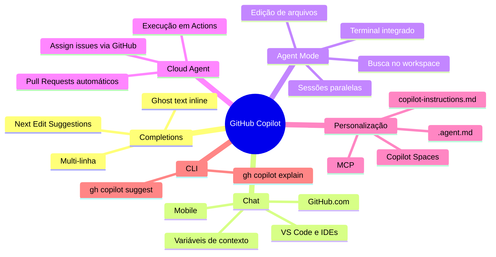

# 01 — Visão Geral e Planos do GitHub Copilot

> **Objetivo:** Entender o que é o GitHub Copilot, suas capacidades atuais e escolher o plano adequado ao seu contexto de uso.

---

## O que é o GitHub Copilot

GitHub Copilot é um assistente de IA para desenvolvedores integrado ao ecossistema do GitHub. Opera em múltiplos níveis:

- **Completions inline** — sugestões de código em tempo real dentro do editor
- **Chat** — interface conversacional para explicações, debugging e geração de código
- **Agent mode** — execução autônoma de tarefas de múltiplos passos no IDE
- **Cloud Agent** — execução assíncrona de issues via GitHub Actions
- **CLI** — assistência no terminal via extensão do GitHub CLI

> 📌 **Referência:** docs.github.com/en/copilot/about-github-copilot/what-is-github-copilot

---

## Planos Disponíveis

| Plano | Preço | Público |
|-------|-------|---------|
| **Free** | Gratuito | Devs individuais, experimentação |
| **Pro** | US$ 10/mês | Devs individuais com uso intenso |
| **Pro+** | US$ 39/mês | Devs que precisam de modelos premium |
| **Business** | US$ 19/usuário/mês | Times e organizações |
| **Enterprise** | US$ 39/usuário/mês | Empresas com controles avançados |

> 📌 **Referência:** docs.github.com/en/copilot/about-github-copilot/subscription-plans-for-github-copilot

---

## Comparativo de Features por Plano

| Feature | Free | Pro | Pro+ | Business | Enterprise |
|---------|:----:|:---:|:----:|:--------:|:----------:|
| Completions inline | 2.000/mês | ♾️ | ♾️ | ♾️ | ♾️ |
| Chat messages | 50/mês | ♾️ | ♾️ | ♾️ | ♾️ |
| Agent mode (IDE) | ✅ | ✅ | ✅ | ✅ | ✅ |
| Cloud Agent | ❌ | ✅ | ✅ | ✅ | ✅ |
| Next Edit Suggestions | ✅ | ✅ | ✅ | ✅ | ✅ |
| Modelos premium | ❌ | Limitado | ✅ | ✅ | ✅ |
| Copilot Spaces | ❌ | ✅ | ✅ | ✅ | ✅ |
| Políticas de organização | ❌ | ❌ | ❌ | ✅ | ✅ |
| Knowledge bases (docs internas) | ❌ | ❌ | ❌ | ❌ | ✅ |
| Audit logs | ❌ | ❌ | ❌ | ✅ | ✅ |
| Indemnização de IP | ❌ | ❌ | ❌ | ✅ | ✅ |

> 📌 **Referência:** docs.github.com/en/copilot/about-github-copilot/subscription-plans-for-github-copilot

---

## Modelos de IA Disponíveis

O Copilot permite selecionar o modelo subjacente em chat e agent mode. A disponibilidade varia por plano:

| Modelo | Provedor | Planos |
|--------|----------|--------|
| GPT-4o | OpenAI | Pro, Pro+, Business, Enterprise |
| GPT-4.1 | OpenAI | Pro+, Business, Enterprise |
| Claude Sonnet 3.5 / 3.7 | Anthropic | Pro, Pro+, Business, Enterprise |
| Claude Opus 4 | Anthropic | Pro+ |
| Gemini 1.5 Pro | Google | Pro+, Business, Enterprise |
| o3 / o4-mini | OpenAI | Pro+ (raciocínio avançado) |

> 📌 **Referência:** docs.github.com/en/copilot/using-github-copilot/ai-models/changing-the-ai-model-for-copilot-chat

---

## IDEs e Plataformas Suportadas

| Plataforma | Completions | Chat | Agent Mode |
|-----------|:-----------:|:----:|:----------:|
| VS Code | ✅ | ✅ | ✅ |
| JetBrains IDEs | ✅ | ✅ | ✅ |
| Visual Studio | ✅ | ✅ | ❌ |
| Neovim | ✅ | ❌ | ❌ |
| GitHub.com (browser) | ❌ | ✅ | ❌ |
| GitHub Mobile | ❌ | ✅ | ❌ |
| Terminal (gh copilot) | ❌ | ✅ | ❌ |
| Eclipse | ✅ | ✅ | ❌ |

> 📌 **Referência:** docs.github.com/en/copilot/using-github-copilot/getting-started-with-github-copilot

---

## Mapa de Capacidades



---

## Como Começar

### 1. Ativar o Copilot Free

```
1. Acesse: github.com/settings/copilot
2. Clique em "Start using Copilot for free"
3. Nenhum cartão de crédito necessário para o plano Free
```

### 2. Instalar a Extensão no VS Code

```
1. Extensions → Ctrl+Shift+X
2. Busque "GitHub Copilot"
3. Instale "GitHub Copilot" + "GitHub Copilot Chat"
4. Sign in com sua conta GitHub
```

### 3. Verificar Ativação

```
Barra de status inferior do VS Code:
✅ Ícone Copilot visível e sem sinal de erro = funcionando
⚠️ Ícone com "x" = verificar autenticação em: gh auth status
```

> 📌 **Referência:** docs.github.com/en/copilot/setting-up-github-copilot/setting-up-github-copilot-for-yourself

---

## ✅ Pontos-chave do Capítulo

- Copilot Free oferece 2.000 completions e 50 chats/mês sem custo
- Pro ($10/mês) desbloqueia uso ilimitado de completions e chat, e Cloud Agent
- Pro+ ($39/mês) adiciona modelos premium como Claude Opus 4 e o3
- Business/Enterprise adicionam políticas organizacionais, audit logs e indemnização de IP
- Múltiplos modelos de IA (OpenAI, Anthropic, Google) podem ser selecionados por contexto
- Suporte abrange VS Code, JetBrains, Visual Studio, Neovim e terminal

---

## 🔗 Próxima Aula

👉 [02 — Completions e Sugestões Inline](./02-completions-e-sugestoes-inline.md)
