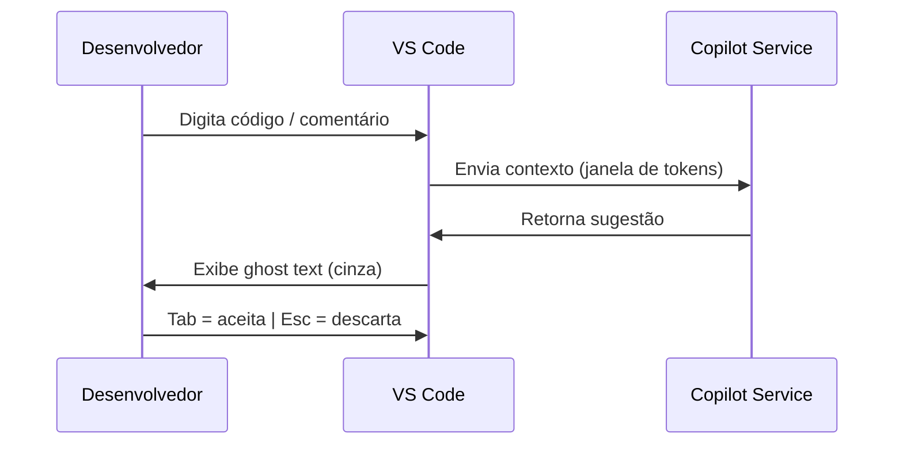
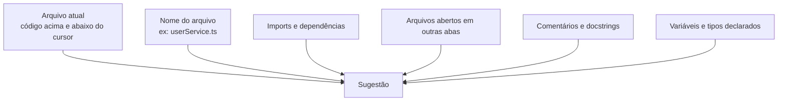

# 02 — Completions e Sugestões Inline

> **Objetivo:** Dominar as sugestões inline do GitHub Copilot — como funcionam, como controlar e como extrair sugestões de maior qualidade.

---

## Como Funcionam as Completions

O Copilot analisa o contexto do arquivo aberto — código acima e abaixo do cursor, nome do arquivo, imports, comentários e arquivos abertos em outras abas — e exibe sugestões como **ghost text** (texto cinza, não confirmado).



> 📌 **Referência:** docs.github.com/en/copilot/using-github-copilot/getting-code-suggestions-in-your-ide-with-github-copilot

---

## Atalhos de Teclado (VS Code)

| Ação | Windows / Linux | macOS |
|------|----------------|-------|
| Aceitar sugestão completa | `Tab` | `Tab` |
| Descartar sugestão | `Esc` | `Esc` |
| Próxima sugestão | `Alt+]` | `Option+]` |
| Sugestão anterior | `Alt+[` | `Option+[` |
| Aceitar palavra por palavra | `Ctrl+→` | `Cmd+→` |
| Ver sugestões no painel lateral | `Ctrl+Enter` | `Ctrl+Enter` |

> 📌 **Referência:** docs.github.com/en/copilot/using-github-copilot/getting-code-suggestions-in-your-ide-with-github-copilot#keyboard-shortcuts-for-github-copilot

---

## Aceitação Parcial

Você não precisa aceitar uma sugestão inteira. O Copilot suporta **aceitação palavra por palavra**:

```
Sugestão completa:
  const result = items.filter(item => item.active).map(item => item.id);

Com Ctrl+→ (uma palavra por vez):
  const → result → = → items → .filter → ...
```

Útil quando a sugestão começa correta mas diverge no meio — aceite até onde é válido e continue digitando.

---

## O que o Copilot Usa como Contexto



**Implicação prática:** abrir arquivos relacionados em outras abas melhora a qualidade das sugestões.

---

## Técnicas para Sugestões de Maior Qualidade

### ✅ Use comentários descritivos como prompt

```python
# ❌ Sem guia — sugestão genérica
def process(data):

# ✅ Com comentário descritivo
# Parse a JSON list of transactions, filter by status="completed",
# and return total amount grouped by currency
def process_transactions(data: list[dict]) -> dict[str, float]:
```

### ✅ Nomeie funções e variáveis com precisão

```typescript
// ❌ Nome vago — sugestão incerta
function calc(x, y) {

// ✅ Nome claro — Copilot entende a intenção
function calculateMonthlyInterest(principal: number, annualRate: number): number {
```

### ✅ Forneça a assinatura completa

```go
// Copilot completa o corpo quando a assinatura está clara
func ValidateEmailAddress(email string) (bool, error) {
    // Copilot sugere regex + validação de domínio
```

### ✅ Deixe exemplos no mesmo arquivo

```javascript
// Exemplo existente no arquivo:
// formatDate("2024-01-15") → "15/01/2024"
function formatDate(isoString) { ... }

// Copilot usa o padrão do exemplo acima para:
function formatDateTime(isoString) { // sugere formato coerente
```

---

## Painel de Sugestões Alternativas

Ao pressionar `Ctrl+Enter`, o Copilot abre um painel lateral com **até 10 sugestões alternativas** para o mesmo ponto:

```
GitHub Copilot - Synthesizing 10 solutions
┌─────────────────────────────────────┐
│ Solution 1 of 10                    │
│ [código da sugestão 1]              │
│ [Accept Solution]                   │
├─────────────────────────────────────┤
│ Solution 2 of 10                    │
│ [código da sugestão 2]              │
│ [Accept Solution]                   │
└─────────────────────────────────────┘
```

Útil para comparar abordagens diferentes para o mesmo problema.

---

## Configurações Úteis (VS Code settings.json)

```json
{
  // Habilitar/desabilitar por linguagem
  "github.copilot.enable": {
    "*": true,
    "markdown": false,
    "plaintext": false
  },

  // Exibir sugestões inline automaticamente
  "editor.inlineSuggest.enabled": true,

  // Mostrar sugestões após delay (ms)
  "github.copilot.inlineSuggest.enable": true
}
```

> 📌 **Referência:** docs.github.com/en/copilot/configuring-github-copilot/configuring-github-copilot-in-your-environment

---

## O que o Copilot NÃO faz nas Completions

| Limitação | Detalhe |
|-----------|---------|
| Não acessa a internet | Trabalha só com o contexto local |
| Não lê arquivos fechados | Apenas arquivos abertos em abas |
| Não tem memória entre sessões | Cada sessão começa do zero |
| Não garante correção lógica | Sempre revisar código gerado |
| Não acessa databases ao vivo | Não executa queries reais |

---

## ✅ Pontos-chave do Capítulo

- Ghost text aparece automaticamente; `Tab` aceita, `Esc` descarta
- `Ctrl+→` aceita palavra por palavra — útil quando a sugestão diverge no meio
- `Ctrl+Enter` abre painel com até 10 sugestões alternativas
- Arquivos abertos em outras abas influenciam diretamente a qualidade das sugestões
- Comentários descritivos antes da função funcionam como prompt para o Copilot
- Configurações por linguagem permitem desativar onde completions não fazem sentido

---

## 🔗 Próxima Aula

👉 [03 — Next Edit Suggestions](./03-next-edit-suggestions.md)
